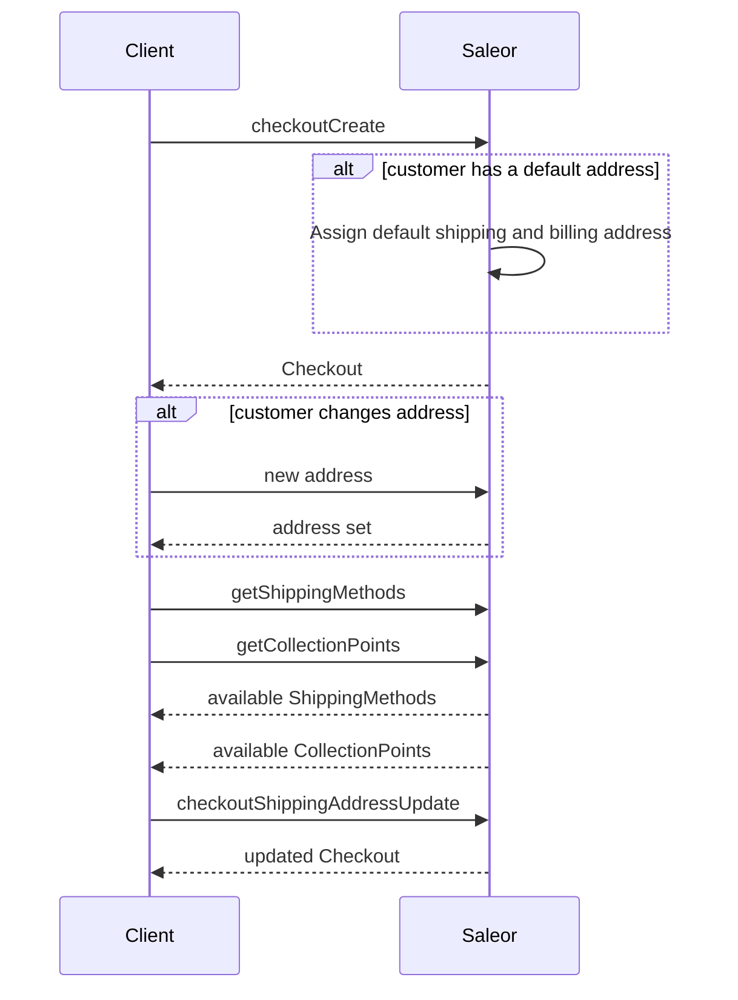

## Shipping

This step is only used if purchased items require shipping (if they are physical products). The user must select a specific shipping method to create shipping for this checkout. To signify whether shipping is required, use the `isShippingRequired` field in the [`Checkout`](api-reference/checkout/objects/checkout.mdx) object.



### Adding address data

Address can be assigned using the [`checkoutShippingAddressUpdate`](api-reference/checkout/mutations/checkout-shipping-address-update.mdx) mutation:

```graphql
mutation {
  checkoutShippingAddressUpdate(
    shippingAddress: {
      country: PL
      firstName: "John"
      lastName: "Smith"
      streetAddress1: "ul. Tęczowa 7"
      postalCode: "53-030"
      city: "Wroclaw"
    }
    id: "Q2hlY2tvdXQ6ZTEzZDFjOTItOWJkNi00ODViLTgyMDctZTNhM2I5NjVkZTQw"
  ) {
    checkout {
      shippingAddress {
        firstName
        lastName
        streetAddress1
        city
        postalCode
      }
    }
    errors {
      field
      message
      code
    }
  }
}
```

Successful response:

```json
{
  "data": {
    "checkoutShippingAddressUpdate": {
      "checkout": {
        "shippingAddress": {
          "firstName": "John",
          "lastName": "Smith",
          "streetAddress1": "ul. Tęczowa 7",
          "city": "WROCLAW",
          "postalCode": "53-030"
        }
      },
      "errors": []
    }
  }
}
```

More information about address validation can be found on the [address validation](developer/address.mdx) page.

#### Default address

Customers with accounts can set up default addresses, which will be attached automatically during the checkout creation. More information on API reference page for [accountSetDefaultAddress](api-reference/users/mutations/account-set-default-address.mdx).

### Listing available shipping methods

After choosing the shipping address, API can be queried for available delivery methods in the user area:

```graphql
query {
  checkout(id: "Q2hlY2tvdXQ6ZTEzZDFjOTItOWJkNi00ODViLTgyMDctZTNhM2I5NjVkZTQw") {
    shippingMethods {
      id
      name
      active
      price {
        currency
        amount
      }
    }
    availableCollectionPoints {
      id
      name
      clickAndCollectOption
    }
  }
}
```

Response:

```json
{
  "data": {
    "checkout": {
      "shippingMethods": [
        {
          "id": "U2hpcHBpbmdNZXRob2Q6MTY1Nw==",
          "name": "DHL",
          "price": {
            "currency": "USD",
            "amount": 10.0
          },
          "active": true,
          "message": ""
        },
        {
          "id": "U2hpcHBpbmdNZXRob2Q6MTM=",
          "name": "UPS",
          "price": {
            "currency": "USD",
            "amount": 8.0
          },
          "active": false,
          "message": "Not available."
        }
      ],
      "availableCollectionPoints": [
        {
          "id": "V2FyZWhvdXNlOjU0NjliNWQ3LThmOGUtNGVmOS1iMGQxLWNhYWZmYTg4MjI1OQ==",
          "name": "Local Store",
          "clickAndCollectOption": "LOCAL"
        },
        {
          "id": "V2FyZWhvdXNlOjU0NjliNWQ3LThmOGUtNGVmOS1iMGQxLWNhYWZmYTg4MjI1OA==",
          "name": "Company HQ",
          "clickAndCollectOption": "ALL"
        }
      ]
    }
  }
}
```

Shipping methods can be internal (defined in the Saleor Dashboard) or [external](developer/extending/webhooks/synchronous-events/shipping.mdx) (coming from the 3-rd party). Collection points are [warehouses](api-reference/products/objects/warehouse.mdx) that allow picking-up orders e.g. for click & collect flow.

### Selecting the delivery method

Use the [`checkoutDeliveryMethodUpdate`](api-reference/checkout/mutations/checkout-delivery-method-update.mdx) mutation to effectively pair the specific [`Checkout`](api-reference/checkout/objects/checkout.mdx) object with the specified delivery method selected by the user.

This operation requires the following input:

- `id`: the checkout ID (the `id` field of the [`Checkout`](api-reference/checkout/objects/checkout.mdx) object).
- `deliveryMethodId`: the shipping method ID or Warehouse ID (from the `shippingMethods` or `availableCollectionPoints` field of the [`Checkout`](api-reference/checkout/objects/checkout.mdx) object).

In the following mutation, we assign a delivery method to the checkout using IDs from the previous example. Note that for the checkout object, we want to get back the update `totalPrice` including shipping costs:

Please note, that selecting `collectionPoint` or `shippingMethod` is mandatory for the checkout flow. In other words, setting `deliveryMethod` is mandatory.

```graphql {2-5}
mutation {
  checkoutDeliveryMethodUpdate(
    id: "Q2hlY2tvdXQ6ZTEzZDFjOTItOWJkNi00ODViLTgyMDctZTNhM2I5NjVkZTQw"
    deliveryMethodId: "U2hpcHBpbmdNZXRob2Q6MTM="
  ) {
    checkout {
      id
      deliveryMethod {
        __typename
        ... on Warehouse {
          name
        }
        ... on ShippingMethod {
          name
        }
      }
      totalPrice {
        gross {
          amount
          currency
        }
      }
    }
    errors {
      field
      message
    }
  }
}
```

As a result, we get an updated checkout object with a delivery method set:

```json {7}
{
  "data": {
    "checkoutDeliveryMethodUpdate": {
      "checkout": {
        "id": "Q2hlY2tvdXQ6ZTEzZDFjOTItOWJkNi00ODViLTgyMDctZTNhM2I5NjVkZTQw",
        "deliveryMethod": {
          __typename: "ShippingMethod"
          "name": "UPS"
        },
        "totalPrice": {
          "gross": {
            "amount": 25.99,
            "currency": "USD"
          }
        }
      },
      "errors": []
    }
  }
}
```

### Switching from C&C to standard delivery method

After choosing the click & collect option on a checkout, going back to a standard delivery method will require the shipping address to be changed.

1. First use [`checkoutDeliveryMethodUpdate`](api-reference/checkout/mutations/checkout-delivery-method-update.mdx) (just with `id` or `token` provided). This will remove the collection point from checkout and also remove the shipping address.

```graphql
mutation {
  checkoutDeliveryMethodUpdate(id: "your_checkout_id") {
    checkout {
      id
    }
  }
}
```

2. Now [`checkoutShippingAddressUpdate`](api-reference/checkout/mutations/checkout-shipping-address-update.mdx) can be used to set the new shipping address for checkout.
3. Finally, use [`checkoutDeliveryMethodUpdate`](api-reference/checkout/mutations/checkout-delivery-method-update.mdx) with `deliveryMethodId` to set the standard delivery method.

## Address Validation

The checkout's mutations that accept an address as an input have a field that can turn off the address validation. It allows assigning a partial or not fully valid address to the checkout. Providing country code is mandatory for all addresses regardless of the rules provided in this input.

The address [validation](api-reference/checkout/inputs/checkout-address-validation-rules.mdx) input has two boolean fields:

- `checkRequiredFields` - signals Saleor to raise an error when the provided address doesn't have all the required fields. Set to `true` by default.
- `checkFieldsFormat` - signals Saleor to raise an error when the provided address doesn't match the expected format. Set to `true` by default.
- `enableFieldsNormalization` - determines if Saleor should apply normalization on address fields. Example: converting city field to uppercase letters. Set to `true` by default.

#### checkoutCreate

The [`checkoutCreate`](api-reference/checkout/mutations/checkout-create.mdx) mutation has an optional input for providing shipping and billing addresses. If you want to provide only a part of the address, you can disable the address validation.

The mutation accepts [validationRules](api-reference/checkout/inputs/checkout-validation-rules.mdx) as an [input](api-reference/checkout/inputs/checkout-create-input.mdx) field.

```graphql
mutation {
  checkoutCreate(
    input: {
      channel: "default-channel"
      email: "customer@example.com"
      lines: [{ quantity: 1, variantId: "UHJvZHVjdFZhcmlhbnQ6Mjk3" }]
      shippingAddress: { country: US }
      billingAddress: { postalCode: "XX-YYY", country: US }
      validationRules: {
        shippingAddress: { checkRequiredFields: false }
        billingAddress: { checkRequiredFields: false, checkFieldsFormat: false }
      }
    }
  ) {
    checkout {
      id
    }
    errors {
      field
      code
    }
  }
}
```

The response contains the created checkout object:

```json
{
  "data": {
    "checkoutCreate": {
      "checkout": {
        "id": "Q2hlY2tvdXQ6NGY1NjI1MDQtOWE2ZS00YjRjLWJiZWYtYmNjNDhkNWMwNDVj"
      },
      "errors": []
    }
  }
}
```

#### CheckoutShippingAddressUpdate

The [`checkoutShippingAddressUpdate`](api-reference/checkout/mutations/checkout-shipping-address-update.mdx) mutation has an optional field for controlling the shipping address validation: [validationRules](api-reference/checkout/inputs/checkout-address-validation-rules.mdx).

```graphql
mutation {
  checkoutShippingAddressUpdate(
    id: "Q2hlY2tvdXQ6MjU1MmYxYTctN2Q3MC00ODg5LTg1OWYtNGNiNWNlMGI4Zjhk"
    shippingAddress: { postalCode: "12-333", country: PL }
    validationRules: { checkRequiredFields: false }
  ) {
    errors {
      field
      message
      code
    }
    checkout {
      id
      shippingAddress {
        id
        postalCode
        firstName
        lastName
        country {
          code
        }
      }
    }
  }
}
```

The response contains the updated checkout object:

```json
{
  "data": {
    "checkoutShippingAddressUpdate": {
      "errors": [],
      "checkout": {
        "id": "Q2hlY2tvdXQ6MjU1MmYxYTctN2Q3MC00ODg5LTg1OWYtNGNiNWNlMGI4Zjhk",
        "shippingAddress": {
          "id": "QWRkcmVzczo4Mg==",
          "postalCode": "12-333",
          "firstName": "",
          "lastName": "",
          "country": {
            "code": "PL"
          }
        }
      }
    }
  }
}
```

#### CheckoutBillingAddressUpdate

The [`checkoutBillingAddressUpdate`](api-reference/checkout/mutations/checkout-billing-address-update.mdx) mutation has an optional field for controlling the billing address validation: [validationRules](api-reference/checkout/inputs/checkout-address-validation-rules.mdx).

```graphql
mutation {
  checkoutBillingAddressUpdate(
    id: "Q2hlY2tvdXQ6ZTM4NjMyYzItZTg5NS00ZjE4LTg3YTMtNjIwNGU0NzlmYjUw"
    validationRules: { checkFieldsFormat: false, checkRequiredFields: false }
    billingAddress: { country: GB, postalCode: "XX YYY" }
  ) {
    checkout {
      id
      billingAddress {
        streetAddress1
        city
        cityArea
        postalCode
        country {
          code
        }
        countryArea
      }
    }
  }
}
```

The response contains the updated checkout object:

```json
{
  "data": {
    "checkoutBillingAddressUpdate": {
      "checkout": {
        "id": "Q2hlY2tvdXQ6ZTM4NjMyYzItZTg5NS00ZjE4LTg3YTMtNjIwNGU0NzlmYjUw",
        "billingAddress": {
          "streetAddress1": "",
          "city": "",
          "cityArea": "",
          "postalCode": "XX YYY",
          "country": {
            "code": "GB"
          },
          "countryArea": ""
        }
      }
    }
  }
}
```

:::note
The information about address validation can be found on the [address validation](developer/address.mdx) page.
:::

:::note
The shipping and billing addresses need to be valid when finalizing checkout by calling [checkoutComplete](api-reference/checkout/mutations/checkout-complete.mdx) mutation.
:::

:::note
The fields for shipping and billing addresses will be normalized (if needed) on completing the checkout by calling [checkoutComplete](api-reference/checkout/mutations/checkout-complete.mdx) mutation.
:::

## Customer Address Saving Strategies

:::info
This feature was introduced in **Saleor 3.21**.
:::

Address updates allow configuring the address-saving strategy for both shipping and billing addresses.
This setting determines whether the shipping or billing address should be saved in the customer's address book.
It applies only when the checkout is completed by a logged-in user.

By default, both billing and shipping addresses are saved in the customer's address book.

### Use cases:
- **External Click & Collect (C&C) addresses:** Prevents collection point addresses from being saved to a customer’s address book.
- **Customer choice during checkout:** Allows customers to explicitly decide whether to save newly entered addresses to their account.

:::note
The save setting does not apply to the shipping address when the internal Click & Collect delivery method is used.
In this case, the shipping address will not be saved to the customer’s address book.
:::

### Applicable Checkout Mutations
The default behavior can be adjusted in the following checkout mutations:
- [checkoutCreate](/api-reference/checkout/mutations/checkout-create.mdx)
```graphql
mutation createCheckout($input: CheckoutCreateInput!) {
  checkoutCreate(input: $input){
    checkout {
      id
    }
    errors {
      field
      code
    }
  }
}
```
input data:
```json {6,16}
{
  "input": {
    "channel": "default-channel",
    "email": "customer@example.com",
    "lines": [{ "quantity": 1, "variantId": "UHJvZHVjdFZhcmlhbnQ6Mjk3" }],
    "saveShippingAddress": false,
    "shippingAddress": {
      "firstName": "John",
      "lastName": "Doe",
      "streetAddress1": "1470  Pinewood Avenue",
      "city": "Michigan",
      "postalCode": "49855",
      "country": "US",
      "countryArea": "MI"
    },
    "saveBillingAddress": true,
    "billingAddress": {
      "firstName": "John",
      "lastName": "Doe",
      "streetAddress1": "1470  Pinewood Avenue",
      "city": "Michigan",
      "postalCode": "49855",
      "country": "US",
      "countryArea": "MI"
    }
  }
}
```
- [checkoutShippingAddressUpdate](/api-reference/checkout/mutations/checkout-shipping-address-update.mdx)
```graphql
mutation checkoutShippingAddressUpdate(
  $id: ID,
  $shippingAddress: AddressInput!
  $saveAddress: Boolean
){
  checkoutShippingAddressUpdate(
    id: $id
    shippingAddress: $shippingAddress
    saveAddress: $saveAddress
  ) {
    errors {
      field
      message
      code
    }
    checkout {
      id
      shippingAddress {
        id
        postalCode
        firstName
        lastName
        country {
          code
        }
      }
    }
  }
}
```
input data:
```json {4}
{
  "id": "Q2hlY2tvdXQ6MjU1MmYxYTctN2Q3MC00ODg5LTg1OWYtNGNiNWNlMGI4Zjhk",
  "shippingAddress": { "postalCode": "12-333"},
  "saveAddress": false
}
```
- [checkoutBillingAddressUpdate](/api-reference/checkout/mutations/checkout-billing-address-update.mdx)
```graphql
mutation checkoutBillingAddressUpdate(
  $id: ID,
  $billingAddress: AddressInput!
  $saveAddress: Boolean
){
  checkoutBillingAddressUpdate(
    id: $id
    billingAddress: $billingAddress
    saveAddress: $saveAddress
  ) {
    errors {
      field
      message
      code
    }
    checkout {
      id
      billingAddress {
        id
        postalCode
        firstName
        lastName
        country {
          code
        }
      }
    }
  }
}
```
input data:
```json {4}
{
  "id": "Q2hlY2tvdXQ6MjU1MmYxYTctN2Q3MC00ODg5LTg1OWYtNGNiNWNlMGI4Zjhk"
  "billingAddress": { "postalCode": "12-333"}
  "saveAddress": false
}
```

### Important Notes

The setting is treated as part of the address and cannot be provided independently in the mutation input.
Attempting to set `saveShippingAddress` or `saveBillingAddress` without including the corresponding
`shippingAddress` or `billingAddress` will result in an error.

For example, providing `saveShippingAddress` in the `checkoutCreate` mutation without including `shippingAddress` will raise an error:
```graphql
mutation createCheckout($input: CheckoutCreateInput!) {
  checkoutCreate(input: $input){
    checkout {
      id
    }
    errors {
      field
      code
    }
  }
}
```
invalid input data:
```json
{
  "input": {
    "channel": "default-channel"
    "email": "customer@example.com"
    "lines": [{ "quantity": 1, "variantId": "UHJvZHVjdFZhcmlhbnQ6Mjk3" }]
    "saveShippingAddress": true
  }
}
```

:::warning
Any update to the address, even a partial change, resets the `saveAddress` flag to its default behavior.
To ensure the correct setting is applied, explicitly provide the `saveAddress` value with each update.
:::