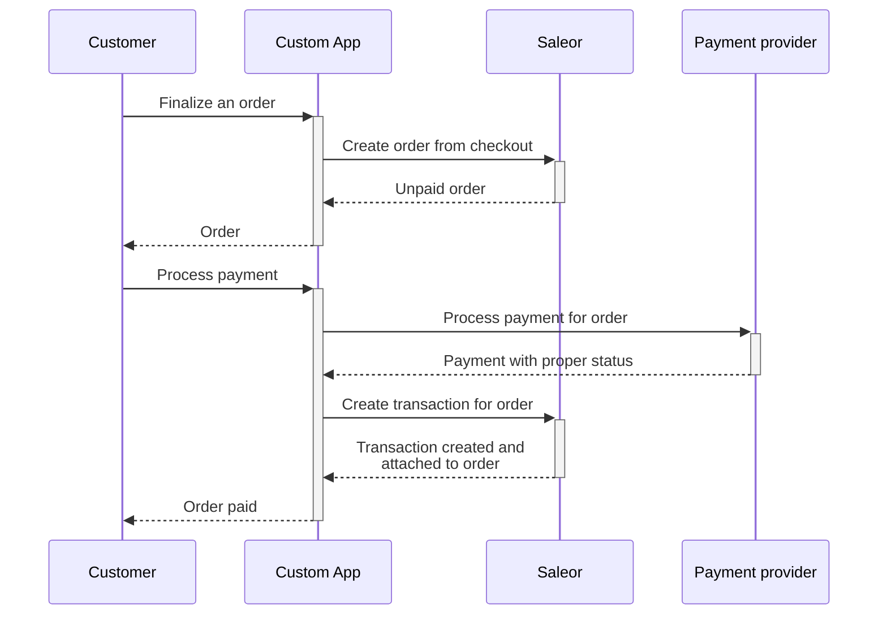
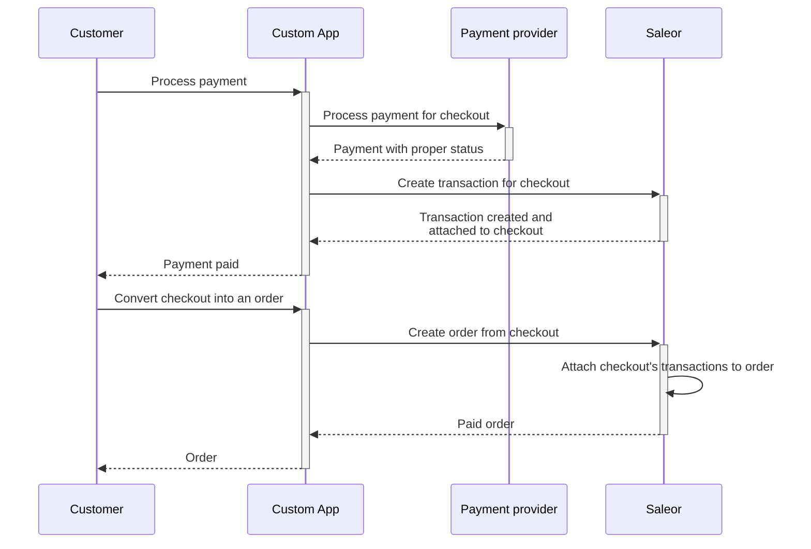
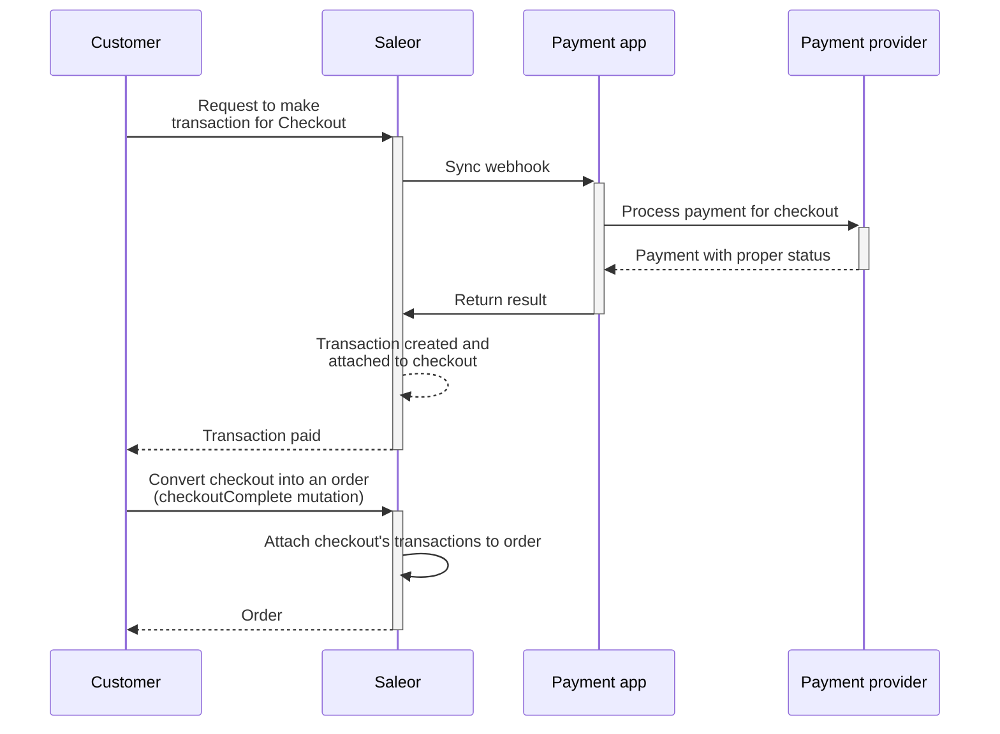

import Tabs from "@theme/Tabs";
import TabItem from "@theme/TabItem";

## Free orders

You might have a use case where you want to allow customers to complete a checkout without needing to pay. This can be useful for scenarios like:

- Free samples
- Free digital downloads

To allow for this, you can create a checkout with a total price of `0`. This can be achieved by adding a free item to the checkout or by applying a discount code that reduces the total price to `0`.

## Example of checkout flows

### Creating order before processing payment (using custom app)

The advantage of this flow that prices, discount and stock are frozen before payment is created.



### Processing payment before creating an order (using custom app)

In this flow payment is made in Checkout, before Order is created - this way stocks are not reserved until a payment is made.



### Processing payment before creating an order (using Saleor Transaction API)

Similar to previous flow, but instead of communicating with a custom app directly, Saleor Transaction API is used, payment app can be easily swapped for another.

Learn more about this integration in [Transactions Overview](/developer/payments/overview.mdx).



### Creating order from checkout without Payments

Creating unpaid orders is possible for channels that have [`allowUnpaidOrders`](/api-reference/miscellaneous/objects/order-settings#ordersettingsallowunpaidordersboolean---) setting enabled.
If you wish to bypass this setting, you can use [`orderCreateFromCheckout`](api-reference/orders/mutations/order-create-from-checkout.mdx).

The operation requires the `HANDLE_CHECKOUTS` permission and can be called only by the App. Calling `checkoutPaymentCreate` and `checkoutComplete` is not necessary.

The created order can be marked as paid by staff customer/app with the `MANAGE_ORDERS` permission.

To create an order from checkout we can pass id of the checkout to [`orderCreateFromCheckout`](api-reference/orders/mutations/order-create-from-checkout.mdx).

<Tabs>
<TabItem value={"GraphQL"}>
```graphql
mutation {
  orderCreateFromCheckout(
    id: "Q2hlY2tvdXQ6YTcxYjRjZDQtNzI1NS00ZjAyLWEzOTEtMDQxYWQ0MmNjZWNk"
    removeCheckout: true
  ) {
    order {
      id
    }
  }
}
```
</TabItem>
<TabItem value={"Result"}>
```json
{
  "data": {
    "orderFromCheckoutCreate": {
      "order": {
        "id": "T3JkZXI6MjI="
      }
    }
  },
  "extensions": {
    "cost": {
      "requestedQueryCost": 0,
      "maximumAvailable": 50000
    }
  }
}
```
</TabItem>
</Tabs>


## Partial/Split payments

Common use cases of splitting payments on a single order are:

- Charging only for part of the order and another part after the fulfillment.
- Orders are split into fulfillment's paid separately to each vendor.
- Paying part with gift card, and the rest with credit card.
- Authorize part of the basket as a pre-order payment (without charging) and change it immediately before fulfillment.

#### Possible Approach
Prepare two transactions, one that is only authorized and one that is charged immediately.

1. **Initialize transactions:**

For the authorized-only transaction:
- Checkout passes `amount` to the [`transactionInitialize`](/api-reference/payments/mutations/transaction-initialize.mdx) mutation, and desired action such as `AUTHORIZE`.
- In the `TRANSACTION_INITIALIZE_SESSION` webhook the payment app validates the split (e.g. if it is allowed) and includes `AUTHORIZE` in [allowed actions](/developer/extending/webhooks/synchronous-events/transaction#response-4).

Remaining amount:
- Checkout passes the remaining `amount` to the [`transactionInitialize`](/api-reference/payments/mutations/transaction-initialize.mdx) mutation and desired action such as `CHARGE`.
- In the `TRANSACTION_INITIALIZE_SESSION` webhook, the payment app validates the split (e.g., if it is allowed) and includes `CHARGE` in [allowed actions](/developer/extending/webhooks/synchronous-events/transaction#response-4).

2. **Process transactions:**
 - Calling [`transactionProcess`](/api-reference/payments/mutations/transaction-process.mdx) with `action` set to `AUTHORIZE` for the first transaction and `CHARGE` for the second transaction.

:::note
While it is possible to call `transactionInitialize` and `transactionProcess` directly from the storefront (client-side), it is recommended that these operations be executed from the backend (server-side), which would be more resilient and maintainable.
:::

## Product personalization

Common use cases of product personalization are:

- Customized products (e.g., engraved jewelry, custom t-shirts)
- Packaging preferences
- Product configuration such as PC components, furniture, cars, etc.
- Delivery preferences for each item

The personalization can be achieved by adding additional [`metadfields`](/api-reference/checkout/objects/checkout-line.mdx#checkoutlinemetafieldstring--) fields to the [`CheckoutLine`](/api-reference/checkout/objects/checkout-line.mdx) object.

With the following mutations:
- [`checkoutLinesAdd`](/api-reference/checkout/mutations/checkout-lines-add.mdx)
- [`checkoutLinesUpdate`](/api-reference/checkout/mutations/checkout-lines-update.mdx)

The [`metdafields`](/api-reference/orders/objects/order-line.mdx#orderlinemetafieldstring--) will be copied to the [`OrderLine`](/api-reference/orders/objects/order-line.mdx) after checkout completion.

Additional steps might be required to process such fields in the fulfillment process, such as:

- Pass the fields to the ERP system
- Listen to [`webhook`](/developer/extending/webhooks/overview.mdx) events such as `ORDER_CREATED` to process the fields
- [Custom pricing](#custom-product-pricing)
- Metadata can be added without permissions via front-end API; thus, it might require extra validation steps on the server or write metadata lines with server permissions to `privateMetadata` instead.

## Custom product pricing

To set prices on checkout lines dynamically you can use the [`checkoutLinesUpdate`](/api-reference/checkout/inputs/checkout-line-update-input.mdx#checkoutlineupdateinputpricepositivedecimal--) mutation.
See example [repository](https://github.com/saleor/saleor-app-checkout-prices) for creating custom pricing middleware.


## Using phone number instead as identity

You can use a phone number instead of an email address to identify customers. While Saleor always requires email to create orders, you can use the `email` field as a phone number or other semantic meaning. For example: `123456789@noreply.yourcompany.com`. Make sure always to use **domain names you own**, to avoid leaking user data.

## Automatic checkout completion

The checkout can be automatically completed once full payment is received when using Payment Apps.

For more details, read [here](/developer/payments/transactions#automatic-checkout-completion).


## Order approvals and quotes

Example order approval flow:
1. Customer places an order without payment
2. Admin reviews the order and provides a final price in the form of a discount
3. Customer pays the final price
4. The order is shipped

[Channel setting](/developer/channels/configuration.mdx#allow-unpaid-orders) should enable [`allowUnpaidOrders`](/api-reference/orders/inputs/order-settings-input.mdx#ordersettingsinputallowunpaidordersboolean--) to create orders without payments, (settings can be set via [API](/api-reference/channels/mutations/channel-update.mdx) or _Dashboard -> Order -> Order settings cogwheel_).

To require manual approval of orders in the dashboard, set the [`automaticallyConfirmAllNewOrders`](/api-reference/orders/inputs/order-settings-input.mdx#ordersettingsinputautomaticallyconfirmallnewordersboolean--) to `false`
(can be set via the dashboard _Configuration -> Channel_).

To arrange communication between flow between admin see Order related [`webhooks`](/api-reference/webhooks/enums/webhook-sample-event-type-enum.mdx).


## Subscriptions

Common use cases of subscriptions are:

- Create a subscription for a product that gets fulfilled periodically.
- Create membership subscriptions that do not require fulfillment.

A subscription service can be implemented as a standalone service that communicates with Saleor to write orders, update payments, and fulfill orders.
If admins need to manage subscriptions, you can use [custom app](/developer/extending/apps/quickstart.mdx) to create a dedicated UI in the Saleor dashboard to talk to your subscription service.
