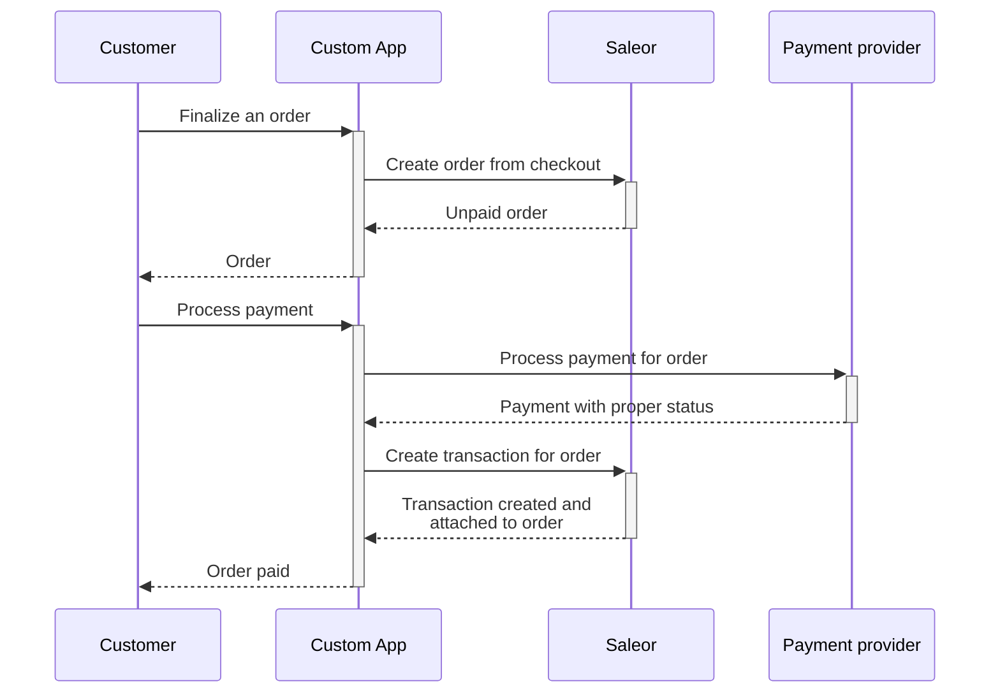
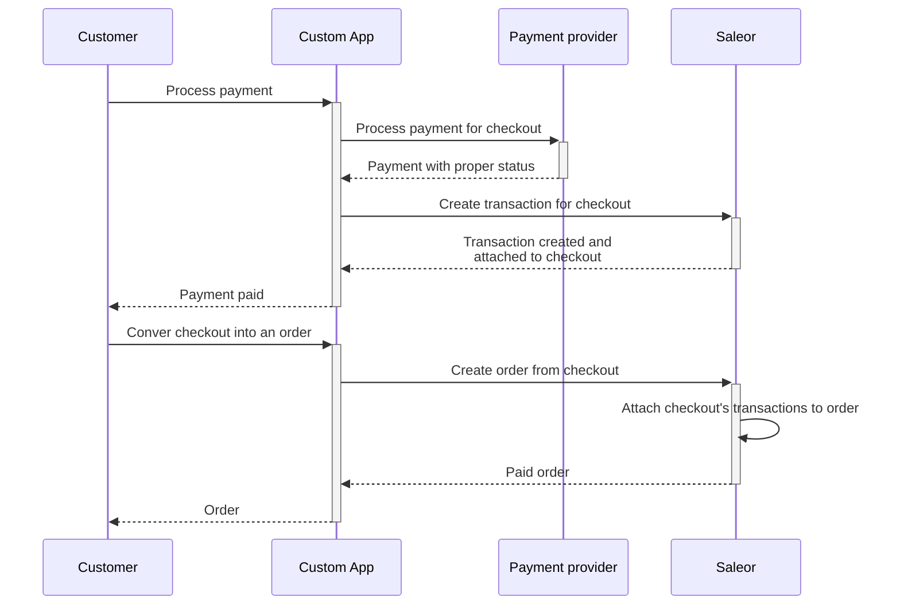

import Tabs from "@theme/Tabs";
import TabItem from "@theme/TabItem";

## Free orders

You might have a use case where you want to allow customers to complete a checkout without needing to pay. This can be useful for scenarios like:

- Free samples
- Free digital downloads

To allow for this, you can create a checkout with a total price of `0`. This can be achieved by adding a free item to the checkout or by applying a discount code that reduces the total price to `0`.

## Example of checkout flows

### Creating order before processing payment

The advantage of this flow that prices, discount and stock are frozen before payment is created.



### Processing payment before creating an order



### Creating order from checkout without Payments

Creating unpaid orders is possible for channels that have [`allowUnpaidOrders`](/api-reference/miscellaneous/objects/order-settings#ordersettingsallowunpaidordersboolean--) setting enabled.
If you wish to bypass this setting, you can use [`orderCreateFromCheckout`](api-reference/orders/mutations/order-create-from-checkout.mdx).

The operation requires the `HANDLE_CHECKOUTS` permission and can be called only by the App. Calling `checkoutPaymentCreate` and `checkoutComplete` is not necessary.

The created order can be marked as paid by staff customer/app with the `MANAGE_ORDERS` permission.

To create an order from checkout we can pass id of the checkout to [`orderCreateFromCheckout`](api-reference/orders/mutations/order-create-from-checkout.mdx).

<Tabs>
<TabItem value={"GraphQL"}>
```graphql
mutation {
  orderCreateFromCheckout(
    id: "Q2hlY2tvdXQ6YTcxYjRjZDQtNzI1NS00ZjAyLWEzOTEtMDQxYWQ0MmNjZWNk"
    removeCheckout: true
  ) {
    order {
      id
    }
  }
}
```
</TabItem>
<TabItem value={"Result"}>
```json
{
  "data": {
    "orderFromCheckoutCreate": {
      "order": {
        "id": "T3JkZXI6MjI="
      }
    }
  },
  "extensions": {
    "cost": {
      "requestedQueryCost": 0,
      "maximumAvailable": 50000
    }
  }
}
```
</TabItem>
</Tabs>
