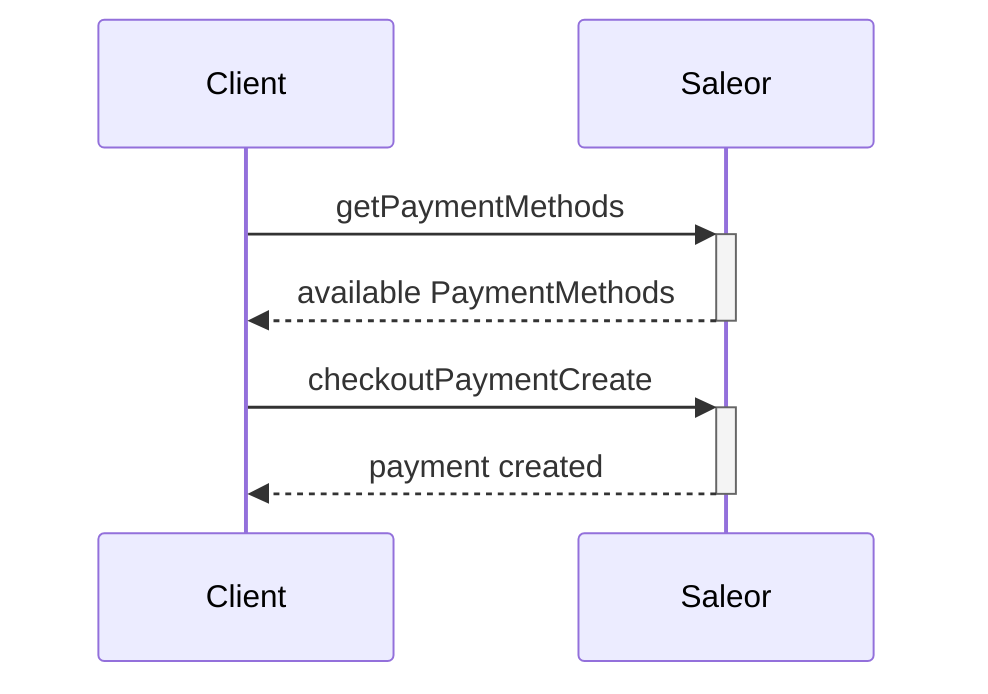
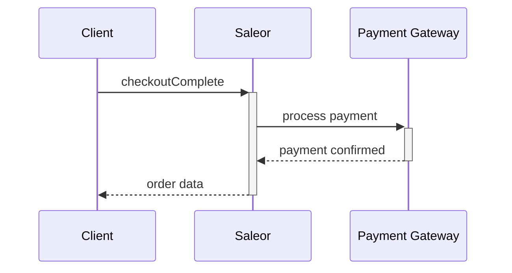
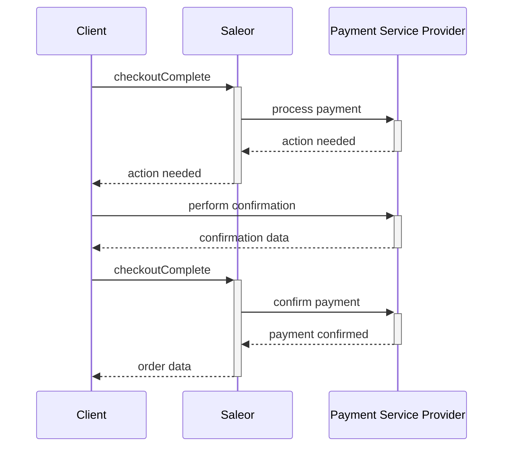
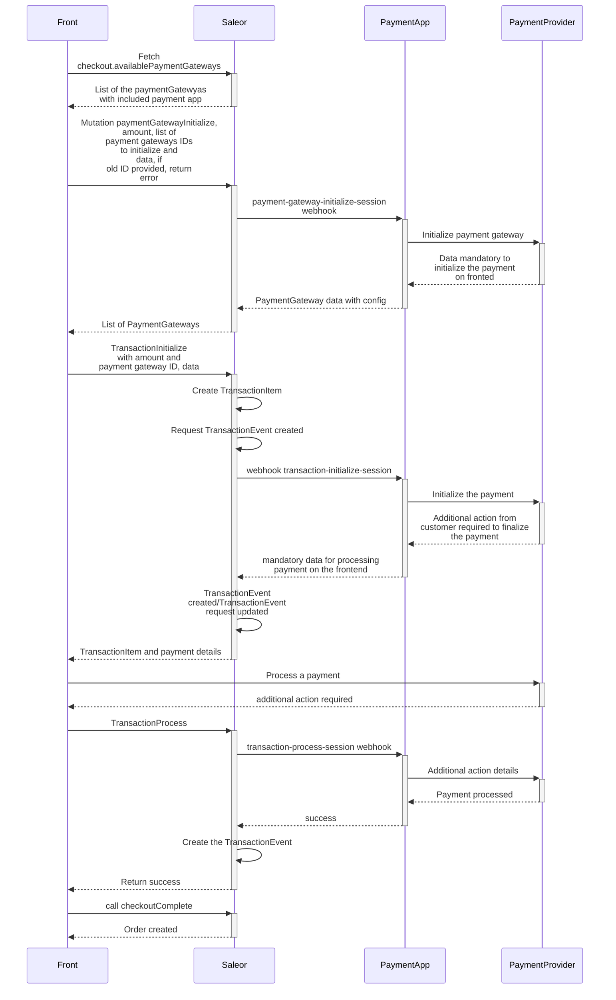
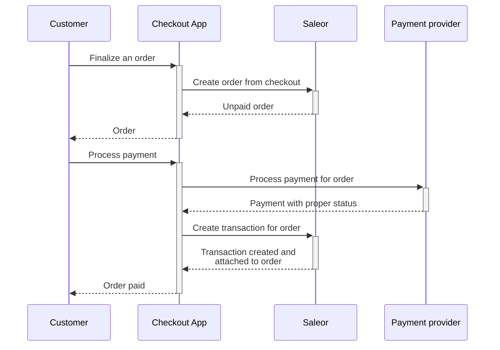
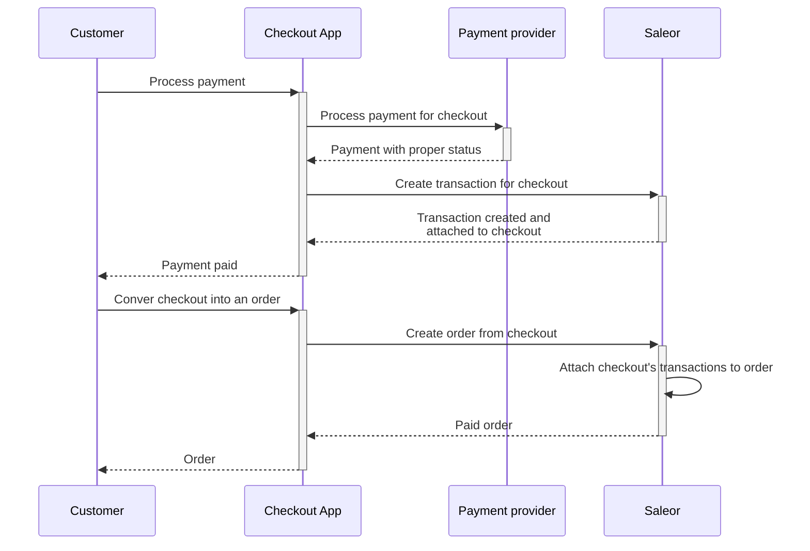
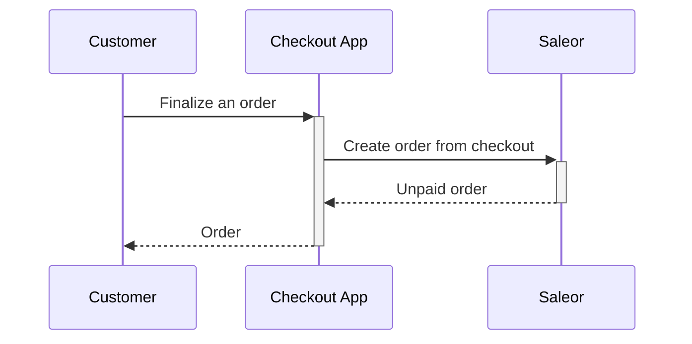

## Finalizing checkout with Saleor's payment gateways

The payment flow uses the Saleor's payment gateway or payment synchronous webhooks to process a payment.

### Payment

Depending on the selected payment gateway, you will use the payment provider's form, which can be integrated with Saleor or be redirected to an external payment page. The payment gateway returns information if the payment is successful, along with tokenized credit card payment information. This token is then used to run the [`checkoutPaymentCreate`](docs/api-reference/checkout/mutations/checkout-payment-create.mdx) mutation.



#### Listing available payment gateways

Available payment gateways can be listed from the `Checkout.availablePaymentGateways` field. Depending on the chosen gateway, you may need additional configuration. For example, public `api_key` is used by the frontend payment library. To obtain that data, run:

```graphql
query {
  checkout(id: "Q2hlY2tvdXQ6ZTEzZDFjOTItOWJkNi00ODViLTgyMDctZTNhM2I5NjVkZTQw") {
    availablePaymentGateways {
      id
      name
      config {
        field
        value
      }
    }
  }
}
```

Response:

```json
{
  "data": {
    "checkout": {
      "availablePaymentGateways": [
        {
          "id": "mirumee.payments.stripe",
          "name": "Stripe",
          "config": [
            {
              "field": "api_key",
              "value": "pk_test_SkWEusCNFdSgxGGmd23z7JC1FHh3uNufNuX"
            },
            {
              "field": "store_customer_card",
              "value": "false"
            }
          ]
        },
        {
          "id": "mirumee.payments.dummy",
          "name": "Dummy",
          "config": [
            {
              "field": "store_customer_card",
              "value": "false"
            }
          ]
        }
      ]
    }
  }
}
```

#### Creating payment

The [`checkoutPaymentCreate`](docs/api-reference/checkout/mutations/checkout-payment-create.mdx) mutation takes the following arguments:

- `id`: the checkout id (if required by a payment gateway).
- `input`: [PaymentInput](docs/api-reference/payments/inputs/payment-input.mdx) object:
  - `gateway`: the ID of the selected payment gateway (a list of the available payment gateways can be fetched from the `Checkout.availablePaymentGateways` field). The selected gateway must support the checkout currency.
  - `token`: a client-side generated payment token (if required).
  - `amount`: the total amount of this operation.
  - `returnUrl`: URL of a storefront view where the user should be redirected after requiring additional actions. Payment with additional actions will not be finished if this field is not provided.
  - `storePaymentMethod`: the type of payment storage in a gateway. [StorePaymentMethod](docs/api-reference/payments/enums/store-payment-method-enum.mdx) value. If not provided, defaults to `NONE` (added in Saleor 3.1).
  - `metadata`: a list of [MetadataInput](docs/api-reference/miscellaneous/inputs/metadata-input.mdx) (added in Saleor 3.1).

This mutation returns the following fields:

- `checkout`: the updated checkout object.
- `payment`: the newly created payment object.
- `errors`: a list of errors that occurred during mutation execution.

In the example below, we're creating a new Braintree payment for our checkout:

```graphql {2-15}
mutation {
  checkoutPaymentCreate(
    id: "Q2hlY2tvdXQ6ZTEzZDFjOTItOWJkNi00ODViLTgyMDctZTNhM2I5NjVkZTQw"
    input: {
      gateway: "mirumee.payments.braintree"
      token: "tokencc_bh_s3bjkh_24smq8_6c6zhq_w4v6b9_8vz"
      amount: 25.99
      storePaymentMethod: ON_SESSION
      metadata: [{ key: "user_id", value: "#1234" }]
    }
  ) {
    payment {
      id
      chargeStatus
      metadata {
        key
        value
      }
    }
    paymentErrors {
      field
      message
    }
  }
}
```

As a result, we get the payment object:

```json
{
  "data": {
    "checkoutPaymentCreate": {
      "payment": {
        "id": "UGF5bWVudDox",
        "chargeStatus": "NOT_CHARGED",
        "metadata": [
          {
            "key": "user_id",
            "value": "#1234"
          }
        ]
      },
      "errors": []
    }
  }
}
```

### Completing the checkout

The purpose of the operation is to ensure this checkout is correct. The validation consists of checking:

1. The required addresses are valid.

2. All selected products are in stock (while making the purchase, another user could already buy the last available item), except variants that have disabled stock tracking which can have negative stock.

3. The payment creation succeeded.

4. No additional actions are required by the PSP.

If these are satisfied, the checkout is transformed into an order, and the customer receives a confirmation email.

#### Without additional payment action



The [`checkoutComplete`](docs/api-reference/checkout/mutations/checkout-complete.mdx) mutation requires the following input:

- `id`: the ID of the checkout to complete.
- `redirectUrl`: URL of a view where users should be redirected to see the order details. URL in RFC 1808 format.
- `paymentData`: Client-side generated data required to finalize the payment.

It returns the following output:

- `order`: an `Order` object created from the checkout object.
- `confirmationNeeded`: set to `true` if payment needs to be confirmed before checkout is complete.
- `confirmationData`: confirmation data used to process additional authorization steps, required by the PSP.
- `errors`: a list of errors that occurred during mutation execution.

Here is the example of a complete mutation:

```graphql {2-4}
mutation {
  checkoutComplete(
    id: "Q2hlY2tvdXQ6ZTEzZDFjOTItOWJkNi00ODViLTgyMDctZTNhM2I5NjVkZTQw"
  ) {
    order {
      id
      status
    }
    errors {
      field
      message
    }
  }
}
```

A successful response would look like this:

```json
{
  "data": {
    "checkoutComplete": {
      "order": {
        "id": "T3JkZXI6MjU=",
        "status": "UNFULFILLED"
      },
      "errors": []
    }
  }
}
```

Here is an example of the [`checkoutComplete`](docs/api-reference/checkout/mutations/checkout-complete.mdx) mutation where the payment gateway requires additional data to finalize the payment using the Adyen payment gateway:

```graphql {2-5}
mutation{
  checkoutComplete(
    id: "Q2hlY2tvdXQ6ZTEzZDFjOTItOWJkNi00ODViLTgyMDctZTNhM2I5NjVkZTQw",
    paymentData: "{\"paymentMethod\": {\"type\": \"scheme\", \"encryptedCardNumber\": \"ad...\", \"encryptedExpiryMonth\": \"18...\", \"encryptedExpiryYear\": \"18$C...\", \"encryptedSecurityCode\": \"18$...\", \"holderName\": \"S. Hopper\"}}"
){
     confirmationNeeded
     confirmationData
     order
     errors{
       field
       message
       code
     }
}
```

A response would look like this:

```json
{
  "data": {
    "checkoutComplete": {
      "order": {
        "id": "T3JkZXI6MjU=",
        "status": "UNFULFILLED"
      },
      "confirmationNeeded": false,
      "confirmationData": null,
      "errors": []
    }
  }
}
```

#### Payment requiring additional action



An example of additional action is 3D Secure confirmation required by payment providers.

An example of a complete mutation where the payment gateway requires additional steps from the user:

```graphql {2-5}
mutation{
  checkoutComplete(
    id: "Q2hlY2tvdXQ6ZTEzZDFjOTItOWJkNi00ODViLTgyMDctZTNhM2I5NjVkZTQw",
    paymentData: "{\"encryptedAdditionalAction\": \"eka...\"}"
){
     confirmationNeeded
     confirmationData
     order
     errors{
       field
       message
       code
     }
}
```

A response would look like this:

```json
{
  "data": {
    "checkoutComplete": {
      "order": null,
      "confirmationNeeded": true,
      "confirmationData": "{\"paymentData\":\"Ab02b4c...\", \"paymentMethodType\":\"scheme\", \"token\":\"eyJ0aHJlZURTTWV0aG9kTm9...\", \"type\":\"threeDS2Fingerprint\"}",
      "errors": []
    }
  }
}
```

:::caution

When any error is raised during the checkout completion or the payment
will become inactive, processed payment will be refunded or voided (in case the payment wasn't charged yet).

Here are the example scenarios that may end up with payment refunding:

- the shipping method became invalid
- the checkout is not fully paid
- some products became unavailable od there is not enough stock of them
- the processed payment became inactive

:::

## Finalizing checkout with Saleor App

The flow where the payment process is handled by an external Saleor App.
Saleor expects to receive a result of the payment transaction processed by Saleor App.

There are two ways to process payments with the Saleor app:

- Using the Checkout app: This external app handles the payment process and creates an order by
  using the `orderCreateFromCheckout` API. The API is protected and requires an app token.
  This flow supports two ways of processing checkout: first payments, then order and first order,
  then payments. It also supports partial payments.

- Using the Payment app: The communication between the storefront and payment app goes through
  Saleor. Based on the response, Saleor creates or updates the transaction with the proper status.
  The API is public. This flow allows you to handle the checkout process when payments are processed
  first, then the order is created. It also supports partial payments.

### Using the Payment app

:::info

This feature was introduced in **Saleor 3.13**.

:::
:::caution

This feature is in the **Feature Preview** stage, which means that it is available for experimentation and
feedback. However, it is still undergoing development and is subject to modifications.

:::

:::info
This feature is dedicated to [third-party](api-reference/apps/enums/app-type-enum.mdx#code-style-fontweight-normal-apptypeenumbthirdpartybcode) apps.
:::

The flow of communication between the storefront and payment app goes through Saleor. Based on the response, Saleor creates or updates the transaction with the proper status and returns them to the frontend.

The diagram below shows the workflow of a checkout process with a payment app:



#### Processing a payment

All details related to processing and managing payments can be found [here](developer/payments.mdx#processing-a-payment-with-payment-app)

:::note
When the checkout is fully paid, the webhook [CHECKOUT_FULLY_PAID](api-reference/webhooks/enums/webhook-event-type-async-enum.mdx#code-style-fontweight-normal-webhookeventtypeasyncenumbcheckout_fully_paidbcode) will be triggered.
:::

#### Completing the checkout

The purpose of the operation is to ensure this checkout is correct. The validation consists of checking:

1. The required addresses are valid.

2. All selected products are in stock (while making the purchase, another user could already buy the last available item).

3. The payments are processed

If these are satisfied, the checkout is transformed into an order, and the customer receives a confirmation email.

The [`checkoutComplete`](api-reference/checkout/mutations/checkout-complete.mdx) mutation requires the following input:

- `id`: the ID of the checkout to complete

It returns the following output:

- `order`: an `Order` object created from the checkout object.
- `errors`: a list of errors that occurred during mutation execution.

Here is the example of a complete mutation:

```graphql {2-4}
mutation {
  checkoutComplete(
    id: "Q2hlY2tvdXQ6ZTEzZDFjOTItOWJkNi00ODViLTgyMDctZTNhM2I5NjVkZTQw"
  ) {
    order {
      id
      status
    }
    errors {
      field
      message
    }
  }
}
```

A successful response would look like this:

```json
{
  "data": {
    "checkoutComplete": {
      "order": {
        "id": "T3JkZXI6MjU=",
        "status": "UNFULFILLED"
      },
      "errors": []
    }
  }
}
```

### Using the Checkout app

The flow where the payment process is handled by an external Saleor App such as [saleor-checkout](https://github.com/saleor/react-storefront/tree/canary/apps/checkout).

:::note
This flow is recommended when the implemented checkout has custom steps that need to be handled before creating
the order or when you expect that the order needs to be created first.
:::

The below charts show the workflow of a checkout process.

#### Case: Creating order before processing payment



#### Case: Processing payment before creating an order



#### Creating order from checkout

:::info

This feature was introduced in **Saleor 3.2**.

:::

Pre-requirements for creating an order from checkout:

- The required addresses are valid.
- The shipping method is valid (if required).
- All selected products are in stock.

If these are satisfied, the checkout is transformed into an order, and the customer receives a confirmation email.
The operation requires the `HANDLE_CHECKOUTS` permission and can be called only by the App. Calling `checkoutPaymentCreate` and `checkoutComplete` is not needed for this approach.
The created order can be marked as a paid by staff customer/app with the `MANAGE_ORDERS` permission.

The chart below shows a proposed flow where this operation can be used.



The [orderCreateFromCheckout](docs/api-reference/checkout/mutations/order-create-from-checkout.mdx) mutation takes the following arguments:

- `id`: The ID of the checkout that should be used to create a new order.
- `removeCheckout`: Determines if checkout should be removed after creating an order. Default `true`.

The following example shows how the [orderCreateFromCheckout](docs/api-reference/checkout/mutations/order-create-from-checkout.mdx) mutation creates a new order and removes the checkout.

```graphql
mutation {
  orderCreateFromCheckout(
    id: "Q2hlY2tvdXQ6YTcxYjRjZDQtNzI1NS00ZjAyLWEzOTEtMDQxYWQ0MmNjZWNk"
    removeCheckout: true
  ) {
    order {
      id
    }
  }
}
```

As a result, we get an order object:

```json
{
  "data": {
    "orderFromCheckoutCreate": {
      "order": {
        "id": "T3JkZXI6MjI="
      }
    }
  },
  "extensions": {
    "cost": {
      "requestedQueryCost": 0,
      "maximumAvailable": 50000
    }
  }
}
```

#### Managing payments

Saleor uses transaction flow to manage the payments attached to the checkout by Saleor apps.
You can find more details about it [here](docs/developer/payments.mdx#processing-a-payment-with-checkout-app).
