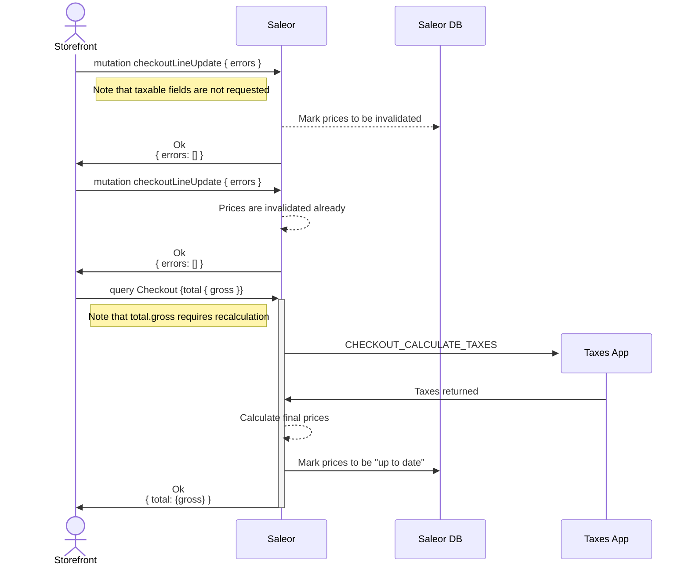

This chapter contains guidelines for improving the performance of the checkout process.

## Taxes recalculation with custom taxes apps

When taxes app is used to calculate taxes (`CHECKOUT_CALCULATE_TAXES` AND `ORDER_CALCULATE_TAXES` subscriptions are being used),
the app is called every time taxes [need to be recalculated](/developer/extending/webhooks/synchronous-events/tax).

:::warning
Since **Saleor 3.21**, the following queries will return prices stored in the database:
 - `checkouts(...)`
 - `me.checkouts(...)`
 - `checkoutLines(...)`

These queries **will not** make external API calls for tax recalculation.
:::

You may see mutations like `checkoutLineAdd` or `checkoutShippingMethodUpdate` being slow,
just like the queries that require prices affected by taxes (see [TaxedMoney](/api-reference/miscellaneous/objects/taxed-money)).

To improve checkout (or order - it can be used in the same way) performance, you can optimize your storefront to avoid recalculating taxes when possible.

Example patterns:
- When calling `checkoutLineAdd` do not require entire checkout in the response. Check for `errors` and assume mutation succeeds if there are none.
- If storefront doesn't show gross prices (they are calculated after shipping is provided), do not require gross price. Use net prices or catalog prices instead.

### Optimistic UI

For operations like changing line quantity, you may want to assume that the operation will succeed and update the UI immediately.
You can leverage strategy called "optimistic updates" for that.

- [Apollo](https://www.apollographql.com/docs/react/v2/performance/optimistic-ui)
- [React Query](https://tanstack.com/query/v4/docs/framework/react/guides/optimistic-updates)
- [urql](https://commerce.nearform.com/open-source/urql/docs/graphcache/cache-updates/#optimistic-updates)

In the nutshell, storefront can calculate new price locally and update the UI immediately, while the real response will apply with a delay in the background.

### Lazy vs eager recalculations

Some mutations require price recalculations - such as changing lines quantity or adding a voucher. However, not every mutation behaves the same way.

With performance considerations, there are two strategies how mutations recalculate prices:

- Eager: Mutation will call `CHECKOUT_CALCULATE_TAXES` / `ORDER_CALCULATE_TAXES` event during the mutation execution. That means mutation will run slower and the returned value will have latest updates prices values.
- Lazy: Mutation will mark internal prices to be "dirty", but not call the webhook immediately. Webhook will be called once the value is requested afterward.

#### Eager mutations

Following Order mutations are eager:
- [draftOrderComplete](/api-reference/orders/mutations/draft-order-complete.mdx)
- [orderDiscountAdd](/api-reference/orders/mutations/order-discount-add.mdx)
- [orderDiscountUpdate](/api-reference/orders/mutations/order-discount-update.mdx)
- [orderLineDiscountUpdate](/api-reference/orders/mutations/order-discount-update.mdx)
- [orderLineDiscountDelete](/api-reference/orders/mutations/order-discount-delete.mdx)

In case of Checkout mutations and not mentioned Order mutations - all of them are lazy.

#### Fields that cause taxes recalculations

For lazy operations, only requesting certain fields will trigger prices recalculation (including synchronous webhook calls).

It takes at least one field to trigger recalculation.

These fields are:

**For Checkout**
- `totalPrice`, `subtotalPrice`
- `shippingPrice`
- lines `totalPrice`
- lines `unitPrice`

**For Order in Draft or Unconfirmed status**
- `total`, `subtotal` & `undiscountedTotal`
- `undiscountedShippingPrice`, `shippingPrice` & `shippingTaxRate`
- `discounts`
- lines `totalPrice` & `undiscountedTotalPrice`
- lines `unitPrice` & `undiscountedUnitPrice`
- lines `taxRate`
- lines `unitDiscount`, `unitDiscountValue`, `unitDiscountType`