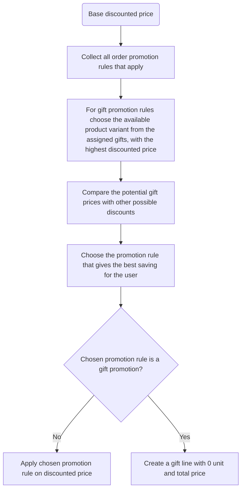

Order promotions apply discounts during checkout or draft order creation when specific conditions are met. 
Unlike catalogue promotions, these discounts don't appear on product pages - they activate based on cart contents.

## How Order Promotions Work

Order promotions evaluate checkout/draft order amount and apply rewards when conditions match. The system:

1. Checks all applicable order promotion rules
2. Compares potential savings from each qualifying rule
3. Applies only the rule providing maximum savings

Order discounts calculate from **base prices** (prices after catalogue promotions).

## Reward Types

Order promotions support two reward types:

### Subtotal Discount

Reduces the subtotal price by a fixed amount or percentage.


:::warning
Promotions with `SUBTOTAL_DISCOUNT` do not work with the `TAX_APP` strategy.
To Do: VERIFY 
:::

### Gift Reward

Adds a free product to the order. You define which variants can be given as gifts, and the system selects the one with the highest discounted price.

Gift details:

- Created as a new line with unit and total price of 0
- Only one gift per checkout/draft order
- Limited to 500 gift variants per promotion rule
- Marked with `isGift: true` on the line

## Creating Order Promotion
**In Dashboard**
To Do: 

### Defining Order Predicates

Order predicates define conditions based on checkout/order attributes:

- `baseSubtotalPrice`: Sum of line prices (after catalogue discounts)
- `baseTotalPrice`: Subtotal plus shipping

:::info
Price-based predicates require all assigned channels to have the same currency.
:::

### Examples

**10% off when subtotal exceeds $20:**

```json
{
  "orderPredicate": {
    "discountedObjectPredicate": {
      "baseSubtotalPrice": {
        "range": { "gte": 20 }
      }
    }
  },
  "rewardValueType": "PERCENTAGE",
  "rewardValue": 10,
  "rewardType": "SUBTOTAL_DISCOUNT"
}
```

**$5 off when total exceeds $50:**

```json
{
  "orderPredicate": {
    "discountedObjectPredicate": {
      "baseTotalPrice": {
        "range": { "gte": 50 }
      }
    }
  },
  "rewardValueType": "FIXED",
  "rewardValue": 5,
  "rewardType": "SUBTOTAL_DISCOUNT"
}
```

## Gift vs Subtotal Discount Selection

When both gift and subtotal discount rules qualify, Saleor compares savings:

1. For gift rules: Uses the highest-value gift variant's discounted price
2. For subtotal rules: Calculates the actual discount amount
3. Applies whichever provides greater savings



## Order Promotions in Checkout

When an order promotion applies, the discount appears on:

- `checkout.discount.amount`: The order promotion discount value
- `checkout.discountName`: The promotion rule name
- Line prices: Reduced proportionally

### Example Checkout with Order Discount

```json
{
  "checkout": {
    "discount": { "amount": 5.0 },
    "discountName": "Example order promo: order rule",
    "subtotalPrice": { "gross": { "amount": 35.0 } },
    "lines": [
      {
        "undiscountedTotalPrice": { "amount": 40.0 },
        "totalPrice": { "gross": { "amount": 35.0 } },
        "unitPrice": { "gross": { "amount": 17.5 } },
        "undiscountedUnitPrice": { "amount": 20.0 }
      }
    ]
  }
}
```

### Completed Order with Order Discount

```json
{
  "order": {
    "total": { "gross": { "amount": 42.5 } },
    "undiscountedTotal": { "gross": { "amount": 47.5 } },
    "discounts": [
      {
        "name": "Example order promo: order rule",
        "type": "ORDER_PROMOTION",
        "valueType": "FIXED",
        "amount": { "amount": 5.0 }
      }
    ]
  }
}
```

### Example Checkout with Gift

```json
{
  "checkout": {
    "discount": { "amount": 0.0 },
    "lines": [
      {
        "isGift": false,
        "totalPrice": { "gross": { "amount": 40.0 } }
      },
      {
        "isGift": true,
        "totalPrice": { "gross": { "amount": 0.0 } },
        "undiscountedUnitPrice": { "amount": 50.0 }
      }
    ]
  }
}
```

## Combining with Catalogue Promotions

Order and catalogue promotions can apply together:

1. Catalogue promotion reduces the product price
2. Order promotion applies to the already-discounted subtotal

The total discount is the sum of both:

```json
{
  "checkout": {
    "discount": { "amount": 5.0 },
    "lines": [
      {
        "undiscountedTotalPrice": { "amount": 40.0 },
        "totalPrice": { "gross": { "amount": 23.0 } },
        "variant": {
          "pricing": {
            "onSale": true,
            "discount": { "gross": { "amount": 6.0 } }
          }
        }
      }
    ]
  }
}
```

In this example: **$6** catalogue discount × 2 items + **$5** order discount = **$17** total savings.

## Order Promotions and Vouchers

Order promotions **cannot** combine with vouchers. When a voucher code is added:

- The order promotion discount is removed
- Only the voucher discount applies

## Limits

- Maximum 100 promotion rules with `ORDER` predicate type
- Maximum 500 gift variants per promotion rule

## Business Use Cases

- **Spend thresholds**: "Get 10% off orders over $100"
- **Free shipping equivalent**: "$10 off when you spend $75"
- **Gift with purchase**: "Free sample when you spend $50"
- **Basket builders**: Encourage larger orders with tiered discounts

## Related

- [Promotions Overview](/developer/discounts/promotions-overview.mdx)
- [Promotions API](/developer/discounts/promotions-api.mdx) - Create order promotions via API
