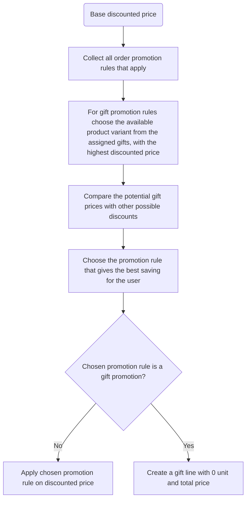

Order promotions apply discounts during checkout or draft order creation when specific conditions are met. 
Unlike catalogue promotions, these discounts don't appear on product pages - they activate based on cart contents.

## How Order Promotions Work

Order promotions evaluate checkout/draft order amount and apply rewards when conditions match. The system:

1. Checks all applicable order promotion rules
2. Compares potential savings from each qualifying rule
3. Applies only the rule providing maximum savings

Order discounts are calculated from prices after catalogue promotions

## Reward Types

Order promotions support two reward types:

### Subtotal Discount

Reduces the total cost of the order by a fixed amount (e.g., $10 off) or a percentage (e.g., 10% off).

:::info
For a promotion with multiple price-based rules, all assigned channels must use the same currency.
:::

### Gift Reward

Automatically adds a free item ($0.00) to the cart when promotion criteria are met.

- **Gift Selection:** You can list up to 500 gift options. Saleor automatically picks the highest-priced item available. If it’s out of stock, it moves to the next available option.
- **One Per Order:** Only one free gift is allowed per checkout / draft order.
- **Clear Tracking:** Gifts are tagged as isGift in your records to distinguish them from paid items.

## Predicate
Predicate define the spending threshold required to trigger the reward.
- **Subtotal Price:**	The sum of all items in the cart.	"Spend over $100"
- **Total Price:** The subtotal PLUS shipping costs.	"Total exceeds $120"

## Creating Order Promotion

Follow these steps to set up an order-wide discount or gift in the Saleor Dashboard.

**1. Start a New Promotion**

    - In the left sidebar, go to **Discounts > Promotions**
    - Click **Create Discount** in the top right corner

**2. General Information**

    - **Name**: Enter a descriptive name (e.g., "New Year Sale")
    - **Type**: Select **Order** to apply the discount to the checkout subtotal
    - **Description** (Optional): Add details about the promotion for your team
    - **Dates**: Set a **Start Date** and optional **End Date**

**3. Define Promotion Rules**

    Rules determine who gets a reward and what that reward is.
    - **Rule Name**: Give this specific rule a name (e.g., "10% off in Main Store")
    - **Channels**: Select which sales channels this rule applies to (e.g., "Main Store", "Mobile App")
    - **Predicate**: Set the trigger for the reward e.g., "Subtotal price is greater than $100"
    - **Reward**: Choose between:
      - **Subtotal Discount**: Select **Percentage** (e.g., 10%) or **Fixed Amount** (e.g., $15)
      - **Gift**: Select the product variants to be given away.

**4. Save rule and promotion**

The promotion will automatically apply to checkout that meet the conditions when checkout will be updated.

See [Promotion API guide](/developer/discounts/promotions-api.mdx) to learn how to create promotions via API.

## Applying the Order Promotion Chart

When both gift and subtotal discount rules qualify, Saleor compares savings:

1. For gift rules: Uses the highest-value gift variant's discounted price
2. For subtotal rules: Calculates the actual discount amount
3. Applies whichever provides greater savings

## Related

- [Promotions Overview](/developer/discounts/promotions-overview.mdx)
- [Catalogue Promotions](/developer/discounts/catalog-promotions.mdx)
- [API Guide](/developer/discounts/promotions-api.mdx) - Create order promotions via API, checkout examples, building integrations.
