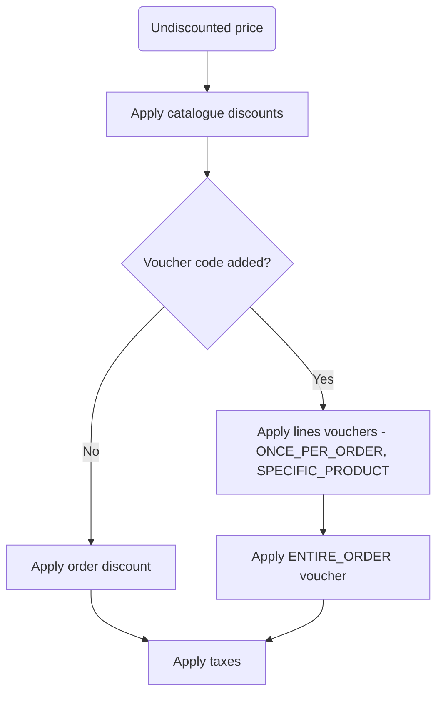

Discounts allow for the reduction of prices for selected variants, products, collections,
or categories by a given percentage or a fixed value. They can also decrease the value 
of subtotal and shipping price or grant a gift if certain conditions are met. 

## Classification

To better understand Saleor discounts and explain the terms used in this documentation, let's classify discounts
by type, level and value type.

### Type
There are three kinds of discounts in Saleor: [`Promotions`](developer/discounts/promotions-overview.mdx), 
[`Vouchers`](developer/discounts/vouchers.mdx) and [`Manual discounts`](developer/discounts/manual-discounts.mdx).
The **promotion** discount is automatically applied to all products included in the promotion,
without requiring any additional actions from the user.
In contrast, **voucher** requires the customer to provide a code during the checkout process (or staff user during draft order process).
Lastly, Saleor offer **manual discounts**, which can be applied by staff users.

* [promotions](developer/discounts/promotions-overview.mdx)
    * [catalogue promotion](developer/discounts/catalog-promotions.mdx)
    * [order promotion](developer/discounts/order-promotions.mdx)
* [vouchers](developer/discounts/vouchers.mdx)
    * [entire order](developer/discounts/apply-vouchers.mdx#entire-order-voucher)
    * [specific product](developer/discounts/apply-vouchers.mdx#specific-product-voucher)
    * [voucher applied to the cheapest line](developer/discounts/apply-vouchers.mdx#once-per-order-entire-order-voucher)
    * [shipping](developer/discounts/apply-vouchers.mdx#shipping-voucher)
* [manual discounts](developer/discounts/manual-discounts.mdx)
    * [manual order discount](developer/discounts/manual-discounts.mdx#manual-order-discount)
    * [manual line discount](developer/discounts/manual-discounts.mdx#manual-line-discount)

### Level
We can distinguish discounts by the object they are associated with. 
Line-level discounts are applicable first, directly to the order line, and decrease the line [base prices](developer/price-calculation.mdx#discount-application).
Order-level discounts are associated with an order object, they decrease subtotal or shipping price, 
and next the discount is propagated to the order's lines. 

* **line-level discounts**
    * [catalogue promotion](developer/discounts/catalog-promotions.mdx)
    * [specific product vouchers](developer/discounts/apply-vouchers.mdx#specific-product-voucher)
    * [vouchers with applyOncePerOrder=True](developer/discounts/apply-vouchers.mdx#once-per-order-entire-order-voucher) 
    * [shipping voucher](developer/discounts/apply-vouchers.mdx#shipping-voucher) (despite being associated with the order, 
    and not with the order line, it decreases the [shipping base price](developer/price-calculation.mdx#discount-application), 
    so should be considered as line-level discount)
    * [manual line discount](developer/discounts/manual-discounts.mdx#manual-line-discount)

* **order-level discounts**
    * [order promotion](developer/discounts/order-promotions.mdx)
    * [entire order voucher](developer/discounts/apply-vouchers.mdx#entire-order-voucher)
    * [manual order discount](developer/discounts/manual-discounts.mdx#manual-order-discount)
    

### Value Type
In general, discounts can take two forms:
* **fixed** - fixed amount, that is deducted from the original price
* **percentage** - percentage value of the original price

## Combining Discounts
### Order of Applying Discounts 

When multiple promotions apply to the same product or order:

- **Multiple catalogue promotions on one product**: Only the discount providing maximum savings applies (discounts don't stack)
- **Catalogue + order promotions**: Both can apply; order discounts calculate from the already-discounted catalogue price
- **Order promotions + vouchers**: Cannot be combined; voucher code takes precedence

### Combining Discounts Table

| Combination | Works Together | Notes |
|------------|----------------|-------|
| Multiple Catalogue Promotions (same product) | ❌ No | Only the discount providing maximum savings applies. Discounts don't stack. |
| Multiple Vouchers | ❌ No | Only one voucher can be applied per order. |
| Multiple Order Promotion | ❌ No | Only the discount providing maximum savings applies. |
| Catalogue Promotion + Order Promotion | ✅ Yes | Catalogue promotion reduces product price first. Order promotion applies to the already-discounted subtotal. |
| Catalogue Promotion + Voucher (ENTIRE_ORDER) | ✅ Yes | Catalogue promotion reduces product price first. Order-level voucher discount applies to the already-discounted subtotal. |
| Catalogue Promotion + Voucher (SPECIFIC_PRODUCT) | ✅ Yes | **Both line-level discounts stack.** Catalogue promotion applies first, then SPECIFIC_PRODUCT voucher applies to the already-discounted price. |
| Order Promotion + Voucher | ❌ No | Voucher code takes precedence. Order promotion is automatically removed when voucher is applied. |
| Order Promotion + Manual Order Total Discount | ❌ No | Manual discount takes precedence. Order promotion is automatically removed when manual discount is applied. |
| Catalogue Promotion + Manual Order Total Discount | ✅ Yes | Both can apply. Catalogue discount applies at line level, manual discount at order level. |
| Catalogue Promotion + Manual Order Line Discount | ❌ No | Manual line discount overrides catalogue promotion. Only one line-level discount can apply per line. |
| Voucher ENTIRE_ORDER + Manual Order Total Discount | ❌ No | Manual order-level discount takes precedence. Order-level voucher discount is removed when manual order discount exists. |
| Voucher ENTIRE_ORDER + Manual Order Line Discount | ✅ Yes | Order-level voucher can work with manual line-level discount (different scopes). |

## Difference Between Vouchers and Gift Cards
While both vouchers and gift cards are applied and removed using the same mutations (`checkoutAddPromoCode` / `checkoutRemovePromoCode`), they work differently:
- **Vouchers** reduce the **subtotal**, product **unit price**, or **shipping price** depending on voucher type and conditions.
- **Gift cards** reduce the **total price** of the checkout.

**Scope:** Vouchers are scoped to **channels**, while gift cards are created **per currency** and can be used across multiple channels as long as the currency matches.
