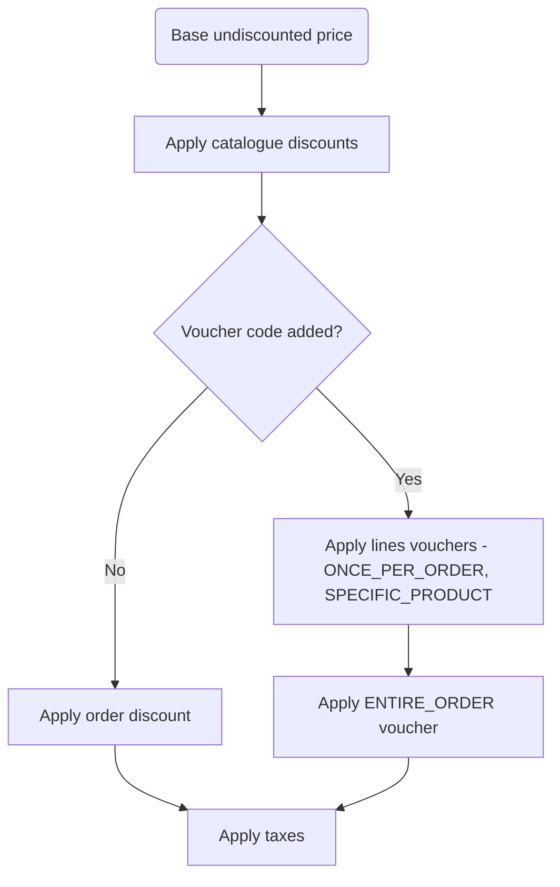

Promotions enable price reductions based on specific conditions. You can use them to drive sales, reward loyal customers, and run time-limited marketing campaigns.

## How Promotions Work

A promotion consists of one or more rules that define:

- **Conditions**: What criteria must be met (e.g., specific products, minimum order value)
- **Rewards**: What discount or benefit the customer receives

Each rule can only belong to one promotion, and all rules within a promotion must be of the same type (catalog/order).

## Types of Promotions

Saleor supports two types of promotions:

| Type | When Applied | Use Case |
|------|--------------|----------|
| **Catalogue promotions** | Before checkout, on product prices | Show discounted prices on product pages |
| **Order promotions** | During checkout/draft order | Apply discounts  or add gifts based on cart contents |

### Catalogue Promotions

Catalogue promotions reduce product prices visible to customers before they add items to cart. The discounted price appears on `ProductVariant.pricing`.

**Example**: A product priced at **$9** with a **10%** catalogue discount shows as **$8.10** on the product page.

[Learn more about catalogue promotions →](/developer/discounts/catalog-promotions.mdx)

### Order Promotions

Order promotions apply discounts during checkout when specific conditions are met. They can:

- Reduce the subtotal price
- Add free gifts to the order

**Example**: "Get 10% off when you spend $50 or more"

[Learn more about order promotions →](/developer/discounts/order-promotions.mdx)

## Combining Promotions

When multiple promotions apply to the same product or order:

- **Multiple catalogue promotions on one product**: Only the discount providing maximum savings applies (discounts don't stack)
- **Catalogue + order promotions**: Both can apply; order discounts calculate from the already-discounted catalogue price
- **Order promotions + vouchers**: Cannot be combined; voucher code takes precedence

## Permissions

Managing promotions requires the `MANAGE_DISCOUNTS` permission.

## Glossary

| Term | Definition |
|------|------------|
| **Promotion** | Container for rules; defines start/end dates |
| **Promotion type** | `CATALOGUE` or `ORDER` |
| **Promotion rule** | Defines conditions and rewards |
| **Catalogue predicate** | Conditions based on products, variants, categories, or collections |
| **Order predicate** | Conditions based on checkout/order attributes (e.g., subtotal) |
| **Reward value** | Amount of discount (fixed or percentage) |
| **Reward type** | Type of benefit: `SUBTOTAL_DISCOUNT` or `GIFT` (order promotions only) |
| **Base prices** | Prices after catalogue promotions, before vouchers or order discounts |
| **Gift** | A free product line added as an order promotion reward |

## Next Steps

- [Catalogue Promotions](/developer/discounts/catalog-promotions.mdx) - Discount product prices
- [Order Promotions](/developer/discounts/order-promotions.mdx) - Discount based on cart contents
- [Promotions API](/developer/discounts/promotions-api.mdx) - Create and manage promotions programmatically
