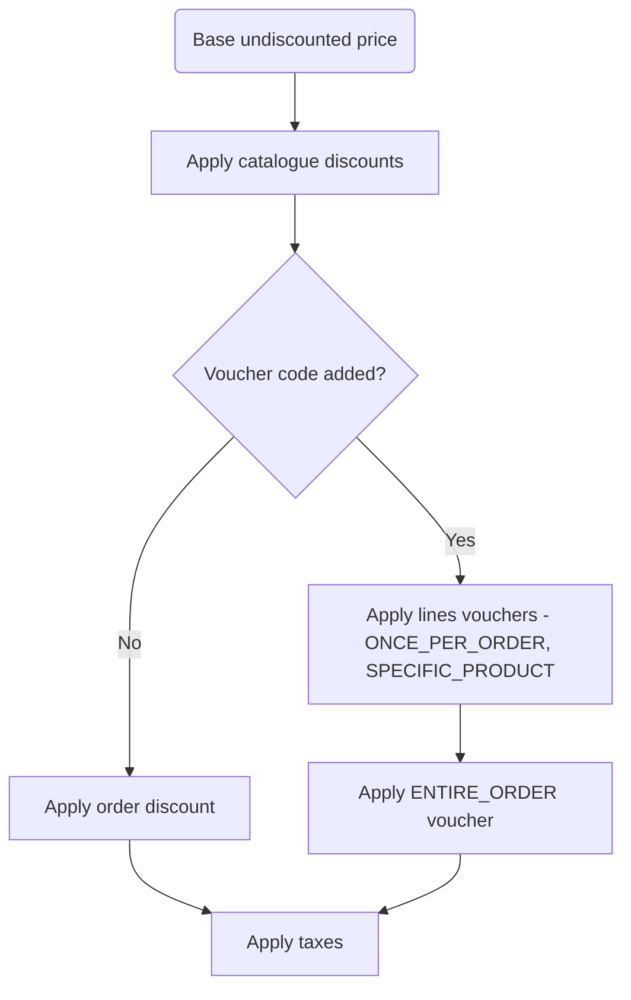
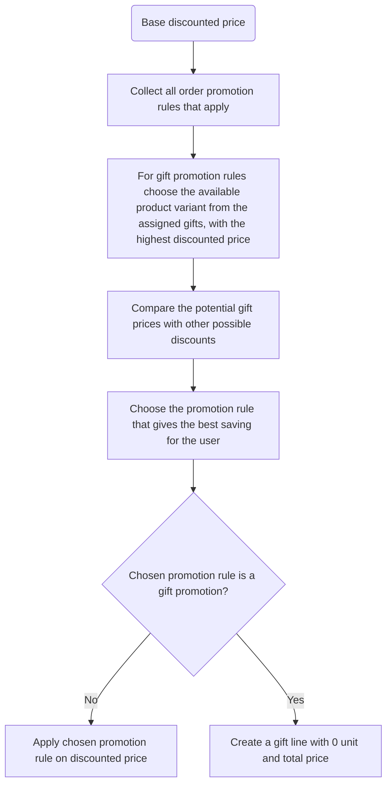

Promotions enable price reductions based on specific conditions.
These conditions are defined as predicates in the promotion rules.
A promotion can consist of multiple rules, but each rule can only belong to one promotion.

There are two types of promotions:

- catalogue promotions - reduce the product price visible to the customer,
- order promotions - applied on checkout / draft order when the object fulfilled
  the rule conditions.

All rules within promotion must be of one type `CATALOGUE` or `ORDER`.
The type of rule is determined by the promotion to which the rule is assigned.
The `CATALOGUE` promotion consists only of `CATALOGUE` rules with `cataloguePredicate` defined,
and `ORDER` promotion consists only of `ORDER` rules with `orderPredicate` defined.
Promotion rules specify the criteria that must be met, as well as the discount or reward that will be applied.

### Catalogue promotions

The discounts from catalogue rules are automatically applied to all products that meet the conditions defined in the promotion.

For instance, if a product is priced at **$9** and has a **10%** discount, it will be available for **$8.1**.
The discount will be visible on `ProductVariant.pricing` - `priceUndiscounted` will be the price
before the promotion discount, and `price` will have an applied discount.
The promotion discount will be also visible on the checkout line prices after adding the discounted
product to the card. The checkout subtotal is calculated as a sum of discounted prices of variants
added to the cart.

When multiple promotions apply to one product, only the discount from the promotion rule that provides the maximum savings for the customer is applied.
The discounts from rules within the single promotion are not summed up.

:::note
The catalogue discounts from promotions are recalculated by a background task, so the discounted price will not be instantly visible after promotion creation. 
:::

### Examples of the use cases

- Define the product fixed or percentage discounts based on certain conditions.
- Define the discount available only for a specific period.

### Order promotions

The discounts from order rules are automatically applied during checkout or draft orders when certain conditions are met.
Only the discount from the promotion rule that provides the maximum savings for the customer is applied.

The order discounts can be combined with catalogue discounts, and in such cases, the discount is calculated based on the discounted price.

This kind of promotion discount requires providing the `rewardType` that describes what
kind of discount will be applied after meeting the conditions.

Currently available reward types are:

- `SUBTOTAL_DISCOUNT` - applies the discount on the subtotal price,
- `GIFT` - adds a gift to the order from available gifts.

For gift rewards, the promotion rule must specify the available gifts as product variants
that can be added to checkout or draft orders. During calculations, the discounted prices
of these variants (marked as possible gifts) are compared, and the variant with the
highest discounted price is selected. This price is then compared to the savings offered
by other promotion rules, such as those that apply discounts based on the subtotal price.

The gift is created as a new checkout or order line, with both its unit and total price set to 0.
For now, only one gift can be assigned to the checkout/draft order.

For example, let's consider a checkout with only one product that is on catalogue discount, and the discounted price is **$12**.
There are two promotion rules applied to this checkout.

- **Promotion Rule A** offers a **10%** discount on the subtotal price. In this scenario, the discount will be **10%** of **$12**, resulting in a savings of **$1.2**.
- **Promotion Rule B** adds a gift worth **$5**, which provides more savings compared to Promotion Rule A.

As a result, the gift worth **$5** will be added to the checkout. The total price of the line is 0, so the total price of the checkout remains unchanged.

:::info
The number of `PromotionRule` with `ORDER` predicate type is limited to 100.
:::

:::warning
Promotions with the `SUBTOTAL_DISCOUNT` do not work in conjunction with the `TAX_APP` strategy.
:::

### Permissions

Managing promotions is available for users and apps with the `MANAGE_DISCOUNTS` permission.

### Glossary

- **Promotion:** Consists of promotion rules, and defines the start and end date when the discounts from the rules will be applied.
- **Promotion type:** Determine the type of promotion - `CATALOGUE` or `ORDER`.
- **Promotion rule:** Defines the reward that will be given when the specified conditions are met.
- **Catalogue predicate:** Defines the conditions to be met on the catalogue level. When the conditions are met, the discount is applied automatically to corresponding variant prices.
- **Order predicate:** Defines the conditions to be met by checkout or draft order. When the conditions are met, the discount is applied automatically.
- **Reward value:** Defines the amount of the discount.
- **Reward value type:** Describe if the provided reward value is the fixed or percentage discount.
- **Reward type:** Describe what kind of reward is given when the promotion rule conditions are met. (Applicable only for order promotions).
- **Base prices:** Prices after applying catalogue promotions, do not include vouchers or order discounts.
- **Gift:** The checkout or order line that is added to checkout or draft order as a reward from order promotions.

## Promotion type

The type of promotion determines whether to give the `CATALOGUE` or `ORDER` discount.
For the `CATALOGUE` type, all rules within the promotion must have the `cataloguePredicate` defined,
while for the `ORDER` type, the `orderPredicate` must be defined.

## Rewards value

Reward value is defined on the promotion rule level and specifies the amount and type of the discount
that will be applied when the defined conditions are met.
Currently, there is only `FIXED` or `PERCENTAGE` discount available.

## Reward type

Reward type is applicable only for order promotions and specify what kind of reward
will be given when the defined conditions are met.
Currently, only `SUBTOTAL_DISCOUNT` is available so the order subtotal price will be reduced.

## Base prices

Base prices are the prices after applying for catalogue promotions and do not include vouchers or order discounts.
The subtotal price is the sum of the discounted total price of lines, the total price is subtotal
plus the base delivery price.

## Gift

A gift is a checkout or order line that is added as a reward from the order promotion rule. The price of this line is set to 0.
The possible gifts are defined on `PromotionRule` with `GIFT` reward type.

## Predicates

Predicates define the conditions to be met to apply the reward.
Allows defining complex nested conditions in the same way as in `where` filters, with `AND` and `OR` operators,
combined with operations (e.g. `eq`, `oneOf`).
To get to know how to build complex conditions reach out to the [filters page](/api-usage/filtering.mdx#general-approach).

### Catalogue predicate

Catalogue level predicates allow defining conditions for variants, products, collections and categories.
Must be specified when `CATALOGUE` predicate type is set.

### Catalogue discount examples

Below, you can find examples of promotion rules with catalogue predicates that define a described catalogue discount.

- 10% discount on collection X

```json
{
  "promotionRule": {
    "cataloguePredicate": {
      "collectionPredicate": {
        "ids": ["Q29sbGVjdGlvbjox"]
      }
    },
    "rewardValueType": "PERCENTAGE",
    "rewardValue": 10
  }
}
```

- 10% discount on category X

```json
{
  "promotionRule": {
    "cataloguePredicate": {
      "categoryPredicate": {
        "ids": ["Q29sbGVjdGlvbjox"]
      }
    },
    "rewardValueType": "PERCENTAGE",
    "rewardValue": 10
  }
}
```

- 10% discount on variant X

```json
{
  "promotionRule": {
    "cataloguePredicate": {
      "variantPredicate": {
        "ids": ["Q29sbGVjdGlvbjox"]
      }
    },
    "rewardValueType": "PERCENTAGE",
    "rewardValue": 10
  }
}
```

- 10% discount on product X

```json
{
  "promotionRule": {
    "cataloguePredicate": {
      "productPredicate": {
        "ids": ["Q29sbGVjdGlvbjox"]
      }
    },
    "rewardValueType": "PERCENTAGE",
    "rewardValue": 10
  }
}
```

- $10 discount on collection X, or category X, or variant X or product X

```json
{
  "promotionRule": {
    "cataloguePredicate": {
      "OR": [
        {
          "collectionPredicate": {
            "ids": ["Q2F0ZWdvcnk6OA=="]
          }
        },
        {
          "categoryPredicate": {
            "ids": ["Q2F0ZWdvcnk6OA=="]
          }
        },
        {
          "variantPredicate": {
            "ids": ["Q2F0ZWdvcnk6OA=="]
          }
        },
        {
          "productPredicate": {
            "ids": ["Q2F0ZWdvcnk6OA=="]
          }
        }
      ]
    },
    "rewardValueType": "FIXED",
    "rewardValue": 10
  }
}
```

### Order predicate

The order predicates enable the definition of conditions for checkout and draft order objects based on their attributes.
Currently, it is only possible to define conditions based on the base total and base subtotal price.

Catalogue and order promotion discounts can be combined. Therefore, during checkout or draft order qualification,
the discounted price (after applying any catalogue discount) is utilized.

### Order discount examples

- **10%** discount applied when the subtotal price is above **$20**, applied on subtotal price

```json
{
  "promotionRule": {
    "orderPredicate": {
      "discountedObjectPredicate": {
        "baseSubtotalPrice": {
          "range": { "gte": 20 }
        }
      }
    },
    "rewardValueType": "PERCENTAGE",
    "rewardValue": 10,
    "rewardType": "SUBTOTAL_DISCOUNT"
  }
}
```

- **$5** discount applied when the total price is above **$50**, applied on subtotal price

```json
{
  "promotionRule": {
    "orderPredicate": {
      "discountedObjectPredicate": {
        "baseTotalPrice": {
          "range": { "gte": 50 }
        }
      }
    },
    "rewardValueType": "FIXED",
    "rewardValue": 5,
    "rewardType": "SUBTOTAL_DISCOUNT"
  }
}
```

- gift reward when the total price is above **$50**

```json
{
  "promotionRule": {
    "orderPredicate": {
      "discountedObjectPredicate": {
        "baseTotalPrice": {
          "range": { "gte": 50 }
        }
      }
    },
    "rewardValueType": null,
    "rewardValue": null,
    "rewardType": "GIFT",
    "giftIds": ["UHJvZHVjdFZhcmlhbnQ6MzQ4", "UHJvZHVjdFZhcmlhbnQ6NDAw"]
  }
}
```

## Channel availability

Each rule can have assigned channels in which the discount will be applied.
Promotion rules without any channels will not apply anywhere.

The promotion rule can have multiple channels assigned, but there is a restriction to that.
When the rule reward value type is `FIXED`, all assigned channels must have the same currency.

## Creating the promotion

To create a promotion use [`promotionCreate`](../../api-reference/discounts/mutations/promotion-create) mutation.
The mutation takes the following input:

- `name`: name of the promotion;
- `type`: type of the promotion;
- `description`: optional description of the promotion;
- `startDate`: defines when the promotion becomes active;
- `endDate`: defines when the promotion becomes ends;
- `rules`: optional list of promotion rules. The rules could be also created
  by `promotionRuleCreate` mutation.

### Defining the promotion

Below is an example of promotion creation without any rules.

```graphql
mutation promotionCreate($input: PromotionCreateInput!) {
  promotionCreate(input: $input) {
    promotion {
      id
      name
      type
      description
      startDate
      endDate
    }
  }
}
```

Query variables:

```json
{
  "input": {
    "name": "Example sale",
    "type": "CATALOGUE",
    "description": {
      "blocks": [
        {
          "type": "paragraph",
          "data": {
            "text": "Test example sale."
          }
        }
      ]
    },
    "startDate": "2023-06-06T00:00:00.00+00:00"
  }
}
```

As a response, we will get a newly created promotion:

```json
{
  "data": {
    "promotionCreate": {
      "promotion": {
        "id": "UHJvbW90aW9uOjEyMzA0YmM4LTA2ZTMtNDg1Mi05ODU1LWM4ZDkyMDgzNTYwZA==",
        "name": "Example sale",
        "type": "CATALOGUE",
        "description": {
          "blocks": [
            {
              "type": "paragraph",
              "data": {
                "text": "Test example sale."
              }
            }
          ]
        },
        "startDate": "2023-06-06T00:00:00+00:00",
        "endDate": null
      }
    }
  }
}
```

### Adding promotion rule

To add a promotion rule to the promotion use [`promotionRuleCreate`](../../api-reference/discounts/mutations/promotion-rule-create) mutation.

The mutation takes the following input:

- `name`: optional name of the promotion rule.
- `description`: optional description of the promotion rule.
- `promotion`: define to which promotion the rule should be part of.
- `channels`: define in which channels the rule should be applicable.
- `rewardValueType`: define the type of discount `PERCENTAGE`/`FIXED`.
- `rewardValue`: define the value of the discount.
- `rewardType`: define the type of reward. Required for order promotion rules.
- `gifts`: define product variants that might be added as a gift. Required for `GIFT` reward type.
- `cataloguePredicate`: defines the conditions to be met to apply catalogue discount.
  **Required for the rule that belongs to `CATALOGUE` promotion.**
  Allows defining complex nested conditions with `AND` and `OR` operators.
- `orderPredicate`: defines the conditions to be met to apply order discount.
  **Required for the rule that belongs to `ORDER` promotion.**
  Allows defining complex nested conditions with `AND` and `OR` operators.

#### Creation of catalogue promotion rule

The following example demonstrates the creation of a catalogue promotion rule that applies
a **50%** discount on all products from a collection and categories with specified IDs.
The rule will be applicable on two channels.

```graphql
mutation promotionRuleCreate($input: PromotionRuleCreateInput!) {
  promotionRuleCreate(input: $input) {
    promotionRule {
      id
      name
      description
      promotion {
        id
      }
      channels {
        id
      }
      rewardValueType
      rewardValue
      cataloguePredicate
    }
  }
}
```

To define such a discount the catalogue predicate with `OR` operator is used, to
mark that any products from given collections or categories are included in this promotion.
For this kind of promotion rule, you must provide `cataloguePredicate`,
the rule must be part of `CATALOGUE` promotion.

Query variables:

```json
{
  "input": {
    "name": "50% catalogue discount",
    "promotion": "UHJvbW90aW9uOjEyMzA0YmM4LTA2ZTMtNDg1Mi05ODU1LWM4ZDkyMDgzNTYwZA==",
    "channels": ["Q2hhbm5lbDoy", "Q2hhbm5lbDo0"],
    "rewardValueType": "PERCENTAGE",
    "rewardValue": "50",
    "cataloguePredicate": {
      "OR": [
        {
          "categoryPredicate": {
            "ids": ["Q2F0ZWdvcnk6MQ==", "Q2F0ZWdvcnk6NDQ="]
          }
        },
        {
          "collectionPredicate": {
            "ids": ["Q29sbGVjdGlvbjo1"]
          }
        }
      ]
    }
  }
}
```

As a result, we get a newly created promotion rule:

```json
{
  "data": {
    "promotionRuleCreate": {
      "promotionRule": {
        "id": "UHJvbW90aW9uUnVsZTo0NThmMTFlZC04NTIxLTQ0YTgtYmM2YS1iNjNmNzg0Yzc0ZmM=",
        "name": "50% catalogue discount",
        "description": null,
        "promotion": {
          "id": "UHJvbW90aW9uOjEyMzA0YmM4LTA2ZTMtNDg1Mi05ODU1LWM4ZDkyMDgzNTYwZA=="
        },
        "channels": [
          {
            "id": "Q2hhbm5lbDoy"
          },
          {
            "id": "Q2hhbm5lbDo0"
          }
        ],
        "rewardValueType": "PERCENTAGE",
        "rewardValue": 50,
        "predicateType": "CATALOGUE",
        "cataloguePredicate": {
          "OR": [
            {
              "categoryPredicate": {
                "ids": ["Q2F0ZWdvcnk6MQ==", "Q2F0ZWdvcnk6NDQ="]
              }
            },
            {
              "collectionPredicate": {
                "ids": ["Q29sbGVjdGlvbjo1"]
              }
            }
          ]
        }
      }
    }
  }
}
```

#### Creation of order promotion rule with subtotal discount

The following example demonstrates the creation of an order promotion rule that
gives **10%** subtotal price discount on checkout/draft order that subtotal price is greater
than or equal to **20**.
For this kind of promotion rule, you must provide `orderPredicate` and `rewardType`,
it can be defined only for promotion with `ORDER` type.

:::info
Price-based predicates are only allowed for promotion rules in which all assigned channels have the same currency.
:::

```graphql
mutation promotionRuleCreate($input: PromotionRuleCreateInput!) {
  promotionRuleCreate(input: $input) {
    promotionRule {
      id
      name
      description
      promotion {
        id
      }
      channels {
        id
      }
      rewardValueType
      rewardValue
      orderPredicate
    }
  }
}
```

Query variables:

```json
{
  "input": {
    "name": "10% percentage order discount",
    "promotion": "UHJvbW90aW9uOjEyMzA0YmM4LTA2ZTMtNDg1Mi05ODU1LWM4ZDkyMDgzNTYwZA==",
    "channels": ["Q2hhbm5lbDoy"],
    "rewardValueType": "PERCENTAGE",
    "rewardValue": "10",
    "rewardType": "SUBTOTAL_DISCOUNT",
    "orderPredicate": {
      "discountedObjectPredicate": {
        "baseSubtotalPrice": {
          "range": { "gte": 20 }
        }
      }
    }
  }
}
```

#### Creation of order promotion rule with gift reward

The following example demonstrates the creation of a gift order promotion rule that
gives add a gift to checkout/draft order that subtotal price is greater
than or equal to **20**.
For this kind of promotion rule, you must provide `orderPredicate`, `rewardType`, and `gifts`,
it can be defined only for promotion with `ORDER` type.
For this kind of promotion rule, the `rewardValue` and `rewardValueType` are empty.

:::info
Price-based predicates are only allowed for promotion rules in which all assigned channels have the same currency.
:::

:::info
The limit of assigned gifts to the promotion rule is 500.
:::

```graphql
mutation promotionRuleCreate($input: PromotionRuleCreateInput!) {
  promotionRuleCreate(input: $input) {
    promotionRule {
      id
      name
      description
      promotion {
        id
      }
      channels {
        id
      }
      rewardValueType
      rewardValue
      orderPredicate
      giftIds
    }
  }
}
```

Query variables:

```json
{
  "input": {
    "name": "Gift order rule",
    "promotion": "UHJvbW90aW9uOjEyMzA0YmM4LTA2ZTMtNDg1Mi05ODU1LWM4ZDkyMDgzNTYwZA==",
    "channels": ["Q2hhbm5lbDoy"],
    "rewardType": "GIFT",
    "orderPredicate": {
      "discountedObjectPredicate": {
        "baseSubtotalPrice": {
          "range": { "gte": 20 }
        }
      }
    },
    "gifts": ["UHJvZHVjdFZhcmlhbnQ6MzQ4", "UHJvZHVjdFZhcmlhbnQ6NDAw"]
  }
}
```

## Discounted price recalculations

Discounted prices are calculated based on catalogue promotions.

:::info
The discounts for specified catalogues are calculated asynchronously, so the discounted price
will be not visible immediately after promotion creation or activation.
:::

The discounted price is visible on `ProductVariant.pricing`.
Below you can see the pricing of the variant included in the newly created promotion:

```json
{
  "data": {
    "productVariant": {
      "id": "UHJvZHVjdFZhcmlhbnQ6MzM1",
      "pricing": {
        "onSale": true,
        "priceUndiscounted": {
          "gross": {
            "amount": 90.0
          }
        },
        "price": {
          "gross": {
            "amount": 45.0
          }
        },
        "discount": {
          "gross": {
            "amount": 45.0
          }
        }
      }
    }
  }
}
```

As you can see, the variant is `onSale` and the price was reduced by half.

## Promotion events history

We store the promotion history in events. Each action related to the creation, update,
or deletion of promotions and promotion rules, and activation and deactivation of promotion
is recorded in an event. The list of possible events is represented by
[PromotionEventsEnum](../../api-reference/discounts/enums/promotion-events-enum).

You can check promotion events by fetching `promotion.events`. As it's shown
in the example below:

```graphql
query Promotion($id: ID!) {
  promotion(id: $id) {
    id
    events {
      ... on PromotionEventInterface {
        type
        date
        createdBy {
          ... on User {
            id
          }
        }
      }
      ... on PromotionRuleEventInterface {
        ruleId
      }
    }
  }
}
```

Query variable:

```json
{
  "id": "UHJvbW90aW9uOmYxMWQ5ZWRiLTI5ZjktNDA5Yy05MjdlLTNjOGMzMDFjZjM2NA=="
}
```

Response:

```json
{
  "data": {
    "promotion": {
      "id": "UHJvbW90aW9uOjEyMzA0YmM4LTA2ZTMtNDg1Mi05ODU1LWM4ZDkyMDgzNTYwZA==",
      "events": [
        {
          "type": "PROMOTION_CREATED",
          "date": "2023-09-21T12:28:16.457902+00:00",
          "createdBy": {
            "id": "VXNlcjox"
          }
        },
        {
          "type": "PROMOTION_STARTED",
          "date": "2023-09-21T12:28:16.464749+00:00",
          "createdBy": {
            "id": "VXNlcjox"
          }
        },
        {
          "type": "RULE_CREATED",
          "date": "2023-09-21T12:30:17.520316+00:00",
          "createdBy": {
            "id": "VXNlcjox"
          },
          "ruleId": "UHJvbW90aW9uUnVsZTo1MjIwYmViZS02MjczLTRkNjUtYTNkZC1iYjNlYmI4MjllYjA="
        }
      ]
    }
  }
}
```

## Webhooks

All promotion actions also generate asynchronous webhooks that can be used for reacting
to the events emitted by Saleor, e.g. `PROMOTION_CREATED`, `PROMOTION_STARTED`, `PROMOTION_ENDED`.
The [WebhookEventTypeAsyncEnum](/api-reference/webhooks/enums/webhook-event-type-async-enum.mdx#values)
represents the full list of asynchronous webhooks.

You can learn more about webhooks [here](/developer/extending/webhooks/asynchronous-events.mdx).

## Completing checkout with a promotion discount

In the case of a variant on promotion, the applied discount is visible only on the order and lines
prices; the `order.discounts` field is empty. Let's see the following example,
for completing the checkout with **two items** of the product included in the promotion
that reduces the price of the single item by **$5**.

```json
{
  "data": {
    "checkoutComplete": {
      "order": {
        "id": "T3JkZXI6YzQ0YTAzNDgtZDlhYy00ZDkyLWFiZWUtMmNjNzg2OWJkOWQy",
        "status": "UNFULFILLED",
        "totalCaptured": {
          "amount": 30.0
        },
        "subtotal": {
          "gross": {
            "amount": 30.0
          }
        },
        "total": {
          "gross": {
            "amount": 30.0
          }
        },
        "undiscountedTotal": {
          "gross": {
            "amount": 40.0
          }
        },
        "discounts": [],
        "lines": [
          {
            "quantity": 2,
            "totalPrice": {
              "gross": {
                "amount": 30.0
              }
            },
            "unitPrice": {
              "gross": {
                "amount": 15.0
              }
            },
            "undiscountedUnitPrice": {
              "gross": {
                "amount": 20.0
              }
            },
            "unitDiscount": {
              "amount": 5.0
            }
          }
        ]
      },
      "errors": []
    }
  }
}
```

:::info
The promotion discount is not visible on `checkout.discount.amount`.
:::

As you can see, the `order.discounts` field is empty, but there is a difference between
`order.total` and `order.undiscountedTotal`. The applied discount can be checked
on the unit level in the `order.lines.unitDiscount` field, as well as by comparing
the `order.lines.undiscountedUnitPrice` and `order.lines.unitPrice`. The sum of line unit
discounts multiplied by the quantity of the line gives the total discount, which is
equal to the difference between `order.total` and `order.undiscountedTotal`.

## Processing checkout with an applied order promotion

Below you can see an example of checkout data with an applied order discount from an order promotion
that applied **$5** discount on objects with subtotal above **$20**.

```json
{
  "data": {
    "checkout": {
      "id": "Q2hlY2tvdXQ6YzJlNTlmNTUtZjYzOS00MTc2LWI0ZjMtMGFjYWE1Y2FiZDlm",
      "email": "customer@example.com",
      "token": "c2e59f55-f639-4176-b4f3-0acaa5cabd9f",
      "channel": {
        "slug": "default-channel"
      },
      "voucherCode": null,
      "discount": {
        "amount": 5.0
      },
      "discountName": "Example order promo: order rule",
      "totalPrice": {
        "gross": {
          "amount": 42.5,
          "currency": "USD"
        }
      },
      "subtotalPrice": {
        "gross": {
          "amount": 35.0,
          "currency": "USD"
        }
      },
      "shippingPrice": {
        "gross": {
          "amount": 7.5,
          "currency": "USD"
        }
      },
      "deliveryMethod": {
        "id": "U2hpcHBpbmdNZXRob2Q6MQ=="
      },
      "lines": [
        {
          "id": "Q2hlY2tvdXRMaW5lOjkzOTk0OTgxLThmNWItNDg1OS04NzZmLTM1MmY5YjEyMTJlMg==",
          "quantity": 2,
          "undiscountedTotalPrice": {
            "amount": 40.0
          },
          "totalPrice": {
            "gross": {
              "amount": 35.0
            }
          },
          "unitPrice": {
            "gross": {
              "amount": 17.5
            }
          },
          "undiscountedUnitPrice": {
            "amount": 20.0
          },
          "variant": {
            "pricing": {
              "onSale": false,
              "discount": null,
              "priceUndiscounted": {
                "gross": {
                  "amount": 20.0
                }
              },
              "price": {
                "gross": {
                  "amount": 20.0
                }
              }
            }
          }
        }
      ]
    }
  }
}
```

The discount is visible on the `discount.amount` field at the checkout level,
as well as on the line prices, which are discounted.

After completing the checkout we get an order with discounted prices:

```json
{
  "data": {
    "checkoutComplete": {
      "order": {
        "id": "T3JkZXI6ZWVjNTFjZWItZTlkZi00ZmYzLTgxYWUtYzQ4ODYyNjQwNWQ1",
        "status": "UNFULFILLED",
        "totalCaptured": {
          "amount": 42.5
        },
        "subtotal": {
          "gross": {
            "amount": 35.0
          }
        },
        "total": {
          "gross": {
            "amount": 42.5
          }
        },
        "undiscountedTotal": {
          "gross": {
            "amount": 47.5
          }
        },
        "discounts": [
          {
            "name": "Example order promo: order rule",
            "type": "ORDER_PROMOTION",
            "valueType": "FIXED",
            "amount": {
              "amount": 5.0
            }
          }
        ],
        "lines": [
          {
            "quantity": 2,
            "totalPrice": {
              "gross": {
                "amount": 35.0
              }
            },
            "unitPrice": {
              "gross": {
                "amount": 17.5
              }
            },
            "undiscountedUnitPrice": {
              "gross": {
                "amount": 20.0
              }
            },
            "unitDiscount": {
              "amount": 2.5
            }
          }
        ]
      },
      "errors": []
    }
  }
}
```

## Catalogue and order promotions

Catalogue and order promotions can be mixed. In such cases the
order discount is applied on the discounted price.
Let's see the example:

```json
{
  "data": {
    "checkout": {
      "id": "Q2hlY2tvdXQ6NjA1YWU2NWYtNjYwZC00OGY1LWI5MzMtMjVjYjEzM2U1MWU3",
      "email": "admin@example.com",
      "token": "605ae65f-660d-48f5-b933-25cb133e51e7",
      "channel": {
        "slug": "default-channel"
      },
      "voucherCode": null,
      "discount": {
        "amount": 5.0
      },
      "discountName": "Example order promo: order rule",
      "totalPrice": {
        "gross": {
          "amount": 30.5,
          "currency": "USD"
        }
      },
      "subtotalPrice": {
        "gross": {
          "amount": 23.0,
          "currency": "USD"
        }
      },
      "shippingPrice": {
        "gross": {
          "amount": 7.5,
          "currency": "USD"
        }
      },
      "deliveryMethod": {
        "id": "U2hpcHBpbmdNZXRob2Q6MQ=="
      },
      "lines": [
        {
          "id": "Q2hlY2tvdXRMaW5lOjgwYTk5YmE5LWY4YTUtNDhhZS1hN2FlLWMyMDRmY2MxNDEzNw==",
          "quantity": 2,
          "undiscountedTotalPrice": {
            "amount": 40.0
          },
          "totalPrice": {
            "gross": {
              "amount": 23.0
            }
          },
          "unitPrice": {
            "gross": {
              "amount": 11.5
            }
          },
          "undiscountedUnitPrice": {
            "amount": 20.0
          },
          "variant": {
            "pricing": {
              "onSale": true,
              "discount": {
                "gross": {
                  "amount": 6.0
                }
              },
              "priceUndiscounted": {
                "gross": {
                  "amount": 20.0
                }
              },
              "price": {
                "gross": {
                  "amount": 14.0
                }
              }
            }
          }
        }
      ]
    }
  }
}
```

The **$5** discount shown on `checkout.discount.amount` is a result of the order promotion.
The line displaying discounted prices includes both the catalogue discount and the order discount.
To verify the catalogue discount, refer to `checkout.lines.variant.prices`.
In this example, the catalogue discount is $6 for each quantity of 1,
resulting in a total discount of **$6** \* 2 quantities. Additionally, there is a **$5** discount
from the order discount, making a total discount of **$17**.
This amount matches the difference between the `undiscountedTotalPrice` and `totalPrice`.

An order with discounted prices after completing the checkout:

```json
{
  "data": {
    "checkoutComplete": {
      "order": {
        "id": "T3JkZXI6OTM3ZDkxMjUtMjA0Ny00ZjE2LWE1MzItZTAwMTUyOWMyYmEz",
        "status": "UNFULFILLED",
        "totalCaptured": {
          "amount": 30.5
        },
        "subtotal": {
          "gross": {
            "amount": 23.0
          }
        },
        "total": {
          "gross": {
            "amount": 30.5
          }
        },
        "undiscountedTotal": {
          "gross": {
            "amount": 47.5
          }
        },
        "discounts": [
          {
            "name": "Example order promo: order rule",
            "type": "ORDER_PROMOTION",
            "valueType": "FIXED",
            "amount": {
              "amount": 5.0
            }
          }
        ],
        "lines": [
          {
            "quantity": 2,
            "totalPrice": {
              "gross": {
                "amount": 23.0
              }
            },
            "unitPrice": {
              "gross": {
                "amount": 11.5
              }
            },
            "undiscountedUnitPrice": {
              "gross": {
                "amount": 20.0
              }
            },
            "unitDiscount": {
              "amount": 8.5
            }
          }
        ]
      },
      "errors": []
    }
  }
}
```

## Completing checkout with a gift reward

Below you can see an example of checkout data with an applied gift reward from an order promotion
that applies on objects with subtotal above **$20**.

```json
{
  "data": {
    "checkout": {
      "id": "Q2hlY2tvdXQ6NTdkZjViYjUtNWY3My00NTZjLTg4YjgtOTgwZGQ3OWZiZmE5",
      "email": "admin@example.com",
      "token": "57df5bb5-5f73-456c-88b8-980dd79fbfa9",
      "channel": {
        "slug": "default-channel"
      },
      "voucherCode": null,
      "discount": {
        "amount": 0.0
      },
      "discountName": null,
      "totalPrice": {
        "gross": {
          "amount": 40.0
        }
      },
      "subtotalPrice": {
        "gross": {
          "amount": 40.0
        }
      },
      "shippingPrice": {
        "gross": {
          "amount": 0.0
        }
      },
      "deliveryMethod": null,
      "lines": [
        {
          "id": "Q2hlY2tvdXRMaW5lOmU5ZmI3YjY3LTA4ZjctNDQzZi1iMWNjLWE1ZmJlNGU0NjcxMg==",
          "quantity": 2,
          "isGift": false,
          "undiscountedTotalPrice": {
            "amount": 40.0
          },
          "totalPrice": {
            "gross": {
              "amount": 40.0
            },
            "net": {
              "amount": 40.0
            }
          },
          "unitPrice": {
            "gross": {
              "amount": 20.0
            },
            "net": {
              "amount": 20.0
            }
          },
          "undiscountedUnitPrice": {
            "amount": 20.0
          }
        },
        {
          "id": "Q2hlY2tvdXRMaW5lOmMwNzhjNGQyLWI1MzUtNDhkMy04MDlmLTA1ZDUyYjY3MWFiNQ==",
          "quantity": 1,
          "isGift": true,
          "undiscountedTotalPrice": {
            "amount": 50.0
          },
          "totalPrice": {
            "gross": {
              "amount": 0.0
            },
            "net": {
              "amount": 0.0
            }
          },
          "unitPrice": {
            "gross": {
              "amount": 0.0
            },
            "net": {
              "amount": 0.0
            }
          },
          "undiscountedUnitPrice": {
            "amount": 50.0
          }
        }
      ]
    }
  }
}
```

We can see an extra line added to checkout which is marked with `isGift` flag.
The unit and total price of this line is set to 0.
The checkout `discount.amount` is 0.

After completing the checkout we get an order with the gift line:

```json
{
  "data": {
    "checkoutComplete": {
      "order": {
        "id": "T3JkZXI6YTAxYjEzMWQtZjA0Ny00ZWM3LTk3OWUtZWUyMGEzYzBjNDk2",
        "status": "UNFULFILLED",
        "totalCaptured": {
          "amount": 47.5
        },
        "subtotal": {
          "gross": {
            "amount": 40.0
          }
        },
        "total": {
          "currency": "USD",
          "gross": {
            "amount": 47.5
          }
        },
        "undiscountedTotal": {
          "currency": "USD",
          "gross": {
            "amount": 547.5
          }
        },
        "discounts": [],
        "lines": [
          {
            "quantity": 2,
            "isGift": false,
            "totalPrice": {
              "gross": {
                "amount": 40.0
              }
            },
            "unitPrice": {
              "gross": {
                "amount": 20.0
              }
            },
            "undiscountedUnitPrice": {
              "gross": {
                "amount": 20.0
              }
            },
            "unitDiscount": {
              "amount": 0.0
            }
          },
          {
            "quantity": 1,
            "isGift": true,
            "totalPrice": {
              "gross": {
                "amount": 0.0
              }
            },
            "unitPrice": {
              "gross": {
                "amount": 0.0
              }
            },
            "undiscountedUnitPrice": {
              "gross": {
                "amount": 50.0
              }
            },
            "unitDiscount": {
              "amount": 50.0
            }
          }
        ]
      },
      "errors": []
    }
  }
}
```

## Catalogue Promotion and Voucher

Catalogue promotions and vouchers can be combined. In this case, the voucher discount
is applied to the price after the promotion discount.
[Here](/developer/discounts/vouchers.mdx#catalogue-promotion-and-voucher-together) you can find the example of such scenario.

## Order Promotion and Voucher

Order promotion cannot be mixed with Vouchers.
When a voucher code is added, the discount from the order promotion is not applied.

## Charts that show the discounts flow

#### The following chart shows an order in which discounts apply:



#### Below the chart shows the process of applying the `ORDER` promotion discount


