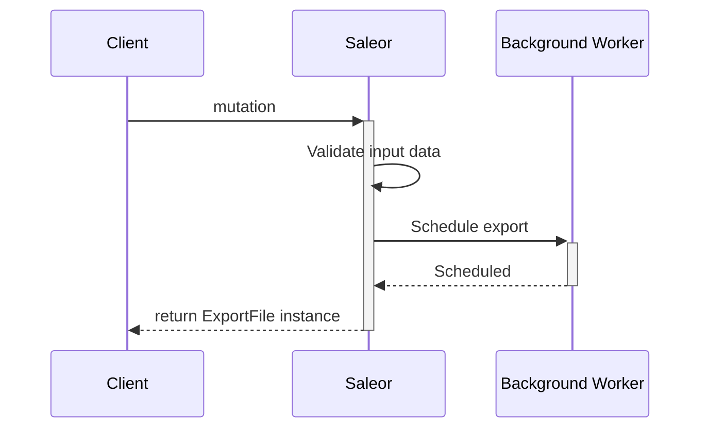
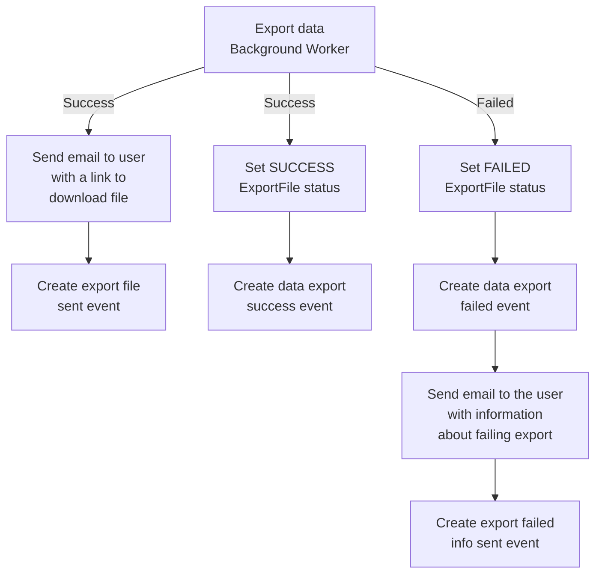

This guide gives information common to all exports.
At this time, only the export of products and gift cards is available.

### Workflow

#### Schedule export

The chart below describes what the workflow looks like for each export.
The changes for each export involve the mutation and the background worker adapted to the data type.



#### Handling background worker result

Background worker result is also handled in the same way for all workers.
The chart below shows what happens in case of the successful and failed worker results.



### Mutations

The input data for the mutations may differ insignificantly, but all of them return the same data type: the `ExportFile` object, being a `Job` instance.
It corresponds to running the export background worker, keeping task status, and creating a file.
`ExportFile` object contains the following fields:

- `id`: a unique export file ID. Could be use to check export status.
- `status`: status of running the job.
- `user`: instance of `User` who requested exporting products.
  Set to `null` if export requested by `App`.
- `app`: instance of `App` which requested exporting products.
  Set to `null` if export requested by `User`.
- `createdAt`: the date and time when the export was started.
- `updatedAt`: the date and time when the job was last time updated.
- `url`: URL to the exported file. Set to `null` when the file doesn't exist yet.
- `events`: a list of events associated with the export.

In addition, the following field is available on every mutation result:

- `errors`: a list of errors that occurred during mutation execution.

### Fetching `ExportFile` instance

Export is done in the asynchronous worker, so as a result, you might get an export file instance with a `PENDING` status. To check if the task status has changed, you can fetch `ExportFile` by `ID` with the use of `exportFile` query:

```graphql {2}
query {
  exportFile(id: "RXhwb3J0RmlsZToxMA==") {
    id
    status
    createdAt
    updatedAt
    url
  }
}
```

Example response with the URL address to the file.

```json
{
  "data": {
    "exportFile": {
      "id": "RXhwb3J0RmlsZToxMA==",
      "status": "SUCCESS",
      "createdAt": "2020-06-05T09:15:42.924676+00:00",
      "updatedAt": "2020-06-05T09:16:27.691838+00:00",
      "url": "http://localhost:8000/media/export_files/product_data_05_06_2020.csv"
    }
  }
}
```
