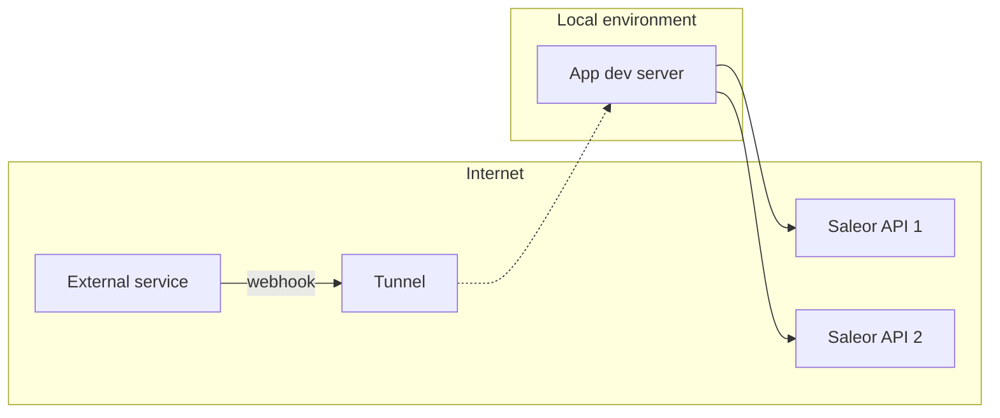

## What is external webhook

Saleor may be not the only source of the webhooks send to your application. Popular use cases:

- status update of a payment from payment provider like Stripe
- delivery status update of a package

If application is multi tenant, then flow of the data is as below:

## Exposing endpoint

First step will be creating a REST endpoint which will receive events. For example it's going to be `/api/webhooks/status-update`. Since external services require address which is accessible from the internet, you are going to need a tunnel to expose local environment. You can read more in the [tunneling section](docs/developer/extending/apps/developing-with-tunnels.mdx).

When subscribing for webhooks in the external service, use URL of the tunneled endpoint or deployed app.

## Handling multi tenancy

If your application is handling more than one Saleor instance, it's going to need a way do distinguish which one is target of the webhook payload. One way of doing that, is to add a domain or unique id to endpoint, for example `/api/webhooks/status-update?domain=demo.saleor.io`.

## Securing your endpoint

Before you deploy your application, you'll need to make sure unauthorized clients wont use endpoints to send malicious data. Heres a few ways you should implement

### Domain allowlist

If possible, endpoint should reject connections from unknown domains. Services often publish list of known domains which they use to send webhooks. For example theres [list of domains used by Stripe](https://stripe.com/docs/ips).

### Secrets

Common practice is to generate unique secret for each webhook and attach it to the payload body or headers. Consult webhook provider documentation where you can find it.
You can use app metadata to store the secret value. Check [MetadataManager docs](developer/extending/apps/apps-patterns/persistence-with-metadata-manager.mdx) to learn more about helper functions available in Saleor App SDK.

### Checking the payload checksum - HMAC

To make sure webhook payload has not been tempered with by third party, is to calculate it's checksum (signature).

Example documentation of how you can calculate the signature:

- [Adyen docs](https://docs.adyen.com/development-resources/webhooks/verify-hmac-signatures)
- [Stripe docs](https://stripe.com/docs/webhooks/signatures)
