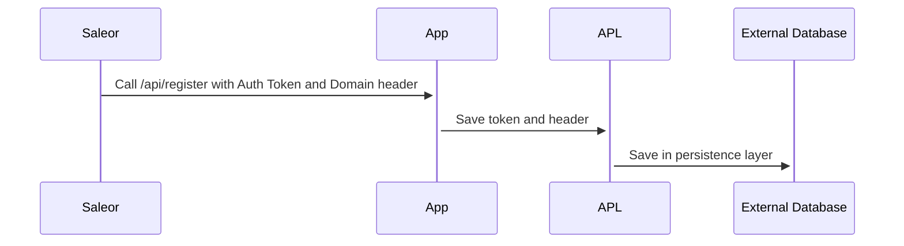
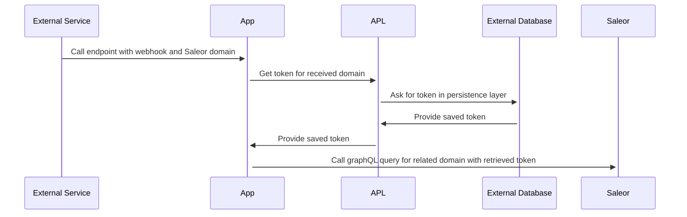

APL is the core component of communication between Saleor and the App.

During installation, Saleor sends AppToken, which the App uses to communicate with GraphQL API. The App must save this token and target domain - but where?

# What is APL

APL is an abstraction on key/value persistence that holds domains (under which Saleor API is available) and tokens for communication.

Saleor provides a simple persistence with App Metadata. Still, if the App doesn't have a token and domain saved (which is typical for serverless architecture), it can't also call Saleor to reach Metadata. Hence need for simple, fast storage to save auth data.

Saleor doesn't require an App to use any specific technology for persistence. That's why there are many implementations of APL available in the `app-sdk` package. If they don't suffice, you can easily write a custom one.

# Communication diagram

Following diagram describes how APL is used to store token received from Saleor during registration



The following diagram describes an example of an external webhook, that calls the App and sends the data to Saleor:



# Shape of the APL

```typescript
export interface AuthData {
  domain: string;
  token: string;
}

export type AplReadyResult =
  | {
      ready: true;
    }
  | {
      ready: false;
      error: Error;
    };

export type AplConfiguredResult =
  | {
      configured: true;
    }
  | {
      configured: false;
      error: Error;
    };

export interface APL {
  get: (domain: string) => Promise<AuthData | undefined>;
  set: (authData: AuthData) => Promise<void>;
  delete: (domain: string) => Promise<void>;
  getAll: () => Promise<AuthData[]>;
  /**
   * Inform that configuration is finished and correct
   */
  isReady: () => Promise<AplReadyResult>;
  isConfigured: () => Promise<AplConfiguredResult>;
}
```

You can find the [APL shape in app-sdk](https://github.com/saleor/saleor-app-sdk/blob/main/src/APL/apl.ts).

# Single vs. Multi-tenant APLs

Saleor apps can work in both Single and Multi-tenant modes. Single-tenant apps can hardcode the Saleor domain and even a token, but they can perform only as an extension for one Saleor instance. That's how [App Template Gallery](https://docs.saleor.io/docs/3.x/dashboard/app-templates-gallery) works. If another Saleor instance is used, it requires a separate App deployment (with updated settings/env).

The preferred way is to write apps in a Multi-tenant manner. That means a single deployment can connect to multiple Saleor instances. To achieve that, App must ask some database for a token assigned to a specific Saleor domain.

# Available APL clients

There are several implementations of APL, including:

- local filesystem (Single tenant)
- Vercel (single tenant)
- Upstash (Multi-tenant)
- Firestore (Multi-tenant)

The updated [list of APLs is here](https://github.com/saleor/saleor-app-sdk/blob/main/docs/apl.md#available-apls)

# Writing custom APL

Writing custom APL is easy - you only need to implement the `APL` interface from `app-sdk`. You can find an example of a custom Redis APL [here](https://github.com/saleor/saleor-app-sdk/blob/main/docs/apl.md#example-implementation).

# Developing an App without APL

Technically, a simple App can be developed without APL. The token can be created via GraphQL mutation or in the Dashboard. The App can also decide to work only with a single Saleor instance - as a custom extension only for a single store.
In this case, APL can be omitted, and App can store domain and tokens in env variables (or hardcode, which is not recommended).

However, some features in `app-sdk` are meant to be used together with the APL interface. That's why it's recommended to follow this pattern.
