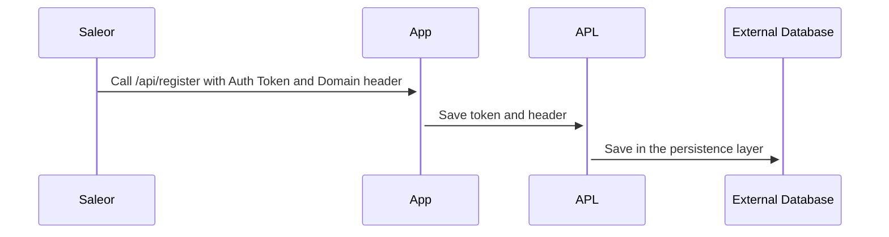
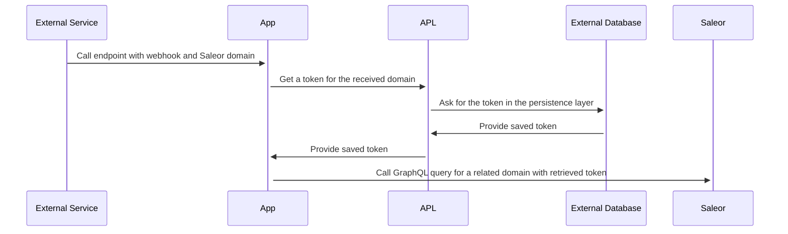

## Overview

When installing the app, Saleor sends over the app token. It allows the app to communicate with the GraphQL API. To reuse it in the future, we have to store the token somewhere. To ensure we retrieved the right one, we must attach the API domain to it.

So per each app, we have many pairs of tokens and domains. Where do we keep all that?

### What is APL

**APL (Auth Persistence Layer)** is an abstraction on key/value persistence. Its job is to store domains (under which the Saleor API is available) and tokens.

Saleor provides key-value persistence with the app metadata. But, if the app doesn't save the token and the domain, it is unable to call Saleor to retrieve the metadata. Hence need for additional storage to save the auth data.

Your app can use any technology of your choosing for persistence. That's why there are many implementations of APL available in the `app-sdk` package. If they don't suffice, you are welcome to write a custom one.

### Communication diagram

The following diagram describes how you can use APL to store a token received from Saleor during registration:



The following diagram describes an external webhook calling the app and sending the data to Saleor:



### Single vs. Multi-tenant APLs

Saleor apps can work in both single and multi-tenant modes.
Single-tenant apps can hardcode the Saleor domain as well as a token, but they can perform only as an extension for one Saleor instance.
If you wanted to use another Saleor instance, you would need to deploy it separately (with corresponding environment variables).

We recommend writing apps in a multi-tenant manner. That means a single deployment can connect to many Saleor instances. To achieve that, the app must query a database for a token assigned to a specific Saleor domain.

### Available APL clients

There are several implementations of APL, including:

- FileAPL (single tenant)
- EnvAPL (single tenant)
- [Upstash](https://upstash.com/) (multi-tenant)

You can find an updated list of APLs [here](developer/extending/apps/developing-apps/app-sdk/apl.mdx#available-apls).

## Development

### The definition of an APL

Saleor APL implements the following structure:

```typescript
export interface AuthData {
  domain: string;
  token: string;
}

export type AplReadyResult =
  | {
      ready: true;
    }
  | {
      ready: false;
      error: Error;
    };

export type AplConfiguredResult =
  | {
      configured: true;
    }
  | {
      configured: false;
      error: Error;
    };

export interface APL {
  get: (domain: string) => Promise<AuthData | undefined>;
  set: (authData: AuthData) => Promise<void>;
  delete: (domain: string) => Promise<void>;
  getAll: () => Promise<AuthData[]>;
  /**
   * Inform that configuration is finished and correct
   */
  isReady: () => Promise<AplReadyResult>;
  isConfigured: () => Promise<AplConfiguredResult>;
}
```

You can find the [APL shape in app-sdk](https://github.com/saleor/saleor-app-sdk/blob/main/src/APL/apl.ts).

### Writing custom APL

You are free to write your own APL but you need to make sure it follows the `APL` TypeScript interface from [app-sdk](https://github.com/saleor/saleor-app-sdk).

Please proceed [here](developer/extending/apps/developing-apps/app-sdk/apl.mdx#example-implementation) to see an example of building one with Redis.

### Developing an App without APL

If you designed your app to work with a single Saleor instance, you may not need an APL. You can retrieve your token manually, with a GraphQL mutation, and store it in environment variables.

However, we designed some features in the `app-sdk` around the concept of APL. That's why we recommend following this pattern.
