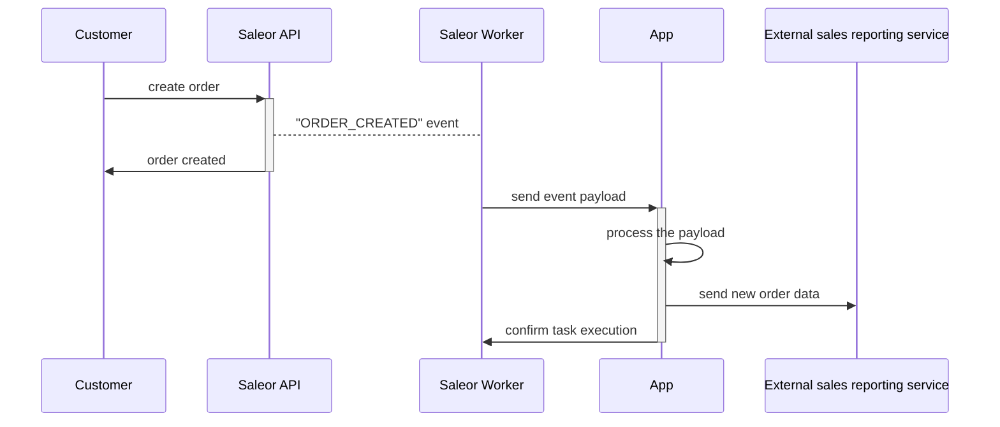
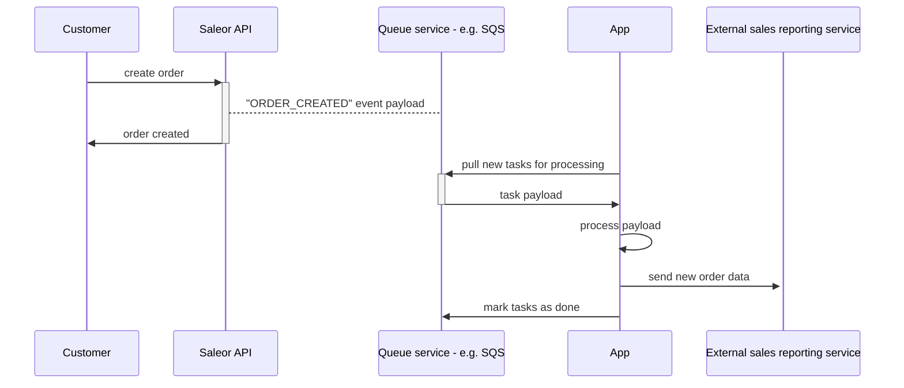
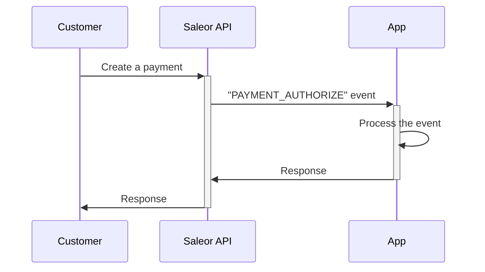
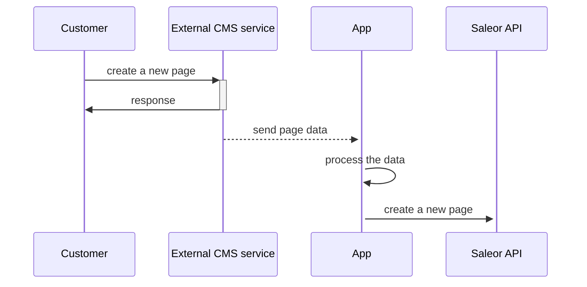
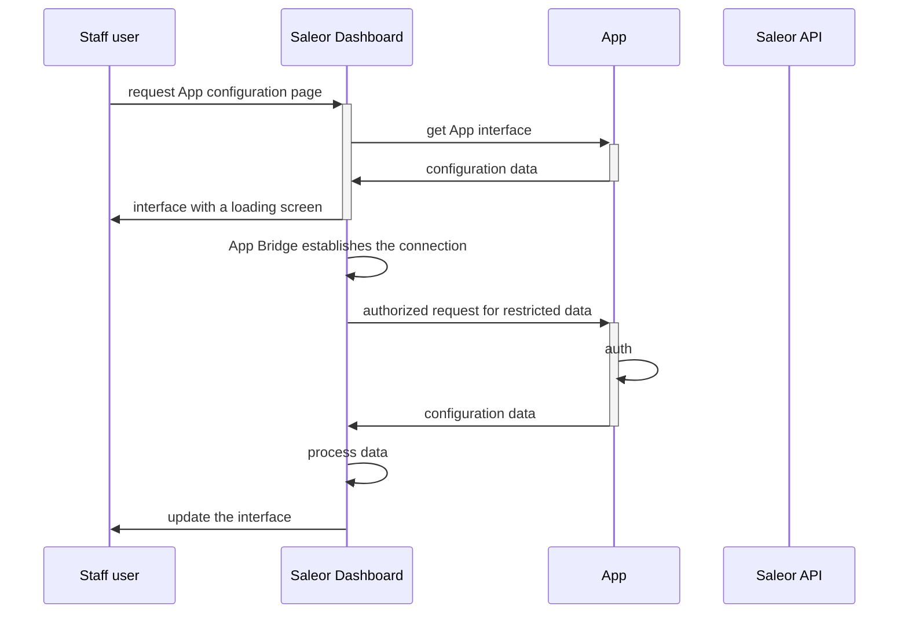

## Saleor Asynchronous Events

In this scenario, the source of the request is a Saleor instance (the worker - to be exact). In contrast to synchronous events, Saleor does not expect an immediate response from the App.
More details can be found at [Asynchronous Webhooks documentation pages](developer/extending/apps/asynchronous-webhooks.mdx).

### Webhooks (HTTP requests)

To process webhooks, the App needs publicly accessible endpoints listening for HTTP POST requests. Before requests will be sent, App must [subscribe for events](developer/extending/apps/asynchronous-webhooks.mdx).
Event delivery will retry if:

- endpoint does not respond before timeout
- endpoint will respond with non-200 status code

If your application performs long-running operations after receiving the event, consider using the task queue.

### Task queue

Example flow of the data for application sending data to reporting service:

Instead of sending requests, the worker will put events in the queue. This approach allows you to:

- perform long-running tasks
- in case of events surge, the App will not be overwhelmed with requests. The tasks will wait in the queue for the processing
- easy scaling - just add more workers consuming the queue
- queue will ensure that all the tasks will be processed

To read more, check [queues documentation](developer/extending/apps/asynchronous-webhooks.mdx#google-cloud-pubsub).

## Saleor synchronous events

Synchronous events can be used to implement payments, shipping and tax processing. When using synchronous events, response time is crucial -
any delay introduced by the App will impact customers using your shop.

To read more about synchronous events, check [documentation](developer/extending/apps/synchronous-webhooks/key-concepts.mdx).

## App to Saleor API

The App can also use Saleor GraphQL API queries and mutations. The scope of the access is dictated by the App's [permissions](developer/extending/apps/key-concepts.mdx#permissions).

Example data flow for application synchronizing CMS (eg. Strapi) data with the Saleor:

## Dashboard interface

The Dashboard can display App views in two scenarios:

- user will navigate to the App configuration page
- user will use the Dashboard extension

Data flow for both is the same:

The App interface should use App Bridge for auth and integration with dashboard features like notifications or theming.

To read more about using Apps in the dashboard, read the [extending dashboard documentation](developer/extending/apps/extending-dashboard-with-apps.mdx).
