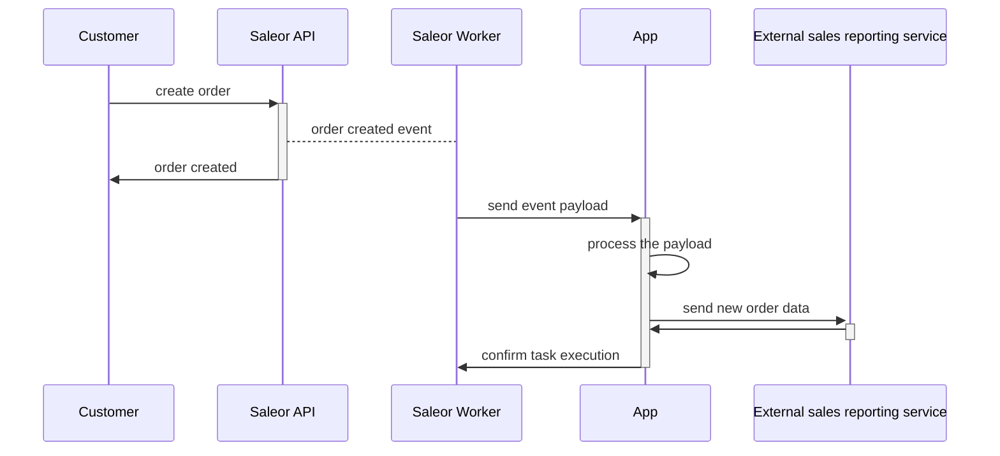
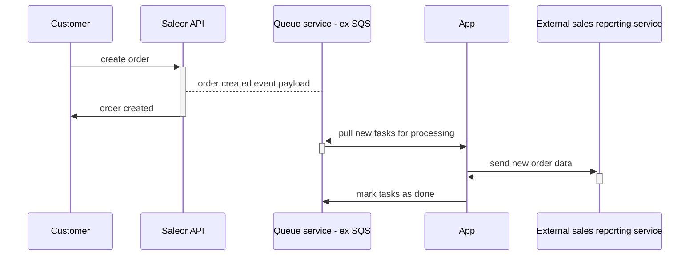
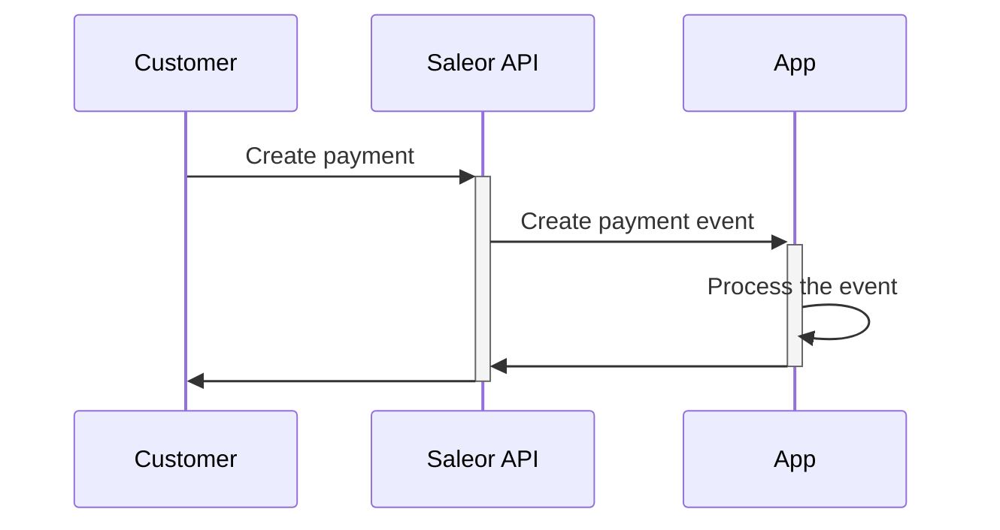
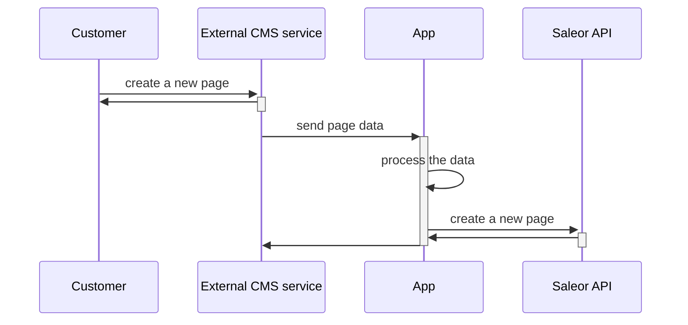
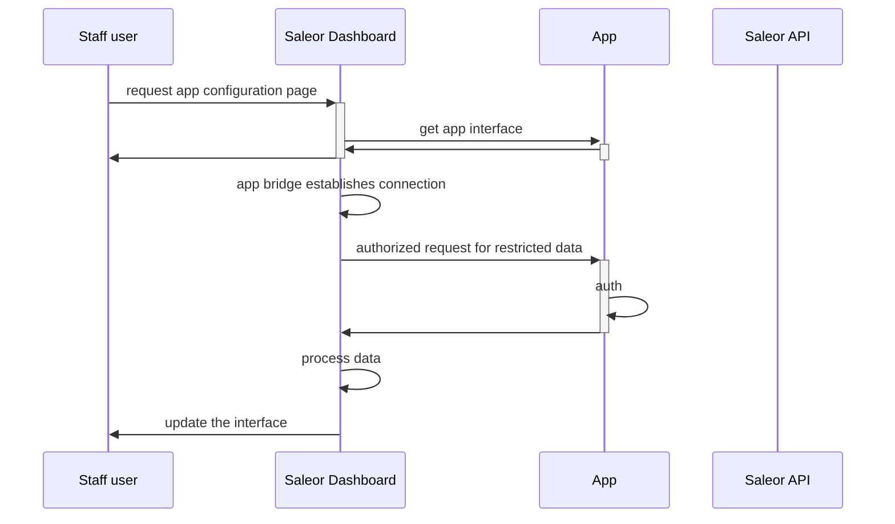

## Saleor Asynchronous Events

In this scenario, the source of the request is a Saleor instance (the worker - to be exact). In contrast to synchronous events, Saleor does not expect an immediate response from the App.

### Webhooks (HTTP requests)

To process webhooks, the App needs publicly accessible endpoints listening for HTTP POST requests. Before requests will be sent, App must [subscribe for events](developer/extending/apps/asynchronous-webhooks.mdx).
Event delivery will retry if:

- endpoint does not respond before timeout
- endpoint will respond with non-200 status code

If your application performs long-running operations after receiving the event, consider using the task queue

### Task queue

Example flow of the data for application sending data to reporting service:

Instead of sending requests, the worker will put events in the queue. This approach allow you to:

- perform long-running tasks
- in case of events surge, the App will not be overwhelmed with requests. The tasks will wait in the queue for the processing
- easy scaling - just add more workers consuming the queue
- queue will ensure that all the tasks will be processed

## Saleor synchronous events

## App to Saleor API

- the source of the event is the external service
- app need a way to know which Saleor API should be notified (in MT apps)

## Dashboard interface

Dashboard can display app views in two scenarios:

- user will navigate to app configuration page
- user will navigate to dashboard extension

In both situations, the view will be rendered inside the iframe and [App Bridge] should be used to provide auth and the context data.

### Dedicated app page

The URL to the view is provided in the app's manifest in the `appUrl` field.

### Extensions
