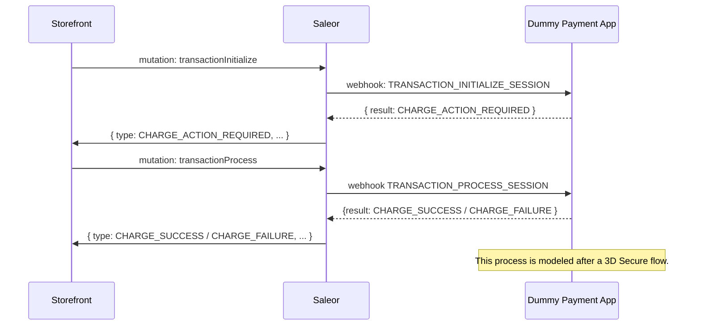

## Overview

This tutorial will demonstrate how to build a [Payment App](/developer/payments/payment-apps.mdx) using dummy payment (without a real payment provider) as an example.

For simplicity, this tutorial will not cover the entire API as a real-world implementation would, where some gateways might require multiple webhooks to capture the payment process.

If you need a reference point for integrating with real payment providers, you can check out the following examples:

- [Example Stripe App](https://github.com/saleor/saleor-app-payment-stripe)
- [Example Authorize.net App](https://github.com/saleor/saleor-app-payment-authorize.net)
- [Example Klarna App](https://github.com/saleor/saleor-app-payment-klarna)

### Prerequisites

- Understanding of [Payment Apps Usage](/developer/payments/payment-apps)
- Understanding of [Transactions](/developer/payments/transactions.mdx)

### What Will We Build

We will build a _Dummy Gateway_ that will simulate a typical 3D secure flow:

1. A Drop-in payment UI will create a token when the user initiates the payment.
2. Ask for payment confirmation (e.g., redirect the user to the 3D Secure page).
3. Charge the payment on the 3D Secure page.
4. Redirect the user to the result (success or failure) page.

Transaction API can be used both in Checkout and Order. In this tutorial, we will cover only payment steps for [existing checkout](developer/checkout/overview.mdx).

### Event Flow

Here is the complete webhooks and their corresponding mutations:



#### Flow Breakdown

1. Storefront will initiate the payment intent by calling the [`transactionInitialize`](/developer/payments/payment-apps.mdx#initialize-transaction) mutation, triggering the -> [`TRANSACTION_INITIALIZE_SESSION`](/developer/extending/webhooks/synchronous-events/transaction#initialize-transaction-session) webhook. The app will return [`CHARGE_ACTION_REQUIRED`](api-reference/payments/enums/transaction-event-type-enum.mdx#transactioneventtypeenumcharge_action_required) as `action_type` to signal the storefront that 3D secure confirmation is required.

2. Storefront will pass 3D secure confirmation data to the [`transactionProcess`](/developer/payments/payment-apps.mdx#process-transaction) mutation which will trigger [`TRANSACTION_PROCESS_SESSION`](/developer/extending/webhooks/synchronous-events/transaction#process-transaction-session) webhook.
   In this step we simulate the attempt of charging payment gateway by returning [`CHARGE_SUCCESS`](api-reference/payments/enums/transaction-event-type-enum.mdx#transactioneventtypeenumcharge_success) or [`CHARGE_FAILURE`](api-reference/payments/enums/transaction-event-type-enum.mdx#transactioneventtypeenumcharge_failure) back from the app.

:::warning
[Transaction Flow Strategy](api-reference/payments/enums/transaction-flow-strategy-enum.mdx) setting can alter the behavior of `transactionProcess` mutation. When set to `CHARGE` strategy, payments will be charged immediately, when it set `AUTHORIZATION` additional authorization step would be necessary. You can decide on the strategy on per channel basis in the _Configuration_ → _Channels_ → your channel page. For this tutorial, we will assume the `CHARGE` strategy is used.
:::

## Building Saleor App from Template

#### Install Dependencies

- Basic understanding of [Saleor Apps](developer/extending/apps/overview.mdx)
- Familiarity with [Next.js](https://nextjs.org/)
- `node >=18.17.0 <=20`
- `pnpm >=9`

#### Getting Started

Any app with server-side capabilities can be considered a Saleor App if it matches the requirements described in the [App Requirements](developer/extending/apps/architecture/app-requirements.mdx) document. Thanks to the [App Template](developer/extending/apps/developing-apps/app-template.mdx), we won't have to check all the boxes manually.

[`saleor-app-template`](https://github.com/saleor/saleor-app-template) is your Next.js starting point for building a Saleor App. It comes with all the necessary scaffolding to get you started. We will explore its features in the following sections of the tutorial.

For now, let's clone the template and boot up our app:

```bash
git clone https://github.com/saleor/saleor-app-template.git
```

Then, navigate to the app directory and install the dependencies:

```bash
pnpm install
```

Finally, start the app:

```bash
pnpm dev
```

## Installing the App

To verify that the app is running correctly, we must install it in Saleor. To do that, we need to expose our local development environment to the internet via a tunneling service. If you don't have experience with tunneling or app installation, you can follow the [Tunneling Apps](developer/extending/apps/developing-with-tunnels.mdx) guide.

The easiest way to proceed is to install a CLI tunneling tool like [`ngrok`](https://ngrok.com/), and then expose the app on the default port `3000`:

```bash
ngrok http 3000
```

This command will return a public URL that you can use to install the app in Saleor.

To do that, go to _Saleor Dashboard_ → _Apps_ → _Install external app_ and paste the URL with the `/api/manifest` suffix.

After the installation, you should see the app on the _Apps_ list. If you click on it, you will see the App Template's default page.

## Implementing Transaction Initialize Session

### Updating the App Permissions in the Manifest

Our first step will be visiting the `src/pages/api/manifest.ts` directory, where the App Manifest lives.

:::info

[App Manifest](developer/extending/apps/architecture/manifest.mdx) is the source of information about the app, including its webhooks. Saleor calls the `/manifest` API route during the app installation to retrieve all the necessary information about the app.

:::

Two fields in the App Manifest require our attention:

- `permissions` - The list of permissions the app requires to communicate with Saleor correctly (through webhooks and queries).
- `webhooks` - The list of webhooks the app wants to register in Saleor.

As we can read in the [Transaction Events](developer/extending/webhooks/synchronous-events/transaction.mdx#key-concepts) documentation, a Payment App needs [`HANDLE_PAYMENTS`](api-reference/users/enums/permission-enum.mdx#permissionenumhandle_payments) permission to receive transaction webhooks:

```ts
import { createManifestHandler } from "@saleor/app-sdk/handlers/next";
import { AppManifest } from "@saleor/app-sdk/types";

export default createManifestHandler({
  async manifestFactory({ appBaseUrl, request }) {
    // ...
    const manifest: AppManifest = {
      name: "Dummy Payment App",
      // highlight-next-line
      permissions: ["HANDLE_PAYMENTS"],
      // ...
    };
  },
});
```

Once we have built our first webhook, we will also add it to the `webhooks` array in the App Manifest.

Luckily, we won't need to provide webhook details manually. [Saleor App SDK](developer/extending/apps/developing-apps/app-sdk/overview.mdx), a package included in the template, already provides helper classes for generating the webhooks: `SaleorSyncWebhook` and `SaleorAsyncWebhook`. Webhook instances created from these classes have the `getWebhookManifest` method, which we can use to generate the webhook manifest.

### Declaring `SaleorSyncWebhook` Instance

It's time to start implementing a handler for our first webhook: `TRANSACTION_INITIALIZE_SESSION`.

Let's create a new file in the `src/pages/api/webhooks` directory, called `transaction-initialize-session.ts`.

Then, initialize the `SaleorSyncWebhook` (since `TRANSACTION_INITIALIZE_SESSION` is a _synchronous_ webhook) instance in that file:

```ts
// src/pages/api/webhooks/transaction-initialize-session.ts
import { SaleorSyncWebhook } from "@saleor/app-sdk/handlers/next";
import { saleorApp } from "../../../saleor-app";

export const transactionInitializeSessionWebhook =
  new SaleorSyncWebhook<unknown /* TODO: Add the payload type */>({
    name: "Transaction Initialize Session",
    webhookPath: "/api/webhooks/transaction-initialize-session",
    event: "TRANSACTION_INITIALIZE_SESSION",
    apl: saleorApp.apl,
    query: "", // TODO: Add the subscription query
  });
```

Here are the required constructor parameters of the `SaleorSyncWebhook` class:

- `name` - The name of the webhook. It will be used during the webhook registration process.
- `webhookPath` - The path to the webhook.
- `event` - The [synchronous webhook event](api-reference/webhooks/enums/webhook-event-type-sync-enum.mdx#values) that the handler will be listening to.
- `apl` - The reference to the app's [APL](developer/extending/apps/developing-apps/app-sdk/apl.mdx). Saleor App Template exports it from `src/saleor-app.ts`.
- `query` - The query needed to generate the [subscription webhook payload](developer/extending/webhooks/subscription-webhook-payloads.mdx). It is currently empty because we still need to declare our subscription query.

Also, we have the `unknown` generic attribute. It represents the type of webhook payload the app will receive. Since we don't have the subscription query yet, it is `unknown`.

### Defining the Subscription Query

With [subscription webhook payloads](developer/extending/webhooks/subscription-webhook-payloads.mdx), you can define the shape of the payload the webhook will receive. [GraphQL Code Generator](https://the-guild.dev/graphql/codegen) and the Saleor App SDK ensure the payload is correctly typed. We will fill the `query` attribute with that subscription query.

Let's define a subscription query for the `TRANSACTION_INITIALIZE_SESSION` handler:

:::info

In the Saleor App Template, we use [urql](https://formidable.com/open-source/urql/) to write GraphQL queries. If you prefer a different client, you still should be able to follow along.

:::

```ts
import { gql } from "urql";

// 💡 We suggest keeping the payload in a fragment. It is easier to retrieve individual fields from the subscription this way.
const TransactionInitializeSessionPayload = gql`
  fragment TransactionInitializeSessionPayload on TransactionInitializeSession {
    action {
      amount
      currency
      actionType
    }
  }
`;

const TransactionInitializeSessionSubscription = gql`
  # Payload fragment must be included in the root query
  ${TransactionInitializeSessionPayload}
  subscription TransactionInitializeSession {
    event {
      ...TransactionInitializeSessionPayload
    }
  }
`;
```

Then, let's regenerate the types (the app initially generated them during the dependencies installation):

```bash
pnpm generate
```

When the command finishes, you should be able to import the type for the declared subscription query. With those two pieces, you can now update the `SaleorSyncWebhook` instance:

```ts
import { SaleorSyncWebhook } from "@saleor/app-sdk/handlers/next";
import { saleorApp } from "../../../saleor-app";
import { TransactionInitializeSessionPayloadFragment } from "../../../../generated/graphql";

export const transactionInitializeSessionWebhook =
  new SaleorSyncWebhook<TransactionInitializeSessionPayloadFragment /* 💾 Updated with the payload type */>(
    {
      name: "Transaction Initialize Session",
      webhookPath: "/api/webhooks/transaction-initialize-session",
      event: "TRANSACTION_INITIALIZE_SESSION",
      apl: saleorApp.apl,
      query: TransactionInitializeSessionSubscription, // 💾 Updated with the subscription query
    }
  );
```

#### `data` Field

There is one more field we want to add to the `TransactionInitializeSessionPayload` fragment: [`data`](api-reference/payments/objects/transaction-initialize.mdx#transactioninitializedatajson--).

`data` is a field you can use to pass custom information to the webhook. There are no requirements for the content of the `data` field as long as it is a valid JSON object. You will notice the presence of the `data` field across other payment-related webhooks.

We will use it to pass [the token received from the drop-in](#event-flow).

In the [Calling the `transactionInitialize` Mutation](#calling-the-transactioninitialize-mutation) section, we will provide the token as a part of the mutation input. In the app, we receive the token in the `data` field of the payload.

```ts
const TransactionInitializeSessionPayload = gql`
  fragment TransactionInitializeSessionPayload on TransactionInitializeSession {
    action {
      amount
      currency
      actionType
    }
    // highlight-next-line
    data
  }
`;
```

Make sure to regenerate the types (by calling `pnpm generate`) after adding the `data` field to the payload fragment.

#### Updating the App Webhooks in the Manifest

Moving to populate the `webhooks` array in the App Manifest with the `transactionInitializeSessionWebhook`:

```ts
// src/pages/api/manifest.ts
import { createManifestHandler } from "@saleor/app-sdk/handlers/next";
import { AppManifest } from "@saleor/app-sdk/types";
// highlight-next-line
import { transactionInitializeSessionWebhook } from "./webhooks/transaction-initialize-session"; // 👈 This is our webhook instance

export default createManifestHandler({
  async manifestFactory({ appBaseUrl }) {
    // ...
    const manifest: AppManifest = {
      name: "Dummy Payment App",
      permissions: ["HANDLE_PAYMENTS"],
      webhooks: [
        // highlight-next-line
        transactionInitializeSessionWebhook.getWebhookManifest(appBaseUrl), // 👈 Call `getWebhookManifest`
      ],
      // ...
    };
  },
});
```

:::warning

Beware that modifying a subscription query for a registered webhook or adding a new webhook requires manual webhook update in Saleor API. The easiest way to do it is to reinstall the app. You can read more about this behavior in [How to Update App Webhooks](developer/extending/apps/updating-app-webhooks.mdx).

:::

### Creating the Webhook Handler

The handler is a function that will be called when the webhook is triggered. `saleor-app-sdk` handler is a decorated Next.js API ([pages](https://nextjs.org/docs/pages)) route handler.

Let's go back to the `src/pages/api/webhooks/transaction-initialize-session.ts` file and extend it with the handler:

```ts
// src/pages/api/webhooks/transaction-initialize-session.ts

// ...
export default transactionInitializeSessionWebhook.createHandler(
  (req, res, ctx) => {
    const { payload, event, baseUrl, authData } = ctx;

    // TODO: Implement the logic

    return res.status(200).end();
  }
);
```

As you can see, we are using the `createHandler` method of the `transactionInitializeSessionWebhook` instance. This method takes a handler function as an argument. The handler function receives three arguments: `req`, `res`, and `ctx`.

While the first two are the standard Next.js request and response objects, the third one is the Saleor context. It contains the following properties:

- `payload` - Type-safe subscription webhook payload.
- `event` - Name of the event that triggered the webhook.
- `baseUrl` - The base URL of the app. If you need to register the app or a webhook in an external service, you can use this URL.
- `authData` - The [authentication data](developer/extending/apps/developing-apps/app-sdk/apl.mdx#authdata) passed from Saleor to the app. Among other things, it contains the `token` you can use to query Saleor API. We won't need it in this tutorial.

Since we are implementing the Dummy Payment Gateway, our handler logic will be basic. We will just log the payload and return the `CHARGE_ACTION_REQUIRED` event status. The only thing we need to remember is that the webhook response must adhere to the [webhook response format](developer/extending/webhooks/synchronous-events/transaction.mdx#response-4):

:::info

A real-world `TRANSACTION_INITIALIZE_SESSION` webhook handler might:

- Retrieve some kind of token from the `payload.data` to identify the payment.
- Transform the payload into a format expected by the payment provider.
- Call the payment provider API (to, for example, create a payment intent).
- Process the response from the payment provider and return it.

:::

```ts
export default transactionInitializeSessionWebhook.createHandler(
  (req, res, ctx) => {
    const { payload, event, baseUrl, authData } = ctx;

    console.log("Transaction Initialize Session payload:", payload);

    // validatePayment(payload.data.token); // This function could validate the token

    const randomPspReference = crypto.randomUUID(); // Generate a random PSP reference

    return res.status(200).json({
      result: "CHARGE_ACTION_REQUIRED",
      amount: payload.action.amount, // `payload` is typed thanks to the generated types
      pspReference: randomPspReference,
    });
  }
);
```

By returning the `CHARGE_ACTION_REQUIRED` event status, we inform Saleor that the payment requires additional action. We will perform this action in the next webhook handler.

Besides the `result` field, we also return the `amount` and `pspReference` fields. The `amount` is the transaction amount, and the `pspReference` is a unique identifier of the payment in the payment provider system. Since we are not integrating with an actual payment provider, we generate a random `pspReference`.

The last thing we must add to the bottom of the handler is the `config` object with `bodyParser` set to `false`. This is necessary for App-SDK to verify the Saleor webhook signature:

```ts
export const config = {
  api: {
    bodyParser: false,
  },
};
```

Here is the full content of the `transaction-initialize-session.ts` file:

```ts
import { SaleorSyncWebhook } from "@saleor/app-sdk/handlers/next";
import { saleorApp } from "../../../saleor-app";
import { TransactionInitializeSessionPayloadFragment } from "../../../../generated/graphql";
import { gql } from "urql";

const TransactionInitializeSessionPayload = gql`
  fragment TransactionInitializeSessionPayload on TransactionInitializeSession {
    action {
      amount
      currency
      actionType
    }
    data
  }
`;

const TransactionInitializeSessionSubscription = gql`
  # Payload fragment must be included in the root query
  ${TransactionInitializeSessionPayload}
  subscription TransactionInitializeSession {
    event {
      ...TransactionInitializeSessionPayload
    }
  }
`;

export const transactionInitializeSessionWebhook =
  new SaleorSyncWebhook<TransactionInitializeSessionPayloadFragment>({
    name: "Transaction Initialize Session",
    webhookPath: "/api/webhooks/transaction-initialize-session",
    event: "TRANSACTION_INITIALIZE_SESSION",
    apl: saleorApp.apl,
    query: TransactionInitializeSessionSubscription,
  });

export default transactionInitializeSessionWebhook.createHandler(
  (req, res, ctx) => {
    const { payload, event, baseUrl, authData } = ctx;

    console.log("Transaction Initialize Session payload:", payload);

    const randomPspReference = crypto.randomUUID();

    return res.status(200).json({
      result: "CHARGE_ACTION_REQUIRED",
      amount: payload.action.amount,
      pspReference: randomPspReference,
    });
  }
);

export const config = {
  api: {
    bodyParser: false,
  },
};
```

### Calling the `transactionInitialize` Mutation

Assuming you installed the app in Saleor, we can finally try out our webhook handler. We can trigger the `TRANSACTION_INITIALIZE_SESSION` event by calling the `transactionInitialize` mutation from [GraphQL Playground](docs/api-usage/developer-tools.mdx#playground).

Here is what the mutation looks like:

```graphql
mutation TransactionInitialize(
  $checkoutId: ID!
  $data: JSON!
  $paymentGatewayId: String!
) {
  transactionInitialize(
    id: $checkoutId
    paymentGateway: { id: $paymentGatewayId, data: $data }
  ) {
    transaction {
      id
    }
    transactionEvent {
      id
      type
    }
    errors {
      field
      message
      code
    }
  }
}
```

The mutation requires `checkoutId`, `data` and `paymentGatewayId`.

- `checkoutId` is the ID of the checkout we want to pay for.

- `data` is that JSON object for additional information [we mentioned earlier](#data-field). In our case, it will contain the token received from the fictional drop-in.

- `paymentGatewayId` is the ID of the payment gateway that we want to use. We can see what payment gateways are available for the checkout by requesting the `availablePaymentGateways` field on the `checkout` query:

```graphql
query GetCheckout($id: ID!) {
  checkout(id: $id) {
    availablePaymentGateways {
      id
      name
    }
  }
}
```

If we installed the app correctly, we should see the "Dummy Payment Gateway" in the list of available payment gateways. The `id` will be drawn from the App Manifest's `id` field (in the App Template, the default id is `saleor.app`).

With `checkoutId`, `data` and `paymentGatewayId`, we can now call the `transactionInitialize` mutation:

```json
{
  "checkoutId": "Q2hlY2tvdXQ6ZjVhMTkzMjUtMjY3My00MTU0LThjM2QtYjE1OThlYzVlZjc3",
  "data": {
    "token": "dummy-drop-in-token"
  },
  "paymentGatewayId": "saleor.app"
}
```

In the response, we should see the created transaction and the transaction event with the `CHARGE_ACTION_REQUIRED` type:

```json
{
  "data": {
    "transactionInitialize": {
      "transaction": {
        "id": "VHJhbnNhY3Rpb25JdGVtOjhiZDY0NTA2LTRlYWYtNGZmYS05ZmRjLTY1MTY5MTc3ZTg2MA=="
      },
      "transactionEvent": {
        "id": "VHJhbnNhY3Rpb25FdmVudDo0MDkx",
        "type": "CHARGE_ACTION_REQUIRED"
      },
      "errors": []
    }
  }
}
```

The app's console should also log the payload received from the webhook:

```json
{
  "action": {
    "amount": 100,
    "currency": "USD",
    "actionType": "CHARGE"
  },
  "data": {
    "token": "dummy-drop-in-token"
  }
}
```

## Implementing Transaction Process Session

### Creating the Webhook Handler

:::warning

The `transactionProcess` mutation will only reach the app if the previous call to `TRANSACTION_INITIALIZE_SESSION` returned either `CHARGE_ACTION_REQUIRED` or `AUTHORIZE_ACTION_REQUIRED` event status.

:::

After our first webhook handler returns the `CHARGE_ACTION_REQUIRED` status, we need to implement the `TRANSACTION_PROCESS_SESSION` webhook handler to update the status to either `CHARGE_SUCCESS` or `CHARGE_FAILURE`.

We will start by repeating the steps from the previous section. Let's create a new file in the `src/pages/api/webhooks` directory, called `transaction-process-session.ts`.

Then, declare the subscription query for the `TRANSACTION_PROCESS_SESSION` webhook:

```ts
import { TransactionProcessSessionPayloadFragment } from "../../../../generated/graphql"; // Import the generated payload type
import { gql } from "urql";

// 💡 Remember to regenerate the types after adding the new subscription query
const TransactionProcessSessionPayload = gql`
  fragment TransactionProcessSessionPayload on TransactionProcessSession {
    action {
      amount
      currency
      actionType
    }
  }
`;

const TransactionProcessSessionSubscription = gql`
  ${TransactionProcessSessionPayload}
  subscription TransactionProcessSession {
    event {
      ...TransactionProcessSessionPayload
    }
  }
`;
```

And then, create the `SaleorSyncWebhook` instance, as well as the webhook handler:

```ts
import { TransactionProcessSessionPayloadFragment } from "../../../../generated/graphql"; // Import the generated payload type
import { gql } from "urql";
// highlight-start
import { SaleorSyncWebhook } from "@saleor/app-sdk/handlers/next";
import { saleorApp } from "../../../saleor-app";
// highlight-end

// 💡 Remember to regenerate the types after adding the new subscription query
const TransactionProcessSessionPayload = gql`
  fragment TransactionProcessSessionPayload on TransactionProcessSession {
    action {
      amount
      currency
      actionType
    }
  }
`;

const TransactionProcessSessionSubscription = gql`
  ${TransactionProcessSessionPayload}
  subscription TransactionProcessSession {
    event {
      ...TransactionProcessSessionPayload
    }
  }
`;

// highlight-start
export const transactionProcessSessionWebhook =
  new SaleorSyncWebhook<TransactionProcessSessionPayloadFragment>({
    name: "Transaction Process Session",
    webhookPath: "/api/webhooks/transaction-process-session",
    event: "TRANSACTION_PROCESS_SESSION",
    apl: saleorApp.apl,
    query: TransactionProcessSessionSubscription,
  });

export default transactionProcessSessionWebhook.createHandler(
  (req, res, ctx) => {
    const { payload, event, baseUrl, authData } = ctx;

    console.log("Transaction Process Session payload:", payload);

    return res.status(200).json({
      result: "CHARGE_SUCCESS",
      amount: payload.action.amount,
      pspReference: crypto.randomUUID(),
    });
  }
);

export const config = {
  api: {
    bodyParser: false,
  },
};
// highlight-end
```

Once again, our handler is simple. We only log the payload and return the `CHARGE_SUCCESS` event status, no questions asked.

:::info

A real-world `TRANSACTION_PROCESS_SESSION` webhook handler might:

- Call the payment provider API to confirm the payment status.
- Return either `CHARGE_SUCCESS`, `CHARGE_FAILURE` or `CHARGE_ACTION_REQUIRED` (if there are multiple checks required).

:::

#### Error Handling

If the handler performs a logic that could fail, we should try to catch the error and, in that case, return the `CHARGE_FAILURE` event status:

```ts
export default transactionProcessSessionWebhook.createHandler(
  (req, res, ctx) => {
    const { payload, event, baseUrl, authData } = ctx;

    console.log("Transaction Process Session payload:", payload);

    try {
      doSomethingThatCanFail(); // This function can throw an error

      return res.status(200).json({
        result: "CHARGE_SUCCESS",
        amount: payload.action.amount,
        pspReference: crypto.randomUUID(),
      });
    } catch (error) {
      return res.status(200).json({
        result: "CHARGE_FAILURE",
        amount: payload.action.amount,
        pspReference: crypto.randomUUID(),
      });
    }
  }
);
```

#### Updating the App Manifest

The last step is to update the App Manifest with the new webhook:

```ts
// src/pages/api/manifest.ts
import { createManifestHandler } from "@saleor/app-sdk/handlers/next";
import { AppManifest } from "@saleor/app-sdk/types";
import { transactionInitializeSessionWebhook } from "./webhooks/transaction-initialize-session";
// highlight-next-line
import { transactionProcessSessionWebhook } from "./webhooks/transaction-process-session";

export default createManifestHandler({
  async manifestFactory({ appBaseUrl }) {
    // ...
    const manifest: AppManifest = {
      name: "Dummy Payment App",
      webhooks: [
        transactionInitializeSessionWebhook.getWebhookManifest(appBaseUrl),
        // highlight-next-line
        transactionProcessSessionWebhook.getWebhookManifest(appBaseUrl),
      ],
      // ...
    };
  },
});
```

Once again, **remember to update the app's webhooks or reinstall the app in Saleor**. Otherwise, the new webhook handler won't be called on `transactionProcess`.

:::warning

When installing the app back, you may get "**App with the same identifier is already installed**" error.

Saleor throws this error because the process of fully uninstalling the app is handled by an asynchronous Saleor worker. This means it can take some time before you can install the app with the same identifier again.

If you encounter this error, you can temporarily change the app's `id` in the App Manifest.

:::

### Calling the `transactionProcess` Mutation

To test the `TRANSACTION_PROCESS_SESSION` webhook, we need to call the `transactionProcess` mutation. The mutation requires the `transactionId` variable, which is the ID of the transaction we want to process. That will be the `id` field from the `transaction` object returned by the `transactionInitialize` mutation.

Here is what the mutation looks like:

```graphql
mutation TransactionProcess($transactionId: ID!) {
  transactionProcess(id: $transactionId) {
    transaction {
      id
    }
    transactionEvent {
      id
      type
    }
    errors {
      field
      message
      code
    }
  }
}
```

In response, we should receive the processed transaction and the corresponding transaction event with the `CHARGE_SUCCESS` type:

```json
{
  "data": {
    "transactionProcess": {
      "transaction": {
        "id": "UHJvamVjdFRy"
      },
      "transactionEvent": {
        "id": "VHJhbnNhY3Rpb25FdmVudDoz",
        "type": "CHARGE_SUCCESS"
      },
      "errors": []
    }
  }
}
```

And that concludes the implementation of the Dummy Payment Gateway. With just two webhooks, we managed to model a 3D Secure payment flow.

For most checkouts, placing payment will be the last step. That means you could now [complete the checkout](api-reference/checkout/mutations/checkout-complete.mdx) and place the order 🎉.

## Next steps

Congratulations on building your first Saleor Payment App!

Its scope doesn't have to end here. You can further extend the app with additional features:

- If your payment provider requires additional operation before the payment is even initialized (for example, to render the drop-in), you might be interested in reading about the [`PAYMENT_GATEWAY_INITIALIZE_SESSION`](/developer/payments/payment-apps.mdx#initialize-payment-gateway) webhook.
- To allow users to save their payment methods for future use, you should implement the [Stored Payment Methods API](developer/payments/stored-payments.mdx).
- If your payment provider needs to report the transaction status to Saleor asynchronously, you can use the [`transactionEventReport` mutation](developer/payments/transactions.mdx#reporting-actions-for-transactions).

## Related Resources

- [Using Payment Apps](/developer/payments/payment-apps)
- [Transactions API](/developer/payments/transactions)
- [Transactions Webhooks](/developer/extending/webhooks/synchronous-events/transaction)
