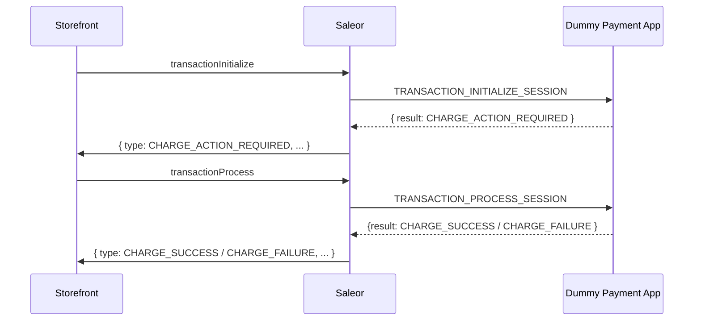

## Overview

In this tutorial, you will learn how to create a basic Payment App with [Transactions API](developer/extending/webhooks/synchronous-events/transaction.mdx).

:::note

We will be integrating with a fictional **Dummy Payment Gateway**. The Dummy Payment Gateway will mimic a real payment gateway but not actually process any payments.

:::

### Prerequisites

- Basic understanding of [Saleor Apps](developer/extending/apps/overview.mdx)
- `node >=18.17.0 <=20`
- `pnpm >=9`

### What is a Payment App

Payment App is [a Saleor App](developer/extending/apps/overview.mdx) that implements a standard interface for integrating with payment providers. Given that each payment provider comes with its unique payment flow, Saleor must provide an API flexible enough to accommodate all of them. That was the key principle behind the [Transactions API](developer/extending/webhooks/synchronous-events/transaction.mdx).

In this tutorial, we won't cover the entire API surface but rather focus on the bare minimum required to build a Dummy Payment App. Remember that integrating a real payment provider might be more complex.

:::info

If you need a reference point for integrating with an actual payment provider, you can check out the following examples:

- [Example Stripe App](https://github.com/saleor/saleor-app-payment-stripe)
- [Example Authorize.net App](https://github.com/saleor/saleor-app-payment-authorize.net)
- [Example Klarna App](https://github.com/saleor/saleor-app-payment-klarna)

:::

The centrepiece of any Payment App are [the synchronous webhooks](developer/extending/webhooks/synchronous-events/overview.mdx). This feature allows Saleor to suspend the resolution of an API call until Saleor receives a response from the app in the correct format. Saleor can then pass that response as a result of the API call. We will look at what webhooks we must implement in [the "Webhooks" section](#webhooks).

### What is a Transaction

A transaction is an attempt to pay for an order. It is represented by a list of payment events. These events have their `status` field expressing different payment process stages.

TODO: finish

### Dummy Payment Gateway Flow

For this tutorial, we will assume that the Dummy Payment Gateway requires the following operations:

1. Initiate the payment process (e.g., proceed to the payment page).
2. Ask for payment confirmation (e.g., redirect the user to the 3D Secure page).
3. Charge the payment on the 3D Secure page.
4. Redirect the user to the result (success or failure) page.

## Modeling the Transaction Flow

### Transaction Events

:::tip

Before starting any Payment App implementation, consider the transaction events you want to capture and how the app should transition between them. This will help you choose the right webhooks and mutations.

:::

The first step in building our Payment App does not involve any code. To avoid further rework, we need to understand the transaction flow we want to model. The goal is to have a list of events produced by the app and their corresponding webhooks.

Let's extract two crucial details from the [Dummy Payment Gateway flow](#dummy-payment-gateway-flow):

- We want to charge the payment successfully.
- We can't charge the payment without the user's confirmation (3D Secure).

That means the app can't immediately return the `CHARGE_SUCCESS` / `CHARGE_FAILURE` event status. Before it does that, the user needs to confirm the payment. The `CHARGE_ACTION_REQUIRED` event status will represent this step.

Now, we can assign Saleor transaction event statuses to steps of the [Dummy Payment Gateway flow](#dummy-payment-gateway-flow):

| Step                                    | Status                                                                                                                              | Description                                                 |
| --------------------------------------- | ----------------------------------------------------------------------------------------------------------------------------------- | ----------------------------------------------------------- |
| 1. Initiate the payment process         | ---                                                                                                                                 | ---                                                         |
| 2. Confirm the payment via 3D Secure    | [`CHARGE_ACTION_REQUIRED`](api-reference/payments/enums/transaction-event-type-enum#transactioneventtypeenumcharge_action_required) | The payment requires additional action to be completed.     |
| 3. Charge the payment                   | ---                                                                                                                                 | ---                                                         |
| 3.1 Charge successful                   | [`CHARGE_SUCCESS`](api-reference/payments/enums/transaction-event-type-enum#transactioneventtypeenumcharge_success)                 | The payment was successful.                                 |
| 3.2 Charge failed                       | [`CHARGE_FAILURE`](api-reference/payments/enums/transaction-event-type-enum#transactioneventtypeenumcharge_failure)                 | The payment failed, for example, due to insufficient funds. |
| 4. Redirect the user to the result page | ---                                                                                                                                 | ---                                                         |

### Webhooks

Since we know what transaction events we want to capture, we can now choose the right webhooks to implement.

When exploring the [Transaction Events](developer/extending/webhooks/synchronous-events/transaction.mdx) documentation, you may notice that two webhooks can result in the `CHARGE_SUCCESS` event: [`TRANSACTION_CHARGE_REQUESTED`](developer/extending/webhooks/synchronous-events/transaction.mdx#transaction-charge) and [`TRANSACTION_INITIALIZE_SESSION`](developer/extending/webhooks/synchronous-events/transaction.mdx#transaction-initialize-session).

There are two reasons for why **we are not going** with the `TRANSACTION_CHARGE_REQUESTED` webhook:

1. It is designed for the staff users to charge the payment manually. Since we want a checkout user (possibly unauthenticated) to be able to pay for the order, it is not a good fit.
2. It does not allow the return of the `CHARGE_ACTION_REQUIRED` event status.

That leaves us with the `TRANSACTION_INITIALIZE_SESSION` webhook. It is triggered on the [`transactionInitialize`](api-reference/payments/mutations/transaction-initialize.mdx) mutation which can be used without any permissions. It can emit the `CHARGE_ACTION_REQUIRED` event status, as required.

When `TRANSACTION_INITIALIZE_SESSION` returns `CHARGE_ACTION_REQUIRED`, the app must execute this additional action. Depending on the outcome, we want the status to transition to either `CHARGE_SUCCESS` or `CHARGE_FAILURE`. The additional [`TRANSACTION_PROCESS_SESSION`](developer/extending/webhooks/synchronous-events/transaction.mdx#process-transaction-session) webhook will be responsible for this transition.

Here is the list of webhooks and their corresponding transaction event statuses:

- `TRANSACTION_INITIALIZE_SESSION` -> `CHARGE_ACTION_REQUIRED`
- `TRANSACTION_PROCESS_SESSION` -> `CHARGE_SUCCESS` / `CHARGE_FAILURE`

And the sequence diagram of the transaction flow:



Now that we know the webhooks we will implement, we can finally start coding.

## Creating a Saleor App from Template

Any app with server-side capabilities can be considered a Saleor App if it matches the requirements described in the [App Requirements](developer/extending/apps/architecture/app-requirements.mdx) document. Thanks to the [App Template](developer/extending/apps/developing-apps/app-template.mdx), we won't have to manually check all the boxes.

[`saleor-app-template`](https://github.com/saleor/saleor-app-template) is your Next.js starting point for building a Saleor App. It comes with all the necessary scaffolding to get you started. We will explore its features in the following sections of the tutorial. For now, let's clone the template and boot up our app:

```bash
git clone https://github.com/saleor/saleor-app-template.git
```

Then, navigate to the app directory and install the dependencies:

```bash
pnpm install
```

Finally, start the app:

```bash
pnpm dev
```

## Implementing the First Webhook

### App Manifest

Our first step will be visiting the `src/pages/api/manifest.ts` directory, where the App Manifest lives.

:::info

[App Manifest](developer/extending/apps/architecture/manifest.mdx) is the source of truth for all the app-related metadata, including its webhooks. Saleor calls the `/manifest` API route during the app installation to provide all the necessary information about the app.

:::

The `webhooks` array of the App Manifest should be filled with the webhook manifests:

```ts
import { createManifestHandler } from "@saleor/app-sdk/handlers/next";
import { AppManifest } from "@saleor/app-sdk/types";

export default createManifestHandler({
  async manifestFactory({ appBaseUrl, request }) {
    // ...
    const manifest: AppManifest = {
      name: "Dummy Payment App",
      webhooks: [], // 👈 provide webhook manifests here
      // ...
    };
  },
});
```

Luckily, we don't need to do that manually.

[Saleor App SDK](developer/extending/apps/developing-apps/app-sdk/overview.mdx), a package included in the template, already provides helper classes for generating the webhooks: `SaleorSyncWebhook` and `SaleorAsyncWebhook`. Webhook instances created from these classes have the `getWebhookManifest` method, which we can use to generate the webhook manifest.

### Declaring `SaleorSyncWebhook` Instance

In this step, we begin implementing a handler for our first webhook: `TRANSACTION_INITIALIZE_SESSION`.

We first need a new file in the `src/pages/api/webhooks` directory, called `transaction-initialize-session.ts`. Then, initialize the `SaleorSyncWebhook` instance (since `TRANSACTION_INITIALIZE_SESSION` is a synchronous webhook):

```ts
import { SaleorAsyncWebhook } from "@saleor/app-sdk/handlers/next";
import { saleorApp } from "../../../saleor-app";

export const transactionInitializeSessionWebhook =
  new SaleorSyncWebhook<unknown /* TODO: Add the payload type */>({
    name: "Transaction Initialize Session",
    webhookPath: "api/webhooks/transaction-initialize-session",
    event: "TRANSACTION_INITIALIZE_SESSION",
    apl: saleorApp.apl,
    query: "", // TODO: Add the subscription query
  });
```

Let's go through all the constructor parameters of the `SaleorSyncWebhook` class:

- `name` - The name of the webhook. It will be used during the webhook registration process.
- `webhookPath` - The path to the webhook.
  `event` - The [synchronous webhook event](api-reference/webhooks/enums/webhook-event-type-sync-enum.mdx#values) that the handler will be listening to.
- `apl` - The reference to the app's [APL](developer/extending/apps/developing-apps/app-sdk/apl.mdx). Saleor App Template exports it from `src/saleor-app.ts`.
- `query` - The query needed to generate the [subscription webhook payload](developer/extending/webhooks/subscription-webhook-payloads.mdx). It is currently empty because we still need to declare our subscription query.
- `unknown` generic attribute - The type of webhook payload the app will receive. Since we don't have the subscription query yet, it is `unknown`.

### Building the Subscription Query

The next step will be filling that empty `query` attribute with an actual subscription query.

With [subscription webhook payloads](developer/extending/webhooks/subscription-webhook-payloads.mdx), you can define the shape of the payload the webhook will receive. [GraphQL Code Generator](https://the-guild.dev/graphql/codegen) and the Saleor App SDK ensure the payload is correctly typed.

Let's define a subscription query for the `TRANSACTION_INITIALIZE_SESSION` handler:

```ts
import { gql } from "urql";

// 💡 We suggest keeping the payload in a fragment. It is easier to retrieve individual fields from the subscription this way.
const TransactionInitializeSessionPayload = gql`
  fragment TransactionInitializeSessionPayload on TransactionInitializeSession {
    action {
      amount
      currency
      actionType
    }
  }
`;

const TransactionInitializeSessionSubscription = gql`
  # Payload fragment must be included in the root query
  ${TransactionInitializeSessionPayload}
  subscription TransactionInitializeSession {
    event {
      ...TransactionInitializeSessionPayload
    }
  }
`;
```

:::warning

Remember that adding a new field to the subscription query requires re-registering the webhook in Saleor API. You can read more about this behavior in [How to Update App Webhooks](developer/extending/apps/updating-app-webhooks.mdx).

:::

Then, let's regenerate the types (the app initially generated them during the dependencies installation):

```bash
pnpm generate
```

When the command finishes, you should be able to import the type for the declared subscription query. With those two pieces, you can now update the `SaleorSyncWebhook` instance:

```ts
import { SaleorSyncWebhook } from "@saleor/app-sdk/handlers/next";
import { saleorApp } from "../../../saleor-app";
import { TransactionInitializeSessionPayloadFragment } from "../../../../generated/graphql";

export const transactionInitializeSessionWebhook =
  new SaleorSyncWebhook<TransactionInitializeSessionPayloadFragment /* 💾 Updated with the payload type */>(
    {
      name: "Transaction Initialize Session",
      webhookPath: "api/webhooks/transaction-initialize-session",
      event: "TRANSACTION_INITIALIZE_SESSION",
      apl: saleorApp.apl,
      query: TransactionInitializeSessionSubscription, // 💾 Updated with the subscription query
    }
  );
```

### Creating the Webhook Handler

The last step is to create the webhook handler. The handler is a function that will be called when the webhook is triggered. `saleor-app-sdk` handler is a decorated Next.js API ([pages](https://nextjs.org/docs/pages)) route handler. The extra bit is the Saleor context that is passed to the handler.

Let's extend our `transaction-initialize-session.ts` file with the handler boilerplate:

```ts
export default transactionInitializeSessionWebhook.createHandler(
  (req, res, ctx) => {
    const { payload, event, baseUrl, authData } = ctx;

    // TODO: Implement the handler

    return res.status(200).end();
  }
);
```

The `ctx` object contains the following properties:

- `payload` - The type-safe payload received from the webhook.
- `event` - Name of the event that triggered the webhook.
- `baseUrl` - The base URL of the app. If you need to register the app or webhook in an external service, you can use this URL.
- `authData` - The [authentication data](developer/extending/apps/developing-apps/app-sdk/apl.mdx#authdata) passed from Saleor to the app. Among other things, it contains the `token` you can use to query Saleor API.

Since we are implementing the Dummy Payment Gateway, our handler will be basic. We will just log the payload and return the `CHARGE_ACTION_REQUIRED` event status. However, we need to remember that the webhook response must adhere to the [webhook response format](developer/extending/webhooks/synchronous-events/transaction.mdx#response-4):

:::info

Here is what a real-world handler could do:

- Transform the payload into a format expected by the payment provider.
- Call the payment provider API (to, for example, create a payment intent).
- Process the response from the payment provider.
- Return the response from the webhook.

:::

```ts
export default transactionInitializeSessionWebhook.createHandler(
  (req, res, ctx) => {
    const { payload, event, baseUrl, authData } = ctx;

    console.log("Transaction Initialize Session payload:", payload);

    const randomPspReference = crypto.randomUUID(); // Generate a random PSP reference

    return res.status(200).json({
      result: "CHARGE_ACTION_REQUIRED",
      amount: payload.action.amount,
      pspReference: randomPspReference,
      //   TODO: CHECK IF OTHER FIELDS ARE NEEDED
    });
  }
);
```

Note that we are generating a random PSP reference. In a real-world scenario, this would be a transaction identifier returned by the payment provider.

## Installing the App

Now that we have implemented the first webhook, we can install the app in Saleor. We need to expose our local development environment to the internet via a tunneling service to do that. You can follow the [Tunneling Apps](developer/extending/apps/developing-with-tunnels.mdx) guide to learn how to do that.

## Testing the Webhook

Assuming you installed the app in Saleor, we can test the webhook. We need to trigger the `TRANSACTION_INITIALIZE_SESSION` event by calling the `transactionInitialize` mutation from GraphQL Playground. Here is what the mutation looks like:

```graphql
mutation TransactionInitialize($checkoutId: ID!, $paymentGateway: String!) {
  transactionInitialize(
    id: $checkoutId
    paymentGateway: { id: $paymentGateway }
  ) {
    transaction {
      id
    }
    transactionEvent {
      id
      type
    }
    errors {
      field
      message
      code
    }
  }
}
```

The mutation requires two variables: `checkoutId` and `paymentGateway`. The `checkoutId` is the ID of the checkout that we want to pay for. The `paymentGateway` is the ID of the payment gateway that we want to use.

We can see what payment gateways are available for the checkout by requesting the `availablePaymentGateways` field on the `checkout` query:

```graphql
query GetCheckout($id: ID!) {
  checkout(id: $id) {
    availablePaymentGateways {
      id
      name
    }
  }
}
```

If we installed the app correctly, we should see the `Dummy Payment Gateway` in the list of available payment gateways. The `id` will be drawn from the App Manifest's `id` field.

If we have the `checkoutId` and `paymentGateway`, we can now call the `transactionInitialize` mutation. In the response, we should see the created transaction and the transaction event with the `CHARGE_ACTION_REQUIRED` type:

<!-- TODO: ADD REAL RESPONSE -->

```json
{
  "data": {
    "transactionInitialize": {
      "transaction": {
        "id": "UHJvamVjdFRy"
      },
      "transactionEvent": {
        "id": "UHJvamVjdFRy",
        "type": "CHARGE_ACTION_REQUIRED"
      },
      "errors": []
    }
  }
}
```

The app's console should also log the payload received from the webhook.

## Implementing Transaction Process Session

:::warning

The `transactionProcess` mutation will only reach the app if the previous call to `TRANSACTION_INITIALIZE_SESSION` returned either `CHARGE_ACTION_REQUIRED` or `AUTHORIZE_ACTION_REQUIRED` event status.

:::
