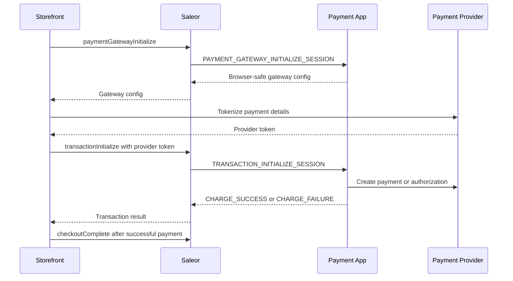
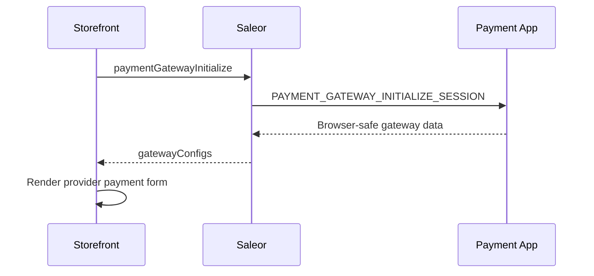
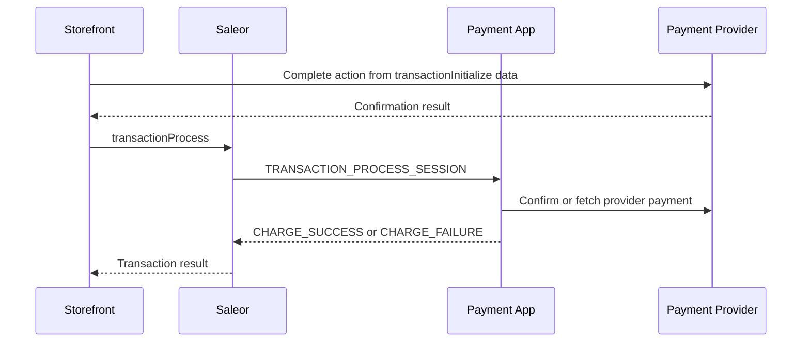
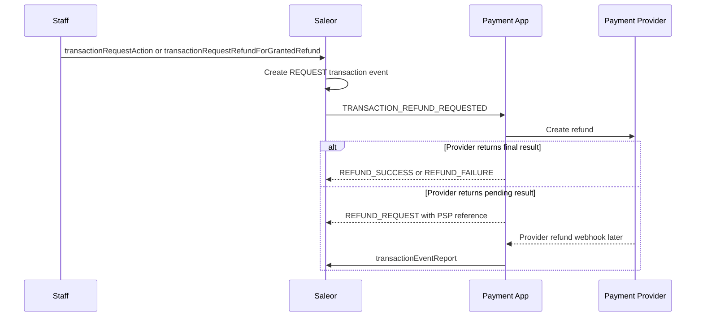
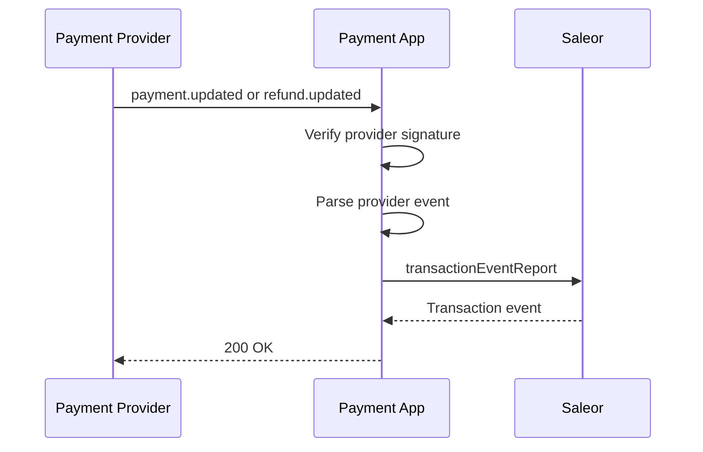
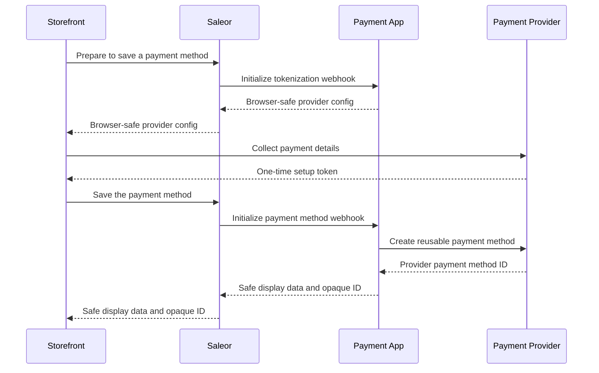

## Overview

This tutorial shows how to build a dummy Saleor Payment App that covers the main integration paths for a real gateway: gateway initialization, transactions, follow-up actions, refunds, provider webhooks, and stored payment methods.

The dummy provider does not charge money. Use it as a reference for the integration shape, then replace provider calls with your gateway API.

:::tip Building a payment app with an AI agent?

Install the [Saleor App Agent Skill](https://github.com/saleor/agent-skills) to give your agent Saleor-specific guidance for building apps, including manifests, webhooks, and permissions.

:::

:::info

The `@example/payment-provider-sdk` import is fictional. It mocks the integration surface of a typical payment provider SDK.

:::

If you want to compare the tutorial with production examples, see:

- [Stripe App](https://github.com/saleor/apps/tree/main/apps/stripe)
- [Authorize.net App](https://github.com/saleor/examples)

You can test the storefront side by forking [Saleor Payment Apps test client](https://github.com/saleor/saleor-payment-apps-testclient) or [Saleor Storefront](https://github.com/saleor/storefront).

### Prerequisites

- Basic understanding of [Saleor Apps](./overview.mdx)
- Familiarity with [Next.js](https://nextjs.org/), especially API routes

## Integration Surface

You will build a dummy payment app that covers the main integration paths for a real gateway. The dummy app keeps the provider logic behind the fictional `paymentProvider` client, but the Saleor routes, webhooks, and response shapes match the paths a real gateway must implement.

The table below is the tutorial scope. It lists the app responsibilities first, then shows the Saleor mutation or query and app webhook at the end for reference.

| Stage | Operation | Dummy behavior | Real gateway behavior | Saleor mutation or query | App webhook or endpoint |
| --- | --- | --- | --- | --- | --- |
| [Basic Payment](#stage-1-basic-payment) | Prepare checkout payment UI | Return browser-safe config and enabled methods. | Return a client secret, publishable key, SDK config, available methods, or provider account data. | `paymentGatewayInitialize` | `PAYMENT_GATEWAY_INITIALIZE_SESSION` |
| [Basic Payment](#stage-1-basic-payment) | Start a one-time payment | Return `CHARGE_SUCCESS` or `CHARGE_FAILURE`. | Create a payment intent, authorization, charge, or session. | `transactionInitialize` | `TRANSACTION_INITIALIZE_SESSION` |
| [Follow-Up Actions](#stage-2-follow-up-actions) | Request a follow-up action | Return `CHARGE_ACTION_REQUIRED` or `AUTHORIZATION_ACTION_REQUIRED`. | Ask the customer to complete 3D Secure, a redirect, mobile approval, or another provider step. | `transactionInitialize` | `TRANSACTION_INITIALIZE_SESSION` |
| [Follow-Up Actions](#stage-2-follow-up-actions) | Complete a follow-up action | Accept confirmation data and return the final event. | Confirm 3D Secure, redirect, mobile approval, or another provider step. | `transactionProcess` | `TRANSACTION_PROCESS_SESSION` |
| [Post-Purchase Actions](#stage-3-post-purchase-actions) | Request charge, cancel, or refund | Return a dummy action PSP reference. | Capture, cancel, or refund through the provider. | `transactionRequestAction` | `TRANSACTION_CHARGE_REQUESTED`, `TRANSACTION_CANCELATION_REQUESTED`, or `TRANSACTION_REFUND_REQUESTED` |
| [Post-Purchase Actions](#stage-3-post-purchase-actions) | Refund a granted refund | Return a dummy refund result. | Refund with line-level context from Saleor. | `transactionRequestRefundForGrantedRefund` | `TRANSACTION_REFUND_REQUESTED` |
| [Post-Purchase Actions](#stage-3-post-purchase-actions) | Report provider status later | Accept a signed dummy event and report it to Saleor. | Verify provider webhook signature, map provider status, and call Saleor. | `transactionEventReport` | App-owned provider webhook endpoint |
| [Stored Payment Methods](#stage-4-stored-payment-methods) | Initialize stored-method tokenization UI | Return browser-safe tokenization config. | Return setup intent, customer session, or SDK config. | `paymentGatewayInitializeTokenization` | `PAYMENT_GATEWAY_INITIALIZE_TOKENIZATION_SESSION` |
| [Stored Payment Methods](#stage-4-stored-payment-methods) | Create a stored payment method | Return `SUCCESSFULLY_TOKENIZED` or `ADDITIONAL_ACTION_REQUIRED`. | Create a provider customer, setup intent, mandate, card, or payment method. | `paymentMethodInitializeTokenization` | `PAYMENT_METHOD_INITIALIZE_TOKENIZATION_SESSION` |
| [Stored Payment Methods](#stage-4-stored-payment-methods) | Complete stored-method action | Finalize the dummy method. | Confirm setup intent, mandate, redirect, or 3D Secure. | `paymentMethodProcessTokenization` | `PAYMENT_METHOD_PROCESS_TOKENIZATION_SESSION` |
| [Stored Payment Methods](#stage-4-stored-payment-methods) | List saved methods | Return stored dummy cards. | List provider vault entries for the Saleor user. | `checkout.storedPaymentMethods` or `User.storedPaymentMethods` | `LIST_STORED_PAYMENT_METHODS` |
| [Stored Payment Methods](#stage-4-stored-payment-methods) | Delete saved method | Return `SUCCESSFULLY_DELETED`. | Disable or detach the provider payment method. | `storedPaymentMethodRequestDelete` | `STORED_PAYMENT_METHOD_DELETE_REQUESTED` |

This tutorial focuses on Payment Apps and the Transaction API. Legacy payment plugin mutations such as `paymentInitialize`, `paymentCapture`, `paymentRefund`, and `paymentVoid` are outside this guide.

## Stage 1: Basic Payment

Start with the smallest complete checkout payment. The storefront initializes the gateway, collects provider payment details, calls `transactionInitialize`, and receives an immediate success or failure.

### Payment Flow

The main checkout flow uses Saleor as the source of truth for checkout, order, amount, currency, and transaction state. The payment provider owns payment tokens, payment references, payment method details, and asynchronous status updates.


```mermaid
sequenceDiagram
  participant Storefront
  participant Saleor
  participant App as Payment App
  participant Provider as Payment Provider

  Storefront->>Saleor: paymentGatewayInitialize
  Saleor->>App: PAYMENT_GATEWAY_INITIALIZE_SESSION
  App-->>Saleor: Browser-safe gateway config
  Saleor-->>Storefront: Gateway config
  Storefront->>Provider: Tokenize payment details
  Provider-->>Storefront: Provider token
  Storefront->>Saleor: transactionInitialize with provider token
  Saleor->>App: TRANSACTION_INITIALIZE_SESSION
  App->>Provider: Create payment or authorization
  App-->>Saleor: CHARGE_SUCCESS or CHARGE_FAILURE
  Saleor-->>Storefront: Transaction result
  Storefront->>Saleor: checkoutComplete after successful payment
```

### Build the App

Start from the [Saleor App Template](./developing-apps/app-template.mdx):

```bash
git clone https://github.com/saleor/saleor-app-template.git
cd saleor-app-template
pnpm install
pnpm dev
```

Install the app in Saleor by exposing the local app through a tunnel. See [Developing with Tunnels](./developing-with-tunnels.mdx) if you have not installed a local app before.

```bash
ngrok http 3000
```

Then open Saleor Dashboard, go to _Apps_ -> _Install external app_, and paste the tunnel URL with the `/api/manifest` suffix.

### Define the Manifest

A payment app starts as a regular Saleor App. The first payment-specific requirement is the `HANDLE_PAYMENTS` permission. Without it, Saleor will not call your payment webhooks.

Start with the app identity, registration endpoint, and permission. In the Saleor App Template, the manifest handler usually lives at `src/pages/api/manifest.ts`. If your app uses a different Next.js structure, keep the same manifest fields and adapt the file path.

```ts
// src/pages/api/manifest.ts

import { createManifestHandler } from "@saleor/app-sdk/handlers/next";
import { type AppManifest } from "@saleor/app-sdk/types";

export default createManifestHandler({
  async manifestFactory({ appBaseUrl }) {
    const manifest: AppManifest = {
      name: "Dummy Payment App",
      id: "app.saleor.dummy-payment",
      appUrl: appBaseUrl,
      tokenTargetUrl: `${appBaseUrl}/api/register`,
      // highlight-next-line
      permissions: ["HANDLE_PAYMENTS"],
      webhooks: [],
    };

    return manifest;
  },
});
```

The empty `webhooks` array is intentional at this point. Add each webhook to the manifest only after you create the route that handles it. When you add or change a webhook subscription query, reinstall the app or update the webhook in Saleor.

:::info

The [App SDK](./developing-apps/app-sdk/overview.mdx) uses the [APL](./developing-apps/app-sdk/apl.mdx) to store app installation auth data. A single-tenant app can usually read one installation record and one set of provider credentials. A multi-tenant app must resolve provider configuration by Saleor installation, channel, or merchant account before it calls the provider.

:::

### Manage Gateway Configuration

Keep provider configuration separate from payment flow code. A real app usually stores:

- server-only credentials, such as access tokens or secret keys,
- browser-safe values, such as publishable keys or account IDs,
- environment selection, such as sandbox or production,
- feature flags, such as card, saved card, wallet, or gift card support.

For this tutorial, the dummy provider can use static config:

```ts
// src/lib/dummy-gateway-config.ts

export const dummyGatewayConfig = {
  publishableKey: "pk_dummy_123",
  environment: "sandbox",
  methods: {
    card: true,
    storedCard: true,
  },
};
```

In production, store secrets in encrypted app private metadata or another secret store. Never expose provider secret keys, access tokens, webhook signing secrets, or app tokens to the browser.

### Initialize the Payment Gateway

Use `paymentGatewayInitialize` when the storefront needs data before it can render the payment form. A real provider might return a client secret, a publishable key, an available methods list, or SDK options.


```mermaid
sequenceDiagram
  participant Storefront
  participant Saleor
  participant App as Payment App

  Storefront->>Saleor: paymentGatewayInitialize
  Saleor->>App: PAYMENT_GATEWAY_INITIALIZE_SESSION
  App-->>Saleor: Browser-safe gateway data
  Saleor-->>Storefront: gatewayConfigs
  Storefront->>Storefront: Render provider payment form
```

The storefront calls `paymentGatewayInitialize` before it renders the provider UI:

```graphql
mutation PaymentGatewayInitialize(
  $id: ID!
  $amount: PositiveDecimal
  $paymentGateways: [PaymentGatewayToInitialize!]
) {
  paymentGatewayInitialize(
    id: $id
    amount: $amount
    paymentGateways: $paymentGateways
  ) {
    gatewayConfigs {
      id
      data
      errors {
        field
        message
        code
      }
    }
    errors {
      field
      message
      code
    }
  }
}
```

Saleor then sends `PAYMENT_GATEWAY_INITIALIZE_SESSION` to your app. Create `src/pages/api/webhooks/payment-gateway-initialize-session.ts` and define the subscription query and webhook:

```ts
// src/pages/api/webhooks/payment-gateway-initialize-session.ts

import { SaleorSyncWebhook } from "@saleor/app-sdk/handlers/next";
import { saleorApp } from "../../../saleor-app";

const subscription = `
  subscription PaymentGatewayInitializeSession {
    event {
      ... on PaymentGatewayInitializeSession {
        issuedAt
        amount
        data
        sourceObject {
          __typename
          ... on Checkout {
            id
          }
          ... on Order {
            id
          }
        }
      }
    }
  }
`;

export const paymentGatewayInitializeSessionWebhook = new SaleorSyncWebhook({
  name: "Dummy Payment Gateway Initialize Session",
  webhookPath: "/api/webhooks/payment-gateway-initialize-session",
  event: "PAYMENT_GATEWAY_INITIALIZE_SESSION",
  apl: saleorApp.apl,
  query: subscription,
});
```

After you add or change a subscription query in the Saleor App Template, regenerate GraphQL types:

```bash
pnpm generate
```

This tutorial keeps handler snippets compact, but production code should type `ctx.payload` with the generated subscription payload.

Then return the browser-safe gateway data from the handler:

```ts
// src/pages/api/webhooks/payment-gateway-initialize-session.ts

export default paymentGatewayInitializeSessionWebhook.createHandler((_req, res) => {
  return res.status(200).json({
    data: {
      publishableKey: "pk_dummy_123",
      environment: "sandbox",
      methods: {
        card: true,
        storedCard: true,
      },
    },
  });
});

export const config = {
  api: {
    bodyParser: false,
  },
};
```

After creating the route, import `paymentGatewayInitializeSessionWebhook` in the manifest and add its `getWebhookManifest(appBaseUrl)` result to the `webhooks` array:

```ts
// src/pages/api/manifest.ts

import { paymentGatewayInitializeSessionWebhook } from "./webhooks/payment-gateway-initialize-session";

// ...

webhooks: [
  paymentGatewayInitializeSessionWebhook.getWebhookManifest(appBaseUrl),
],
```

:::caution

When you add a new webhook or modify a subscription query for a registered webhook, Saleor does not update the installed webhook automatically. The easiest way to apply the change during development is to reinstall the app. For production update flows, see [How to Update App Webhooks](./updating-app-webhooks.mdx).

:::

### Initialize a Transaction

Use `transactionInitialize` to create the first payment action for a checkout or order. The storefront should pass only provider client output and app-level routing fields in `paymentGateway.data`.

```json
{
  "version": "dummy.v1",
  "method": "card",
  "token": "provider-token-from-frontend"
}
```

The storefront passes that object through `paymentGateway.data`:

```graphql
mutation TransactionInitialize(
  $id: ID!
  $paymentGateway: PaymentGatewayToInitialize!
  $idempotencyKey: String
) {
  transactionInitialize(
    id: $id
    paymentGateway: $paymentGateway
    idempotencyKey: $idempotencyKey
  ) {
    transaction {
      id
    }
    transactionEvent {
      type
      pspReference
    }
    data
    errors {
      field
      message
      code
    }
  }
}
```

Do not trust amount, currency, checkout ID, order ID, customer ID, provider account ID, or final payment state from `paymentGateway.data`. Saleor sends amount and currency in the webhook payload. The provider API returns provider references and status.

Create `src/pages/api/webhooks/transaction-initialize-session.ts`:

```ts
// src/pages/api/webhooks/transaction-initialize-session.ts

import { SaleorSyncWebhook } from "@saleor/app-sdk/handlers/next";
import { paymentProvider } from "@example/payment-provider-sdk";
import { saleorApp } from "../../../saleor-app";

const subscription = `
  subscription TransactionInitializeSession {
    event {
      ... on TransactionInitializeSession {
        issuedAt
        idempotencyKey
        data
        action {
          amount
          currency
          actionType
        }
        transaction {
          id
        }
        sourceObject {
          __typename
          ... on Checkout {
            id
          }
          ... on Order {
            id
          }
        }
      }
    }
  }
`;

export const transactionInitializeSessionWebhook = new SaleorSyncWebhook({
  name: "Dummy Transaction Initialize Session",
  webhookPath: "/api/webhooks/transaction-initialize-session",
  event: "TRANSACTION_INITIALIZE_SESSION",
  apl: saleorApp.apl,
  query: subscription,
});

export default transactionInitializeSessionWebhook.createHandler(async (_req, res, ctx) => {
  const { payload } = ctx;
  const payment = await paymentProvider.payments.create({
    amount: payload.action.amount,
    currency: payload.action.currency,
    paymentToken: payload.data?.token,
    idempotencyKey: payload.idempotencyKey,
    sourceObjectId: payload.sourceObject.id,
  });

  return res.status(200).json({
    result: "CHARGE_SUCCESS",
    amount: payload.action.amount,
    pspReference: payment.id,
  });
});

export const config = {
  api: {
    bodyParser: false,
  },
};
```

A real provider might create a payment intent, authorize funds, charge the card, or create a hosted session. Use the Saleor `idempotencyKey` for the provider request, or derive a provider-safe key from it if the provider has length or character limits.

## Stage 2: Follow-Up Actions

Some providers cannot finish the payment in the first `transactionInitialize` call. They may require 3D Secure, a redirect, mobile approval, or a provider-hosted confirmation screen.

When `transactionInitialize` returns `CHARGE_ACTION_REQUIRED` or `AUTHORIZATION_ACTION_REQUIRED`, the storefront must complete the provider action and then call `transactionProcess`.

The payment app returns action instructions in the webhook response `data` field. Saleor does not interpret this object. It returns the same object in the `transactionInitialize` or `transactionProcess` mutation response so the storefront can decide what to render next.

Support this path by returning `CHARGE_ACTION_REQUIRED` from `transactionInitialize` when the provider says the customer must complete another step. Add this branch before the success response in the `transactionInitialize` handler:

```ts
// src/pages/api/webhooks/transaction-initialize-session.ts

if (payment.status === "requires_action") {
  return res.status(200).json({
    result: "CHARGE_ACTION_REQUIRED",
    amount: payload.action.amount,
    pspReference: payment.id,
    data: payment.nextAction,
  });
}
```

### Process the Follow-Up Action


```mermaid
sequenceDiagram
  participant Storefront
  participant Saleor
  participant App as Payment App
  participant Provider as Payment Provider

  Storefront->>Provider: Complete action from transactionInitialize data
  Provider-->>Storefront: Confirmation result
  Storefront->>Saleor: transactionProcess
  Saleor->>App: TRANSACTION_PROCESS_SESSION
  App->>Provider: Confirm or fetch provider payment
  App-->>Saleor: CHARGE_SUCCESS or CHARGE_FAILURE
  Saleor-->>Storefront: Transaction result
```

The storefront calls `transactionProcess` with the provider confirmation data:

```graphql
mutation TransactionProcess($id: ID!, $data: JSON) {
  transactionProcess(id: $id, data: $data) {
    transaction {
      id
    }
    transactionEvent {
      type
      pspReference
    }
    data
    errors {
      field
      message
      code
    }
  }
}
```

Create `src/pages/api/webhooks/transaction-process-session.ts`:

```ts
// src/pages/api/webhooks/transaction-process-session.ts

import { SaleorSyncWebhook } from "@saleor/app-sdk/handlers/next";
import { paymentProvider } from "@example/payment-provider-sdk";
import { saleorApp } from "../../../saleor-app";

const subscription = `
  subscription TransactionProcessSession {
    event {
      ... on TransactionProcessSession {
        issuedAt
        data
        action {
          amount
          currency
          actionType
        }
        transaction {
          id
          pspReference
        }
      }
    }
  }
`;

export const transactionProcessSessionWebhook = new SaleorSyncWebhook({
  name: "Dummy Transaction Process Session",
  webhookPath: "/api/webhooks/transaction-process-session",
  event: "TRANSACTION_PROCESS_SESSION",
  apl: saleorApp.apl,
  query: subscription,
});

export default transactionProcessSessionWebhook.createHandler(async (_req, res, ctx) => {
  const { payload } = ctx;

  const payment = await paymentProvider.payments.confirm({
    paymentId: payload.transaction.pspReference,
    confirmationData: payload.data,
  });

  return res.status(200).json({
    result: "CHARGE_SUCCESS",
    amount: payload.action.amount,
    pspReference: payment.id,
  });
});

export const config = {
  api: {
    bodyParser: false,
  },
};
```

Some providers require more than one follow-up step. In that case, the app can return another `CHARGE_ACTION_REQUIRED` or `AUTHORIZATION_ACTION_REQUIRED` response until the provider reaches a final state.

## Stage 3: Post-Purchase Actions

After the checkout payment works, handle the transaction lifecycle that happens after the first charge or authorization. This includes refunds, delayed charge or cancel requests, and provider webhooks that report final status later.

### Handle Refunds and Transaction Actions

Saleor can request transaction actions after the original payment. For a payment app, the most common action is a refund.

There are two request mutations:

- [`transactionRequestAction`](../../../api-reference/payments/mutations/transaction-request-action.mdx) can request charge, cancel, or refund actions for a transaction.
- [`transactionRequestRefundForGrantedRefund`](../../../api-reference/payments/mutations/transaction-request-refund-for-granted-refund.mdx) requests a refund based on an `OrderGrantedRefund`.

Both paths can trigger `TRANSACTION_REFUND_REQUESTED`. If you support delayed capture or cancellation, you can also implement `TRANSACTION_CHARGE_REQUESTED` and `TRANSACTION_CANCELATION_REQUESTED`.

Use `transactionRequestAction` when you want to request a charge, cancel, or refund action for a transaction:

```graphql
mutation TransactionRequestAction(
  $id: ID!
  $actionType: TransactionActionEnum!
  $amount: PositiveDecimal
) {
  transactionRequestAction(id: $id, actionType: $actionType, amount: $amount) {
    transaction {
      id
      pspReference
      actions
      events {
        id
        type
        pspReference
      }
    }
    errors {
      field
      message
      code
    }
  }
}
```

Use `transactionRequestRefundForGrantedRefund` when Saleor has already created a granted refund and the provider needs that refund context:

```graphql
mutation TransactionRequestRefundForGrantedRefund(
  $transactionId: ID!
  $grantedRefundId: ID!
) {
  transactionRequestRefundForGrantedRefund(
    id: $transactionId
    grantedRefundId: $grantedRefundId
  ) {
    transaction {
      id
      pspReference
      actions
      events {
        id
        type
        pspReference
      }
    }
    errors {
      field
      message
      code
    }
  }
}
```


```mermaid
sequenceDiagram
  participant Staff
  participant Saleor
  participant App as Payment App
  participant Provider as Payment Provider

  Staff->>Saleor: transactionRequestAction or transactionRequestRefundForGrantedRefund
  Saleor->>Saleor: Create REQUEST transaction event
  Saleor->>App: TRANSACTION_REFUND_REQUESTED
  App->>Provider: Create refund
  alt Provider returns final result
    App-->>Saleor: REFUND_SUCCESS or REFUND_FAILURE
  else Provider returns pending result
    App-->>Saleor: REFUND_REQUEST with PSP reference
    Provider-->>App: Provider refund webhook later
    App->>Saleor: transactionEventReport
  end
```

Create `src/pages/api/webhooks/transaction-refund-requested.ts`:

```ts
// src/pages/api/webhooks/transaction-refund-requested.ts

import { SaleorSyncWebhook } from "@saleor/app-sdk/handlers/next";
import { paymentProvider } from "@example/payment-provider-sdk";
import { saleorApp } from "../../../saleor-app";

const subscription = `
  subscription TransactionRefundRequested {
    event {
      ... on TransactionRefundRequested {
        issuedAt
        action {
          amount
          currency
          actionType
        }
        transaction {
          id
          pspReference
        }
        grantedRefund {
          id
          reason
        }
      }
    }
  }
`;

export const transactionRefundRequestedWebhook = new SaleorSyncWebhook({
  name: "Dummy Transaction Refund Requested",
  webhookPath: "/api/webhooks/transaction-refund-requested",
  event: "TRANSACTION_REFUND_REQUESTED",
  apl: saleorApp.apl,
  query: subscription,
});

export default transactionRefundRequestedWebhook.createHandler(async (_req, res, ctx) => {
  const { payload } = ctx;

  const refund = await paymentProvider.refunds.create({
    paymentId: payload.transaction.pspReference,
    amount: payload.action.amount,
    currency: payload.action.currency,
    idempotencyKey: payload.grantedRefund?.id,
  });

  return res.status(200).json({
    result: "REFUND_SUCCESS",
    amount: payload.action.amount,
    pspReference: refund.id,
  });
});

export const config = {
  api: {
    bodyParser: false,
  },
};
```

For a real provider, use the transaction `pspReference` to identify the original provider payment. Use a stable idempotency key for the refund request, especially when retrying after a timeout.

### Report Provider Webhooks to Saleor

Many providers send final status through their own webhooks. Provider webhooks are not Saleor manifest webhooks. They are app-owned routes that receive provider events, verify provider signatures, and report the result to Saleor with `transactionEventReport`.


```mermaid
sequenceDiagram
  participant Provider as Payment Provider
  participant App as Payment App
  participant Saleor

  Provider->>App: payment.updated or refund.updated
  App->>App: Verify provider signature
  App->>App: Parse provider event
  App->>Saleor: transactionEventReport
  Saleor-->>App: Transaction event
  App-->>Provider: 200 OK
```

The app reports provider status back to Saleor with `transactionEventReport`:

```graphql
mutation TransactionEventReport(
  $id: ID!
  $type: TransactionEventTypeEnum!
  $amount: PositiveDecimal
  $pspReference: String!
  $message: String
) {
  transactionEventReport(
    id: $id
    type: $type
    amount: $amount
    pspReference: $pspReference
    message: $message
  ) {
    transactionEvent {
      id
      type
      pspReference
    }
    alreadyProcessed
    errors {
      field
      message
      code
    }
  }
}
```

Keep the provider adapter separate from the Saleor reporting helper. The provider adapter should verify the provider signature, parse the provider event, and map it to the `transactionEventReport` variables.

Create a provider webhook route such as `src/pages/api/provider-webhook.ts`:

```ts
// src/pages/api/provider-webhook.ts

import { type NextApiHandler, type NextApiRequest } from "next";
import { paymentProvider } from "@example/payment-provider-sdk";

import { reportTransactionEvent } from "../../lib/report-transaction-event";

type ProviderEvent = {
  transactionId: string;
  pspReference: string;
  amount: number;
  type: "CHARGE_SUCCESS" | "CHARGE_FAILURE" | "REFUND_SUCCESS" | "REFUND_FAILURE";
};

const readRawBody = async (req: NextApiRequest) => {
  const chunks: Buffer[] = [];

  for await (const chunk of req) {
    chunks.push(Buffer.isBuffer(chunk) ? chunk : Buffer.from(chunk));
  }

  return Buffer.concat(chunks).toString("utf8");
};

const mapProviderEventToReportInput = (event: ProviderEvent) => {
  return {
    id: event.transactionId,
    type: event.type,
    amount: event.amount,
    pspReference: event.pspReference,
  };
};

const handler: NextApiHandler = async (req, res) => {
  const rawBody = await readRawBody(req);
  const signature = req.headers["dummy-signature"];
  const signatureValue = Array.isArray(signature) ? signature[0] : signature;
  const event = paymentProvider.webhooks.parseEvent(rawBody, signatureValue);
  const reportInput = mapProviderEventToReportInput(event);

  await reportTransactionEvent(reportInput);

  return res.status(200).json({
    result: "received",
    pspReference: reportInput.pspReference,
  });
};

export default handler;

export const config = {
  api: {
    bodyParser: false,
  },
};
```

The `reportTransactionEvent` helper should execute the mutation above with an app token from the APL. In a single-tenant app, that usually means reading the app's installation auth data and creating a Saleor GraphQL client for that Saleor domain.

A real provider webhook route should:

- verify the provider signature before parsing business fields,
- reject invalid payloads,
- map only known provider statuses,
- report unknown statuses as operational errors,
- avoid logging raw provider tokens or secrets,
- return `200` only when the event was accepted or intentionally ignored.

## Stage 4: Stored Payment Methods

Stored payment methods let a signed-in customer save a payment method and use it again later. A common example is a card saved during checkout.

The payment provider still owns the sensitive payment details. Your app connects the provider's stored method to the Saleor user and gives Saleor a safe description to display, such as the card brand, last four digits, and expiry date. The storefront refers to the method by an opaque ID. It never receives the full card number or a provider secret.

Saving a method usually has two parts:

1. **Get the provider configuration.** The storefront asks for the browser-safe values it needs to start the provider SDK, such as a publishable key or setup session.
2. **Save the method.** After the provider collects the payment details, the storefront sends the resulting provider token to Saleor. Your app exchanges that token for a reusable provider payment method and returns its ID.

Saleor uses longer API names for these two parts:

| What the customer is doing | Storefront mutation | Webhook handled by the app |
| --- | --- | --- |
| Starting the "save payment method" form | `paymentGatewayInitializeTokenization` | `PAYMENT_GATEWAY_INITIALIZE_TOKENIZATION_SESSION` |
| Saving the collected payment method | `paymentMethodInitializeTokenization` | `PAYMENT_METHOD_INITIALIZE_TOKENIZATION_SESSION` |


```mermaid
sequenceDiagram
  participant Storefront
  participant Saleor
  participant App as Payment App
  participant Provider as Payment Provider

  Storefront->>Saleor: Prepare to save a payment method
  Saleor->>App: Initialize tokenization webhook
  App-->>Saleor: Browser-safe provider config
  Saleor-->>Storefront: Browser-safe provider config
  Storefront->>Provider: Collect payment details
  Provider-->>Storefront: One-time setup token
  Storefront->>Saleor: Save the payment method
  Saleor->>App: Initialize payment method webhook
  App->>Provider: Create reusable payment method
  Provider-->>App: Provider payment method ID
  App-->>Saleor: Safe display data and opaque ID
  Saleor-->>Storefront: Safe display data and opaque ID
```

The examples below walk through these two parts. Define both webhook routes with `SaleorSyncWebhook`, a subscription query, `saleorApp.apl`, and `bodyParser: false`, as shown in the checkout payment webhooks. Run `pnpm generate` and type `ctx.payload` with the generated subscription payload.

### Get the Provider Configuration

The storefront starts with `paymentGatewayInitializeTokenization`. This does not save anything yet. It asks your app for the browser-safe values needed to render the provider's form or SDK.

```graphql
mutation PaymentGatewayInitializeTokenization(
  $id: String!
  $channel: String!
  $data: JSON
) {
  paymentGatewayInitializeTokenization(id: $id, channel: $channel, data: $data) {
    result
    data
    errors {
      field
      code
      message
    }
  }
}
```

Saleor triggers `PAYMENT_GATEWAY_INITIALIZE_TOKENIZATION_SESSION`. The app gets its provider configuration and returns only the values that are safe to expose in the browser:

```ts
// src/lib/stored-payment-methods.ts

const buildGatewayTokenizationResponse = () => {
  return {
    result: "SUCCESSFULLY_INITIALIZED",
    data: {
      publishableKey: "pk_dummy_123",
      setupSessionId: "dummy-setup-session-123",
    },
  };
};
```

The storefront uses this response to initialize the provider SDK. The provider then collects the payment details directly and returns a short-lived setup token. Do not send raw card details through Saleor or your app.

### Save the Payment Method

After collecting the provider token, the storefront calls `paymentMethodInitializeTokenization`. The `data` field carries provider-specific input, not trusted Saleor data:

```graphql
mutation PaymentMethodInitializeTokenization(
  $id: String!
  $channel: String!
  $paymentFlowToSupport: TokenizedPaymentFlowEnum!
  $data: JSON
) {
  paymentMethodInitializeTokenization(
    id: $id
    channel: $channel
    paymentFlowToSupport: $paymentFlowToSupport
    data: $data
  ) {
    result
    id
    data
    errors {
      field
      code
      message
    }
  }
}
```

Saleor triggers `PAYMENT_METHOD_INITIALIZE_TOKENIZATION_SESSION`. The app should:

1. Read the Saleor user and channel from the webhook payload.
2. Pass the short-lived setup token to the provider.
3. Create or attach the reusable payment method to the correct provider customer.
4. Return an opaque method ID and safe display details.

For the dummy provider, the response can look like this:

```ts
// src/lib/stored-payment-methods.ts

const buildPaymentMethodInitializeResponse = () => {
  return {
    result: "SUCCESSFULLY_TOKENIZED",
    id: "dummy-method-123",
    data: {
      brand: "visa",
      lastDigits: "4242",
    },
  };
};
```

The ID is the handle used for later operations. It must not contain sensitive payment data. Before using it, the app must verify that the method belongs to the Saleor user from the webhook payload.

### The Remaining Operations

The same pattern covers the rest of the stored-method lifecycle. The storefront calls Saleor, Saleor calls the app, and the app performs the operation with the provider.

| Customer action | Saleor API | What the app does |
| --- | --- | --- |
| Complete an extra verification step | `paymentMethodProcessTokenization` / `PAYMENT_METHOD_PROCESS_TOKENIZATION_SESSION` | Confirm a setup flow that returned `ADDITIONAL_ACTION_REQUIRED`, such as 3D Secure or a redirect. |
| View saved methods | `checkout.storedPaymentMethods` or `User.storedPaymentMethods` / `LIST_STORED_PAYMENT_METHODS` | List the user's provider methods and return only their IDs and safe display details. |
| Delete a saved method | `storedPaymentMethodRequestDelete` / `STORED_PAYMENT_METHOD_DELETE_REQUESTED` | Detach or disable the method at the provider and return `SUCCESSFULLY_DELETED`. |
| Pay with a saved method | `transactionInitialize` / `TRANSACTION_INITIALIZE_SESSION` | Resolve the supplied method ID, verify ownership, and create a payment with the provider. |

These operations do not need separate implementations in this tutorial. They use the same webhook structure and provider boundary as the two methods above. See [Stored Payment Methods](../../payments/stored-payments.mdx) for every request and response shape.

## Best Practices

The examples above keep the provider logic simple. A production payment app needs a stronger contract:

1. **Follow the Saleor action exactly.** Use its action type, amount, currency, and refund identity. Do not replace them with checkout totals or storefront data. The storefront may send an opaque provider token, but it does not decide financial facts. Do not store or log short-lived payment tokens, and never expose server credentials to the browser.

2. **Give every attempt one stable reference.** Create an app-owned reference before calling the provider. Keep it across retries, return it as Saleor's `pspReference`, and send it to the provider as a merchant reference when possible. Webhooks should use this same reference to find the attempt.

3. **Keep identities separate.** The app's attempt reference, the provider's payment or refund ID, and the provider account that owns it are different things. A local configuration ID is not a payment identity.

4. **Unknown does not mean failed.** A timeout only means the app did not receive an answer. The payment or refund may still have happened. Keep the transaction pending and reconcile it later instead of inviting another attempt.

5. **Verify what the provider did.** Before reporting success, check the provider status, amount, currency, object ID, and its relationship to the original payment. An HTTP success response alone does not prove that the requested financial operation completed.

6. **Use provider webhooks to reconcile existing attempts.** Verify the signature against the raw body. Expect events to arrive early, late, more than once, or out of order. Do not let an old event move a completed transaction backwards. Return `2xx` only after processing the event or storing it durably. If the matching Saleor transaction does not exist yet and nothing stored the event, return a retriable error such as `503`.

7. **Refund the original provider payment.** Saleor decides the refund amount. The stored provider payment ID identifies what to refund. Use credentials for the provider account that owns that payment, not an old local configuration ID or whichever configuration is currently assigned to the channel.

8. **Make each Saleor transaction atomic.** In plain English, one transaction should do one financial thing against one funding source: one charge, authorization, refund, capture, or cancellation. It should not quietly create another payment, switch payment methods, or combine several funding sources. For example, a gift card and a credit card should be two separate Saleor transactions.

9. **Design for interruption.** Any provider call can time out halfway through. Before making it, the app should already have a stable reference, a pending state, and a way to reconcile the result later.

Keep shopper-facing errors short and safe. Put detailed diagnostics in server logs or app configuration screens without logging payment tokens or secrets.

## Frontend Testing

You can test the frontend side with:

- [Saleor Payment Apps test client](https://github.com/saleor/saleor-payment-apps-testclient), which is designed for payment app checkout testing.
- [Saleor Storefront](https://github.com/saleor/storefront), which is a production-style storefront baseline.

For a one-time payment, the frontend should:

1. Query the checkout and available payment gateways.
2. Call `paymentGatewayInitialize` if the provider needs browser setup.
3. Render the provider payment UI.
4. Collect a provider token or complete the provider-hosted step.
5. Call `transactionInitialize` with a stable `idempotencyKey`.
6. If the app returns follow-up action data, complete the action and call `transactionProcess`.
7. Call `checkoutComplete` only after Saleor reports a successful charge or authorization state.

## Related Resources

- [Using Payment Apps](../../payments/payment-apps.mdx)
- [Transactions API](../../payments/transactions.mdx)
- [Stored Payment Methods](../../payments/stored-payments.mdx)
- [Transaction Webhooks](../webhooks/synchronous-events/transaction.mdx)
- [Stored Payment Method Webhooks](../webhooks/synchronous-events/stored-payment-method.mdx)
- [Subscription Webhook Payloads](../webhooks/subscription-webhook-payloads.mdx)
