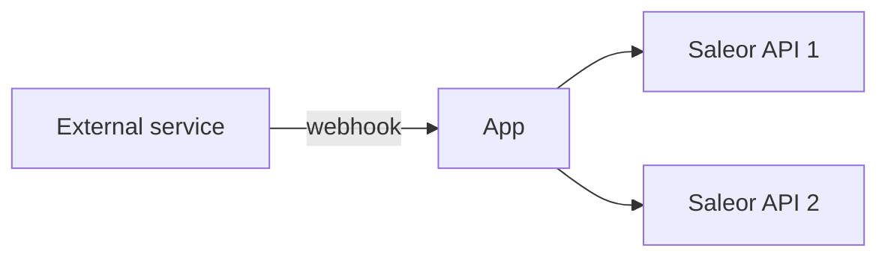
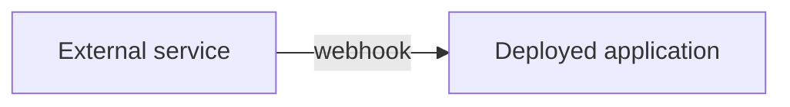
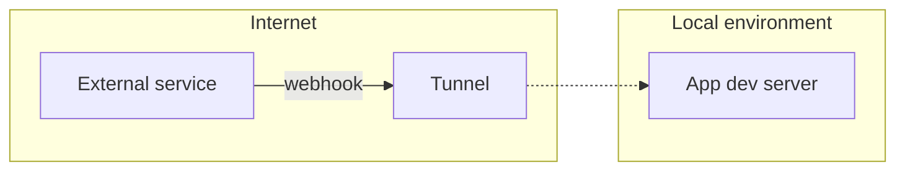

## What is an external webhook

Saleor may not be the only source of the webhooks sent to your application. Popular use cases:

- status update of payment from a provider like Stripe
- delivery status update of a package
- CMS changed a product description

If the application is multi-tenant, then the flow of the data is as below:

## Exposing endpoint

The first step will be creating an HTTP endpoint that will receive events. For example, it's going to be `/api/webhooks/status-update`.

Since external services require an address that is accessible from the internet, you are going to need a tunnel to expose the local environment. You can read more in the [tunneling section](../../developing-with-tunnels.mdx).

When subscribing for webhooks in the external service, use the URL of the tunneled endpoint or deployed app.

## Handling multi-tenancy

If your application is handling more than one Saleor instance, it's going to need a way to distinguish which one is the target of the webhook payload. One way of doing that is to add a domain or unique id to the endpoint, for example `/api/webhooks/status-update?domain=demo.saleor.io`.

## Securing your endpoint

Before you deploy your application, you'll need to make sure unauthorized clients won't use endpoints to send malicious data. Here are a few ways you should implement

### Domain allowlist

If possible, the endpoint should reject connections from unknown domains. Services often publish lists of known domains that they use to send webhooks. For example, there's [a list of domains used by Stripe](https://stripe.com/docs/ips).

### Secrets

Common practice is to generate a unique secret for each webhook and attach it to the payload body or headers. Consult webhook provider documentation where you can find it.
You can use app metadata to store the secret value. Check [MetadataManager docs](./persistence-with-metadata-manager.mdx) to learn more about helper functions available in Saleor App SDK.

### Checking the payload checksum - HMAC

To make sure the webhook payload has not been tampered with by a third party is to calculate its checksum (signature).

Example documentation of how you can calculate the signature:

- [Adyen docs](https://docs.adyen.com/development-resources/webhooks/verify-hmac-signatures)
- [Stripe docs](https://stripe.com/docs/webhooks/signatures)
