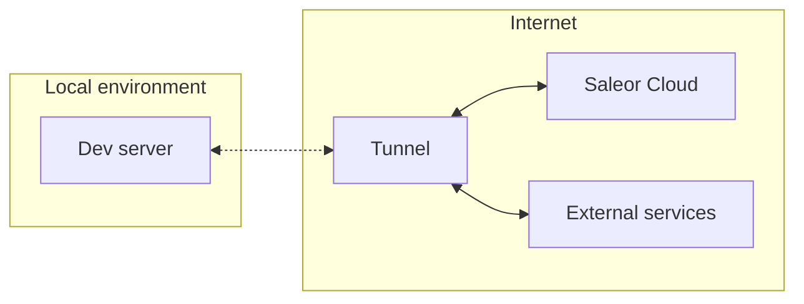

:::note
This article focuses on developing apps connected to Saleor hosted in the cloud. You can also develop them locally, using Saleor Platform, without access to internet. Read more about [developing apps locally](developer/extending/apps/local-app-development.mdx)
:::

## What is a tunnel, and why do you need one?

The Saleor extendability model relies on the concept of Apps. If you want to read more about them, head to [the Apps Overview page](developer/extending/apps/overview.mdx).

As you want Apps to react to events in your store, you reach for webhooks. However, webhooks pose a unique challenge: they can only communicate with public clients. If so, how are you supposed to develop your app on `localhost`?

This is where tunnels come into play. **A tunnel allows you to create a proxy that exposes a local environment to a public URL.**

---

Let's say you are building a [Next.js](https://nextjs.org/) application that leverages a webhook. You boot it up with the `next dev` command, which renders it on `http://localhost:3000`. Since this address is only reachable from your machine and is not HTTPS compliant, the webhook cannot reach the app. We have a perfect use case for a tunnel on our hands.

A simplified process of using a tunnel to expose this app would look like this:

1. Start the dev server of your application.
2. You authenticate yourself in the tunneling service of your choosing (e.g.: `ngrok`).
3. You provide the tunnel with the port number `3000` (where your app is running).
4. The tunnel will provide a publicly available URL of your application.
5. Now you can install your application in Saleor Cloud and receive webhooks 🎉.

## Example tunnels

Saleor will work with any tunneling solution and follow a similar set-up process.

Here are a few funnels we suggest:

- [ngrok](https://ngrok.com/)
- [localtunnel](https://localtunnel.github.io/www/)
- [VS Code tunnels](https://code.visualstudio.com/docs/remote/tunnels)

## Installing the App in the Dashboard

If your app is already exposed to the internet via a tunnel, here is how you can install it in the Saleor Dashboard:

1. Copy the app URL.
2. Go to Dashboard → Apps.
3. Click _Install external app_ in the top right corner.
4. Paste the app URL with "/api/manifest" suffix.
5. Follow the dashboard installation process.