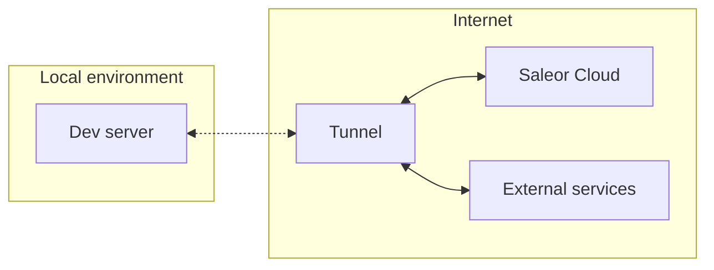

## What is a tunnel?

The Saleor extendability model relies on the concept of Apps. If you want to read more about them, head to [the Apps page](developer/key-concepts.mdx).

As you want Apps to react to events in your store, you reach for webhooks. However, webhooks pose a unique challenge: they can only communicate with HTTPS clients. It is a reasonable requirement for a deployed application, but what about the development environment?

This is where tunnels come into play. **A tunnel allows you to create a proxy that exposes a local environment to a public URL.**



---

Let's say you are building a [Next.js](https://nextjs.org/) application that leverages a webhook. You boot it up with the `next dev` command, which renders it on `http://localhost:3000`. Since this address is not HTTPS-compliant, the app cannot access the webhook response. We have a perfect use case for a tunnel on our hands.

A simplified process of using a tunnel to expose this app would look like this:

1. You authenticate yourself in the tunneling service of your choosing (e.g.: `ngrok`).
2. You provide the tunnel with the port number `3000` (where your app is running).
3. You access the URL returned from the tunnel.
4. You successfully access the response from the webhook 🎉.

## Available tunnels

### Saleor App Tunnel

:::caution
We are keen on making Saleor App Tunnel flawless. Yet, issues with its stability may occur now and then. If that's the case, please look at [the alternatives](#alternatives).
:::

To use Saleor App Tunnel, you must install [Saleor CLI](https://www.npmjs.com/package/@saleor/cli).

:::note
Run `saleor app tunnel -h` to check detailed usage.
:::

To create a tunnel, run `saleor app tunnel`. After several seconds, the CLI should print a URL with the`.saleor.live` domain:

```bash
$ saleor app tunnel

✔ Organization · YourShop
✔ Select Environment · staging
✔ Environment · staging
─────────────────────────────────────────────────────────────────

     Saleor App Name: Your app
     Saleor App URL: https://your-app-shop.saleor.live

     Saleor Dashboard: https://yourshop.eu.saleor.cloud/dashboard/
     GraphQL Playground: https://yourshop.eu.saleor.cloud/graphql/

─────────────────────────────────────────────────────────────────
✔ Installing...

Tunnel is listening to your local machine on port: 3000

Press CTRL-C to stop the tunnel
Use it to install the app in the Dashboard

```

#### Installing the App in the Dashboard

An extra feature of the Saleor App Template is the ability to install Apps inside the Dashboard. This way, you can develop the App while displaying it inside your Saleor Dashboard.

To do it, please run the following:

```
saleor app tunnel --force-install
```

#### Troubleshooting

If you experience any issues with the Saleor App Tunnel, please file an issue [here](https://github.com/saleor/saleor-cli/issues/new?assignees=&labels=bug,tunnel&template=cli-bug-report.md&title=).

### Alternatives

While we encourage you to use Saleor App Tunnel, Saleor will work with any tunneling solution. They will all follow a set-up process similar to the Saleor App Tunnel.

The list of verified Saleor App Tunnel alternatives features:

- [ngrok](https://ngrok.com/)
