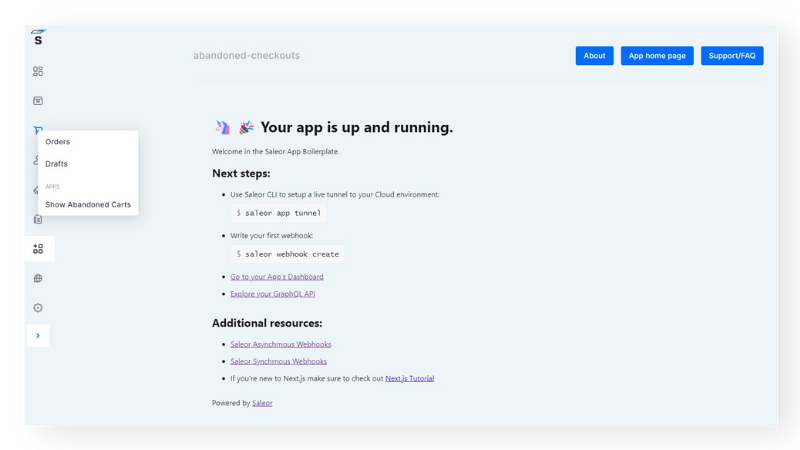

## Summing up

Before we continue, let's sum up what should we have up until this point:

- a Saleor account assigned to an organization
- a Saleor Dashboard for a project we want to extend with an app
- Saleor CLI installed

:::tip
If at any point you feel you've got lost, feel free to peek into the corresponding [repository 🖥️](https://github.com/saleor/saleor-app-abandoned-checkouts).
:::

All good? Let's start building then 🚀!

## Step 1. Spawning the App Template

Saleor CLI provides developers with the possibility to use a ready-made example app. In this guide, we will utilize CLI to spawn such a template.

In your terminal, `cd` to the path where you want to install the template and type in:

```shell
saleor app create abandoned-checkouts
```

:::note
Under the hood, the `saleor app create` command uses the Saleor App Template repository. If you want to read up on it, go [here](developer/extending/apps/developing-apps/app-template.mdx).
:::

This command will install a Next.js app called `abandoned-checkouts` equipped with many tools that'll come in handy during the process of integration.

After the successful installation, you have to `cd` into the `abandoned-checkouts` directory, and boot up the project using [pnpm](https://pnpm.io/). The command is:

```shell
pnpm dev
```

## Step 2. Updating the App Manifest

[The App Manifest](developer/extending/apps/manifest.mdx) serves as the source of information about the Saleor app. It includes the app name, description, URL, as well as configuration for webhooks and extensions. The information is then consumed by other Saleor parties, such as the API and the Dashboard.

:::note
Don't worry, you don't need to fill the manifest yourself. If you use the CLI, a basic manifest is generated.
:::

Some apps don't require a UI. They can simply communicate through webhooks without displaying an interface.

However, the purpose of our application is to render a list of abandoned checkouts. This gives us a perfect chance to leverage one of many cool features baked-in in the app template the CLI has spawned for us: mounting an app in the Saleor Dashboard.

---

Even though apps are separate codebases, they can be embedded inside the Saleor Dashboard. To accomplish it, please:

1. Open your code editor, go to the `pages/api/manifest.ts` file in your app and locate the `manifest` object.
2. As our app will operate on checkouts, we must grant it the permissions required to fetch them. Find the `permissions` field and add `MANAGE_CHECKOUTS` to it:

```jsx
...
permissions: ["MANAGE_CHECKOUTS"],
...
```

The `permissions` field determines the scope of operations **the app** is authorized to perform. You can find the full list of permissions [here](developer/permissions.mdx#app-permissions).

3.  Next, we want to declare the place in our Dashboard where the app should mount. To do so, please find the `extensions` field. Then, add a new extension to it as follows:

```jsx
...
extensions: [
	{
		label: "Show Abandoned Checkouts",
		mount: "NAVIGATION_ORDERS",
		target: "APP_PAGE",
		permissions: ["MANAGE_CHECKOUTS"],
		url: "/",
	},
],
...
```

Let's break down what we have here:

- The `extensions` comes from [the "extendability" of the Dashboard](developer/extending/apps/extending-dashboard-with-apps.mdx#key-concepts).
- There can be many "extensions" for each app. That is why the value of `extensions` is an array.
- The array contains an object with five fields:
  - `label`: A name of our extension. It will display in the Dashboard menu.
  - `mount`: An identifier of [the place where we can mount our apps](developer/extending/apps/extending-dashboard-with-apps.mdx#possible-mounting-places).
  - `target`: It describes the method of presenting the interface. The other option is `POPUP`.
  - `permissions`: It allows blocking access from the extension based on **user** permissions. If the users don't have the right permissions, they won't be able to display the extension.
  - `url`: The path in the application the extension should render. As we will build our UI in the `pages/index.tsx` file, the path is "/".

## Step 3. Installing the app in the Dashboard

:::tip
In the next couple of paragraphs, you will see the term "tunneling" being thrown quite frequently. If it all sounds a bit foreign, please head on [here](developer/extending/apps/developing-with-tunnels.mdx).
:::

### Option 1: Using `saleor app tunnel`

Right now, you develop your app locally. To embed it in your Dashboard hosted on Saleor Cloud, you need to make your environment public. Luckily, the CLI has your back on this one.

While running the app in the background, please execute:

```
saleor app tunnel 3000
```

The CLI wizard will ask you about the organization and environment. Those details are needed to install your app in the correct Saleor instance.

:::important
`3000` is the assumed port on which your application is running. If you decided to run it on a different port, please adjust the command.
:::

The result of running this command is twofold:

- It exposes your local environment through tunneling software. That makes it available publicly.
- It installs your app in the Dashboard which makes it display under the location we pointed out in the previous point.

### Option 2: Using a third-party tunneling software and `saleor app install`

Alternatively, you can make your app live using a third-party tool. To set the tunnel manually, you can use [localtunnel](https://theboroer.github.io/localtunnel-www/) or [ngrok](https://ngrok.com/). Follow the installation guides linked.

Then, go to your terminal and:

1. While in the app's root folder, type in `saleor app install`.
2. Provide the `name` for the app: `abandoned-checkouts`.
3. Provide the `url` to the app's manifest, following the format: _[yourdomain-set-with-tunneling-app]/api/manifest_.

---

Either way, you can now go to your Saleor Dashboard and inspect your app in the _Apps_ tab, as well as the _Orders_ tab.


