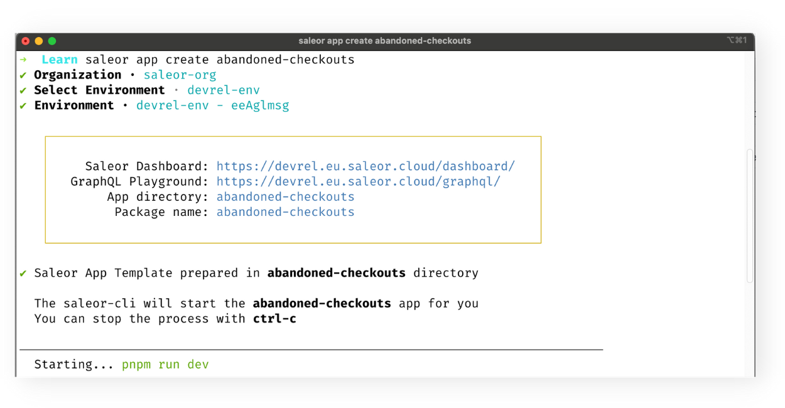

MINIMUM SALEOR VERSION
3.5.10<br/>
MINIMUM SALEOR CLI VERSION
1.13

## Overview

Saleor platform gives developers a powerful way to extend its capabilities by building `Apps`, which can then be integrated with the Saleor store. By developing Apps you can add new features to the store, create a better user experience or pull Saleor store data in response to webhook notifications or user input. To read more about Apps architecture and integration with Saleor, [read the Saleor docs](https://docs.saleor.io/docs/3.x/developer/extending/apps/key-concepts).

## What will I learn?

After finishing this guide, you'll have accomplished the following:

1. Generated a template for your first Saleor App.
2. Prepared your local development environment for App installation.
3. Installed your App in the Admin Dashboard.

## Prerequisites

Before you create your first App using CLI, you need to make sure to:

1. Install Saleor CLI.
2. Register an account in Saleor Cloud and be logged in.
3. Create an organisation, a project and an environment.

You may find the instructions for every of these steps in the [Getting Started with Saleor CLI guide](/cli/getting-started).

## What will I build?

You will create your first Saleor App. Also, you will embed this app to your Admin Dashboard in the Saleor Cloud and be able to see its view on a dedicated app page. Since you haven't built any Saleor apps yet, it is a good idea to start with a template.

## Step 1. Installing the App template locally

Saleor CLI provides developers with the possibility to use a ready-made example App. In this guide we will utilize CLI to create such a template.

In your Terminal, `cd` to the path where you want to install the template and type in:

`saleor app create abandoned-checkouts`

This command will install a Next.js app called "abandoned-checkouts" equipped with many tools that'll come in handy during the process of integration. After the successful completion of the installation process, the CLI will automatically start the development server.



## Step 2. Updating the App manifest.

App manifest informs Saleor API about the details of your app such as name, url, permissions and the mounting place in the Dashboard. You can read more about the manifest in [the docs](https://docs.saleor.io/docs/3.x/developer/extending/apps/manifest).

1. Go to `pages/api/manifest` folder in your app template and locate the `manifest` object.
2. Add the `appUrl:` field with `${baseURL}` value.
3. Add the `extensions` field under `webhooks`.

```jsx
...
extensions: [
	{
		label: "Show Abandoned Carts",
		mount: "NAVIGATION_ORDERS",
		target: "APP_PAGE",
		permissions: ["MANAGE_PRODUCTS"],
		url: "/",
	},
],
...
```

Here, we're giving the extension a label under which it is going to be visible in the navbar in the Admin Dashboard, the mounting place for the App (which is the Orders tab in the navbar) and permissions for the App. We want the App's view to be the index page.

## Step 3. Installing the App template in the Dashboard

### Using `saleor app tunnel`

In order to integrate your App with Saleor Cloud it needs to have a public endpoint. It is possible to create it using `saleor app tunnel` CLI command. Go to your Terminal, and run this command from the root folder of your app.

The `saleor app tunnel` command will also install the app in the Dashboard, so after running it successfully you will complete the integration process.

### Using a third-party tunnelling software and `saleor app install`

Alternatively, you can set the App template live using a third-party tool. We're going to use a technique called _tunneling_, . In order to set the tunnel manually, you can use [localtunnel](https://theboroer.github.io/localtunnel-www/) or [ngrok](https://ngrok.com/). Follow the installation guides linked.

Then, go to your Terminal and:

1. Being in the App's root folder, type in `saleor app install`.
2. Provide the `name` for the app: `abandoned-checkouts`.
3. Provide the `url` to the app's manifest: _[yourdomain-set-with-tunneling-app]/api/manifest_

You can now go to your Admin Dashboard and inspect the new App in the "Apps" tab and inside the "Orders" tab.


