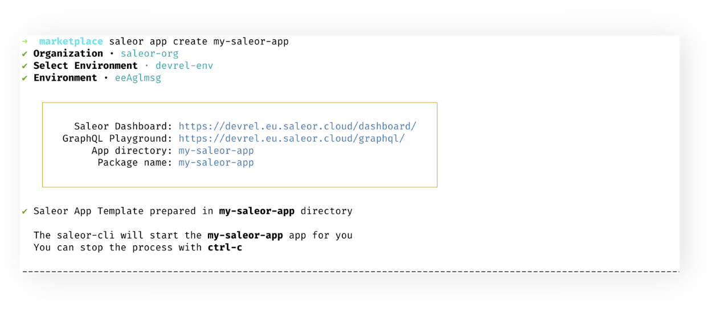
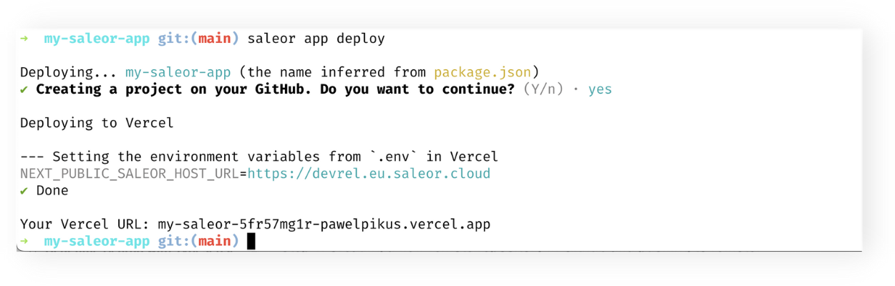
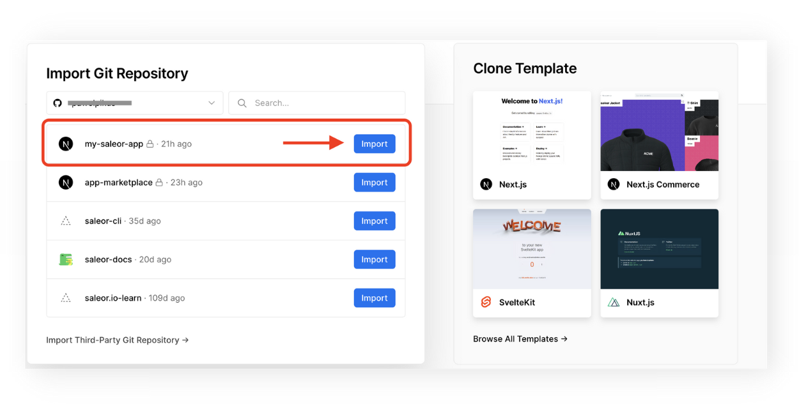
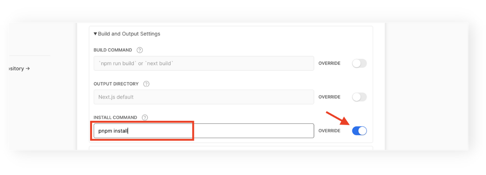
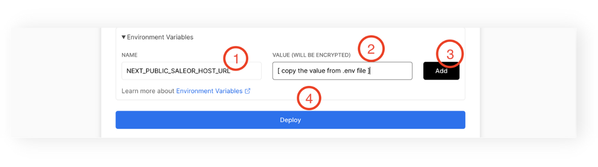
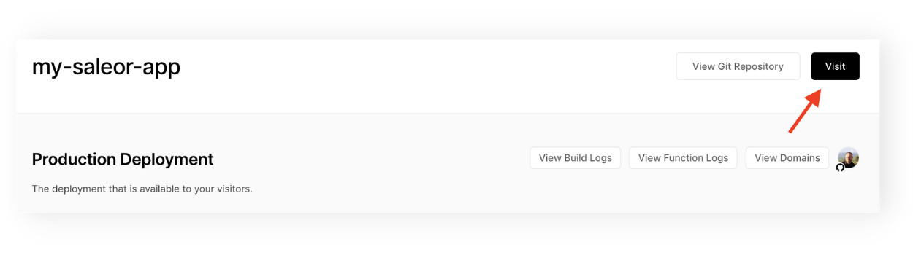

MINIMUM SALEOR VERSION
3.5.10<br/>
MINIMUM SALEOR CLI VERSION
1.13

Vercel is a robust platform that enables hosting of static sites and frontend frameworks. It is built to integrate with a headless content, commerce, or database. It provides a smooth integration with Next.js so, in this guide we are going to set up the Saleor App template to be hosted on this platform.

## Prerequisites

1. Install `saleor CLI` with `npm i -g saleor`.
2. Make sure you have [established your organisation and environment](/cli/getting-started/) in the Saleor Cloud.
3. Log in to Vercel and Github. In your Terminal, run:

   ```
   saleor vercel login
   ```

   ```
   saleor github login
   ```

   If this is the first time you integrate with these platforms, you will be redirected to a dedicated page where you can finish the integration process.

## Step 1. Creating a template App.

1. In your Terminal, go to a directory in your computer you'd like to install the App in and type: `saleor app create my-saleor-app`.
2. Select your organisation and environment.

After a few moments, you'll have your app named `my-saleor-app` created locally, and your developer environment set up. Also, the CLI will automatically run the development server. You may stop the server with `CTRL+C`.



## Step 2. Deploying to Vercel.

1. In your Terminal, type `cd my-saleor-app` to go to the root of your app's project.
2. If you haven't already, integrate with Github and Vercel using Saleor CLI. See [Prerequisites](#prerequisites).
3. Type in: `saleor app deploy`.
4. In the initialization wizard, agree on creating a project on Github.

The CLI will create a repository with the app on your Github account. Then, it will create a project in Vercel and deploy the app there. Lastly, it will take the `NEXT_PUBLIC_SALEOR_HOST_URL=` variable from `.env` file in your app and set it in the environmental variables in Vercel.



The URL to your Saleor App deployed to Vercel is displayed in CLI in the summary message.

### Manual deployment.

If you desire to go through all the actions that `saleor app deploy` command perform, you may follow the steps below. It will give you a deeper understanding of the process of deployment and will show you the extend to which Saleor CLI makes your life easier.

#### Step 1. Creating a new remote repository in Github and pushing to remote.

1. In Github.com create a new repository called `my-saleor-app`. Copy the URL of the repository.
2. In your Terminal, go to the root of your project and paste the instructions below to push an existing local repository to remote. Remember to insert the correct URL to your remote!

```
git add .
git commit -m"First commit."
git remote add origin <url-to-your-remote-repo>
git branch -M main
git push -u origin main
```

#### Step 2. Creating a project in Vercel.

1. In Vercel, click New Project.
2. Choose to Import a Github repository with the name of your App.



3. At the configuration page, override the install command to `pnpm install`.



#### Step 3. Set the environment variable.

1. In your code editor, navigate to `.env` file and copy the `NEXT_PUBLIC_SALEOR_HOST_URL` variable.
2. Go back to Vercel and add the environment variable `NEXT_PUBLIC_SALEOR_HOST_URL` and its value taken from your app project.
3. Hit Deploy button.



After a while, your App should be deployed, and you can go to dashboard and click `Visit` to see it live.


