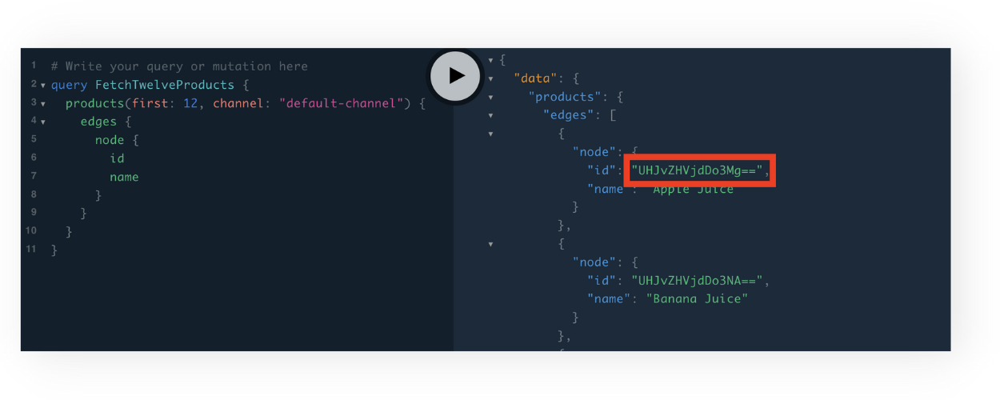
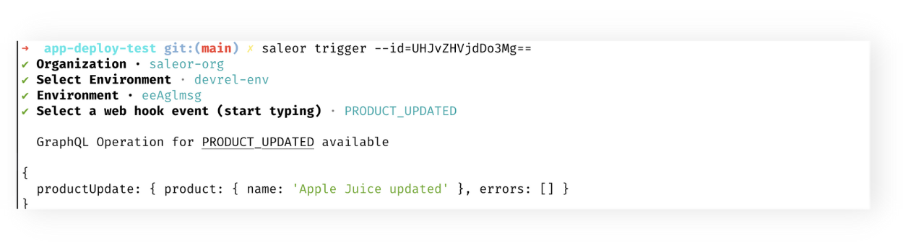
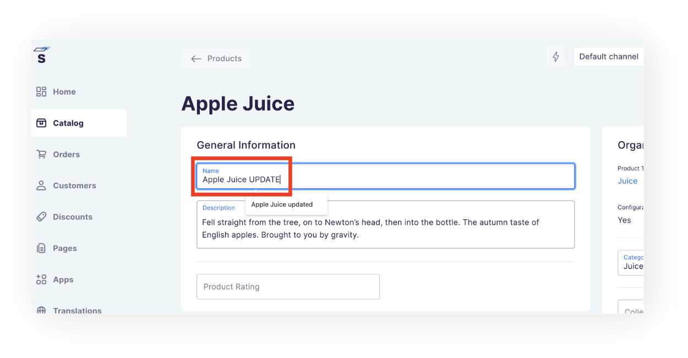

MINIMUM SALEOR VERSION
3.5.10<br/>
MINIMUM SALEOR CLI VERSION
1.13

After you have installed your first App and learned how to develop its new features, it is time to extend its capabilities. Saleor platform allows developers to use webhooks, which can be set to notify the App about certain events i.e. creating a new order, updating a category, sending an invoice, and many more. The architectural details of webhooks and the complete list of webhook events are available in the [docs](https://docs.saleor.io/docs/3.x/developer/extending/apps/asynchronous-webhooks).

## What will I learn?

After finishing this guide, you'll have accomplished the following:

1. Generated a webhook handler using CLI.
2. Created a webhook for the installed App.
3. Tested and verified the webhook endpoint of type HTTPS.

## What will I build?

You will extend the Saleor template App with a webhook that will send notifications over the HTTPS every time a product is updated.

## Prerequisites

1. You know the concept of webhooks.
2. You're familiar with [how webhooks work with Saleor API](https://docs.saleor.io/docs/3.x/developer/extending/apps/asynchronous-webhooks).
3. You have authenticated with the Saleor Cloud. You can use `saleor login` in the Terminal to accomplish that.
4. You have [created and installed an App](/cli/creating-apps/) for testing webhook integration.

## Step 1. Creating a webhook handler.

In this step, you're going to generate a boilerplate code to handle incoming webhook notifications in your App. The data is going to be displayed in the console.

1. In your Terminal type in: `saleor app generate webhook`.
2. Using arrow keys navigate to `PRODUCT_UPDATED` event and press Enter.

You can now inspect the newly created handler in `api/webhooks/product-updated.ts` file. As you can see, the handler's job is simply to log out the request body in the console.

## Step 2. Creating a webhook in Saleor.

Let's hook up our handler to the webhook instance created in Saleor.

1. In the Terminal type in: `saleor webhook create`.
2. Provide a name for the webhook, i.e. "product-updated".
3. From the web browser copy the URL of your App's live instance and add the path to your webhook handler:

`https://[app-in-your-environment.saleor.live]/api/webhooks/product-updated`

4. Paste the link to the Target URL prompt.
5. Optionally, provide a Secret to secure the operation.
6. Using arrow keys navigate to `PRODUCT_UPDATED` event and press Space to select it.
7. Press Enter to confirm selections.
8. Skip the synchronous event's selection by pressing Enter.
9. Confirm webhook activation by pressing Enter.
10. Optionally, provide a `string` with the subscription query.

After a successful install, you will be provided with the webhook `id` and are ready to test and verify its functionality.

## Step 3. Testing the webhook.

For your webhook to send a notification to the handler, you need to trigger an action of updating a product. Let's quickly initiate an event in Saleor with the help of the Saleor CLI.

### Using `saleor trigger` command.

1. In the web browser, go to the GraphQL Playground for your environment and use the query below to fetch some information about products.

```graphql
query FetchTwelveProducts {
  products(first: 12, channel: "default-channel") {
    edges {
      node {
        id
        name
        thumbnail {
          url
        }
        category {
          name
        }
      }
    }
  }
}
```

2. From the results on the right copy the `id` of the first product.



3. In your Terminal, type in: `saleor trigger --id=` and paste the `id` you have just copied, without the quote marks, e.g.
   `saleor trigger --id=UHJvZHVjdDo3Mg==` and hit Enter.



### Using Saleor Dashboard.

You can also use your Saleor Dashboard to trigger the event.

1. Go to your Saleor Dashboard and click the Catalog / Products tab.
2. On the list of products, click Apple Juice.
3. Update the name of the product.



Go to your code editor and check up on the local server console. You should be provided with a payload object describing your newly triggered action:

```ts
[
  {
    "type": "Product",
    "id": "UHJvZHVjdDo3Mg==",
    "category": {
      "type": "Category",
      "id": "Q2F0ZWdvcnk6MTQ=",
      "name": "Juices",
      "slug": "juices"
    },
    "collections": null,
    "meta": {
      "issued_at": "2022-07-21T06:31:47.479000+00:00",
      "version": "3.5.1",
      "issuing_principal": {
        "id": "VXNlcjoyMg==",
        "type": "user"
      }
    },
    "attributes": [
      {
        "name": "Flavor",
        "input_type": "dropdown",
        "slug": "flavor",
        "entity_type": null,
        "unit": null,
        "id": "QXR0cmlidXRlOjE2",
        "values": [
          {
...
```
