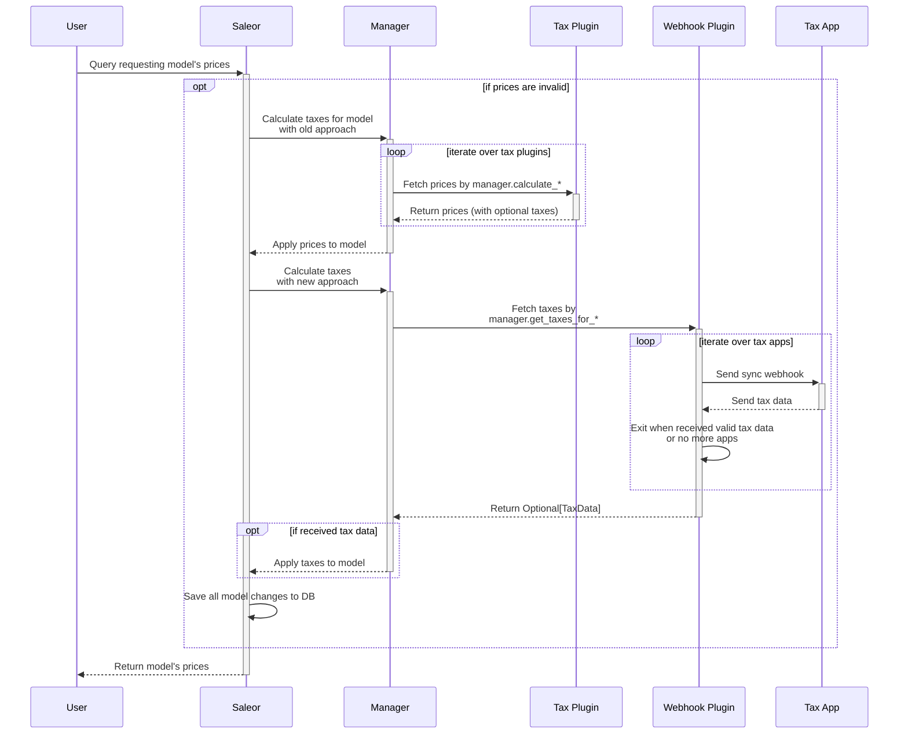

:::note
Subscription Webhook Payloads are available in Saleor 3.6.
:::

:::caution
This feature is currently in **Feature Preview**. This part of Saleor is not complete
and subject to change but is available to experiment and provide feedback.
:::

# Introduction

Tax webhooks are synchronous webhooks that allow delegating tax calculations to Saleor Apps. Synchronous means that these webhooks expect a response of a particular shape to be returned from the app to continue processing in Saleor. Tax webhooks only support HTTP(S) protocol; they are sent as POST requests with `application/json` body and expect a response of the same content type.

## Key concepts

`HANDLE_TAXES` permission is required for app to be able to calculate taxes.
When there are more than one app subscribed to `CHECKOUT_CALCULATE_TAXES` or `ORDER_CALCULATE_TAXES` we iterate over them until we get a proper response
Prices on checkout and order are denormalized.

- Order prices
  Prices for order never expired, but could be invalidated only in `draft order` or `unconfirmed order`. Prices are invalidated automatically for any address, user, line and shipping change in order.
- Checkout prices
  Prices for checkout could expired. Expiration time is set automatically when new taxes are fetched(regardless of source tax). Expiration time could be set in setting by `CHECKOUT_PRICES_TTL` variable. Prices for checkout also could be invalidated by any change in checkout. This process is also automatically for any address, user, line and shipping change in checkout.

## General tax flow



## Available payment events are:

| Name                       | Description                   |
| -------------------------- | ----------------------------- |
| `CHECKOUT_CALCULATE_TAXES` | Calculates taxes for checkout |
| `ORDER_CALCULATE_TAXES`    | Calculates taxes for order    |

# Checkout taxes

Saleor Apps can subscribe to the `CHECKOUT_CALCULATE_TAXES` synchronous webhook. It is called whenever any user fetch checkout prices which are expired or not calculated yet. Response is processed and saved on checkout and checkout lines. Prices could expired or be invalidated by any change in checkout. Any tax app is treated as source of true about pricing.

:::note
For amount fields, we use the same format as in the rest of the API.
For example amount of 12,34 USD will be sent as `"total_amount": "12.34"`
:::

:::warning

- All sales are included in line prices.
- Shipping vouchers are included in shipping prices.
- Vouchers for "Specific products" are included in line prices.
- Vouchers "Apply only to a single cheapest eligible product" are included in line prices.
  :::

## Request format

```json
[
  {
    "type": "Checkout",
    "id": "Q2hlY2tvdXQ6OTJhNDI4ODgtNDJkYi00NjJjLWE3YmMtNDBjM2YzMjJkYzRl",
    "included_taxes_in_prices": true,
    "shipping_name": "FedEx",
    "shipping_amount": "59.17",
    "currency": "USD"
    "metadata": {},
    "user_id": "VXNlcjox",
    "user_public_metadata": {},
    "address": {
      "type": "Address",
      "id": "QWRkcmVzczoxMTc=",
      "first_name": "Test",
      "last_name": "TESTTEST",
      "company_name": "",
      "street_address_1": "4836  Melville Street",
      "street_address_2": "",
      "city": "JACKSON",
      "city_area": "",
      "postal_code": "38301",
      "country": "US",
      "country_area": "TN",
      "phone": "+48123456789"
    },
    "channel": {
      "type": "Channel",
      "id": "Q2hhbm5lbDox",
      "slug": "default-channel",
      "currency_code": "USD"
    },
    "discounts": [
      {
        "name": "New user promo",
        "amount": "10.00"
      }
    ],
    "lines": [
      {
        "id": "Q2hlY2tvdXRMaW5lOjdmMmQwMDZkLWM1YmEtNDE4MS1hMTlkLTVmYzczMTMxNmYyMg==",
        "charge_taxes": true,
        "sku": "202165300",
        "variant_id": "UHJvZHVjdFZhcmlhbnQ6Mzg0",
        "full_name": "Apple Juice (202165300)",
        "product_name": "Apple Juice",
        "variant_name": "202165300",
        "product_metadata": {},
        "product_type_metadata": {},
        "unit_amount": "1.99",
        "quantity": 10,
        "total_amount": "19.90"
      },
      {
        "id": "Q2hlY2tvdXRMaW5lOmYxYzNhYjc2LTk0ZTItNDQ4NC05MzIxLWI0NDZiYWYzZjBiZQ==",
        "charge_taxes": true,
        "sku": "12487157",
        "variant_id": "UHJvZHVjdFZhcmlhbnQ6MzQ2",
        "full_name": "Blue Hoodie (UHJvZHVjdFZhcmlhbnQ6MzQ2)",
        "product_name": "Blue Hoodie",
        "variant_name": "UHJvZHVjdFZhcmlhbnQ6MzQ2",
        "product_metadata": {},
        "product_type_metadata": {},
        "unit_amount": "31.50",
        "quantity": 2,
        "total_amount": "63.00"
      }
    ],
  }
]
```

### Fields:

1. `id` - Id of checkout for which app should calculate taxes.
2. `included_taxes_in_prices` - Flag that shows whether taxes should be included in prices.
3. `shipping_name` - Name of shipping method assigned to checkout.
4. `shipping_amount` - Price of shipping method assigned to checkout.
5. `currency` - Checkout currency.
6. `metadata` - Public metadata of checkout.
7. `user_id` - Id of the user assigned do checkout. (In case of anonymous customer this field return `null`)
8. `user_public_metadata` - Public metadata of user assigned to checkout.
9. `address` - Shipping address assigned to checkout. (In case of checkout without required shipping this field contains the billing address.)
10. `channel` - Data of channel to which checkout is assigned.
11. `discounts` - List of discounts assigned to checkout. (Those discounts should be applied by tax app.)
    1. `name` - Name of discount.
    2. `amount` - Amount of assigned discount.
12. `lines` - List of items inside checkout.
    1. `id` - Id of line
    2. `charge_taxes` - Flag that shows whether taxes should be calculated for the line.
    3. `sku` - SKU of product from the line.
    4. `variant_id` - Id of variant from the line.
    5. `full_name` - Full name of item from the line.
    6. `product_name` - Name of product from the line.
    7. `variant_name` - Name of variant from the line.
    8. `product_metadata` - Public metadata assigned to product from the line.
    9. `product_type_metadata` - Public metadata assigned for product type form the line.
    10. `unit_amount` - Price of the single item in the line.
    11. `quantity` - Quantity of item in the line.
    12. `total_amount` - Total price of the line.

## Response format

```json
{
 "shipping_tax_rate": "10"
 "shipping_price_gross_amount": 59.17,
 "shipping_price_net_amount": 53.79,
  "lines": [
    {
      "tax_rate": "10",
      "total_gross_amount": 17.49,
      "total_net_amount": 15.91
    },
    {
      "tax_rate": "10",
      "total_gross_amount": 55.40,
      "total_net_amount": 50.36
    }
  ],
}
```

### Fields:

1. `shipping_tax_rate` - Tax rate of shipping.
2. `shipping_price_gross_amount` - The gross price of shipping.

3. `shipping_price_net_amount` - Net price of shipping.
4. `lines` - List of lines tax assigned do checkout. Lines should be returned in the same order in which they were sent to the app.
   1. `tax_rate` - Tax rate of line.
   2. `total_gross_amount` - Gross price of line.
   3. `total_net_amount` - Net price of line.

# Order taxes

Saleor Apps can subscribe to the `ORDER_CALCULATE_TAXES` synchronous webhook. It is called whenever any user fetch order prices which are expired or not calculated yet. Response form app is processed ans saved on order and order liens. Prices could expired or be invalidated by any change in order. Any tax app is treated as source of true about pricing.

:::note
For amount fields, we use the same format as in the rest of the API.
For example amount of 12,34 USD will be sent as `"total_amount": "12.34"`
:::

:::warning

- All sales are included in line prices.
- Shipping vouchers are included in shipping prices.
- Vouchers for "Specific products" are included in line prices.
- Vouchers "Apply only to a single cheapest eligible product" are included in line prices.
  :::

## Request format

```json
[
  {
    "type": "Order",
    "id": "T3JkZXI6ZTdlODYzMDctMDdhYi00ODNjLTk0YmUtM2FiNzlkYTA2ZGRm",
    "included_taxes_in_prices": true,
    "shipping_name": "FedEx",
    "shipping_amount": "59.17",
    "currency": "USD"
    "metadata": {},
    "user_id": "VXNlcjo3OTU=",
    "user_public_metadata": {},
    "address": {
      "type": "Address",
      "id": "QWRkcmVzczoyMDM=",
      "first_name": "Brandon",
      "last_name": "Ruiz",
      "company_name": "",
      "street_address_1": "09925 Isabel Run",
      "street_address_2": "",
      "city": "JAMESFORT",
      "city_area": "",
      "postal_code": "72850",
      "country": "US",
      "country_area": "AR",
      "phone": ""
    },
    "channel": {
      "type": "Channel",
      "id": "Q2hhbm5lbDox",
      "slug": "default-channel",
      "currency_code": "USD"
    },
    "discounts": [
      {
        "name": "New user discount",
        "amount": "10.00"
      }
    ],
    "lines": [
      {
        "type": "OrderLine",
        "id": "T3JkZXJMaW5lOmE5MTc2NjhmLWNmYjUtNDM4Yi05MTFlLWNhNGVlZTgyYzQ5Mw==",
        "variant_id": "UHJvZHVjdFZhcmlhbnQ6Mzg0",
        "full_name": "Apple Juice (202165300)",
        "product_metadata": {},
        "product_type_metadata": {},
        "charge_taxes": true,
        "sku": "202165300",
        "unit_amount": "1.99",
        "total_amount": "1.99",
        "product_name": "Apple Juice",
        "variant_name": "202165300",
        "quantity": 1
      }
    ],
  }
]
```

### Fields:

1. `id` - Id of order for which app should calculate taxes.
2. `included_taxes_in_prices` - Flag that shows whether taxes should be included in prices.
3. `shipping_name` - Name of shipping method assigned to order.
4. `shipping_amount` - Price of shipping method assigned to order.
5. `currency` - Order currency.
6. `metadata` - Public metadata of order.
7. `user_id` - Id of the user assigned to order. (In case of anonymous customer this field return `null`)
8. `user_public_metadata` - Public metadata of user assigned to order.
9. `address` - Shipping address assigned to order. (In case of order without required shipping this field contains billing address.)
10. `channel` - Data of channel to which order is assigned.
11. `discounts` - List of discounts assigned to order. (Those discounts should be applied by tax app.)
    1. `name` - Name of discount.
    2. `amount` - Amount of assigned discount.
12. `lines` - List of items inside order.
    1. `id` - Id of the line
    2. `charge_taxes` - Flag that shows whether taxes should be calculated for the line.
    3. `sku` - SKU of product from the line.
    4. `variant_id` - Id of variant from the line.
    5. `full_name` - Full name of item from the line.
    6. `product_name` - Name of product from the line.
    7. `variant_name` - Name of variant from the line.
    8. `product_metadata` - Public metadata assigned to product from the line.
    9. `product_type_metadata` - Public metadata assigned for product type form the line.
    10. `unit_amount` - Price of the single item in the line.
    11. `quantity` - Quantity of item in the line.
    12. `total_amount` - Total price of the line.

## Response format

```json
{
 "shipping_tax_rate": "10"
 "shipping_price_gross_amount": 59.17,
 "shipping_price_net_amount": 53.79,
  "lines": [
    {
      "tax_rate": "10",
      "total_gross_amount": 17.49,
      "total_net_amount": 15.91
    },
    {
      "tax_rate": "10",
      "total_gross_amount": 55.40,
      "total_net_amount": 50.36
    }
  ],
}
```

### Fields:

1. `shipping_tax_rate` - Tax rate of shipping.
2. `shipping_price_gross_amount` - Gross price of shipping.

3. `shipping_price_net_amount` - Net price of shipping.
4. `lines` - List of lines tax assigned do order. Lines should be returned in same order in which they were sent to the app.
   1. `tax_rate` - Tax rate of line.
   2. `total_gross_amount` - Gross price of line.
   3. `total_net_amount` - Net price of line.
