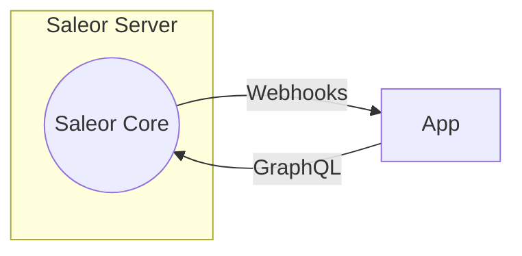
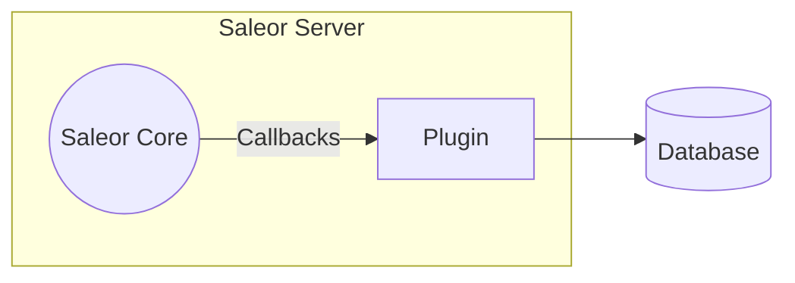

:::warning
Forking Saleor is not recommended for the following reasons:

- Non trivial upgrades due to merge conflicts, incompatible business logic and data migrations.
- Limited or non existing community support.
- Maintenance and security fixes must be applied manually.
- You would have to fork and maintain dashboard which is another large codebase.
  :::

It may seem that the easiest way to customize Saleor is to modify its source code directly. While possible, it leads to all sorts of problems, including the inability to upgrade Saleor easily if a security fix is required. To keep your changes separate from the Core, Saleor offers two mechanisms to aid with customization:

:::note
Start building a new Saleor application in seconds using the Saleor CLI tool. It will help you make the most out of our apps, boilerplate projects, Saleor Cloud environments, and webhooks. Check [the CLI docs.](/cli.mdx)
:::

## Apps (recommended)

Apps are standalone web applications that are given access to the Saleor's API. Apps can be granted permissions and perform most actions that a staff member can perform. Apps can also subscribe to certain events as they happen in Saleor and get notified about them using webhooks.

## Plugins

Plugins offer a way to run your code within the same application process as the Saleor Core. Plugins are notified about events using callbacks and can access the database directly.

:::caution
Because the code is run as part of the same process, there is no way to restrict plugin permissions or audit their actions. Make sure you only run plugins you trust.
:::

:::note
Due to their security implications, plugins are not supported by the Saleor Cloud.
:::
