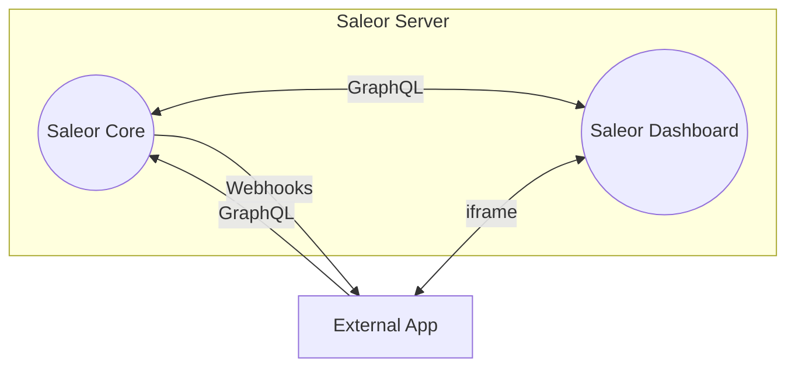
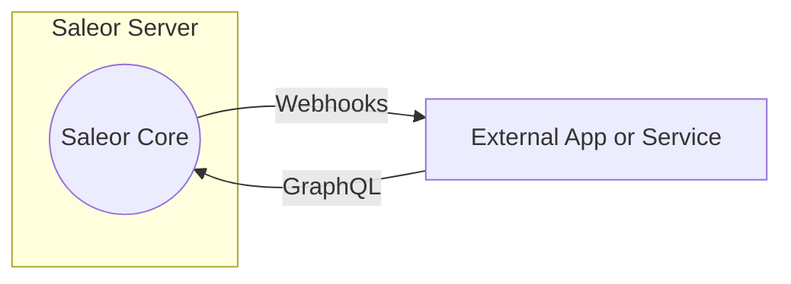

Saleor is extensible in a microservice-based approach. It is possible to add new services to the Saleor ecosystem and communicate with them using the GraphQL API. This approach allows you to add new functionality to Saleor without modifying the core codebase. It also allows you to use any programming language and framework to build your service.

### Why not to fork?

Once you fork a codebase, you technically own the entire platform,
which burdens you with maintenance, security fixes, and all future development.
You might be tempted to alter small bits of logic and hope to be able to merge updates in the future.
But there is a high likelihood that the original codebase
would have significant structural changes requiring a complete rewrite of your modifications.
Having your version of the codebase also means you are on your own when it comes to support.
No community member will have the exact version as you, so troubleshooting assistance and support become challenging.

:::warning
Forking Saleor is not recommended for the following reasons:

- Non-trivial upgrades due to merge conflicts, incompatible business logic and data migrations.
- Limited or non-existing community support.
- Maintenance and security fixes must be applied manually.
- You would have to fork and maintain the Dashboard which is another large codebase.

:::

## Ways of customizing:

### Extending Dashboard

Saleor External Apps allow adding custom logic to the Saleor with the ability to extend Dashboard. External Apps are standalone web applications that are given access to the Saleor's API. After installation, the App is available in the Saleor Dashboard on the Apps page. While opened, the App UI is embedded in the Dashboard using an iframe. This allows the App to be fully integrated with the Dashboard and use the same authentication mechanism. Apart from being available on the Apps page of the Dashboard, External Apps, for ease of use, can be additionally mounted in [several places](developer/extending/apps/extending-dashboard-with-apps.mdx#possible-mounting-places) of the Dashboard.

Apps can be granted permissions and perform most actions that a staff member can perform. Apps can also subscribe to certain events as they happen in Saleor and get notified about them using webhooks.

For example, you can build an App that can extend the Dashboard with a new page that displays a list of abandoned checkouts. The App will fetch data from Saleor about checkouts that for some reason haven't been turned into orders. Such an App can be mounted in the sidebar menu under the Orders section and will be available to all staff members enhancing their knowledge about unfinished orders.

:::note
Start building a new Saleor application in seconds using the Saleor CLI tool. It will help you make the most out of our apps, boilerplate projects, Saleor Cloud environments, and Webhooks. Check the [Developing Apps Quickstart](../extending/apps/quickstart.mdx) or [the CLI docs.](/cli/overview.mdx)
:::

### Admin API calls

Using [app tokens](/api-usage/authentication.mdx#app-authentication) you can have admin permissions
to read and write objects.
Here are some examples of how API keys can be used:

- Create a service that updates stock in Saleor.
- Custom cart service that acts as a proxy to Saleor checkout to set prices based on custom logic.
- Read private metadata of the products that are only accessible to certain users.

### Synchronous Events (API Extensions)

Events that call your service to modify the behavior of certain actions.
For example, creating shipping rates dynamically or custom payment integrations.
Lean more about [Synchronous Events](developer/extending/webhooks/synchronous-events/overview.mdx).

### Webhooks

Saleor can send real-time notifications or data to another application or service through Webhooks. Webhooks provide a way for Saleor to send HTTP POST requests to a specified target URL (endpoint) with a payload (through a subscription query) when a specific event, such as order creation, occurs.

For example, a webhook can be used to notify an external service about a new order. The external service can then use the Saleor API to fetch the order details and process it further.

Webhooks enable communication between different systems by delivering event-based information from one system to another. Use Saleor's webhook functionality to receive notifications and trigger custom actions or integrations in response to specific events.

