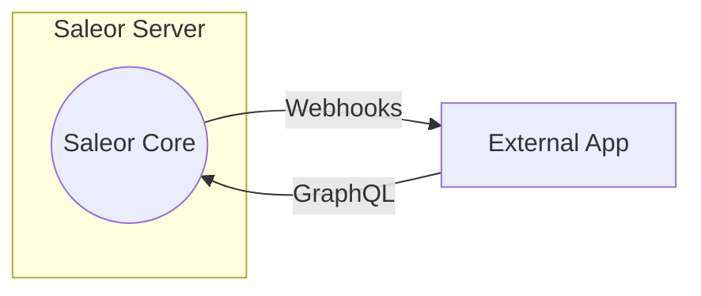
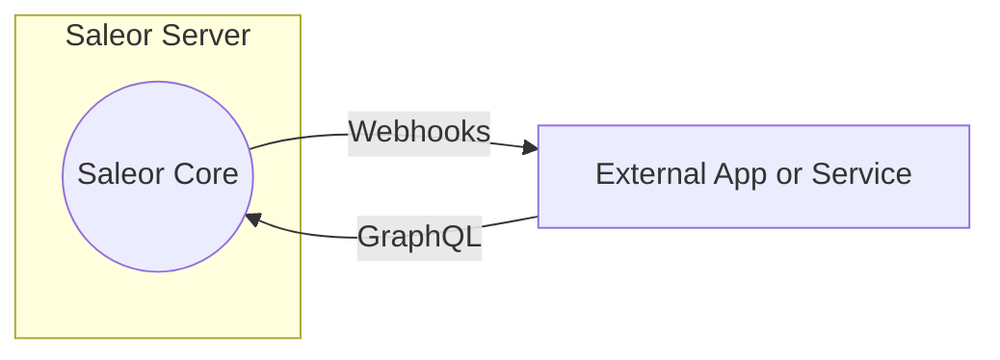
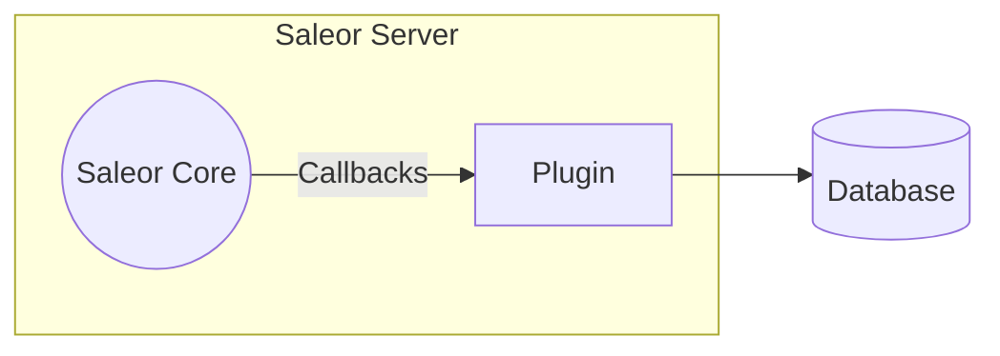

Saleor offers three mechanisms to aid with customization:

## Extending Dashboard

Saleor External Apps allow to add custom logic to the Saleor with the ability to extend Dashboard. External Apps are standalone web applications that are given access to the Saleor's API. Apps can be granted permissions and perform most actions that a staff member can perform. Apps can also subscribe to certain events as they happen in Saleor and get notified about them using webhooks. Apart from being available on the Apps page of the Dashboard, External Apps, for the ease of use, can be additionally mounted in [several places](developer/extending/apps/extending-dashboard-with-apps.mdx#possible-mounting-places) of the Dashboard.

:::note
Start building a new Saleor application in seconds using the Saleor CLI tool. It will help you make the most out of our apps, boilerplate projects, Saleor Cloud environments, and webhooks. Check the [Developing Apps Quickstart](../extending/apps/quickstart.mdx) or [the CLI docs.](/cli.mdx)
:::

## Webhooks

Saleor can send real-time notifications or data to another application or service through Webhooks.

In order to do that you need to create Local App which can be used do define Webhooks.

Saleor Local Apps are custom Webhooks & Token pairs that can be used to connect apps and access Saleor API. Defining webhooks through Saleor Local Apps allows Saleor API to send real-time notifications or data to another application or service. It enables communication between different systems by delivering event-based information from one system to another. Use Saleor's webhook functionality to receive notifications and trigger custom actions or integrations in response to specific events.

## Plugins

Plugins offer a way to run your code within the same application process as the Saleor Core. Plugins are notified about events using callbacks and can access the database directly.

:::caution
Because the code is run as part of the same process, there is no way to restrict plugin permissions or audit their actions. Make sure you only run plugins you trust.
:::

:::note
Due to their security implications, plugins are not supported by the Saleor Cloud.
:::

<!-- :::warning
Forking Saleor is not recommended for the following reasons:

- Non trivial upgrades due to merge conflicts, incompatible business logic and data migrations.
- Limited or non existing community support.
- Maintenance and security fixes must be applied manually.
- You would have to fork and maintain dashboard which is another large codebase.
::: -->
