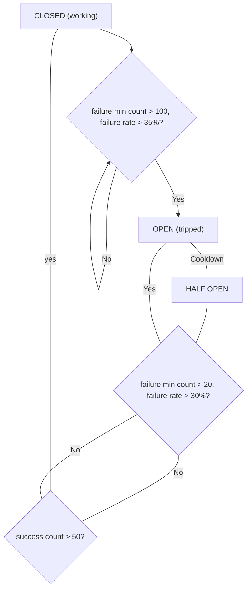

Circuit breakers are a mechanism that temporarily shuts down an app in case of a high number of webhook errors. The feature is off by default.

## Breaker states

### Closed

This is a normal operation state, all webhooks are sent as usual.

### Open

The breaker is open when the number of errors exceeds the threshold. In this state, all webhooks are rejected.

### Half-open

In this state, the breaker allows the requests like in closed state (allowing requests to pass through), however using different thresholds.

:::warning

This is different from common implementation of breakers in which the requests are throttled in half-open state.

:::

## Configuring the feature

To turn the feature on, set the `BREAKER_BOARD_ENABLED` environment variable to `True`.

`BREAKER_BOARD_SYNC_EVENTS` is the setting which allows you to specify the events that should be monitored by the circuit breaker (comma separated).
For example: `"checkout_calculate_taxes, shipping_list_methods_for_checkout"`.

`BREAKER_BOARD_DRY_RUN_SYNC_EVENTS` setting is off by default, if you set it to `True`, the breaker will act as it's on, but only in terms of logging, etc.
However it will **not** block any requests. This is useful for testing the breaker without affecting the webhooks behavior.

## Transitions between states

:::info

Breaker states are being changed automatically as the requests go by. The breaker is monitoring the events and act accordingly.
Note that all of circuit breaker events (both success and failures) have a 5 minutes TTL (time to live) and are stored in Redis.
On each transition, the events are purged, so each state has a fresh start and is not contaminated by older events.

:::

### Closed to Open

The conditions on which breaker enters open state are controlled by two constants:
- `BREAKER_BOARD_FAILURE_MIN_COUNT` - it is set to 100 and is the minimum number of failures that must occur before the breaker can trip.
- `BREAKER_BOARD_FAILURE_THRESHOLD_PERCENTAGE` - it is set to 35 (percent) and is the ratio of failures to total requests that must be exceeded before the breaker trips, assuming `BREAKER_BOARD_FAILURE_MIN_COUNT` is satisfied.
- `BREAKER_BOARD_TTL_SECONDS` - it is set to (last) 5 minutes and is the time window in which the breaker is monitoring the events. Older events are automatically removed.

These constants can be found [here](https://github.com/saleor/saleor/blob/main/saleor/webhook/circuit_breaker/breaker_board.py#L20-L40).

### Open to Half-open

After the breaker enters open state, no webhooks are sent for a certain amount of time. This time is called the cooldown period and it defaults to 2 minutes. Then the breaker automatically transitions to the half-open state.

### Half-open back to Open

The breaker will trip again if the number of errors exceeds the threshold and minimum count. The conditions on which breaker re-enters open state are controlled by another two constants:
- `BREAKER_BOARD_FAILURE_MIN_COUNT_RECOVERY` - simmiliar to `BREAKER_BOARD_FAILURE_MIN_COUNT`, but it defaults to 20 and is the minimum number of failures that must occur before the breaker can trip again.
- `BREAKER_BOARD_FAILURE_THRESHOLD_PERCENTAGE_RECOVERY` - simmiliar to `BREAKER_BOARD_FAILURE_THRESHOLD_PERCENTAGE`, but it defaults to 30 (percent) and is the ratio of failures to total requests that must be exceeded before the breaker trips again.
- `BREAKER_BOARD_TTL_SECONDS` - it is set to (last) 5 minutes and is the time window in which the breaker is monitoring the events. Older events are automatically removed.

These constants can be found [here](https://github.com/saleor/saleor/blob/main/saleor/webhook/circuit_breaker/breaker_board.py#L20-L40).

### Half-open back to Closed

If the number of successful requests is met, the breaker transitions back to the closed state. This is controlled by `BREAKER_BOARD_SUCCESS_COUNT_RECOVERY` constant, which defaults to 50.

## State transition diagram

## Observability

The breaker states can be observed on App type which includes two new fields - [App.breakerState](api-reference/apps/objects/app.mdx#appbreakerstatecircuitbreakerstateenum---) and [App.breakerLastStateChange](api-reference/apps/objects/app.mdx#appbreakerlaststatechangedatetime--).
There is a mutation to manually reset the breaker state - [appReenableSyncWebhooks](api-reference/apps/mutations/app-reenable-sync-webhooks.mdx). It might be usefull if the network infrastructure on webhook end is responding correctly, but the breaker is still in open state and it's desired to resume the webhooks quickly.