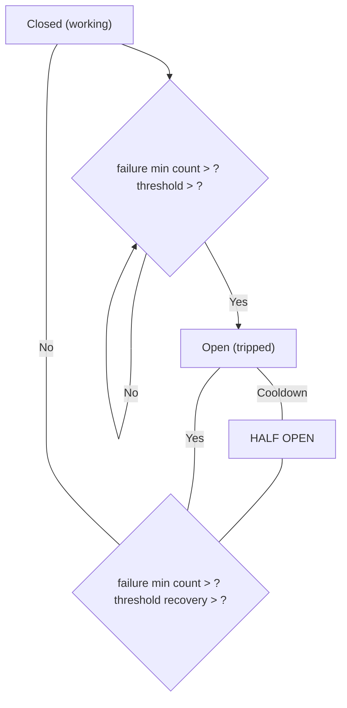

Circuit breakers are a mechanism that temporarily shuts down an app in case of a high number of webhook errors. The feature is off by default.

## Breaker states

### Closed

This is a normal operation state, all webhooks are sent as usual.

### Open

The breaker is open when the number of errors exceeds the threshold. In this state, all webhooks are rejected.

### Half-open

In this state, the breaker allows the requests like in closed state (allowing requests to pass through), however using different thresholds.

## Transitions between states

## Closed to Open

The conditions on which breaker enters open state are controlled by two settings:
- BREAKER_BOARD_FAILURE_MIN_COUNT - it defaluts to 100 and is the minimum number of failures that must occur before the breaker can trip.
- BREAKER_BOARD_FAILURE_THRESHOLD_PERCENTAGE - it defaults to 35 (percent) and is the ratio of failures to total requests that must be exceeded before the breaker trips, assuming BREAKER_BOARD_FAILURE_MIN_COUNT is satisfied.

## Open to Half-open

After the breaker enters open state, no webhooks are sent for a certain amount of time. This time is called the cooldown period and it defaults to 2 minutes. Then the breaker transitions to the half-open state.

## Half-open back to Open

The breaker will trip again if the number of errors exceeds the threshold and minumum count. The conditions on which breaker re-enters open state are controlled by two settings:
- BREAKER_BOARD_FAILURE_MIN_COUNT_RECOVERY - simmiliar to BREAKER_BOARD_FAILURE_MIN_COUNT, but it defaults to 20 and is the minimum number of failures that must occur before the breaker can trip again.
- BREAKER_BOARD_FAILURE_THRESHOLD_PERCENTAGE_RECOVERY - simmiliar to BREAKER_BOARD_FAILURE_THRESHOLD_PERCENTAGE, but it defaults to 30 (percent) and is the ratio of failures to total requests that must be exceeded before the breaker trips again.

## Half-open back to Closed

If the number of successful requests is met, the breaker transitions back to the closed state. This is controlled by BREAKER_BOARD_SUCCESS_COUNT_RECOVERY setting, which defaults to 50.

Note that all of circuit breaker events (both success and failures) have a certain TTL (time to live) and are stored in Redis. On each transition, the events are deleted, so each state has a fresh start and is not contaminated by old events.

## Configuring the feature

To turn the feature on, set the `BREAKER_BOARD_ENABLED` setting to `True`.

`BREAKER_BOARD_SYNC_EVENTS` is the setting which allows you to specify the events that should be monitored by the circuit breaker (comma separated).
For example: "checkout_calculate_taxes, shipping_list_methods_for_checkout".

`BREAKER_BOARD_DRY_RUN_SYNC_EVENTS` setting is off by default, if you set it to `True`, the breaker will not be triggered in any case, it's useful for testing purposes.

## State transition diagram

```mermaid
flowchart TD
    A["Closed (working)"]
    A --> C{failure min count > ? threshold > ?}
    C -->|No| C{failure min count > ? threshold > ?}
    C -->|Yes| D["Open (tripped)"]
    D ---|"Cooldown"| E["HALF OPEN"]
    E --- F{failure min count > ? threshold recovery > ?}
    F ---|"Yes"| D
    F ---|"No"| A
```
