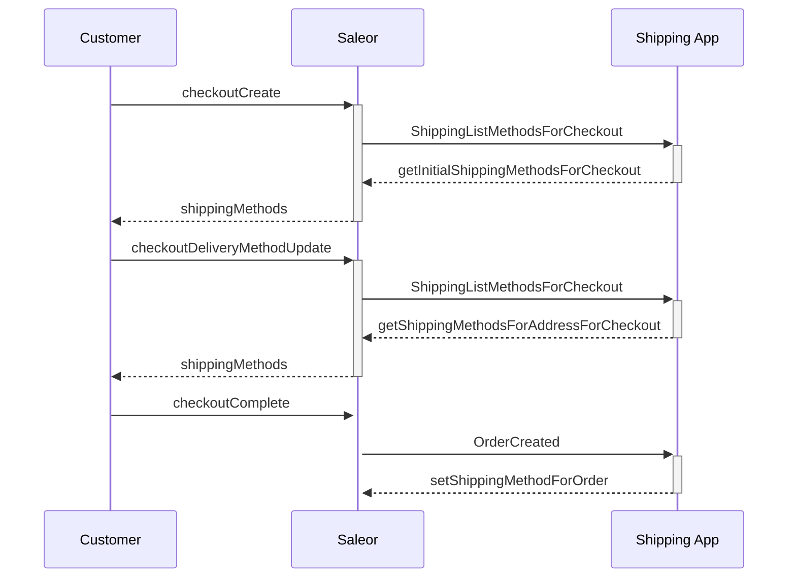

Synchronous webhooks for shipping methods allow Saleor Apps to control shipping methods available for checkouts and draft orders. Diagram below shows example flow of requests between your store customer, Saleor and shipping app.



### Required permissions

- `MANAGE_SHIPPING`
- `MANAGE_ORDERS`
- `MANAGE_CHECKOUTS`

### List external shipping methods

This solution can be used whenever shipping methods need to be fetched from a 3rd party API or when the pricing logic built into Saleor is insufficient for your needs.

External shipping methods can be used alone or with internal shipping methods. Saleor will return both the internal methods (defined through the Saleor Dashboard and stored in the `ShippingMethod` model) and external methods returned from the sync webhook.

#### Subscribe to the webhook

Saleor Apps can subscribe to the `SHIPPING_LIST_METHODS_FOR_CHECKOUT` synchronous webhook. It is called whenever
shipping methods are queried for a checkout object.

```graphql
{
  checkout(id: "checkout-id") {
    shippingMethods {
      id
      name
    }
  }
}
```

:::warning
Due to circular reference, `ShippingListMethodsForCheckout` subscription queries should not contain fields:

- `checkout.shippingMethods`
- `checkout.deliveryMethod`
- `shippingMethods`

:::

#### Request format

This is an example response from the application:

```json
[
  {
    "type": "Checkout",
    "id": "Q2hlY2tvdXQ6dXVpZA==",
    "channel": {
      "type": "Channel",
      "id": "Q2hhbm5lbDox",
      "slug": "default-channel",
      "currency_code": "USD"
    },
    "user": {
      "type": "User",
      "id": "VXNlcjoxOTY=",
      "email": "linda.thomas@example.com",
      "first_name": "Linda",
      "last_name": "Thomas"
    },
    "billing_address": {
      "type": "Address",
      "id": "QWRkcmVzczpOb25l",
      "first_name": "Krista",
      "last_name": "Wyatt",
      "company_name": "",
      "street_address_1": "98910 Cynthia Rest",
      "street_address_2": "",
      "city": "South Christopherville",
      "city_area": "",
      "postal_code": "15178",
      "country": "US",
      "country_area": "PA",
      "phone": ""
    },
    "shipping_address": {
      "type": "Address",
      "id": "QWRkcmVzczpOb25l",
      "first_name": "Bethany",
      "last_name": "Hayes",
      "company_name": "",
      "street_address_1": "59179 Bruce Gardens Apt. 413",
      "street_address_2": "",
      "city": "Lauramouth",
      "city_area": "",
      "postal_code": "71807",
      "country": "US",
      "country_area": "AR",
      "phone": ""
    },
    "shipping_method": null,
    "warehouse_address": {
      "type": "Address",
      "id": "QWRkcmVzczoxMTMw",
      "first_name": "John",
      "last_name": "Doe",
      "company_name": "Mirumee Software",
      "street_address_1": "Tęczowa 7",
      "street_address_2": "",
      "city": "WROCŁAW",
      "city_area": "",
      "postal_code": "53-601",
      "country": "PL",
      "country_area": "",
      "phone": "+48713988102"
    },
    "lines": [],
    "collection_point": null,
    "meta": {
      "issued_at": "1914-06-28T10:50:00+00:00",
      "version": "dev",
      "issuing_principal": {
        "id": null,
        "type": null
      }
    },
    "private_metadata": [],
    "metadata": [],
    "created": "2022-02-20T21:21:18.756Z",
    "last_change": "2022-02-20T21:21:18.756Z",
    "email": "linda.thomas@example.com",
    "currency": "USD",
    "discount_amount": "0.00",
    "discount_name": null
  }
]
```

#### Response format

This is an example response from the application:

```json
[
  {
    "id": "method-1",
    "name": "Same Day Delivery",
    "amount": 10.0,
    "currency": "USD"
  },
  {
    "id": "method-2",
    "name": "Standard Delivery",
    "amount": 0.0,
    "currency": "USD",
    "maximum_delivery_days": 14,
    "minimum_delivery_days": 4,
    "description": "Delivery description",
    "metadata": { "key": "value", "key_2": "value_2" }
  }
]
```

Where:

- `id` **(required)** is id of external shipping method e.g `dhl-exp`. It will be converted by Saleor to `app:<app-database-id>:<id-returned-by-webhook>` and encoded in Base64 format.
- `name` **(required)** of shipping method e.g `DHL Express`.
- `amount` **(required)** is price that customer needs to pay for delivery with shipping method.
- `currency` **(required)** is ISO currency code for amount (needs to match the checkout's currency).
- `maximum_delivery_days` is maximum delivery days for delivery promise of shipping carrier.
- `minimum_delivery_days` is minimum delivery days for delivery promise of shipping carrier.
- `description` is additional description of external shipping method.
- `metadata` is additional shipping method metadata in a form of a dict with strings as keys and values.

:::info

Fields: `minimum_delivery_days`, `description` and `metadata` were added to the response in **Saleor 3.19**.

:::

:::warning

Since **Saleor 3.21**, the `currency` returned by the app must match the checkout's currency. If they do not match, the corresponding shipping method will not be displayed to the customer.

:::

:::warning
 Since **Saleor 3.21**, the following queries will not return external shipping methods:
  - `checkouts(...)`
  - `me.checkouts(...)`
  - `checkoutLines(...)`

 These queries **will not** make external API calls for fetching external shipping methods.
 :::


#### Selecting shipping methods

External shipping methods have an ID of the following format: `app:<app-database-id>:<id-returned-by-webhook>` encoded in Base64.

They are selected using the same mutations as internal shipping methods, e.g.:

```graphql
mutation {
  checkoutDeliveryMethodUpdate(
    id: "Q2hlY2tvdXQ6dXVpZA=="
    deliveryMethodId: "YXBwOjEyMzQ6c29tZS1pZA=="
  ) {
    checkout {
      deliveryMethod {
        ... on ShippingMethod {
          id
          name
        }
      }
    }
    errors {
      code
      message
    }
  }
}
```

Information about an external shipping method is stored in the order's private metadata. This entry should be kept to allow the shipping method to be correctly displayed in the dashboard.

### Filter shipping methods

This solution allows you to control which shipping methods (internal or external) should be available to customers on the storefront or later on order.

#### Subscribe to the webhook

Saleor Apps can subscribe to the synchronous webhooks:

- `CHECKOUT_FILTER_SHIPPING_METHODS` is called whenever shipping methods are listed for a checkout
- `ORDER_FILTER_SHIPPING_METHODS` is called whenever shipping methods are listed for an editable order, such as a [draft order](api-reference/orders/enums/order-status.mdx#orderstatusdraft) or an [unconfirmed order](api-reference/orders/enums/order-status.mdx#orderstatusunconfirmed)

:::warning
Due to circular reference, `CheckoutFilterShippingMethods` and `OrderFilterShippingMethods` subscription queries should not contain fields:

- `checkout.shippingMethods`
- `checkout.deliveryMethod`
- `order.shippingMethods`
- `order.deliveryMethod`

Instead you should fetch shipping methods using root level `shippingMethods` field, e.g.:
```graphql
subscription {
  event {
    ... on CheckoutFilterShippingMethods {
      __typename
      shippingMethods {
        id
        name
      }
      checkout {
        id
      }
    }
  }
}
:::

#### Request format

Example request for `CHECKOUT_FILTER_SHIPPING_METHODS`:

```json
{
  "checkout": {
    "type": "Checkout",
    "id": "Q2hlY2tvdXQ6dXVpZA==",
    "channel": {
      "type": "Channel",
      "id": "Q2hhbm5lbDox",
      "slug": "default-channel",
      "currency_code": "USD"
    },
    "user": null,
    "billing_address": null,
    "shipping_address": null,
    "shipping_method": null,
    "warehouse_address": null,
    "lines": [],
    "collection_point": null,
    "meta": {
      "issued_at": "2022-02-20T21:18:55.216178+00:00",
      "version": "dev",
      "issuing_principal": {
        "id": null,
        "type": null
      }
    },
    "private_metadata": {},
    "metadata": {},
    "created": "2022-02-20T21:18:55.209Z",
    "last_change": "2022-02-20T21:18:55.209Z",
    "email": "user@email.com",
    "currency": "USD",
    "discount_amount": "0.00",
    "discount_name": null
  },
  "shipping_methods": [
    {
      "id": "U2hpcHBpbmdNZXRob2Q6MTIz",
      "price": "10.59",
      "currency": "USD",
      "name": "shipping",
      "maximum_order_weight": "10.0:kg",
      "minimum_order_weight": "1.0:g",
      "maximum_delivery_days": 10,
      "minimum_delivery_days": 2
    }
  ]
}
```

Example request for `ORDER_FILTER_SHIPPING_METHODS`:

```json
{
  "order": {
    "type": "Order",
    "id": "T3JkZXI6Mjkz",
    "channel": {
      "type": "Channel",
      "id": "Q2hhbm5lbDo1Njk=",
      "slug": "main",
      "currency_code": "USD"
    },
    "shipping_method": null,
    "payments": null,
    "shipping_address": {
      "type": "Address",
      "id": "QWRkcmVzczoxMzQz",
      "first_name": "John",
      "last_name": "Doe",
      "company_name": "Mirumee Software",
      "street_address_1": "T\u0119czowa 7",
      "street_address_2": "",
      "city": "WROC\u0141AW",
      "city_area": "",
      "postal_code": "53-601",
      "country": "PL",
      "country_area": "",
      "phone": "+48713988102"
    },
    "billing_address": {
      "type": "Address",
      "id": "QWRkcmVzczoxMzQz",
      "first_name": "John",
      "last_name": "Doe",
      "company_name": "Mirumee Software",
      "street_address_1": "T\u0119czowa 7",
      "street_address_2": "",
      "city": "WROC\u0141AW",
      "city_area": "",
      "postal_code": "53-601",
      "country": "PL",
      "country_area": "",
      "phone": "+48713988102"
    },
    "discounts": null,
    "original": "T3JkZXI6Tm9uZQ==",
    "lines": [],
    "fulfillments": [],
    "collection_point": null,
    "meta": {
      "issued_at": "2022-02-20T21:17:38.766493+00:00",
      "version": "dev",
      "issuing_principal": {
        "id": null,
        "type": null
      }
    },
    "private_metadata": {},
    "metadata": {},
    "created": "2022-02-20T21:17:38.760Z",
    "status": "unfulfilled",
    "user_email": "test@example.com",
    "origin": "checkout",
    "shipping_method_name": null,
    "collection_point_name": null,
    "shipping_price_net_amount": "0.00",
    "shipping_price_gross_amount": "0.00",
    "shipping_tax_rate": "0.0",
    "token": "b449194f-cf9c-4269-9d73-fdfa4534a140",
    "total_net_amount": "0.00",
    "undiscounted_total_net_amount": "0.00",
    "total_gross_amount": "0.00",
    "undiscounted_total_gross_amount": "0.00",
    "weight": "0.0:kg"
  },
  "shipping_methods": [
    {
      "id": "U2hpcHBpbmdNZXRob2Q6MTIz",
      "price": "10.59",
      "currency": "USD",
      "name": "shipping",
      "maximum_order_weight": "10.0:kg",
      "minimum_order_weight": "1.0:g",
      "maximum_delivery_days": 10,
      "minimum_delivery_days": 2
    }
  ]
}
```

#### Response format

This is an example response from the application:

```json
{
  "excluded_methods": [
    {
      "id": "U2hpcHBpbmdNZXRob2Q6MQ==",
      "reason": "Same Day Delivery is no longer available."
    },
    {
      "id": "U2hpcHBpbmdNZXRob2Q6MTQ=",
      "reason": "Bulky items are not allowed for standard shipping."
    }
  ]
}
```

:::warning
 Since **Saleor 3.21**, the following queries will return non filtered shipping methods:
  - `checkouts(...)`
  - `me.checkouts(...)`
  - `checkoutLines(...)`
  - `orders(...)`
  - `draftOrders(...)`
  - `me.orders(...)`

 These queries **will not** make external API calls for filtering shipping methods.
 :::

#### Implementation guide

`ShippingMethod` objects returned by `Checkout.shippingMethods` and `Order.shippingMethods` will have 2 attributes:

- `active` which is set to `false` when at least one of the Saleor Apps excludes the methods;
- `message` which concatenates the exclusion reason coming from each of the Apps;

```graphql
{
  checkout(id: "checkout-id") {
    shippingMethods {
      id
      name
      active
      message
    }
  }
}
```

:::warning
Even though external methods are also subject to filtering, we recommend integrating only one of the two approaches,
as every single synchronous webhook affects the response time of your Saleor API.
:::

### Community resources

- [Demo shipping app](https://github.com/saleor/dummy-shipping-app)
