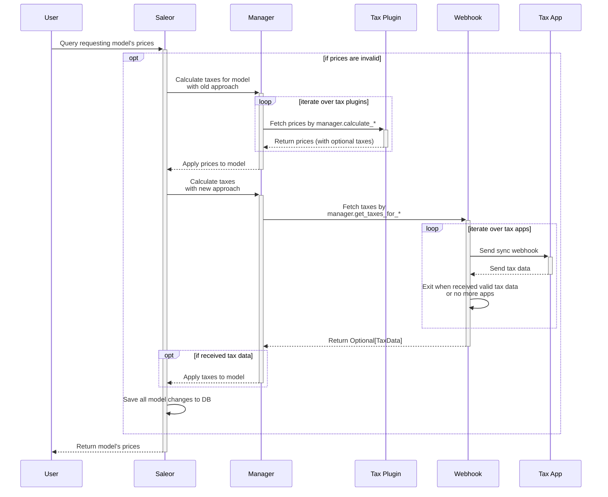

Tax webhooks are synchronous webhooks that allow delegating tax calculations to Saleor Apps. Synchronous means that these webhooks expect a response of a particular shape to be returned from the App to continue processing in Saleor. Tax webhooks only support the HTTP(S) protocol; they are sent as POST requests with the `application/json` body and expect a response of the same content type.

## Key concepts

The `HANDLE_TAXES` permission is required for the App to be able to calculate taxes. When there is more than one App subscribed to `CHECKOUT_CALCULATE_TAXES` or `ORDER_CALCULATE_TAXES`, we iterate over them until we get a proper response.
Prices on checkout and order are denormalized.

- Order prices

  Prices for orders never expire, but can be invalidated only in `draft order` or `unconfirmed order`. Prices are invalidated automatically for any address, user, line, and shipping change in orders.

- Checkout prices

  Prices for checkout can expire. The expiration time is set automatically when new taxes are fetched (regardless of the source tax). Expiration time can be set in the settings by the `CHECKOUT_PRICES_TTL` variable. Prices for checkouts can also be invalidated by any change to checkouts. This process is also automatic for any address, user, line, and shipping change in checkouts.

## General tax flow



## Available taxes events

| Name                       | Description                   |
| -------------------------- | ----------------------------- |
| `CHECKOUT_CALCULATE_TAXES` | Calculates taxes for checkout |
| `ORDER_CALCULATE_TAXES`    | Calculates taxes for order    |

## Checkout taxes

Saleor Apps can subscribe to the `CHECKOUT_CALCULATE_TAXES` synchronous webhook. It is called whenever a user fetches checkout prices that are expired or not calculated yet. The response is processed and saved on checkout and checkout lines. Prices can expire or be invalidated by any change to checkout. Any tax App is treated as the source of truth about pricing.

:::note
For the amount fields, we use the same format as in the rest of the API.
For example, the amount of 12,34 USD will be sent as `"total_amount": "12.34"`
:::

:::warning

- All sales are included in line prices.
- Shipping vouchers are included in shipping prices.
- Vouchers for "Specific products" are included in line prices.
- Vouchers "Apply only to a single cheapest eligible product" are included in line prices.

:::

:::warning
Since **Saleor 3.21**, the following queries will return prices stored in the database:
 - `checkouts(...)`
 - `me.checkouts(...)`
 - `checkoutLines(...)`

These queries **will not** make external API calls for tax recalculation.
:::


### Request

The shape of the request payload can be customized by using subscription webhook payloads.
More details about using webhook with subscription can be found [here](/developer/extending/webhooks/subscription-webhook-payloads.mdx).

The below example shows a definition of a subscription query that defines the shape of the incoming payload.
Only basic fields were requested.

```graphql
subscription {
  event {
    __typename
    ... on CalculateTaxes {
      taxBase {
        lines {
          totalPrice {
            amount
          }
        }
        shippingPrice {
          amount
        }
      }
    }
  }
}
```

The payload sent to the app would look like this:

```json
{
  "taxBase": {
    "lines": [{ "totalPrice": { "amount": 28 } }],
    "shippingPrice": { "amount": 10 }
  },
  "__typename": "CalculateTaxes"
}
```

### Response

#### Request format

```json
[
  {
    "type": "Checkout",
    "id": "Q2hlY2tvdXQ6OTJhNDI4ODgtNDJkYi00NjJjLWE3YmMtNDBjM2YzMjJkYzRl",
    "included_taxes_in_prices": true,
    "shipping_name": "FedEx",
    "shipping_amount": "59.17",
    "currency": "USD"
    "metadata": {},
    "user_id": "VXNlcjox",
    "user_public_metadata": {},
    "address": {
      "type": "Address",
      "id": "QWRkcmVzczoxMTc=",
      "first_name": "Test",
      "last_name": "TESTTEST",
      "company_name": "",
      "street_address_1": "4836  Melville Street",
      "street_address_2": "",
      "city": "JACKSON",
      "city_area": "",
      "postal_code": "38301",
      "country": "US",
      "country_area": "TN",
      "phone": "+48123456789"
    },
    "channel": {
      "type": "Channel",
      "id": "Q2hhbm5lbDox",
      "slug": "default-channel",
      "currency_code": "USD"
    },
    "discounts": [
      {
        "name": "New user promo",
        "amount": "10.00",
        "type": "SUBTOTAL"
      }
    ],
    "lines": [
      {
        "id": "Q2hlY2tvdXRMaW5lOjdmMmQwMDZkLWM1YmEtNDE4MS1hMTlkLTVmYzczMTMxNmYyMg==",
        "charge_taxes": true,
        "sku": "202165300",
        "variant_id": "UHJvZHVjdFZhcmlhbnQ6Mzg0",
        "full_name": "Apple Juice (202165300)",
        "product_name": "Apple Juice",
        "variant_name": "202165300",
        "product_metadata": {},
        "product_type_metadata": {},
        "unit_amount": "1.99",
        "quantity": 10,
        "total_amount": "19.90"
      },
      {
        "id": "Q2hlY2tvdXRMaW5lOmYxYzNhYjc2LTk0ZTItNDQ4NC05MzIxLWI0NDZiYWYzZjBiZQ==",
        "charge_taxes": true,
        "sku": "12487157",
        "variant_id": "UHJvZHVjdFZhcmlhbnQ6MzQ2",
        "full_name": "Blue Hoodie (UHJvZHVjdFZhcmlhbnQ6MzQ2)",
        "product_name": "Blue Hoodie",
        "variant_name": "UHJvZHVjdFZhcmlhbnQ6MzQ2",
        "product_metadata": {},
        "product_type_metadata": {},
        "unit_amount": "31.50",
        "quantity": 2,
        "total_amount": "63.00"
      }
    ],
  }
]
```

#### Fields:

1. `id` - Id of the checkout for which the app should calculate taxes.
2. `included_taxes_in_prices` - Flag that shows whether taxes should be included in prices.
3. `shipping_name` - Name of the shipping method assigned to checkout.
4. `shipping_amount` - Price of the shipping method assigned to checkout, including shipping voucher.
5. `currency` - Checkout currency.
6. `metadata` - Public metadata of checkout.
7. `user_id` - Id of the user assigned to checkout. (In case of anonymous customer this field returns `null`)
8. `user_public_metadata` - Public metadata of the user assigned to checkout.
9. `address` - Shipping address assigned to checkout. (In case of the checkout without required shipping, this field contains the billing address.)
10. `channel` - Data of the channel to which checkout is assigned.
11. `discounts` - List of order-level discounts assigned to checkout. (Those discounts should be applied by a tax App.)
    1. `name` - Name of discount.
    2. `amount` - Amount of assigned discount.
    3. `type` - Indicates which part of the checkout the discount should affect: SUBTOTAL or SHIPPING.
12. `lines` - List of items inside checkout.
    1. `id` - Id of the line.
    2. `charge_taxes` - Flag that shows whether taxes should be calculated for the line.
    3. `sku` - SKU of the product from the line.
    4. `variant_id` - Id of the variant from the line.
    5. `full_name` - Full name of the item from the line.
    6. `product_name` - Name of the product from the line.
    7. `variant_name` - Name of the variant from the line.
    8. `product_metadata` - Public metadata assigned to the product from the line.
    9. `product_type_metadata` - Public metadata assigned for the product type from the line.
    10. `unit_amount` - Price of the single item in the line, including line-level discounts.
    11. `quantity` - Quantity of the item in the line.
    12. `total_amount` - Total price of the line.

#### Response format

```json
{
 "shipping_tax_rate": "10"
 "shipping_price_gross_amount": 59.17,
 "shipping_price_net_amount": 53.79,
  "lines": [
    {
      "tax_rate": "10",
      "total_gross_amount": 17.49,
      "total_net_amount": 15.91
    },
    {
      "tax_rate": "10",
      "total_gross_amount": 55.40,
      "total_net_amount": 50.36
    }
  ],
}
```

#### Fields:

1. `shipping_tax_rate` - Tax rate of shipping.
2. `shipping_price_gross_amount` - The gross price of shipping.

3. `shipping_price_net_amount` - Net price of shipping.
4. `lines` - List of lines tax assigned to checkout. Lines should be returned in the same order in which they were sent to the App.
   1. `tax_rate` - Tax rate value provided as percentage. Example: provide `23` to represent the `23%` tax rate.
   2. `total_gross_amount` - Gross price of the line.
   3. `total_net_amount` - Net price of the line.

## Order taxes

Saleor Apps can subscribe to the `ORDER_CALCULATE_TAXES` synchronous webhook. It is called whenever a user fetches order prices that are expired or not calculated yet. The response from the App is processed and saved on order and order lines. Prices can expire or be invalidated by any change to order. Any tax App is treated as the source of truth about pricing.

:::note
For the amount fields, we use the same format as in the rest of the API.
For example, the amount of 12,34 USD will be sent as `"total_amount": "12.34"`
:::

:::warning

- All sales are included in line prices.
- Shipping vouchers are included in shipping prices.
- Vouchers for "Specific products" are included in line prices.
- Vouchers "Apply only to a single cheapest eligible product" are included in line prices.

:::

:::warning
Since **Saleor 3.21**, the following queries will return prices stored in the database:
 - `orders(...)`
 - `draftOrders(...)`
 - `me.orders(...)`

These queries **will not** make external API calls for tax recalculation.
:::

### Request

The shape of the request payload can be customized by using subscription webhook payloads.
More details about using webhook with subscription can be found [here](/developer/extending/webhooks/subscription-webhook-payloads.mdx).

The below example shows a definition of a subscription query that defines the shape of the incoming payload.
Only basic fields were requested.

```graphql
subscription {
  event {
    __typename
    ... on CalculateTaxes {
      taxBase {
        lines {
          totalPrice {
            amount
          }
        }
        shippingPrice {
          amount
        }
      }
    }
  }
}
```

The payload sent to the app would look like this:

```json
{
  "taxBase": {
    "lines": [{ "totalPrice": { "amount": 28 } }],
    "shippingPrice": { "amount": 10 }
  },
  "__typename": "CalculateTaxes"
}
```

### Response

#### Request format

```json
[
  {
    "type": "Order",
    "id": "T3JkZXI6ZTdlODYzMDctMDdhYi00ODNjLTk0YmUtM2FiNzlkYTA2ZGRm",
    "included_taxes_in_prices": true,
    "shipping_name": "FedEx",
    "shipping_amount": "59.17",
    "currency": "USD"
    "metadata": {},
    "user_id": "VXNlcjo3OTU=",
    "user_public_metadata": {},
    "address": {
      "type": "Address",
      "id": "QWRkcmVzczoyMDM=",
      "first_name": "Brandon",
      "last_name": "Ruiz",
      "company_name": "",
      "street_address_1": "09925 Isabel Run",
      "street_address_2": "",
      "city": "JAMESFORT",
      "city_area": "",
      "postal_code": "72850",
      "country": "US",
      "country_area": "AR",
      "phone": ""
    },
    "channel": {
      "type": "Channel",
      "id": "Q2hhbm5lbDox",
      "slug": "default-channel",
      "currency_code": "USD"
    },
    "discounts": [
      {
        "name": "New user discount",
        "amount": "10.00",
        "type": "SUBTOTAL"
      }
    ],
    "lines": [
      {
        "type": "OrderLine",
        "id": "T3JkZXJMaW5lOmE5MTc2NjhmLWNmYjUtNDM4Yi05MTFlLWNhNGVlZTgyYzQ5Mw==",
        "variant_id": "UHJvZHVjdFZhcmlhbnQ6Mzg0",
        "full_name": "Apple Juice (202165300)",
        "product_metadata": {},
        "product_type_metadata": {},
        "charge_taxes": true,
        "sku": "202165300",
        "unit_amount": "1.99",
        "total_amount": "1.99",
        "product_name": "Apple Juice",
        "variant_name": "202165300",
        "quantity": 1
      }
    ],
  }
]
```

#### Fields:

1. `id` - Id of the order for which the app should calculate taxes.
2. `included_taxes_in_prices` - Flag that shows whether taxes should be included in prices.
3. `shipping_name` - Name of the shipping method assigned to the order.
4. `shipping_amount` - Price of the shipping method assigned to the order, including shipping voucher.
5. `currency` - Order currency.
6. `metadata` - Public metadata of the order.
7. `user_id` - Id of the user assigned to the order. (In case of anonymous customer this field return `null`)
8. `user_public_metadata` - Public metadata of the user assigned to the order.
9. `address` - Shipping address assigned to the order. (In case of the order without required shipping this field contains billing address.)
10. `channel` - Data of the channel to which the order is assigned.
11. `discounts` - List of the discounts assigned to the order. (These discounts should be applied by the tax App.)
    1. `name` - Name of the discount.
    2. `amount` - Amount of the assigned discount.
    3. `type` - Indicates which part of the order the discount should affect: SUBTOTAL or SHIPPING.
12. `lines` - List of the items inside the order.
    1. `id` - Id of the line.
    2. `charge_taxes` - Flag that shows whether taxes should be calculated for the line.
    3. `sku` - SKU of the product from the line.
    4. `variant_id` - Id of the variant from the line.
    5. `full_name` - Full name of the item from the line.
    6. `product_name` - Name of the product from the line.
    7. `variant_name` - Name of the variant from the line.
    8. `product_metadata` - Public metadata assigned to the product from the line.
    9. `product_type_metadata` - Public metadata assigned for the product type from the line.
    10. `unit_amount` - Price of the single item in the line, including line-level discounts.
    11. `quantity` - Quantity of the item in the line.
    12. `total_amount` - Total price of the line.

#### Response format

```json
{
 "shipping_tax_rate": "10"
 "shipping_price_gross_amount": 59.17,
 "shipping_price_net_amount": 53.79,
  "lines": [
    {
      "tax_rate": "10",
      "total_gross_amount": 17.49,
      "total_net_amount": 15.91
    },
    {
      "tax_rate": "10",
      "total_gross_amount": 55.40,
      "total_net_amount": 50.36
    }
  ],
}
```

#### Fields:

1. `shipping_tax_rate` - Tax rate of shipping.
2. `shipping_price_gross_amount` - Gross price of shipping.

3. `shipping_price_net_amount` - Net price of shipping.
4. `lines` - List of line taxes assigned to order. Lines should be returned in the same order in which they were sent to the app.
   1. `tax_rate` - Tax rate value provided as percentage. Example: provide `23` to represent the `23%` tax rate.
   2. `total_gross_amount` - Gross price of the line.
   3. `total_net_amount` - Net price of the line.


## Tax data validation

The app response is considered valid if:
1. There are no negative values
2. Request's number of lines matches number of lines from response
3. The prices and rates do not exceed database limits. 
  * by defult Saleor allows to write db with prices lower than 1 billion. 
  This restriction can be changed over `DEFAULT_DECIMAL_PLACES` and `DEFAULT_MAX_DIGITS` variables.  
  * rates shouldn't be greater than **100%**
