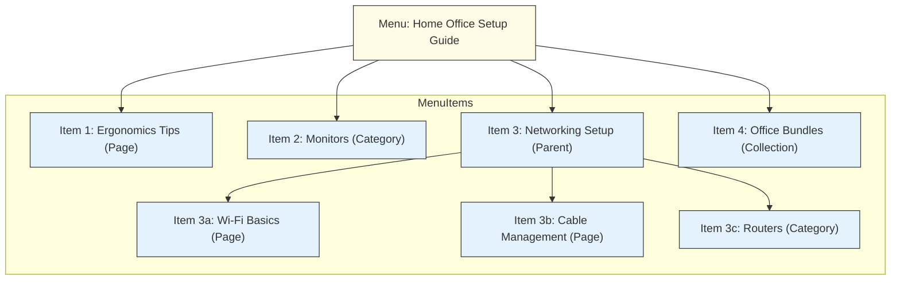

# Menu

## Overview

Menus are assembly structures that group and organize entities in your store. They create hierarchical relationships between categories, collections, and pages. The most common use case is storefront navigation.

You can create menus in the Saleor Dashboard in the _Configuration_ → _Navigation_ page.

## Example Use Case

**Modeling Curated Guides in Online Electronics Store**

Consider an online electronics store that wants to create guided content helping customers choose and set up products for specific needs, like a "Home Office Setup Guide". This guide needs to link specific setup advice Pages, relevant Product Categories, and perhaps a key Collection.

Menus can model this curated, hierarchical structure:



- **Menu:** A Menu is created with the name "Home Office Setup Guide" and slug `home-office-guide`. This Menu itself represents the structured guide.
- **Menu Items:**
  - An item links directly to a `Page` titled "Ergonomics Tips" (perhaps a custom Page modeled for guides).
    - Another item links to the existing `Category` "Monitors".
    - A parent item "Networking Setup" (linking perhaps to a generic URL or another Page) has child items:
      - A child item linking to a "Wi-Fi Basics" `Page`.
      - A child item linking to a "Cable Management" `Page`.
      - A child item linking to the "Routers" `Category`.
    - A final item links to a curated `Collection` named "Office Bundles".


Instead of just being top-level navigation, this Menu (`home-office-guide`) **models a specific, curated relationship** between different types of content and commerce entities (Pages, Categories, Collections). It defines a specific structure for the "Home Office Setup" topic that isn't captured by standard product categorization alone.

By querying this specific menu slug, an application can retrieve this curated structure and present the guide content in the intended order and hierarchy, demonstrating how Menus can assemble entities into a structured whole for purposes beyond simple site navigation.

## Lifecycle

:::info

Menu operations require the [`MANAGE_MENUS`](developer/permissions.mdx#available-permissions) permission.

:::

### Creating a Menu

A menu requires a name and can optionally have a slug. You can create a menu with or without items with the [`menuCreate`](/api-reference/menu/mutations/menu-create) mutation:

```graphql
mutation CreateMenu($input: MenuCreateInput!) {
  menuCreate(input: $input) {
    menu {
      id
      name
      slug
      items {
        id
        name
        level
      }
    }
    errors {
      field
      message
      code
    }
  }
}
```

A menu item can link to one of the following entities:

- Category
- Collection
- Page
- URL

Here is an example input for creating a menu:

```json
{
  "name": "Example Menu Item",
  "slug": "example-menu-item",
  "items": [
    {
      "name": "Category Menu Item",
      "category": "Q2F0ZWdvcnk6MjY="
    },
    {
      "name": "Collection Menu Item",
      "collection": "Q29sbGVjdGlvbjozMjA="
    },
    {
      "name": "Page Menu Item",
      "page": "UGFnZToxMjM="
    },
    {
      "name": "URL Menu Item",
      "url": "https://www.saleor.io"
    }
  ]
}
```

You can also create the menu item itself through the [`menuItemCreate`](/api-reference/menu/mutations/menu-item-create) mutation:

```graphql
mutation CreateMenuItem($input: MenuItemCreateInput!) {
  menuItemCreate(input: $input) {
    menuItem {
      id
      name
      slug
      children {
        id
        name
        level
      }
    }
  }
}
```

Menu items can be nested to create a hierarchy. For example, the following input creates a menu item as a child of another menu item:

```json
{
  "name": "Parent Menu Item",
  "url": "https://www.saleor.io",
  "parent": "Q2F0ZWdvcnk6MjY=",
}
```

### Getting Menus

To retrieve all menus, use the [`menus`](/api-reference/menu/queries/menus) query:

```graphql
  menus(first: $first) {
    edges {
      node {
        id
        name
        slug
        items {
          id
          name
          level
          category {
            id
            name
          }
          collection {
            id
            name
          }
          page {
            id
            title
          }
          children {
            id
            name
            level
          }
        }
      }
    }
  }
```

To get a specific menu by ID, name, or slug, use the [`menu`](/api-reference/menu/queries/menu) query:

```graphql
query GetMenu($id: ID, $name: String, $slug: String) {
  menu(id: $id, name: $name, slug: $slug) {
    id
    name
    slug
    items {
      id
      name
      level
      category {
        id
        name
      }
      collection {
        id
        name
      }
      page {
        id
        title
      }
    }
  }
}
```

### Deleting a Menu

To remove a menu and all its items, use the [`menuDelete`](/api-reference/menu/mutations/menu-delete) mutation:

```graphql
mutation DeleteMenu($id: ID!) {
  menuDelete(id: $id) {
    menu {
      id
      name
      slug
    }
    errors {
      field
      message
      code
    }
  }
}
```

## Webhooks

Here are the webhooks that are available for menus:

- [`MENU_CREATED`](/api-reference/menu/objects/menu-created)
- [`MENU_UPDATED`](/api-reference/menu/objects/menu-updated)
- [`MENU_DELETED`](/api-reference/menu/objects/menu-deleted)
- [`MENU_ITEM_CREATED`](/api-reference/menu/objects/menu-item-created)
- [`MENU_ITEM_UPDATED`](/api-reference/menu/objects/menu-item-updated)
- [`MENU_ITEM_DELETED`](/api-reference/menu/objects/menu-item-deleted)
