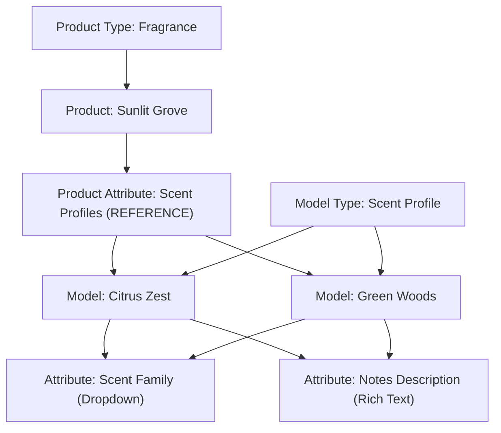

# Models

import Tabs from "@theme/Tabs";
import TabItem from "@theme/TabItem";

:::warning API Compatibility Notice

While we've updated the terminology in the documentation to use "Models" and "Model Types", the API endpoints and GraphQL schema still use `pages` and `pageTypes`. This is temporary, and we plan to update the API to match the new terminology soon.

:::

## Overview

Models provide a flexible mechanism for managing both traditional content and structured data entities that extend your commerce domain beyond the standard Product/Category/Collection model. Think of them as structured documents within Saleor.

## Core Concepts

### Model Types

A Model Type defines the schema for a group of models. It determines what attributes a model will have and how the model can be used. Think of Model Types as templates or schemas. For instance, a "Blog Post" model type might have attributes like `Author`, `PublishedDate`, and `Tags`.

You must create a Model Type before you can create any Model.

:::info

You can manage Model Types in the Dashboard's -> Modeling -> _Model Types_ view.

:::

### Attributes

Attributes define typed fields that can be reused across products and models. When creating an attribute, it must be explicitly [assigned to either `PRODUCT` or `PAGE` type](/api-reference/attributes/enums/attribute-type-enum.mdx).

### Models

A Model is an instance of a Model Type, enriched with specific attribute values and optionally a rich content block. Models can be created, linked to other entities, published, or removed.


:::info

You can manage Models in the Dashboard's -> Modeling -> _Models_ view.

:::

## Example Use Case

**Modeling Scent Profiles in Perfume Store**

Consider a specialized perfume store, where each product is a fragrance. Fragrances are complex blends, often composed of multiple scent profiles like "Citrus", "Woody", or "Floral". These profiles are shared across products.

Here's a breakdown of the entities and relationships:




- **Product Type:** `Fragrance`
- **Product Attribute:** `Scent Profiles`
  - Type: `REFERENCE`
  - Entity: `Page`
- **Model Type:** `Scent Profile`
- **Model Attributes:**
  - `Scent Family` – Dropdown field (e.g., _Citrus_, _Woody_, _Floral_)
  - `Notes Description` – Rich text field (e.g., _Bright and zesty with a hint of green bitterness_)

For the fragrance **Sunlit Grove**, the following scent profiles might be selected:

- `Citrus Zest`
- `Green Woods`

Each of these is a **Model** of type `Scent Profile`, reused across multiple products and enriched with structured attributes.

In the storefront UI, this structure enables rich product pages that showcase the fragrance's composition. For example, the Sunlit Grove product page might display its scent profiles in a dedicated section, with each profile (Citrus Zest, Green Woods) showing its family type and detailed notes description.

## Lifecycle

### Creating a Model

To [create a model](/api-reference/pages/mutations/page-create.mdx) through API, you must first define the [model type](/api-reference/pages/mutations/page-type-create.mdx) and any required attributes.


:::info

Creating a model requires the [`MANAGE_PAGES` permission](/developer/permissions.mdx#available-permissions).

:::

<Tabs>
<TabItem value="Mutation">
```graphql
mutation PageCreate($input: PageCreateInput!) {
  pageCreate(input: $input) {
    page {
      id
      title
    }
    errors {
      field
      message
    }
  }
}
```
</TabItem>

<TabItem value={"Variables"}>
```json
{
  "input": {
    "title": "Citrus Zest",
    "slug": "citrus-zest",
    "isPublished": true,
    "pageType": "UGFnZVR5cGU6NDY="
  }
}
```
</TabItem>
</Tabs>


### Getting Models

You can get individual model details using the [`page`](/api-reference/pages/queries/page.mdx) query:

<Tabs>
<TabItem value="Query">
```graphql
query GetPage($id: ID!) {
  page(id: $id) {
    id
    title
    content
    attributes {
      attribute {
        name
        slug
      }
      values {
        name
      }
    }
  }
}
```
</TabItem>

<TabItem value={"Variables"}>
```json
{
  "id": "UGFnZToz"
}
```
</TabItem>
</Tabs>

or you can get multiple models using the [`pages`](/api-reference/pages/queries/pages.mdx) query:

<Tabs>
<TabItem value="Query">
```graphql
query GetPages($first: Int, $filter: PageFilterInput) {
  pages(first: $first, filter: $filter) {
    totalCount
    edges {
      node {
        id
        title
        attributes {
          attribute {
            name
            slug
          }
          values {
            name
          }
        }
      }
    }
  }
}
```
</TabItem>

<TabItem value={"Variables"}>
```json
{
  "first": 5,
  "filter": {
    "ids": ["UGFnZToz", "UGFnZTo0"]
  }
}
```
</TabItem>
</Tabs>


### Linking Models

Models can reference or be referenced by other entities through attribute of type 
[REFERENCE](/api-reference/attributes/enums/attribute-input-type-enum.mdx#reference). 
The selection of referenceable entities is determined by [`AttributeEntityTypeEnum`](/api-reference/attributes/enums/attribute-entity-type-enum.mdx) 
and currently includes `PAGE`, `PRODUCT` and `PRODUCT_VARIANT`.

<Tabs>
<TabItem value="Mutation">
```graphql
mutation ProductUpdate($id: ID, $input: ProductInput!) {
  productUpdate(id: $id, input: $input) {
    product {
      id
      name
    }
    errors {
      field
      message
    }
  }
}
```
</TabItem>

<TabItem value={"Variables"}>
```json
{
  "id": "UHJvZHVjdElE",
  "input": {
    "attributes": [
      {
        "id": "QXR0cmlidXRlSWQ=",   # Product Attribute of type REFERENCE for scent profiles
        "references": [
          "UGFnZUlE"   # ID of the Citrus Zest model
        ]
      }
    ]
  }
}

```
</TabItem>
</Tabs>


You can also model relationships between Models using a reference attribute or by embedding slugs/IDs in the model metadata.

#### Querying Linked Entities

Below is an example of how to query the linked entities using the [`product`](/api-reference/products/queries/product.mdx) query:

```graphql
query GetProductWithScentProfiles($productId: ID!) {
  product(id: $productId) {
    id
    name
    attributes {
      attribute {
        id
        slug # We are looking for "scent-profiles"
      }
      values {
        reference # This gives the Model ID
      }
    }
  }
}
```

The response will contain the ids of the linked models. You can then use the [`page` query](#getting-models) to get the details of the linked models.

### Publishing Models

Models can be visible or hidden. You can control their visibility using:
- `isPublished` (Boolean): Sets current visibility.
- `publicationDate` (Date): Can schedule a future publication. The model won't appear on the storefront until this date.

:::info

If `isPublished` is false, only users with the [`MANAGE_PAGES`](/developer/permissions.mdx#available-permissions) permission will be able to successfully retrieve it.

:::

You can update the value of those fields using [`pageUpdate`](/api-reference/pages/mutations/page-update.mdx) mutation:

<Tabs>
<TabItem value="Mutation">
```graphql
mutation PageUpdate($id: ID!, $input: PageInput!) {
  pageUpdate(id: $id, input: $input) {
    page {
      id
      title
      isPublished
    }
    errors {
      field
      message
    }
  }
}
```
</TabItem>

<TabItem value={"Variables"}>
```json
{
  "id": "UGFnZUlE",
  "input": {
    "isPublished": true,
    "publicationDate": "2025-04-15"
  }
}
```
</TabItem>
</Tabs>


### Deleting Models

Use [`pageDelete`](/api-reference/pages/mutations/page-delete.mdx) for single models 
or [`pageBulkDelete`](/api-reference/pages/mutations/page-bulk-delete.mdx) for multiple. 
Deleting a Model is permanent. Deleting a Model Type might be restricted if Models are using it.

```graphql
mutation DeletePage($id: ID!) {
  pageDelete(id: $id) {
    page {
      id
    }
    errors {
      field
      code
      message
    }
  }
}
```

```graphql
mutation DeleteMultiplePages($ids: [ID!]!) {
  pageBulkDelete(ids: $ids) {
    count
    errors {
      field
      code
      message
    }
  }
}
```

## Webhooks

Here are the webhooks that are available for models:

- [`PAGE_TYPE_CREATED`](/api-reference/pages/objects/page-type-created.mdx)
- [`PAGE_TYPE_UPDATED`](/api-reference/pages/objects/page-type-updated.mdx)
- [`PAGE_TYPE_DELETED`](/api-reference/pages/objects/page-type-deleted.mdx)
- [`PAGE_CREATED`](/api-reference/pages/objects/page-created.mdx)
- [`PAGE_UPDATED`](/api-reference/pages/objects/page-updated.mdx)
- [`PAGE_DELETED`](/api-reference/pages/objects/page-deleted.mdx)

