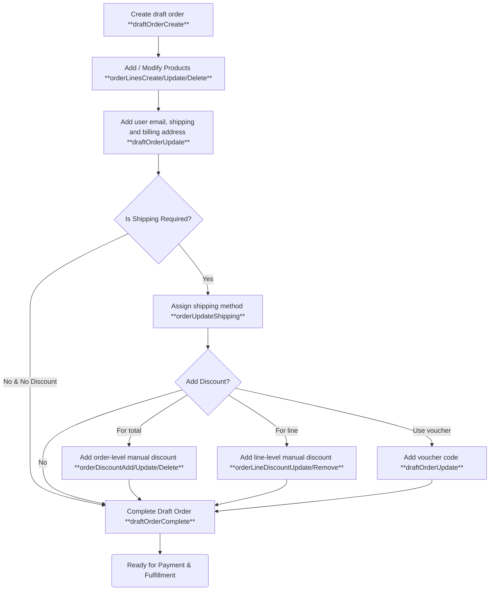

## Overview

Draft Orders in Saleor allow to create and manage orders on behalf of customers: either 
through the Saleor Dashboard or programmatically via API. 
They are ideal for cases where the customer is not initiating the order themselves, 
such as phone sales, in-person purchases, or email requests. 
Once a draft order is completed, Saleor handles the rest: triggering notifications, 
updating inventory, and transitioning the order into the standard fulfillment pipeline.

Common use cases include:

- **Phone Orders:** Customer service teams can create orders directly for customers calling in, 
capturing details like variants, addresses, and shipping methods.
- **Custom Quotes and Negotiations:** Generate draft orders with special pricing or 
configurations for B2B sales or negotiated deals, and confirm them once approved.
- **Item Replacements and Exchanges:** Automatically pre-fill draft orders with customer 
and order context for faster handling of returns, damaged items, or goodwill shipments—without altering the original order.

## Draft Orders Lifecycle

## API
### Core Draft Order Management

- [`draftOrderCreate`](/api-reference/orders/mutations/draft-order-create): 
This mutation is the starting point for creating a new draft order.

- [`draftOrderUpdate`](/api-reference/orders/mutations/draft-order-update): Modify various 
aspects of an existing draft order. This includes:
    - Setting or updating the customer and their associated shipping and billing addresses.
    - Applying vouchers to the draft order to include discounts.
    -  Adding customer notes (visible to the customer).

- [`orderUpdateShipping`](/api-reference/orders/mutations/order-update-shipping): 
Assign or change the shipping method for the draft order. This requires a valid shipping method ID.

- [`draftOrderComplete`](/api-reference/orders/mutations/draft-order-complete): 
Transition into a regular order. This action triggers several important processes:
    - Inventory allocations are created for variants with inventory tracking enabled, 
    reducing the available stock.
    - Order-related webhooks (beyond draft order specific ones) are triggered.
    - The order becomes eligible for the standard order fulfillment and payment processes.

- [`draftOrderDelete`](/api-reference/orders/mutations/draft-order-delete) / [`draftOrderBulkDelete`](/api-reference/orders/mutations/draft-order-bulk-delete): 
Remove one or multiple draft orders.

### Managing Order Lines

- [`orderLinesCreate`](/api-reference/orders/mutations/order-lines-create): 
Add new product variants as lines to the draft order. You specify the variant, the quantity and override current price.
- [`orderLineUpdate`](/api-reference/orders/mutations/order-line-update): 
Modify the quantity or the selected variant of an existing order line in the draft order.
- [`orderLineDelete`](/api-reference/orders/mutations/order-line-delete): 
Remove a specific product line from the draft order.

### Manage Discounts

**Order-Level Discounts:**
    - [`orderDiscountAdd`](/api-reference/orders/mutations/order-discount-add): 
    Apply a discount to the entire draft order, either as a fixed amount or a percentage.
    - [`orderDiscountUpdate`](/api-reference/orders/mutations/order-discount-update): 
    Modify the value or reason of an existing order-level discount.
    - [`orderDiscountDelete`](/api-reference/orders/mutations/order-discount-delete): 
    Remove an order-level discount.

**Order Line-Level Discounts:**
    - [`orderLineDiscountUpdate`](/api-reference/orders/mutations/order-line-discount-update): 
    Apply or modify a discount on a specific order line.
    - [`orderLineDiscountRemove`](/api-reference/orders/mutations/order-line-discount-remove): 
    Remove a discount from a specific order line.

For more information about adding manual discounts, see the [Manual Discounts](/developer/discounts/manual-discounts) documentation.

## Webhooks

- `DRAFT_ORDER_CREATED`
- `DRAFT_ORDER_UPDATED`
- `DRAFT_ORDER_DELETED`
- `ORDER_CALCULATE_TAXES` (sync): Allows external services to calculate taxes for the draft order based on its details.
- `ORDER_FILTER_SHIPPING_METHODS` (sync): Enables filtering (excluding) available shipping methods for the draft order.
