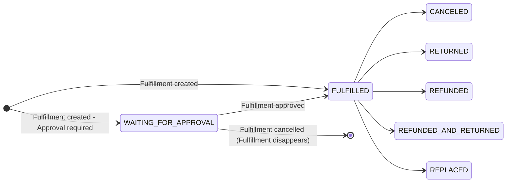

## Introduction

Order fulfillment is the process of handling and delivering goods to customers. 
In Saleor, fulfillments represent the shipping and logistics stage of an order.

### When can fulfillment be created?

Fulfillments can be created after an order is confirmed (reaches the `UNFULFILLED` status). This can happen in two ways:
- Automatically after checkout completion (if [`channel.orderSettings.automaticallyConfirmAllNewOrders`](api-reference/miscellaneous/objects/order-settings.mdx#ordersettingsautomaticallyconfirmallnewordersboolean---) is enabled)
- Manually through the [`orderConfirm`](/api-reference/orders/mutations/order-confirm) mutation

For more details about order statuses and their transitions, see the [Order Status lifecycle](order-status.mdx).

### Order-Fulfillment Relationship

An order can have multiple fulfillments, each linked to specific order lines and warehouses. This one-to-many relationship allows for:
- Shipping items from multiple locations
- Partially fulfilling orders (e.g., when some items are damaged in stock)
- Handling split shipments for different delivery dates
- Managing returns and replacements independently

Each fulfillment affects the order's status:
- Creating a fulfillment moves the order to `PARTIALLY_FULFILLED` or `FULFILLED` status
- Canceling all fulfillments returns the order to `UNFULFILLED` status
- Returning items can move the order to `PARTIALLY_RETURNED` or `RETURNED` status

## Fulfillment Lifecycle
[`FulfillmentStatus Enum`](/api-reference/orders/enums/fulfillment-status) represents all the possible states fulfillment can be in.


### Initial Fulfillment Status
- **FULFILLED** → The default status when fulfillment is created.
- **WAITING_FOR_APPROVAL** → The fulfillment is created but awaits approval before being processed. 
Approval can be done by a staff user or an app. 
You can enable this flow by updating the 
[`shop.fulfillmentAutoApprove`](/api-reference/miscellaneous/objects/shop#shopfulfillmentautoapproveboolean---). 
When set to false, fulfillments will remain in WAITING_FOR_APPROVAL until approved by an authorized entity.

### Status Transitions
**If fulfillment is in WAITING_FOR_APPROVAL**:
   - Running [`orderFulfillmentApprove`](/api-reference/orders/mutations/order-fulfillment-approve) changes status to **FULFILLED**.
   - Running [`orderFulfillmentCancel`](/api-reference/orders/mutations/order-fulfillment-cancel) **removes the fulfillment**.

**If fulfillment is in FULFILLED**:
   - Running [`orderFulfillmentCancel`](/api-reference/orders/mutations/order-fulfillment-cancel) changes status to **CANCELED**.
   - Running [`orderFulfillmentReturnProducts`](/api-reference/orders/mutations/order-fulfillment-return-products) changes status based on the request:
     - **RETURNED** → If only a return was requested.
     - **REPLACED** → If a replacement was requested.
   - Running [`orderFulfillmentRefundProducts`](/api-reference/orders/mutations/order-fulfillment-refund-products) changes status based on the request:
     - **REFUNDED** → If only a refund was requested.
     - **REFUNDED_AND_RETURNED** → If both return and refund were requested.

### Order Line Fulfillment Status

Each order line maintains its own fulfillment state through two key fields:
- [`OrderLine.quantityFulfilled`](/api-reference/orders/objects/order-line#orderlinequantityfulfilledint---) - The number of items that have been fulfilled
- [`OrderLine.quantityToFulfill`](/api-reference/orders/objects/order-line#orderlinequantitytofulfillint---) - The number of items still pending fulfillment

This status tracking allows you to:
- Monitor partial fulfillments
- Track fulfillment progress across multiple shipments
- Handle split shipments from different warehouses
- Manage returns and replacements accurately

Example of order line fulfillment status in a response:
```json
"lines": [
  {
    "id": "T3JkZXJMaW5lOmZlMWUwZjdjLWNjNDAtNDM3OC04OWNhLWVhZDYzNWJhMTA2NQ==",
    "isShippingRequired": true,
    "productName": "Apple Juice",
    "quantity": 2,
    "allocations": [],
    "quantityFulfilled": 0,
    "quantityToFulfill": 2,
    "__typename": "OrderLine"
  }
]
```

### Stock Impact

The impact of fulfillments on stock depends on whether inventory tracking is enabled for the product variant ([`ProductVariant.trackInventory`](/api-reference/products/objects/product-variant#productvarianttrackinventoryboolean---)).

- When `trackInventory` is enabled:
  - Creating a fulfillment reduces stock in the specified warehouse and releases the stock allocation
  - Canceling a fulfillment restores stock to the warehouse and restore the stock allocation
  - Returns require manual stock restoration after staff review (this is by design to allow staff to review returned items before deciding if they can be resold)
- When `trackInventory` is disabled:
  - No stock changes occur for any fulfillment operation

#### Warehouse Selection for Fulfillment
- Saleor dashboard may suggest warehouses based on stock allocation
- You can manually select warehouses when creating fulfillments

#### Stock Level Overrides
- The `allowStockToBeExceeded` parameter in the [`orderFulfill`](/api-reference/orders/mutations/order-fulfill) mutation allows creating fulfillments even when stock is insufficient

:::info

Fulfillment operations require the [`MANAGE_ORDERS`](developer/permissions.mdx#available-permissions) permission.

:::
## API
### Create Fulfillment

Fulfillments are created using the GraphQL mutation [`orderFulfill`](/api-reference/orders/mutations/order-fulfill). This operation allows you to process and ship items from your warehouses to customers.

**Required Fields**

Each fulfillment requires the following information:

- `orderLineID` - The unique identifier of the order line to fulfill
- `quantity` - The number of items to fulfill from this order line
- `warehouseID` - The ID of the warehouse from which the items will be shipped

**Optional Fields**

You can enhance the fulfillment process with these additional options:

- `notifyCustomer` - When enabled, a notification about the created fulfillment is triggered via the configured plugins or apps.
- `allowStockToBeExceeded` - Allows creating a fulfillment even when stock is insufficient
  - Useful for backorders or dropshipping scenarios
  - Should be used with caution as it can cause negative stock value
  - We recommend testing this behavior with both track inventory enabled and disabled
- `trackingNumber` - The shipping tracking number
  - Can be provided during fulfillment creation
  - Can be updated later using the [`orderFulfillmentUpdateTracking`](/api-reference/orders/mutations/order-fulfillment-update-tracking) mutation


Here's an example of creating a fulfillment:

```graphql
mutation FulfillOrder {
  orderFulfill(
    order: "T3JkZXI6OTE3Yjc2NDQtY2Q0Zi00ZjcyLTkzNjktMGNhYTk4ODEyNDQy"
    input: {lines: [
      {orderLineId: "T3JkZXJMaW5lOjM1YzEwNjNkLTYyNjQtNGExMi1hYzBlLWRhMzg1ZDM3ZGRhNA==", stocks: [{quantity: 2, warehouse: "V2FyZWhvdXNlOjc1MjYwYWRjLTJjZjAtNGQ0ZC1hOTM5LTBmZGY2Y2FlYjBjMQ=="}]}, 
      {orderLineId: "T3JkZXJMaW5lOmJmYzQzMDg2LTlkM2ItNGM2MS1hMGJkLTRkNGE2YmIyNWZiNw==", stocks: [{quantity: 3, warehouse: "V2FyZWhvdXNlOjc1MjYwYWRjLTJjZjAtNGQ0ZC1hOTM5LTBmZGY2Y2FlYjBjMQ=="}]}
      ], notifyCustomer: false, allowStockToBeExceeded: false, trackingNumber: "28074624654"}
  ) {
    errors {
      field
      code
      message
      warehouse
      orderLines
    }
    fulfillments {
      id
      created
      status
      trackingNumber
      warehouse {
        name
      }
      lines {
        id
        quantity
      }
    }
    order {
      status
      lines {
        id
        quantityFulfilled
        quantityToFulfill
      }
    }
    __typename
  }
}

```
**Example respose**
```json
{
  "data": {
    "orderFulfill": {
      "errors": [],
      "fulfillments": [
        {
          "id": "RnVsZmlsbG1lbnQ6MTEw",
          "created": "2025-04-03T08:49:13.057114+00:00",
          "status": "FULFILLED",
          "trackingNumber": "28074624654",
          "warehouse": {
            "name": "Americas"
          },
          "lines": [
            {
              "id": "RnVsZmlsbG1lbnRMaW5lOjEyOQ==",
              "quantity": 2
            },
            {
              "id": "RnVsZmlsbG1lbnRMaW5lOjEzMA==",
              "quantity": 3
            }
          ]
        }
      ],
      "order": {
        "status": "FULFILLED",
        "lines": [
          {
            "id": "T3JkZXJMaW5lOjM1YzEwNjNkLTYyNjQtNGExMi1hYzBlLWRhMzg1ZDM3ZGRhNA==",
            "quantityFulfilled": 2,
            "quantityToFulfill": 0
          },
          {
            "id": "T3JkZXJMaW5lOmJmYzQzMDg2LTlkM2ItNGM2MS1hMGJkLTRkNGE2YmIyNWZiNw==",
            "quantityFulfilled": 3,
            "quantityToFulfill": 0
          }
        ]
      },
      "__typename": "OrderFulfill"
    }
  }
}
```

:::note
- Creating a fulfillment will trigger the following async webhook events:
  - `FULFILLMENT_CREATED`
  - `ORDER_FULFILLED`
  - `FULFILLMENT_TRACKING_NUMBER_UPDATED`: If tracking number is provided
  - `FULFILLMENT_APPROVED`: If auto-approval is enabled
- The order status will change to `FULFILLED` if all items are fulfilled
:::

### Cancel Fulfillment

Fulfillments can be canceled using the [`orderFulfillmentCancel`](/api-reference/orders/mutations/order-fulfillment-cancel) mutation. This operation is useful for handling shipping errors, customer cancellations, or when items need to be restocked.

**Required Fields**

- `id` - The unique identifier of the fulfillment to cancel
- `warehouseId` - The ID of the warehouse where the items should be restocked

Here's an example of cancelling a fulfillment:

```graphql
mutation OrderFulfillmentCancel {
  orderFulfillmentCancel(
    id: "RnVsZmlsbG1lbnQ6MTEw",
    input: {
      warehouseId: "V2FyZWhvdXNlOjc1MjYwYWRjLTJjZjAtNGQ0ZC1hOTM5LTBmZGY2Y2FlYjBjMQ=="
    }
  ) {
    errors {
      field
      code
      message
      orderLines
      warehouse
    }
    fulfillment {
      id
      created
      status
      trackingNumber
      warehouse {
        name
      }
      lines {
        id
        quantity
      }
    }
    order {
      status
      lines {
        id
        quantityFulfilled
        quantityToFulfill
      }
    }
    __typename
  }
}
```


**Example Response**

```json
{
  "data": {
    "orderFulfillmentCancel": {
      "errors": [],
      "fulfillment": {
        "id": "RnVsZmlsbG1lbnQ6MTEw",
        "created": "2025-04-03T08:49:13.057114+00:00",
        "status": "CANCELED",
        "trackingNumber": "28074624654",
        "warehouse": {
          "name": "Americas"
        },
        "lines": [
          {
            "id": "RnVsZmlsbG1lbnRMaW5lOjEyOQ==",
            "quantity": 2
          },
          {
            "id": "RnVsZmlsbG1lbnRMaW5lOjEzMA==",
            "quantity": 3
          }
        ]
      },
      "order": {
        "status": "UNFULFILLED",
        "lines": [
          {
            "id": "T3JkZXJMaW5lOjM1YzEwNjNkLTYyNjQtNGExMi1hYzBlLWRhMzg1ZDM3ZGRhNA==",
            "quantityFulfilled": 0,
            "quantityToFulfill": 2
          },
          {
            "id": "T3JkZXJMaW5lOmJmYzQzMDg2LTlkM2ItNGM2MS1hMGJkLTRkNGE2YmIyNWZiNw==",
            "quantityFulfilled": 0,
            "quantityToFulfill": 3
          }
        ]
      },
      "__typename": "FulfillmentCancel"
    }
  }
}
```

:::note
- Canceling a fulfillment will trigger the `FULFILLMENT_CANCELED` webhook event
- The order status will only change to `UNFULFILLED` if all fulfillments are canceled
:::

### Approve Fulfillment

Fulfillments can be approved using the [`orderFulfillmentApprove`](/api-reference/orders/mutations/order-fulfillment-approve) mutation. This operation is used when approval is required before processing a fulfillment.

**Required Fields**

- `id` - The unique identifier of the fulfillment to approve

**Optional Fields**

- `notifyCustomer` - When enabled, a notification about the approved fulfillment information is triggered via the configured plugins or apps.
- `allowStockToBeExceeded` - Allows approving a fulfillment even when stock is insufficient
  - Should be used with caution as it bypasses stock validation
  - We recommend testing this behavior with both track inventory enabled and disabled

Here's an example of approving a fulfillment:

```graphql
mutation OrderFulfillmentApprove {
  orderFulfillmentApprove(
    id: "RnVsZmlsbG1lbnQ6MTIw"
    notifyCustomer: true
    allowStockToBeExceeded: true
  ) {
    errors {
      field
      code
      message
      warehouse
      orderLines
    }
    fulfillment {
      id
      created
      status
      trackingNumber
      warehouse {
        name
      }
      lines {
        id
        quantity
      }
    }
    order {
      status
      lines {
        id
        quantityFulfilled
        quantityToFulfill
      }
    }
  }
}
```

**Example Response**

```json
{
  "data": {
    "orderFulfillmentApprove": {
      "errors": [],
      "fulfillment": {
        "id": "RnVsZmlsbG1lbnQ6MTIw",
        "created": "2025-04-03T11:07:49.188441+00:00",
        "status": "FULFILLED",
        "trackingNumber": "",
        "warehouse": {
          "name": "Americas"
        },
        "lines": [
          {
            "id": "RnVsZmlsbG1lbnRMaW5lOjE0Nw==",
            "quantity": 2
          },
          {
            "id": "RnVsZmlsbG1lbnRMaW5lOjE0OA==",
            "quantity": 3
          }
        ]
      },
      "order": {
        "status": "FULFILLED",
        "lines": [
          {
            "id": "T3JkZXJMaW5lOmVhMjVjMDA2LWM1NzktNDZjYS1hZTM2LTNlMzVjYzgwOTNkMw==",
            "quantityFulfilled": 2,
            "quantityToFulfill": 0
          },
          {
            "id": "T3JkZXJMaW5lOjhjZjY5ZGEzLWFkNWItNGM0NS1iOGE0LTQ2YWZmN2JmOGQ1Mw==",
            "quantityFulfilled": 3,
            "quantityToFulfill": 0
          }
        ]
      }
    }
  }
}
```

:::note
- Approving a fulfillment will trigger the `FULFILLMENT_APPROVED` webhook event
- The order status will change to `FULFILLED` if all items are fulfilled
- Fulfillment approval can be enabled/disabled using the `shop.fulfillmentAutoApprove` setting in shop settings
:::

### Update Tracking Number

The [`orderFulfillmentUpdateTracking`](/api-reference/orders/mutations/order-fulfillment-update-tracking) mutation allows you to update or add a tracking number to an existing fulfillment. This is useful when:
- The tracking number becomes available after the initial fulfillment creation
- You need to update an incorrect tracking number
- You're using a shipping provider that assigns tracking numbers after shipment

**Required Fields** 

- `id` - The unique identifier of the fulfillment to update
- `trackingNumber` - The new tracking number to set

**Optional Fields**

- `notifyCustomer` - When enabled, a notification about the updated tracking number is triggered via the configured plugins or apps.

Here's an example of updating tracking number for fulfillment:

```graphql
mutation OrderFulfillmentUpdateTracking {
  orderFulfillmentUpdateTracking(
    id: "RnVsZmlsbG1lbnQ6MTIw"
    input: {trackingNumber: "12345678", notifyCustomer: true}
  ) {
    errors {
      field
      code
      message
    }
    fulfillment {
      id
      status
      trackingNumber
    }
    order {
      status
      lines {
        id
        quantityFulfilled
        quantityToFulfill
      }
    }
    __typename
  }
}
```


**Example Response**

```json
{
  "data": {
    "orderFulfillmentUpdateTracking": {
      "errors": [],
      "fulfillment": {
        "id": "RnVsZmlsbG1lbnQ6MTIw",
        "status": "FULFILLED",
        "trackingNumber": "12345678"
      },
      "order": {
        "status": "FULFILLED",
        "lines": [
          {
            "id": "T3JkZXJMaW5lOmVhMjVjMDA2LWM1NzktNDZjYS1hZTM2LTNlMzVjYzgwOTNkMw==",
            "quantityFulfilled": 2,
            "quantityToFulfill": 0
          },
          {
            "id": "T3JkZXJMaW5lOjhjZjY5ZGEzLWFkNWItNGM0NS1iOGE0LTQ2YWZmN2JmOGQ1Mw==",
            "quantityFulfilled": 3,
            "quantityToFulfill": 0
          }
        ]
      },
      "__typename": "FulfillmentUpdateTracking"
    }
  }
}
```

:::note
- Updating a tracking number will trigger the `FULFILLMENT_TRACKING_NUMBER_UPDATED` webhook event
- The tracking number can be updated multiple times if needed
- When `notifyCustomer` a notification about the updated tracking information is triggered via the configured plugins or apps.
- The tracking number can be set during initial fulfillment creation or updated later using this mutation
:::

## Post-Fulfillment Actions

After an order has been fulfilled, there are several actions that can be taken 
to handle various post-fulfillment scenarios. These actions help manage returns, 
replacements, and refunds while maintaining proper inventory and order status tracking.

### Return Products

The [`orderFulfillmentReturnProducts`](/api-reference/orders/mutations/order-fulfillment-return-products) 
mutation provides a way to handle various return scenarios, including items returns, replacements, and refunds.

**Available Actions:**

1. **Return**
   - Case: Customer sends back items
   - Process: Provide fulfilled lines ID and quantity of items to be returned
   - Result: New fulfillment is created in `RETURNED` status

2. **Replace**
   - Case: Items are damaged or incorrect, and customer needs replacements
   - Process: 
     - Set `replace: true` for the fulfillment lines that need replacement
   - Result: 
     - New fulfillment is created in `REPLACED` status
     - Saleor automatically creates a draft order for the replacement items
     - The draft order includes the same customer and shipping/billing details
     - Staff needs to:
       1. Assign a shipping method to finalize draft order
       2. Mark the order as paid
       3. Fulfill the replacement order

Here's an example of processing returns and replacements:

```graphql
mutation OrderFulfillmentReturnProducts($orderId: ID!, $input: OrderReturnProductsInput!) {
  orderFulfillmentReturnProducts(order:$orderId, input:$input) {
    errors {
      field
      code
      message
      warehouse
      orderLines
    }
    returnFulfillment {
      id
      status
      lines {
        id
        quantity
      }
    }
    replaceFulfillment {
      id
      status
      lines {
        id
        quantity
      }
    }
    replaceOrder {
      id
    }
    order {
      status
      lines {
        id
        quantityFulfilled
        quantityToFulfill
      }
    }
  }
}
```

**Example Variables:**

```json
{
  "orderId": "T3JkZXI6NjAzYWI5OWMtY2EzZC00NzQwLWIxMDMtMjRhYzMyYmM0MjE2",
  "input": {
    "fulfillmentLines": [
      {
        "fulfillmentLineId": "RnVsZmlsbG1lbnRMaW5lOjI1MQ==",
        "quantity": 1,
        "replace": true
      },
      {
        "fulfillmentLineId": "RnVsZmlsbG1lbnRMaW5lOjI1Mg==",
        "quantity": 1,
        "replace": false
      }
    ],
    "includeShippingCosts": false,
    "orderLines": [],
    "refund": false
  }
}
```

**Example Response:**

```json
{
  "data": {
    "orderFulfillmentReturnProducts": {
      "errors": [],
      "returnFulfillment": {
        "id": "RnVsZmlsbG1lbnQ6MjA1",
        "status": "RETURNED",
        "lines": [
          {
            "id": "RnVsZmlsbG1lbnRMaW5lOjI1NA==",
            "quantity": 1
          }
        ]
      },
      "replaceFulfillment": {
        "id": "RnVsZmlsbG1lbnQ6MjA0",
        "status": "REPLACED",
        "lines": [
          {
            "id": "RnVsZmlsbG1lbnRMaW5lOjI1Mw==",
            "quantity": 1
          }
        ]
      },
      "replaceOrder": {
        "id": "T3JkZXI6MmFhZWVhOGItMzJiZS00N2U3LWEwZjEtYTQ4MTYxNTQ4YTEy"
      },
      "order": {
        "status": "RETURNED",
        "lines": [
          {
            "id": "T3JkZXJMaW5lOmM4ZDI1NDkxLWNhYWMtNDhkNy1iNTlhLTY4M2JkMGUyNWU3NA==",
            "quantityFulfilled": 1,
            "quantityToFulfill": 0
          },
          {
            "id": "T3JkZXJMaW5lOmNjZTgzNzNiLTFjZGQtNDE0Yy05ZWVhLTc1NTRjOGRjOGJlMw==",
            "quantityFulfilled": 1,
            "quantityToFulfill": 0
          }
        ]
      },
      "__typename": "FulfillmentReturnProducts"
    }
  },
  "extensions": {
    "cost": {
      "requestedQueryCost": 3,
      "maximumAvailable": 50000
    }
  }
}
```


3. **Return and Refund**
:::warning
This functionality is only supported when using a payment plugin.

For more details on how to handle refunds for payment created with apps, refer to the [Refunds documentation](/developer/payments/refunds).
:::
   - Case: Processing return and refund simultaneously
   - Process:
     - Set `refund: true` in [`orderFulfillmentReturnProducts`](/api-reference/orders/mutations/order-fulfillment-return-products) to trigger automatic refund
     - Optionally set `includeShippingCosts: true` to refund shipping costs
   - Result: 
     - New fulfillment is created in `REFUNDED_AND_RETURNED` status
     - Saleor will automatically calculate the refund amount and pass it to the payment plugin for processing

:::note
Order status changes based on the return:
- `PARTIALLY_RETURNED`: When some items are returned
- `RETURNED`: When all items are returned
:::

### Refund

Refunds can be processed in various scenarios after fulfillment. 
Saleor provides different mutations to handle these cases, each suited for specific situations.

:::warning
For orders paid via apps or custom integrations, follow the [Refunds documentation](/developer/payments/refunds).

For orders paid using payment plugins, use [`orderFulfillmentRefundProducts`](/api-reference/orders/mutations/order-fulfillment-refund-products) or [`orderRefund`](/api-reference/orders/mutations/order-refund).
:::

**Example Cases:**

1. **Refund only** 
   - When: Items are damaged during shipment and won't be returned
   - Fulfillment: Already shipped
   - Plugin-based: Use [`orderFulfillmentRefundProducts`](/api-reference/orders/mutations/order-fulfillment-refund-products) to refund specific fulfilled lines

2. **Miscellaneous Refund** 
   - When: The order was delivered, but the customer is due a partial refund (e.g. expedited shipping was late)
   - Fulfillment: Already shipped
   - Plugin-based: Use [`orderRefund`](/api-reference/orders/mutations/order-refund) to refund a custom amount (e.g., shipping costs)

3. **Cancel** 
   - When: The customer cancels part of the order before it ships
   - Fulfillment: Not shipped
   - Plugin-based: Use [`orderFulfillmentRefundProducts`](/api-reference/orders/mutations/order-fulfillment-refund-products) for unfulfilled lines

:::note
The `ORDER_REFUNDED` webhook event is triggered when a partial refund is processed.

The `ORDER_FULLY_REFUNDED` webhook event is triggered when the entire order amount has been refunded.
:::

## Fulfillment Webhooks

Fulfillment operations trigger various webhook events (async) that you can use to track and respond to changes:

**Fulfillment Creation**
- `FULFILLMENT_CREATED`: Triggered when a new fulfillment is created
- `ORDER_FULFILLED`: Triggered when an order is fulfilled
- `FULFILLMENT_APPROVED`: Triggered when a fulfillment is approved

**Fulfillment Updates**
- `FULFILLMENT_TRACKING_NUMBER_UPDATED`: Triggered when a tracking number is updated
- `FULFILLMENT_METADATA_UPDATED`: Triggered when fulfillment metadata is updated

**Fulfillment Cancellation**
- `FULFILLMENT_CANCELED`: Triggered when a fulfillment is cancelled

## Fulfillment for External Stock Management

When using external stock management systems alongside Saleor, 
the fulfillment process needs to be synchronized with your external inventory. 
The behavior differs based on whether inventory tracking is enabled for product variants.

### Inventory Tracking Disabled

When `trackInventory` is disabled for a product variant, it is always considered available, 
allowing checkout regardless of warehouse stock levels and without creating any stock allocations.

In this scenario, you should:
1. Listen for the `FULFILLMENT_CREATED` webhook event.
2. Update your external stock management system when the webhook is received.
3. Handle the stock reduction in your external system.

### Inventory Tracking Enabled

When `trackInventory` is enabled for a product variant, 
Saleor validates stock availability during checkout or draft order creation, 
creates stock allocations when an order is placed, 
and reduces stock levels upon fulfillment by clearing the allocations.

To maintain synchronization:

1. Listen for the `FULFILLMENT_CREATED` webhook.
2. Reduce the amount in your external warehouse based on the webhook data.
3. Update stock levels in Saleor using one of these methods:
   - `productVariantStocksUpdate` mutation for individual variants.
   - `stockBulkUpdate` mutation for batch updates.

When items are returned you need to handle both your external stock management system 
and the return process in Saleor:

1. An item is physically returned to the warehouse.
2. Return product in Saleor using Dashboard or GraphQL
[`orderFulfillmentReturnProducts`](/api-reference/orders/mutations/order-fulfillment-return-products) mutation.
3. For items deemed resellable update stock in external system and sync new stock amount in Saleor.

## Fulfillment Settings
Some settings in Saleor can affect how fulfillments are created and processed. These settings can be configured at different levels:

### Shop Settings

[`Shop.fulfillmentAutoApprove`](/api-reference/miscellaneous/objects/shop#shopfulfillmentautoapproveboolean---)
  - Controls whether new fulfillments require approval
  - When enabled, fulfillments are automatically approved
  - When disabled, fulfillments remain in `WAITING_FOR_APPROVAL` status until approved

[`Shop.fulfillmentAllowUnpaid`](/api-reference/miscellaneous/objects/shop#shopfulfillmentallowunpaidboolean---)
  - When enabled, allows creating fulfillments for unpaid orders
  - Useful for certain business models or special cases
  - Should be used with caution as it bypasses payment verification

### Channel Settings
[`OrderSettings.automaticallyFulfillNonShippableGiftCard`](/api-reference/miscellaneous/objects/order-settings#ordersettingsautomaticallyfulfillnonshippablegiftcardboolean---)
  - When enabled, gift card orders are automatically fulfilled
  - Default value is `true`
  - Applies only to non-shippable gift cards
  - Useful for instant delivery of digital gift cards

:::note
- These settings can be configured through the GraphQL API, some of them through the Saleor Dashboard
- Some settings may require specific permissions to modify
- Changes to these settings can affect the entire fulfillment workflow
:::


## Edge Cases & Exceptions
The following scenarios demonstrate how different settings interact in Saleor's fulfillment system. 
Understanding these interactions will help you implement the right fulfillment flow for your business needs:


### Gift Card Fulfillment with Payment Settings

The following explains the interaction between [`automaticallyFulfillNonShippableGiftCard`](/api-reference/miscellaneous/objects/order-settings#ordersettingsautomaticallyfulfillnonshippablegiftcardboolean---) and [`fulfillmentAllowUnpaid`](/api-reference/miscellaneous/objects/shop#shopfulfillmentallowunpaidboolean---) when:

#### Both settings enabled
- `automaticallyFulfillNonShippableGiftCard: true` and `fulfillmentAllowUnpaid: true`
  - **Unpaid Orders:** Gift cards are not automatically fulfilled to avoid sending unpaid items. However, staff can manually fulfill the line.
  - **After Payment:** The gift card is fulfilled automatically, but only when payment is registered through an app or plugin. Using the "Mark as Paid" mutation in the Saleor Dashboard will not trigger automatic fulfillment.
  - **Paid Orders:** Gift cards are fulfilled automatically.

#### Both settings disabled
- `automaticallyFulfillNonShippableGiftCard: false` and `fulfillmentAllowUnpaid: false`
  - **Unpaid Orders:** Gift cards are not automatically fulfilled. Staff cannot fulfill manually because the order is unpaid.
  - **Paid Orders:** Gift cards are not fulfilled automatically. Staff must fulfill them manually.

#### Auto-fulfill disabled, allow-unpaid enabled
- `automaticallyFulfillNonShippableGiftCard: false` and `fulfillmentAllowUnpaid: true`
  - **Unpaid Orders:** Gift cards are not automatically fulfilled, but staff can fulfill manually.
  - **After Payment:** Gift cards are not fulfilled automatically — manual fulfillment is required.
  - **Paid Orders:** Gift cards are not fulfilled automatically.

### Gift Card Fulfillment with Approval Settings

The interaction between [`automaticallyFulfillNonShippableGiftCard`](/api-reference/miscellaneous/objects/order-settings#ordersettingsautomaticallyfulfillnonshippablegiftcardboolean---) and [`fulfillmentAutoApprove`](/api-reference/miscellaneous/objects/shop#shopfulfillmentautoapproveboolean---) determines whether gift card fulfillments require manual approval:

#### Auto-fulfill enabled, auto-approve disabled
- `automaticallyFulfillNonShippableGiftCard: true` and `fulfillmentAutoApprove: false`
  - Gift cards are still fulfilled automatically
