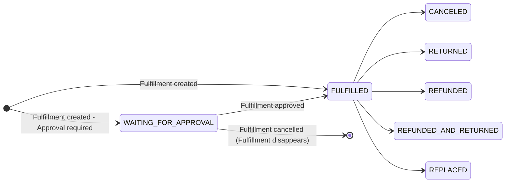

## Introduction

Order fulfillment is the process of handling and delivering goods to customers. 
In Saleor, fulfillments represent the shipping and logistics stage of an order.

#### When are fulfillments created?

Fulfillments are created after an order is confirmed (reaches the `UNFULFILLED` status). This can happen in two ways:
- Automatically after checkout completion (if [`channel.orderSettings.automaticallyConfirmAllNewOrders`](api-reference/miscellaneous/objects/order-settings.mdx#ordersettingsautomaticallyconfirmallnewordersboolean---) is enabled)
- Manually through the [`orderConfirm`](/api-reference/orders/mutations/order-confirm) mutation

For more details about order statuses and their transitions, see the [Order Status lifecycle](order-status.mdx).

#### Order-Fulfillment Relationship

An order can have multiple fulfillments, each linked to specific order lines and warehouses. This one-to-many relationship allows for:
- Shipping items from multiple locations
- Partially fulfilling orders (e.g., when some items are damaged in stock)
- Handling split shipments for different delivery dates
- Managing returns and replacements independently

Each fulfillment affects the order's status:
- Creating a fulfillment moves the order to `PARTIALLY_FULFILLED` or `FULFILLED` status
- Canceling all fulfillments returns the order to `UNFULFILLED` status
- Returning items can move the order to `PARTIALLY_RETURNED` or `RETURNED` status

## Fulfillment Lifecycle
Possible [`Fulfillment statuses`](/api-reference/orders/enums/fulfillment-status)


### Initial Fulfillment Status
- **FULFILLED** → The default status when fulfillment is created.
- **WAITING_FOR_APPROVAL** → The fulfillment is created but awaits approval before being processed. 
Approval can be done by a staff user or an app. 
You can enable this flow by updating the 
[`shop.fulfillmentAutoApprove`](/api-reference/miscellaneous/objects/shop#shopfulfillmentautoapproveboolean---). 
When set to false, fulfillments will remain in WAITING_FOR_APPROVAL until approved by an authorized entity.

### Status Transitions
**If fulfillment is in WAITING_FOR_APPROVAL**:
   - Running [`orderFulfillmentApprove`](/api-reference/orders/mutations/order-fulfillment-approve) changes status to **FULFILLED**.
   - Running [`orderFulfillmentCancel`](/api-reference/orders/mutations/order-fulfillment-cancel) **removes the fulfillment**.

**If fulfillment is in FULFILLED**:
   - Running [`orderFulfillmentCancel`](/api-reference/orders/mutations/order-fulfillment-cancel) changes status to **CANCELED**.
   - Running [`orderFulfillmentReturnProducts`](/api-reference/orders/mutations/order-fulfillment-return-products) changes status based on the request:
     - **RETURNED** → If only a return was requested.
     - **REPLACED** → If a replacement was requested.
   - Running [`orderFulfillmentRefundProducts`](/api-reference/orders/mutations/order-fulfillment-refund-products) changes status based on the request:
     - **REFUNDED** → If only a refund was requested.
     - **REFUNDED_AND_RETURNED** → If both return and refund were requested.

### Order Line Fulfillment Status

Each order line maintains its own fulfillment status through two key fields:
- [`OrderLine.quantityFulfilled`](/api-reference/orders/objects/order-line#orderlinequantityfulfilledint---) - The number of items that have been fulfilled
- [`OrderLine.quantityToFulfill`](/api-reference/orders/objects/order-line#orderlinequantitytofulfillint---) - The number of items still pending fulfillment

This status tracking allows you to:
- Monitor partial fulfillments
- Track fulfillment progress across multiple shipments
- Handle split shipments from different warehouses
- Manage returns and replacements accurately

Example of order line fulfillment status in a response:
```json
"lines": [
  {
    "id": "T3JkZXJMaW5lOmZlMWUwZjdjLWNjNDAtNDM3OC04OWNhLWVhZDYzNWJhMTA2NQ==",
    "isShippingRequired": true,
    "productName": "Apple Juice",
    "quantity": 2,
    "allocations": [],
    "quantityFulfilled": 0,
    "quantityToFulfill": 2,
    "__typename": "OrderLine"
  }
]
```

### Stock Impact

The impact of fulfillments on stock depends on whether inventory tracking is enabled for the product variant ([`ProductVariant.trackInventory`](/api-reference/products/objects/product-variant#productvarianttrackinventoryboolean---)).

- When `trackInventory` is enabled:
  - Creating a fulfillment reduces stock in the specified warehouse and releases the stock allocation
  - Canceling a fulfillment restores stock to the warehouse and restore the stock allocation
  - Returns require manual stock restoration after staff review (this is by design to allow staff to review returned items before deciding if they can be resold)
- When `trackInventory` is disabled:
  - No stock changes occur for any fulfillment operation

#### Warehouse Selection for Fulfillment
- Saleor dashboard may suggest warehouses based on stock allocation
- You can manually select warehouses when creating fulfillments

#### Stock Level Overrides
- The `allowStockToBeExceeded` parameter in the [`orderFulfill`](/api-reference/orders/mutations/order-fulfill) mutation allows creating fulfillments even when stock is insufficient

:::info

Fulfillment operations require the [`MANAGE_ORDERS`](developer/permissions.mdx#available-permissions) permission.

:::
## API
### Create Fulfillment

Fulfillments are created using the GraphQL mutation [`orderFulfill`](/api-reference/orders/mutations/order-fulfill). This operation allows you to process and ship items from your warehouses to customers.

**Required Fields**

Each fulfillment requires the following information:

- `orderLineID` - The unique identifier of the order line to fulfill
- `quantity` - The number of items to fulfill from this order line
- `warehouseID` - The ID of the warehouse from which the items will be shipped

**Optional Fields**

You can enhance the fulfillment process with these additional options:

- `notifyCustomer` - When enabled, sends an email notification to the customer
- `allowStockToBeExceeded` - Allows creating a fulfillment even when stock is insufficient
  - Useful for backorders or dropshipping scenarios
  - Should be used with caution as it can cause negative stock value
  - We recommend testing this behavior with both track inventory enabled and disabled
- `trackingNumber` - The shipping tracking number
  - Can be provided during fulfillment creation
  - Can be updated later using the [`orderFulfillmentUpdateTracking`](/api-reference/orders/mutations/order-fulfillment-update-tracking) mutation


Here's an example of creating a fulfillment:

```graphql
mutation FulfillOrder {
  orderFulfill(
    order: "T3JkZXI6OTE3Yjc2NDQtY2Q0Zi00ZjcyLTkzNjktMGNhYTk4ODEyNDQy"
    input: {lines: [{orderLineId: "T3JkZXJMaW5lOjM1YzEwNjNkLTYyNjQtNGExMi1hYzBlLWRhMzg1ZDM3ZGRhNA==", stocks: [{quantity: 2, warehouse: "V2FyZWhvdXNlOjc1MjYwYWRjLTJjZjAtNGQ0ZC1hOTM5LTBmZGY2Y2FlYjBjMQ=="}]}, {orderLineId: "T3JkZXJMaW5lOmJmYzQzMDg2LTlkM2ItNGM2MS1hMGJkLTRkNGE2YmIyNWZiNw==", stocks: [{quantity: 3, warehouse: "V2FyZWhvdXNlOjc1MjYwYWRjLTJjZjAtNGQ0ZC1hOTM5LTBmZGY2Y2FlYjBjMQ=="}]}], notifyCustomer: false, allowStockToBeExceeded: false, trackingNumber: "28074624654"}
  ) {
    errors {
      field
      code
      message
      warehouse
      orderLines
    }
    fulfillments {
      id
      created
      status
      trackingNumber
      warehouse {
        name
      }
      lines {
        id
        quantity
      }
    }
    order {
      status
      lines {
        id
        quantityFulfilled
        quantityToFulfill
      }
    }
    __typename
  }
}

```
**Example respose**
```json
{
  "data": {
    "orderFulfill": {
      "errors": [],
      "fulfillments": [
        {
          "id": "RnVsZmlsbG1lbnQ6MTEw",
          "created": "2025-04-03T08:49:13.057114+00:00",
          "status": "FULFILLED",
          "trackingNumber": "28074624654",
          "warehouse": {
            "name": "Americas"
          },
          "lines": [
            {
              "id": "RnVsZmlsbG1lbnRMaW5lOjEyOQ==",
              "quantity": 2
            },
            {
              "id": "RnVsZmlsbG1lbnRMaW5lOjEzMA==",
              "quantity": 3
            }
          ]
        }
      ],
      "order": {
        "status": "FULFILLED",
        "lines": [
          {
            "id": "T3JkZXJMaW5lOjM1YzEwNjNkLTYyNjQtNGExMi1hYzBlLWRhMzg1ZDM3ZGRhNA==",
            "quantityFulfilled": 2,
            "quantityToFulfill": 0
          },
          {
            "id": "T3JkZXJMaW5lOmJmYzQzMDg2LTlkM2ItNGM2MS1hMGJkLTRkNGE2YmIyNWZiNw==",
            "quantityFulfilled": 3,
            "quantityToFulfill": 0
          }
        ]
      },
      "__typename": "OrderFulfill"
    }
  }
}
```

:::note
- Creating a fulfillment will trigger the following webhook events:
  - `FULFILLMENT_CREATED` (async): A new fulfillment is created
  - `ORDER_FULFILLED` (async): Order is fulfilled
  - `FULFILLMENT_TRACKING_NUMBER_UPDATED` (async): If tracking number is provided
  - `FULFILLMENT_APPROVED` (async): If auto-approval is enabled
- The order status will change to `FULFILLED` if all items are fulfilled
:::

### Cancel Fulfillment

Fulfillments can be canceled using the [`orderFulfillmentCancel`](/api-reference/orders/mutations/order-fulfillment-cancel) mutation. This operation is useful for handling shipping errors, customer cancellations, or when items need to be restocked.

**Required Fields**

- `id` - The unique identifier of the fulfillment to cancel
- `warehouseId` - The ID of the warehouse where the items should be restocked

Here's an example of cancelling a fulfillment:

```graphql
mutation OrderFulfillmentCancel {
  orderFulfillmentCancel(
    id: "RnVsZmlsbG1lbnQ6MTEw",
    input: {
      warehouseId: "V2FyZWhvdXNlOjc1MjYwYWRjLTJjZjAtNGQ0ZC1hOTM5LTBmZGY2Y2FlYjBjMQ=="
    }
  ) {
    errors {
      field
      code
      message
      orderLines
      warehouse
    }
    fulfillment {
      id
      created
      status
      trackingNumber
      warehouse {
        name
      }
      lines {
        id
        quantity
      }
    }
    order {
      status
      lines {
        id
        quantityFulfilled
        quantityToFulfill
      }
    }
    __typename
  }
}
```


**Example Response**

```json
{
  "data": {
    "orderFulfillmentCancel": {
      "errors": [],
      "fulfillment": {
        "id": "RnVsZmlsbG1lbnQ6MTEw",
        "created": "2025-04-03T08:49:13.057114+00:00",
        "status": "CANCELED",
        "trackingNumber": "28074624654",
        "warehouse": {
          "name": "Americas"
        },
        "lines": [
          {
            "id": "RnVsZmlsbG1lbnRMaW5lOjEyOQ==",
            "quantity": 2
          },
          {
            "id": "RnVsZmlsbG1lbnRMaW5lOjEzMA==",
            "quantity": 3
          }
        ]
      },
      "order": {
        "status": "UNFULFILLED",
        "lines": [
          {
            "id": "T3JkZXJMaW5lOjM1YzEwNjNkLTYyNjQtNGExMi1hYzBlLWRhMzg1ZDM3ZGRhNA==",
            "quantityFulfilled": 0,
            "quantityToFulfill": 2
          },
          {
            "id": "T3JkZXJMaW5lOmJmYzQzMDg2LTlkM2ItNGM2MS1hMGJkLTRkNGE2YmIyNWZiNw==",
            "quantityFulfilled": 0,
            "quantityToFulfill": 3
          }
        ]
      },
      "__typename": "FulfillmentCancel"
    }
  }
}
```

:::note
- Canceling a fulfillment will trigger the `FULFILLMENT_CANCELED` webhook event
- The order status will only change to `UNFULFILLED` if all fulfillments are canceled
:::

### Approve Fulfillment

Fulfillments can be approved using the [`orderFulfillmentApprove`](/api-reference/orders/mutations/order-fulfillment-approve) mutation. This operation is used when approval is required before processing a fulfillment.

**Required Fields**

- `id` - The unique identifier of the fulfillment to approve

**Optional Fields**

- `notifyCustomer` - When enabled, sends an email notification to the customer
- `allowStockToBeExceeded` - Allows approving a fulfillment even when stock is insufficient
  - Should be used with caution as it bypasses stock validation
  - We recommend testing this behavior with both track inventory enabled and disabled

Here's an example of approving a fulfillment:

```graphql
mutation OrderFulfillmentApprove {
  orderFulfillmentApprove(
    id: "RnVsZmlsbG1lbnQ6MTIw"
    notifyCustomer: true
    allowStockToBeExceeded: true
  ) {
    errors {
      field
      code
      message
      warehouse
      orderLines
    }
    fulfillment {
      id
      created
      status
      trackingNumber
      warehouse {
        name
      }
      lines {
        id
        quantity
      }
    }
    order {
      status
      lines {
        id
        quantityFulfilled
        quantityToFulfill
      }
    }
  }
}
```

**Example Response**

```json
{
  "data": {
    "orderFulfillmentApprove": {
      "errors": [],
      "fulfillment": {
        "id": "RnVsZmlsbG1lbnQ6MTIw",
        "created": "2025-04-03T11:07:49.188441+00:00",
        "status": "FULFILLED",
        "trackingNumber": "",
        "warehouse": {
          "name": "Americas"
        },
        "lines": [
          {
            "id": "RnVsZmlsbG1lbnRMaW5lOjE0Nw==",
            "quantity": 2
          },
          {
            "id": "RnVsZmlsbG1lbnRMaW5lOjE0OA==",
            "quantity": 3
          }
        ]
      },
      "order": {
        "status": "FULFILLED",
        "lines": [
          {
            "id": "T3JkZXJMaW5lOmVhMjVjMDA2LWM1NzktNDZjYS1hZTM2LTNlMzVjYzgwOTNkMw==",
            "quantityFulfilled": 2,
            "quantityToFulfill": 0
          },
          {
            "id": "T3JkZXJMaW5lOjhjZjY5ZGEzLWFkNWItNGM0NS1iOGE0LTQ2YWZmN2JmOGQ1Mw==",
            "quantityFulfilled": 3,
            "quantityToFulfill": 0
          }
        ]
      }
    }
  }
}
```

:::note
- Approving a fulfillment will trigger the `FULFILLMENT_APPROVED` webhook event
- The order status will change to `FULFILLED` if all items are fulfilled
- Fulfillment approval can be enabled/disabled using the `shop.fulfillmentAutoApprove` setting in shop settings
:::

### Update Tracking Number

The [`orderFulfillmentUpdateTracking`](/api-reference/orders/mutations/order-fulfillment-update-tracking) mutation allows you to update or add a tracking number to an existing fulfillment. This is useful when:
- The tracking number becomes available after the initial fulfillment creation
- You need to update an incorrect tracking number
- You're using a shipping provider that assigns tracking numbers after shipment

**Required Fields** 

- `id` - The unique identifier of the fulfillment to update
- `trackingNumber` - The new tracking number to set

**Optional Fields**

- `notifyCustomer` - When enabled, sends an email notification to the customer with the updated tracking information

Here's an example of updating tracking number for fulfillment:

```graphql
mutation OrderFulfillmentUpdateTracking {
  orderFulfillmentUpdateTracking(
    id: "RnVsZmlsbG1lbnQ6MTIw"
    input: {trackingNumber: "12345678", notifyCustomer: true}
  ) {
    errors {
      field
      code
      message
    }
    fulfillment {
      id
      status
      trackingNumber
    }
    order {
      status
      lines {
        id
        quantityFulfilled
        quantityToFulfill
      }
    }
    __typename
  }
}
```


**Example Response**

```json
{
  "data": {
    "orderFulfillmentUpdateTracking": {
      "errors": [],
      "fulfillment": {
        "id": "RnVsZmlsbG1lbnQ6MTIw",
        "status": "FULFILLED",
        "trackingNumber": "12345678"
      },
      "order": {
        "status": "FULFILLED",
        "lines": [
          {
            "id": "T3JkZXJMaW5lOmVhMjVjMDA2LWM1NzktNDZjYS1hZTM2LTNlMzVjYzgwOTNkMw==",
            "quantityFulfilled": 2,
            "quantityToFulfill": 0
          },
          {
            "id": "T3JkZXJMaW5lOjhjZjY5ZGEzLWFkNWItNGM0NS1iOGE0LTQ2YWZmN2JmOGQ1Mw==",
            "quantityFulfilled": 3,
            "quantityToFulfill": 0
          }
        ]
      },
      "__typename": "FulfillmentUpdateTracking"
    }
  }
}
```

:::note
- Updating a tracking number will trigger the `FULFILLMENT_TRACKING_NUMBER_UPDATED` webhook event
- The tracking number can be updated multiple times if needed
- When `notifyCustomer` is enabled, the customer will receive an email with the updated tracking information
- The tracking number can be set during initial fulfillment creation or updated later using this mutation
:::

## Fulfillment Webhooks

Fulfillment operations trigger various webhook events (async) that you can use to track and respond to changes:

**Fulfillment Creation**
- `FULFILLMENT_CREATED`: Triggered when a new fulfillment is created
- `ORDER_FULFILLED`: Triggered when an order is fulfilled
- `FULFILLMENT_APPROVED`: Triggered when a fulfillment is approved

**Fulfillment Updates**
- `FULFILLMENT_TRACKING_NUMBER_UPDATED`: Triggered when a tracking number is updated
- `FULFILLMENT_METADATA_UPDATED`: Triggered when fulfillment metadata is updated

**Fulfillment Cancellation**
- `FULFILLMENT_CANCELED`: Triggered when a fulfillment is cancelled

You can learn more about webhooks [here](developer/extending/webhooks/asynchronous-events.mdx).

## Fulfillment Settings
Some settings in Saleor can affect how fulfillments are created and processed. These settings can be configured at different levels:

### Shop Settings

[`Shop.automaticFulfillmentDigitalProducts`](/api-reference/miscellaneous/objects/shop#shopautomaticfulfillmentdigitalproductsboolean--)
  - When enabled, all digital products are automatically fulfilled
  - Useful for instant delivery of digital content
  - Bypasses the manual fulfillment process for digital products

[`Shop.fulfillmentAutoApprove`](/api-reference/miscellaneous/objects/shop#shopfulfillmentautoapproveboolean---)
  - Controls whether new fulfillments require approval
  - When enabled, fulfillments are automatically approved
  - When disabled, fulfillments remain in `WAITING_FOR_APPROVAL` status until approved

[`Shop.fulfillmentAllowUnpaid`](/api-reference/miscellaneous/objects/shop#shopfulfillmentallowunpaidboolean---)
  - When enabled, allows creating fulfillments for unpaid orders
  - Useful for certain business models or special cases
  - Should be used with caution as it bypasses payment verification

### Channel Settings
[`OrderSettings.automaticallyFulfillNonShippableGiftCard`](/api-reference/miscellaneous/objects/order-settings#ordersettingsautomaticallyfulfillnonshippablegiftcardboolean---)
  - When enabled, gift card orders are automatically fulfilled
  - Default value is `true`
  - Applies only to non-shippable gift cards
  - Useful for instant delivery of digital gift cards

:::note
- These settings can be configured through the GraphQL API, some of them through the Saleor Dashboard
- Some settings may require specific permissions to modify
- Changes to these settings can affect the entire fulfillment workflow
:::

## Edge Cases & Exceptions

