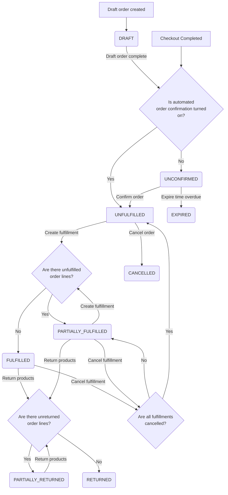
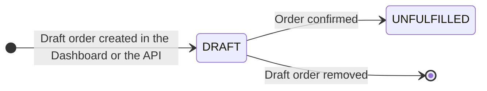
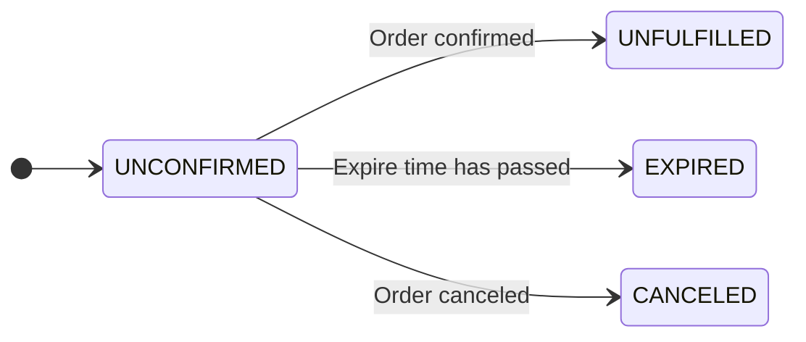
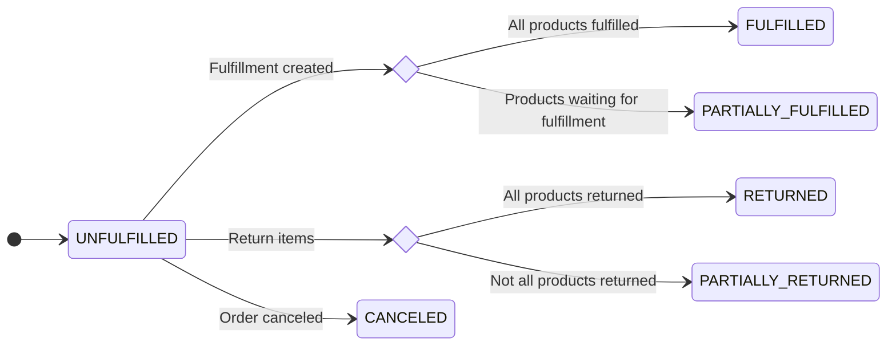
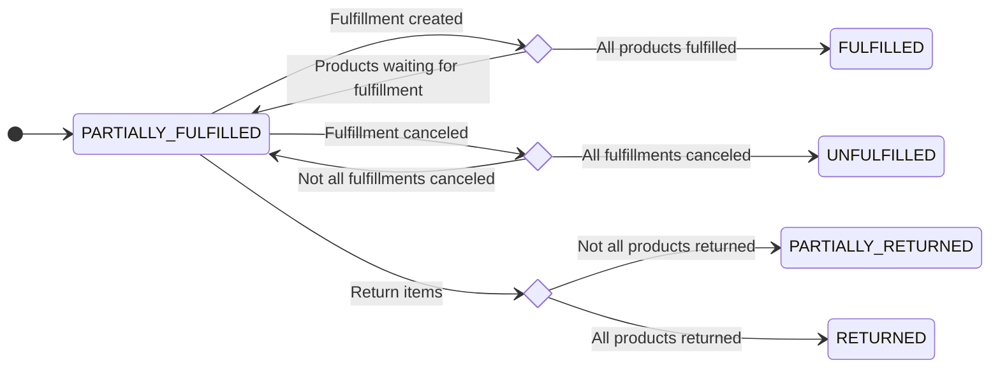
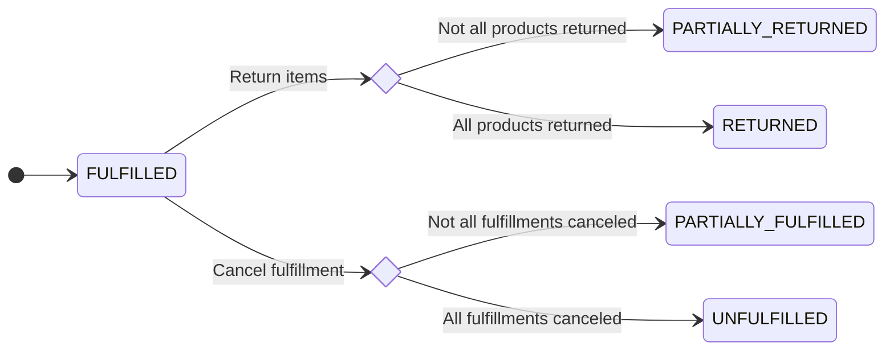
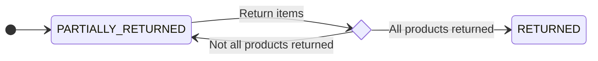

A typical order lifecycle begins with a customer finalizing the checkout process and ends with delivering the products. Between those two points, the order can go through several states. This article describes the possible states of an order and the transitions between them.

## Settings

Several settings can affect the behavior of the order. You can find them in the [`channel.orderSettings`](api-reference/miscellaneous/objects/order-settings.mdx) object.

## Order status

Below is a diagram that shows the possible states of an order and the transitions between them. Names of the states are drawn from the [`OrderStatus`](api-reference/orders/enums/order-status.mdx) enum. Each state is described in detail in the following sections.

The order is initiated either by creating a draft version or completing a checkout.

### DRAFT

- Result of [`draftOrderCreate`](api-reference/orders/mutations/draft-order-create.mdx) mutation.
- Item stocks are not allocated.

#### Available transitions

- Remove: removed `DRAFT` orders are not visible in the dashboard.
- Finalize: the status will change to `UNFULFILLED`.

### UNCONFIRMED

- Item stocks are allocated for ProductVariants with `ProductVariant.trackInventory` turned on.
- this state is the result of [`checkoutComplete`](api-reference/checkout/mutations/checkout-complete.mdx) mutation, if [`channel.orderSettings.automaticallyConfirmAllNewOrders`](api-reference/miscellaneous/objects/order-settings.mdx#ordersettingsautomaticallyconfirmallnewordersboolean---) is set to `False`.

#### Available transitions

- Confirm: the status will change to `UNFULFILLED`.
- Expire: the status will automatically change to `EXPIRED` if the order is older than [`channel.orderSettings.expireOrdersAfter`](api-reference/miscellaneous/objects/order-settings.mdx#ordersettingsexpireordersafterminute--) minutes. This will happen automatically only if no transaction attempts were made.
- Cancel: the status will change to `CANCELED` and order will be visible in the dashboard.

### UNFULFILLED

- Item stocks are allocated for ProductVariants with `ProductVariant.trackInventory` turned on.
- Result of [`orderConfirm`](api-reference/orders/mutations/order-confirm.mdx) mutation or finishing a checkout in a channel with automatic confirmation.

#### Available transitions

- Fulfill: creating fulfillments will result in transition to `PARTIALLY_FULFILLED` or `FULFILLED` state, depending on whether there are any unfulfilled items left. For items with inventory tracking enabled, this will also deduct stock quantity from warehouses and release allocations.
- Return: creating returns will result in transition to `PARTIALLY_RETURNED` or `RETURNED` state. Returning items will not modify stock.
- Cancel: the status will change to `CANCELED` and order will be visible in the dashboard.

### PARTIALLY_FULFILLED

- Stocks of unfulfilled items are allocated, and fulfilled items are deducted from the stock quantity.
- Result of [`orderFulfill`](api-reference/orders/mutations/order-fulfill.mdx) mutation.

#### Available actions

- Fulfill: creating fulfillments will result in transition to `PARTIALLY_FULFILLED` or `FULFILLED` state, depending on whether there are any unfulfilled items left. For items with inventory tracking enabled, this will also deduct stock quantity from warehouses and release allocations.
- Cancel fulfillment: cancelling all fulfillments will result in transition to `UNFULFILLED` state. Items with inventory tracking enabled will be restocked in the warehouse specified in the input of `orderFulfillmentCancel` mutation.
- Return: creating returns will result in transition to `PARTIALLY_RETURNED` or `RETURNED` state. Returning items will not modify stock.

### FULFILLED

- No allocations, stocks already deducted from warehouses.
- Result of [`orderFulfill`](api-reference/orders/mutations/order-fulfill.mdx) mutation.
- Purpose: order is fulfilled, waiting for optional operations: return, refund.

### PARTIALLY_RETURNED

- Some of the items were marked as returned.
- Return procedure does not modify stocks automatically.

### RETURNED

- All of the items were marked as returned.

### EXPIRED

- Stock allocations are released.
- It will happen automatically based on channel settings.

#### Available actions

This state cannot be changed.

### CANCELED

- Stock allocations are released.
- Result of [`orderCancel`](api-reference/orders/mutations/order-cancel.mdx).
- Possible previous states: UNCONFIRMED, UNFULFILLED.

#### Available actions

This state cannot be changed.
