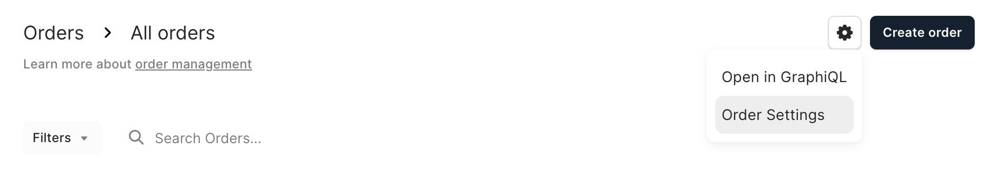

# Order Overview

Orders capture the purchasing process between customers and the store. They record what items were bought, at what price, by whom, and how they should be delivered. Orders are created when [customers finalize their checkout](/developer/checkout/lifecycle.mdx#completing-checkout) or when staff members finalize draft orders in the dashboard.

Each order belongs to a specific sales channel and stores details such as product selections, pricing, customer information, shipping requirements, and fulfillment status.

## Lifecycle

Orders progress through various states during their lifecycle, including unfulfilled, partially fulfilled, fulfilled, and potentially returned or cancelled. For a detailed explanation of order states and the transitions between them, refer to the [Order Status](/developer/order/order-status) documentation.

Orders can be converted back to checkouts for reordering purposes using the functionality described in [Order to Checkout](/developer/order/order-to-checkout).

Orders can also expire if they remain unpaid for a configurable period. The [Order Expiration](/developer/order/order-expiration) documentation covers the configuration and behavior of this process.

## Settings

Order behavior in Saleor is influenced by settings configured at both the **channel** and **store (shop)** levels. These settings determine how orders are processed, paid, and fulfilled.

### Channel-Specific Settings

- **[`automaticallyConfirmAllNewOrders`](/api-reference/miscellaneous/objects/order-settings.mdx#ordersettingsautomaticallyconfirmallnewordersboolean---)**: When enabled, orders are automatically confirmed upon checkout completion. When disabled, orders remain in the `UNCONFIRMED` state until manually confirmed.
- **[`automaticallyFulfillNonShippableGiftCard`](/api-reference/miscellaneous/objects/order-settings#ordersettingsautomaticallyfulfillnonshippablegiftcardboolean---)**: When enabled non shippable gift cards are automatically fulfilled
- **[`allowUnpaidOrders`](/api-reference/miscellaneous/objects/order-settings.mdx#ordersettingsallowunpaidordersboolean---)**: Determines whether a checkout must be paid before an order can be created.
- **[`expireOrdersAfter`](/api-reference/miscellaneous/objects/order-settings.mdx#ordersettingsexpireordersafterminute--)**: Configures how long unpaid orders remain active before being marked as expired. Set in minutes.
- **[`deleteExpiredOrdersAfter`](/api-reference/miscellaneous/objects/order-settings.mdx#ordersettingsdeleteexpiredordersafterday---)**: Determines how many days after expiration an order will be permanently deleted from the system.
- **[`automaticallyFulfillNonShippableGiftCard`](/api-reference/miscellaneous/objects/order-settings.mdx#ordersettingsautomaticallyfulfillnonshippablegiftcardboolean---)**: When enabled, all non-shippable gift card orders will be fulfilled automatically.
- **[`markAsPaidStrategy`](/api-reference/miscellaneous/objects/order-settings.mdx#ordersettingsmarkaspaidstrategymarkaspaidstrategyenum---)**: Determines whether a Payment or Transaction is created when an order is manually marked as paid in Saleor Dashboard or using [`orderMarkAsPaid`](/api-reference/orders/mutations/order-mark-as-paid) mutation.
- **[`includeDraftOrderInVoucherUsage`](/api-reference/miscellaneous/objects/order-settings.mdx#ordersettingsincludedraftorderinvoucherusageboolean---)**: Determines if vouchers applied on draft orders should count toward voucher usage limits.

### Store-Level (Global) Settings
The following settings apply globally across all channels and are configured at the store (shop) level.
- **[`fulfillmentAutoApprove`](/api-reference/miscellaneous/objects/shop#shopfulfillmentautoapproveboolean---)**: When enabled new fulfillments require approval.
- **[`fulfillmentAllowUnpaid`](/api-reference/miscellaneous/objects/shop#shopfulfillmentallowunpaidboolean---)**: When enabled, allows creating fulfillments for unpaid orders.

You can access them from the Order List Page by clicking the settings icon (⚙️) in the top-right corner.

## Historical Data Preservation

When products, variants, or shipping methods are deleted from the catalog, they remain visible in historical orders due to preserved data. This ensures that order history maintains an accurate record of what was purchased and how it was shipped at the time of the order. The following data is preserved:

- `shippingMethodName` or `collectionPointName` on the order level
- `productName` and `productSku` on order lines

This denormalization allows you to maintain a complete historical record of orders even after products, variants, or shipping methods are removed from the active catalog.
