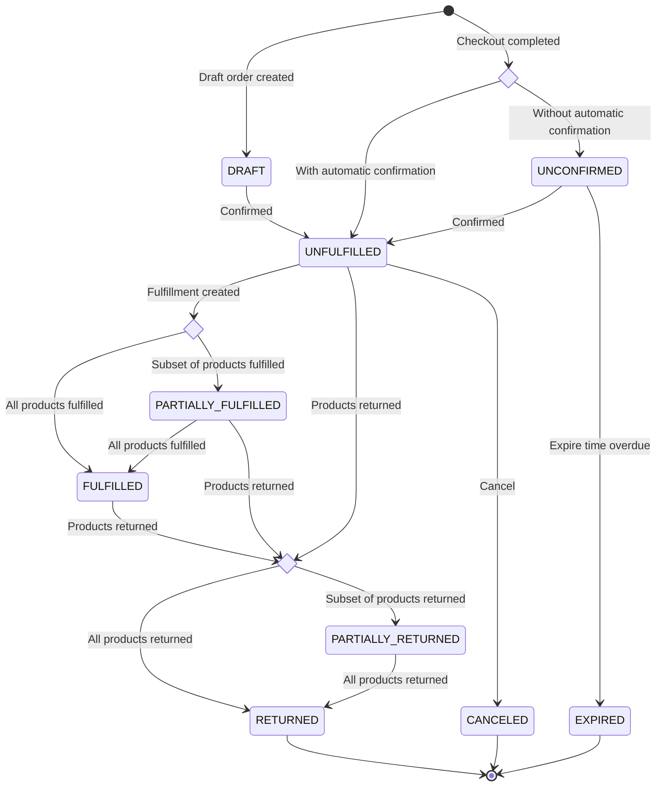
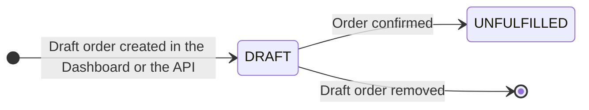
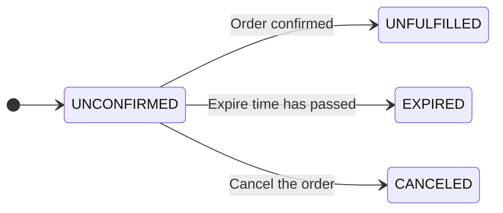
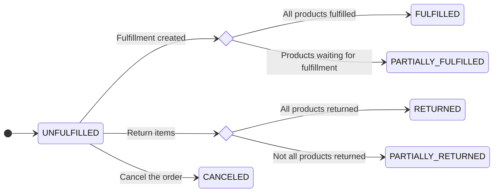
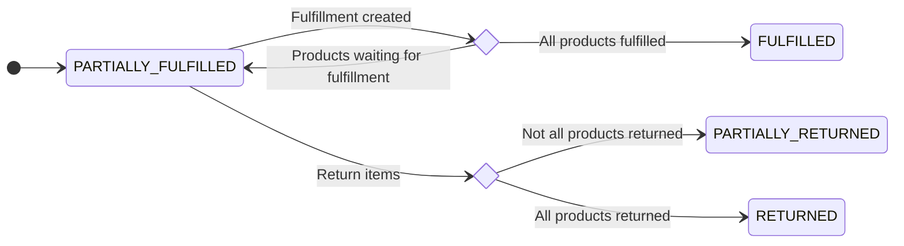
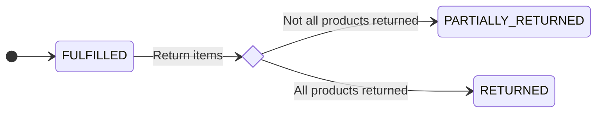
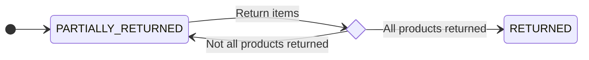
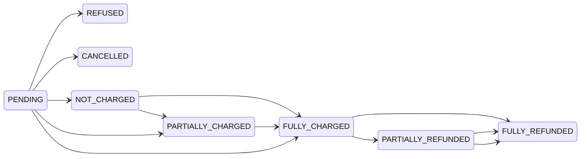
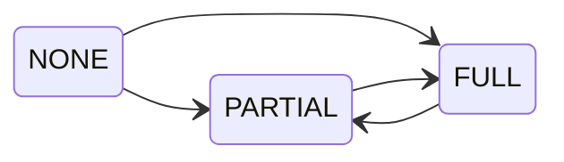
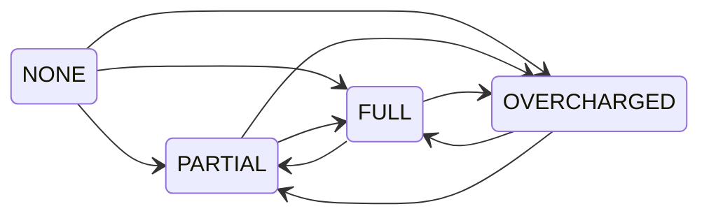

## Introduction

- [Finalizing checkout](developer/checkout/finalizing.mdx)
- Creating a draft order

Settings which have an impact on order status:

- `channel.orderSettings.allowUnpaidOrders: True` - order can be created without payment
- `channel.orderSettings.expireOrdersAfter: 60` - order will be expired after 60 minutes
- `channel.orderSettings.automaticallyConfirmAllNewOrders` - `UNCONFIRMED` status is skipped and order is automatically CONFIRMED

## Order status

### DRAFT

- created by `orderDraftCreate`
- item stocks are allocated

#### Available transitions

- Remove: removed `DRAFT` orders are not visible in the dashboard
- Finalize: the state will be changed to `UNFULFILLED`

### UNCONFIRMED

- item stocks are allocated
- this state will occur when a channel has turned off automatic order confirmation is set to `False` as a result of `checkoutComplete` mutation

#### Available transitions

- Confirm: the state will be changed to `UNFULFILLED`
- Expire: the state will be automatically changed to `EXPIRED` if order is older than `channel.orderSettings.expireOrdersAfter` minutes. This will trigger automatically only if no transaction attempts were made.
- Cancel: the state will be changed to `CANCELED` and order will be visible in the dashboard

### UNFULFILLED

- Stocks allocated
- created by `orderConfirm` mutation or finishing checkout in a channel with automatic confirmation

#### Available transitions

- Fulfill: creating fulfillments will result in transition to `PARTIALLY_FULFILLED` or `FULFILLED` state, depending on if there are any unfulfilled items left. This will also deduct stock quantity from warehouses and release allocations.
- Return: creating returns will result in transition to `PARTIALLY_RETURNED` or `RETURNED` state
- Cancel: the state will be changed to `CANCELED` and order will be visible in the dashboard

### PARTIALLY_FULFILLED

- Stocks of unfulfilled items are allocated, and fulfilled are deducted from the stock quantity
- created by: `fulfillmentCreate`

#### Available actions

- Fulfill: creating fulfillments will result in transition to `PARTIALLY_FULFILLED` or `FULFILLED` state, depending on if there are any unfulfilled items left. This will also deduct stock quantity from warehouses and release allocations.
- Return: creating returns will result in transition to `PARTIALLY_RETURNED` or `RETURNED` state

### FULFILLED

- No allocations, stocks already deducted from warehouses
- created by: `fulfillmentCreate`
- purpose: order fulfilled, waiting for optional operations: return, refund

### PARTIALLY_RETURNED

- Some of the items were marked as returned
- Return procedure does not modify stocks automatically

### RETURNED

- All of the items were marked as returned

### EXPIRED

- Stock allocations released
- Will create automatically based on channel settings

#### Available actions

This state cannot be changed.

### CANCELED

- Stock allocations released
- created by: `orderCancel`
- Possible previous states: UNCONFIRMED, UNFULFILLED

#### Available actions

This state cannot be changed.

## Payment status

Payment status represents the combined payment and refund status of the order. It's calculated based on:

- `order.total` value
- status of the payments
- refunds granted for the order

When no refunds is created, the status is one of the following:

- `PENDING`: waiting for the response from the payment gateway
- `REFUSED`: payment refused by the payment gateway
- `CANCELLED`: payment has been canceled
- `NOT_CHARGED`: the amount is authorized but not charged
- `PARTIALLY_CHARGED`: the charged amount does not cover the order total
- `FULLY_CHARGED`: charged funds fully cover the order total

Creating the refund will change the status to:

- `PARTIALLY_REFUNDED`: the refunded amount does not cover the order total
- `FULLY_REFUNDED`: refunded funds fully cover the order total

## Authorize status

Charge status depends on:

- the sum of **charged** transactions
- the sum of **authorized** transactions
- the `order.totalGrantedRefund` value
- the `order.total` value

The difference between `total` and `totalGrantedRefund` is compared with the sum of **charged** and **authorized** transactions. The result is one of the states: `PARTIAL`, `FULL`. If no transaction has been charged, the status is `NONE`.

### Available transitions

- Status is updated on operations that change the order's `total`, `totalGrantedRefund` or transactions

## Charge status

Charge status depends on:

- the sum of **charged** transactions
- the `order.totalGrantedRefund` value
- the `order.total` value

The difference between `total` and `totalGrantedRefund` is compared with **charged** transactions and the result is one of the states: `PARTIAL`, `FULL`, `OVERCHARGED`. If no transaction has been charged, the status is `NONE`.

### Available transitions

- Status is updated on operations that change the order's `total`, `totalGrantedRefund` or transactions
