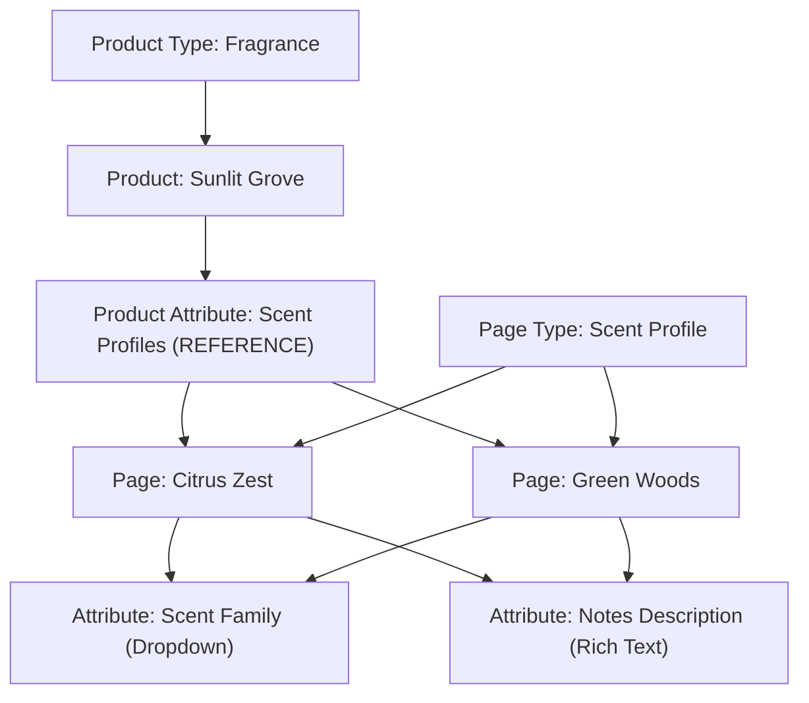

# Pages

## Overview

Pages provide a flexible mechanism for managing both traditional content and structured data entities that extend your commerce domain beyond the standard Product/Category/Collection model. Think of them as structured documents within Saleor.

## Core Concepts

### Page Types

A Page Type defines the schema for a group of pages. It determines what attributes a page will have and how the page can be used. Think of Page Types as templates or models. For instance, a "Blog Post" page type might have attributes like `Author`, `PublishedDate`, and `Tags`.

You must create a Page Type before you can create any Page.

:::info

You can manage Page Types in the Dashboard's -> _Configuration_ -> _Page Types_ view.

:::

### Attributes

Attributes define typed fields that can be reused across products and pages. When creating an attribute, it must be explicitly [assigned to either `PRODUCT` or `PAGE` type](api-reference/attributes/enums/attribute-type-enum.mdx).

### Pages

A Page is an instance of a Page Type, enriched with specific attribute values and optionally a rich content block. Pages can be created, linked to other entities, published, or removed.


:::info

You can manage Pages in the Dashboard's -> _Content_ view.

:::

## Example Use Case

**Modeling Scent Profiles in Perfume Store**

Consider a specialized perfume store, where each product is a fragrance. Fragrances are complex blends, often composed of multiple scent profiles like "Citrus", "Woody", or "Floral". These profiles are shared across products.

Here's a breakdown of the entities and relationships:




- **Product Type:** `Fragrance`
- **Product Attribute:** `Scent Profiles`
  - Type: `REFERENCE`
  - Entity: `Page`
- **Page Type:** `Scent Profile`
- **Page Attributes:**
  - `Scent Family` – Dropdown field (e.g., _Citrus_, _Woody_, _Floral_)
  - `Notes Description` – Rich text field (e.g., _Bright and zesty with a hint of green bitterness_)

For the fragrance **Sunlit Grove**, the following scent profiles might be selected:

- `Citrus Zest`
- `Green Woods`

Each of these is a **Page** of type `Scent Profile`, reused across multiple products and enriched with structured attributes.

In the storefront UI, this structure enables rich product pages that showcase the fragrance's composition. For example, the Sunlit Grove product page might display its scent profiles in a dedicated section, with each profile (Citrus Zest, Green Woods) showing its family type and detailed notes description.

## Lifecycle

### Creating a Page

To create a page through API, you must first define the page type and any required attributes.


:::info

Creating a page requires the [`MANAGE_PAGES` permission](developer/permissions.mdx#available-permissions).

:::

```graphql
mutation {
  pageCreate(input: {
    title: "Citrus Zest",
    slug: "citrus-zest",
    isPublished: true,
    pageType: "UGFnZVR5cGU6NDY=",
  }) {
    page {
      id
      title
    }
    errors {
      field
      message
    }
  }
}
```


### Getting Pages

You can get individual page details using the `page` query:

```graphql
query GetPage($id: ID!) {
  page(id: $id) {
    id
    title
    content
    attributes {
      attribute {
        name
        slug
      }
      values {
        name
      }
    }
  }
}
```

or you can get multiple pages using the `pages` query:

```graphql
query GetPages($ids: [ID!]!) {
  pages(ids: $ids) {
    id
    title
    attributes {
      attribute {
        name
        slug
      }
      values {
        name
      }
    }
  }
}
```

### Linking Pages

Pages can reference or be referenced by other entities through attribute of type [REFERENCE](api-reference/attributes/enums/attribute-input-type-enum.mdx#attributeinputtypeenumreference). The selection of referenceable entities is determined by [`AttributeEntityTypeEnum`](api-reference/attributes/enums/attribute-entity-type-enum.mdx) and currently includes `PAGE`, `PRODUCT` and `PRODUCT_VARIANT`.

```graphql
mutation {
  productUpdate(id: "UHJvZHVjdElE", input: {
    attributes: [
      {
        id: "QXR0cmlidXRlSWQ=", # Product Attribute of type REFERENCE for scent profiles
        references: ["UGFnZUlE"] # ID of the Citrus Zest page
      }
    ]
  }) {
    product {
      id
      name
    }
    errors {
      field
      message
    }
  }
}
```

You can also model relationships between Pages using a reference attribute or by embedding slugs/IDs in the page metadata.

#### Querying Linked Entities

Below is an example of how to query the linked entities using the `product` query:

```graphql
query GetProductWithScentProfiles($productId: ID!) {
  product(id: $productId) {
    id
    name
    attributes {
      attribute {
        id
        slug # We are looking for "scent-profiles"
      }
      values {
        reference # This gives the Page ID
      }
    }
  }
}
```

The response will contain the ids of the linked pages. You can then use the [`page` query](#getting-pages) to get the details of the linked pages.

### Publishing Pages

Pages can be visible or hidden. You can control their visibility using:
- `isPublished` (Boolean): Sets current visibility.
- `publicationDate` (Date): Can schedule a future publication. The page won't appear on the storefront until this date.

:::info

If `isPublished` is false, only users with the [`MANAGE_PAGES`](developer/permissions.mdx#available-permissions) permission will be able to successfully retrieve it.

:::

You can update the value of those fields using `pageUpdate` mutation:

```graphql
mutation {
  pageUpdate(id: "UGFnZUlE", input: {
    isPublished: true,
    publicationDate: "2025-04-15"
  }) {
    page {
      id
      title
      isPublished
    }
    errors {
      field
      message
    }
  }
}
```

### Deleting Pages

Use `pageDelete` for single pages or `pageBulkDelete` for multiple. Deleting a Page is permanent. Deleting a Page Type might be restricted if Pages are using it.

```graphql
mutation DeletePage($id: ID!) {
  pageDelete(id: $id) {
    page { id }
    errors { ... }
  }
}

mutation DeleteMultiplePages($ids: [ID!]!) {
  pageBulkDelete(ids: $ids) {
    count
    errors { ... }
  }
}
```

## Webhooks

Here are the webhooks that are available for pages:

- [`PAGE_TYPE_CREATED`](/api-reference/pages/objects/page-type-created.mdx)
- [`PAGE_TYPE_UPDATED`](/api-reference/pages/objects/page-type-updated.mdx)
- [`PAGE_TYPE_DELETED`](/api-reference/pages/objects/page-type-deleted.mdx)
- [`PAGE_CREATED`](/api-reference/pages/objects/page-created.mdx)
- [`PAGE_UPDATED`](/api-reference/pages/objects/page-updated.mdx)
- [`PAGE_DELETED`](/api-reference/pages/objects/page-deleted.mdx)
