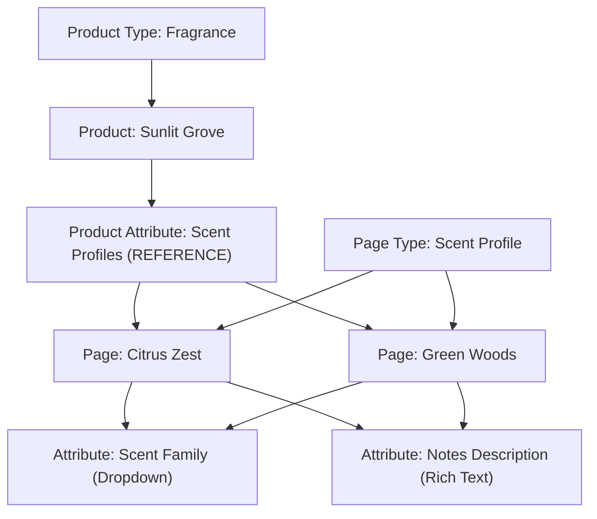

# Pages

## Overview

Pages provide a flexible mechanism for managing both traditional content and structured data entities that extend your commerce domain beyond the standard Product/Category/Collection model. Think of them as structured documents within Saleor.

## Core Concepts

### Page Types

A Page Type defines the schema for a group of pages. It determines what attributes a page will have and how the page can be used. Think of Page Types as templates or models. For instance, a "Blog Post" page type might have attributes like Author, PublishedDate, and Tags.

You must create a Page Type before you can create any Page.

Page Types can be managed in the Dashboard's -> _Configuration_ -> _Page Types_ view.

### Attributes

Attributes define typed fields that can be reused across products and pages. When creating an attribute, it must be explicitly assigned to either PRODUCT or PAGE type.

### Pages

A Page is an instance of a Page Type, enriched with specific attribute values and optionally a rich content block. Pages can be created, linked to other entities, published, or removed.

## Lifecycle

### Creating a Page

To create a page, you must first define the page type and any required attributes.

```graphql
mutation {
  pageCreate(input: {
    title: "Peanuts",
    slug: "peanuts",
    content: "Information about peanuts as an ingredient.",
    isPublished: true,
    pageType: "UGFnZVR5cGVJRA==",
    attributes: [
      {
        id: "QXR0cmlidXRlSWQ=", # e.g., allergen-info
        values: ["Contains traces of other nuts."]
      }
    ]
  }) {
    page {
      id
      title
    }
    errors {
      field
      message
    }
  }
}
```


### Getting Pages

### Linking a Page

Pages can reference or be referenced by other entities through attribute of type [REFERENCE](api-reference/attributes/enums/attribute-input-type-enum.mdx#attributeinputtypeenumreference). The selection of referenceable entities is determined by [`AttributeEntityTypeEnum`](api-reference/attributes/enums/attribute-entity-type-enum.mdx) and currently includes `PAGE`, `PRODUCT` and `PRODUCT_VARIANT`.

```graphql
mutation {
  productUpdate(id: "UHJvZHVjdElE", input: {
    attributes: [
      {
        id: "QXR0cmlidXRlSWQ=", # Product Attribute of type REFERENCE
        references: ["UGFnZUlE"] # ID of the Page
      }
    ]
  }) {
    product {
      id
      name
    }
    errors {
      field
      message
    }
  }
}
```

You can also model relationships between Pages using a reference attribute or by embedding slugs/IDs in the page metadata.

#### Querying Linked Entities

```graphql
query GetProductWithIngredients($productId: ID!) {
  product(id: $productId) {
    id
    name
    # ... other product fields
    attributes {
      attribute {
        id
        slug # We are looking for "ingredients"
      }
      values {
        # reference field contains the ID of the linked Page (Ingredient)
        reference # This gives the Page ID
        # To get full Page details, you need a separate query or use fragments if supported deeply
        # For simplicity, let's assume you fetch IDs here and query pages separately later,
        # OR a future Saleor might allow deeper fetching within the reference.
        # Example of what you *might* want (may require separate query):
        # referencedPage: page(id: reference) { ... } # Not standard GraphQL syntax in one go
      }
    }
    # A more direct way if available (hypothetical shortcut):
    # ingredients: attribute(slug: "ingredients") {
    #   references { # Assuming API allows fetching referenced entities directly
    #     ... on Page {
    #       id
    #       title
    #       slug
    #     }
    #   }
    # }
  }
}
```


### Publishing Pages

Pages can be draft or published. Control their visibility using:
- `isPublished` (Boolean): Sets current visibility.
- `publicationDate` (Date): Can schedule future publication. If set in the future, `isPublished` might be true, but the page won't appear on the storefront until this date.

`pageUpdate` can change these fields, like so:

```graphql
mutation {
  pageUpdate(id: "UGFnZUlE", input: {
    isPublished: true,
    publicationDate: "2025-04-15"
  }) {
    page {
      id
      title
      isPublished
    }
    errors {
      field
      message
    }
  }
}
```

### Deleting Pages

Use `pageDelete` for single pages or `pageBulkDelete` for multiple. Deleting a Page is permanent. Deleting a Page Type might be restricted if Pages are using it (VEIRFY).

```graphql
mutation DeletePage($id: ID!) {
  pageDelete(id: $id) {
    page { id } # Confirms which page was deleted
    errors { ... }
  }
}

mutation DeleteMultiplePages($ids: [ID!]!) {
  pageBulkDelete(ids: $ids) {
    count
    errors { ... }
  }
}
```

## Example Use Cases

### Modeling Scent Profiles in a Perfume Store

Consider a specialized perfume store, where each product is a fragrance. Fragrances are complex blends, often composed of multiple scent profiles like "Citrus", "Woody", or "Floral". These profiles are shared across products.

Here is how to model this in Saleor:



Products of type _Fragrance_ have an attribute called _Scent Profiles_, which references reusable content pages.

Each scent profile is a page of the Scent Profile type.

These pages are structured with:

- Scent Family - a dropdown field (e.g., "Citrus", "Woody", "Floral")

- Notes Description - a rich text field (e.g., "Bright and zesty with a hint of green bitterness")

For example, the fragrance _"Sunlit Grove"_ might include:

- A Citrus Zest scent profile

- A Green Woods scent profile

