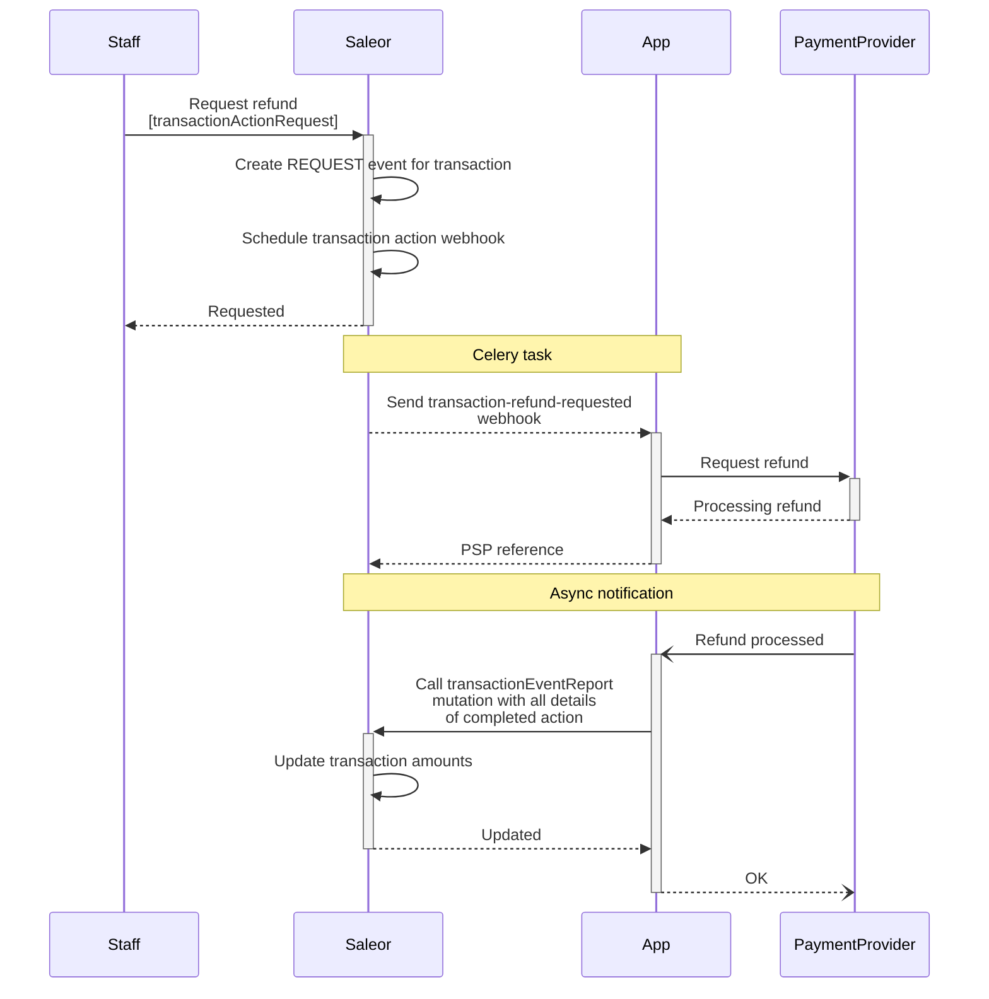
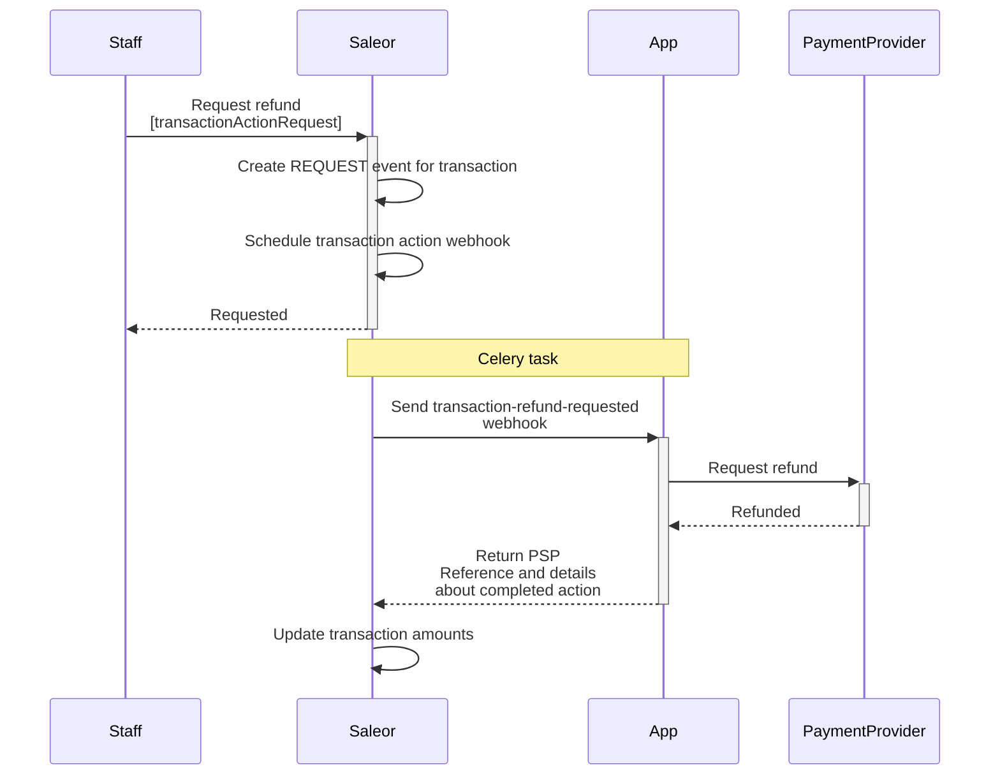
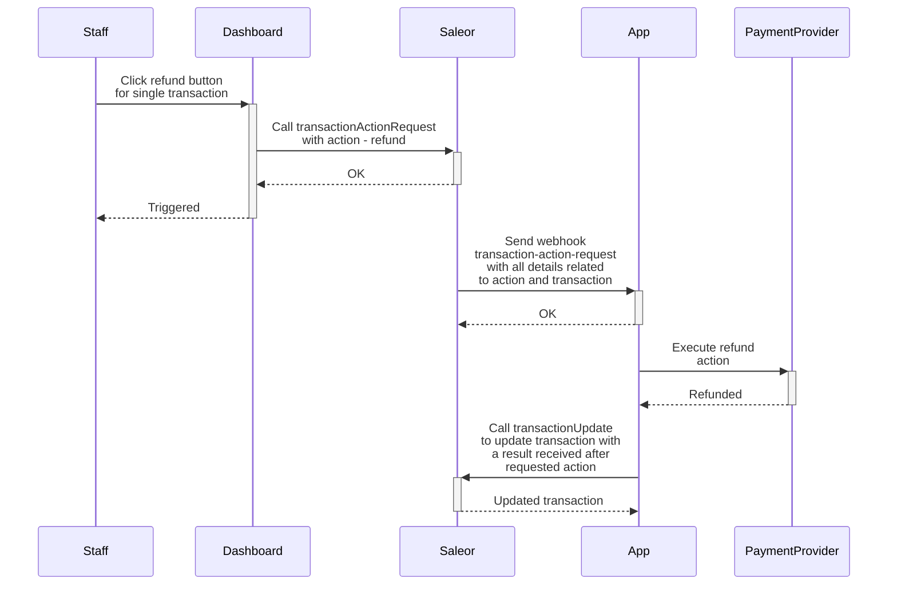

## Introduction

The process below describes the key milestones in the Saleor payment flow.
Additional steps may also occur along the way; however, the purpose of this instruction is to
deliver a base reference for the user to work with.

Saleor distinguishes two different ways of processing a payment:

- By using a [plugin](extending/overview#plugins) embedded in the Saleor code.
- By using a [Saleor App](extending/overview#apps-recommended) (recommended).

## Saleor App (recommended)

This section describes the flow where the payment process is handled by an external Saleor App such as [Checkout](https://github.com/saleor/react-storefront/tree/canary/apps/checkout).
In this case, Saleor expects to receive a result of the payment transaction processed by the Saleor App.

### Creating transaction

:::info

This feature was introduced in **Saleor 3.4**.

:::

:::caution

This feature is currently in **Feature Preview**. This part of Saleor is not complete
and subject to change but is available to experiment and provide feedback.

:::

Transaction stores details of a payment transaction attached to an order or a checkout:

The [transactionCreate](../api-reference/payments/mutations/transaction-create) mutation takes the following arguments:

- `id`: The ID of the checkout or order.
- `transaction`: Input data required to create a new transaction object.
- `transactionEvent`: Data that defines a transaction event. It can be used to provide more context about the current state of the transaction.

The following example shows how you can use the [transactionCreate](../api-reference/payments/mutations/transaction-create) mutation to create a new transaction.

The transaction was authorized, and the payment was made with a credit card. The actions that can be called from Saleor are: `CANCEL` and `CHARGE`.
The authorized amount is **$99**.

#### Saleor 3.13+

```graphql
mutation {
  transactionCreate(
    id: "Q2hlY2tvdXQ6MWQzNmU5YzctYWEwYS00NzM5LTk0MGQtNzdjNmU4Mjc5YmQ0"
    transaction: {
      name: "Credit card"
      message: "Authorized"
      pspReference: "PSP-ref123"
      availableActions: [CANCEL, CHARGE]
      amountAuthorized: { currency: "USD", amount: 99 }
      externalUrl: "https://saleor.io/payment-id/123"
    }
  ) {
    transaction {
      id
    }
  }
}
```

The response would look like this:

```json
{
  "data": {
    "transactionCreate": {
      "transaction": {
        "id": "VHJhbnNhY3Rpb25JdGVtOjE="
      }
    }
  },
  "extensions": {
    "cost": {
      "requestedQueryCost": 0,
      "maximumAvailable": 50000
    }
  }
}
```

#### Saleor 3.4 (deprecated)

```graphql
mutation {
  transactionCreate(
    id: "Q2hlY2tvdXQ6MWQzNmU5YzctYWEwYS00NzM5LTk0MGQtNzdjNmU4Mjc5YmQ0"
    transaction: {
      status: "Authorized"
      type: "Credit card"
      reference: "PSP-ref123"
      availableActions: [CANCEL, CHARGE]
      amountAuthorized: { currency: "USD", amount: 99 }
    }
    transactionEvent: {
      status: SUCCESS
      name: "Authorized credit card"
      reference: "PSP-ref123"
    }
  ) {
    transaction {
      id
    }
  }
}
```

The response would look like this:

```json
{
  "data": {
    "transactionCreate": {
      "transaction": {
        "id": "VHJhbnNhY3Rpb25JdGVtOjE="
      }
    }
  },
  "extensions": {
    "cost": {
      "requestedQueryCost": 0,
      "maximumAvailable": 50000
    }
  }
}
```

:::info

- Transactions attached to the checkout are accessible via the [transactions](../api-reference/checkout/objects/checkout#code-style-fontweight-normal-checkoutbtransactionsbcodetransactionitem--) field.
- Transactions attached to the order are accessible via the [transactions](../api-reference/orders/objects/order#code-style-fontweight-normal-orderbtransactionsbcodetransactionitem--) field.

:::

### Updating transaction

:::info

This feature was introduced in **Saleor 3.4**.

:::

:::caution

This feature is currently in **Feature Preview**. This part of Saleor is not complete
and subject to change but is available to experiment and provide feedback.

:::

The [transactionUpdate](../api-reference/payments/mutations/transaction-update) mutation allows updating the transaction details.
It takes the following arguments:

- `id`: The ID of the transaction.
- `transaction`: Input data that will be used to update the transaction object.
- `transactionEvent`: Data that defines a transaction event. It can be used to provide more context about the current state of the transaction.

:::info

The [transactionUpdate](../api-reference/payments/mutations/transaction-update) can only be called by the transaction owner.
The owner is the User or App that created the given transaction.
:::

The following example shows how you can use the [transactionUpdate](../api-reference/payments/mutations/transaction-create) mutation to update the transaction.

The available action is `REFUND`. The authorized funds are charged, so `amountAuthorized` is **$0**. `amountCharged` is equal to **$99**.

```graphql
mutation {
  transactionUpdate(
    id: "VHJhbnNhY3Rpb25JdGVtOjE="
    transaction: {
      name: "Credit card"
      message: "Authorized"
      pspReference: "PSP-ref123"
      availableActions: [REFUND]
      amountAuthorized: { currency: "USD", amount: 0 }
      amountCharged: { currency: "USD", amount: 99 }
    }
    transactionEvent: {
      message: "Payment charged"
      pspReference: "PSP-ref123.charge"
    }
  ) {
    transaction {
      id
    }
  }
}
```

The response would look like this:

```json
{
  "data": {
    "transactionUpdate": {
      "transaction": {
        "id": "VHJhbnNhY3Rpb25JdGVtOjE="
      }
    }
  },
  "extensions": {
    "cost": {
      "requestedQueryCost": 0,
      "maximumAvailable": 50000
    }
  }
}
```

:::note
During the update of transactions, all funds that go to a new state should be subtracted from the previous state.
Assuming we have a transaction with `authorizedAmount` equal to 100 USD. Moving the `authorizedAmount` to `chargedAmount` requires setting the`authorizedAmount` to 0.

```graphql
mutation {
  transactionUpdate(
    id: "VHJhbnNhY3Rpb25JdGVtOjE="
    transaction: {
      status: "Charged"
      availableActions: [REFUND]
      amountAuthorized: { currency: "USD", amount: 0 }
      amountCharged: { currency: "USD", amount: 100 }
    }
    transactionEvent: {
      status: SUCCESS
      name: "Charged credit card"
      reference: "PSP-ref123.charge"
    }
  ) {
    transaction {
      id
    }
  }
}
```

:::

### Reporting action for transaction

:::info

This feature was introduced in **Saleor 3.13**.

:::

:::caution

This feature is currently in **Feature Preview**. This part of Saleor is not complete
and subject to change but is available to experiment and provide feedback.

:::

The [transactionEventReport](../api-reference/payments/mutations/transaction-event-report) is used to
report a new transaction event. The newly created event will be used to [recalculate](#re-calculations-of-transaction-amounts) the transaction's amounts.
The mutation should be used in case of [asynchronously processing the requested action](#handling-an-action-request-for-a-transaction) or reporting any
changes that happened on the payment provider side.

It takes the following arguments:

- `id`: The id of the transaction.
- `type`: Type of the reported action.
- `amount`: The amount of the reported action.
- `pspReference`: The reference assigned to the action.
- `time`: The time of the action.
- `externalUrl`: The URL that will allow redirecting the user to the payment provider page with action details.
- `message`: Message related to the action.
- `availableActions`: Current list of actions available for the transaction.

:::info

The [transactionEventReport](../api-reference/payments/mutations/transaction-event-report) can be called only by
the owner of the transaction.
The owner is the User or App that created the given transaction.
:::

The following example shows how the [transactionEventReport](../api-reference/payments/mutations/transaction-event-report) mutation is used to report an event
that happened for a given transaction.
The report is a success charge action, with 20 as an amount. The currency is the same as declared
for the transaction. Available action that can proceed for a transaction is `REFUND`.
The provided data will be used to create a new [TransactionEvent](../api-reference/payments/objects/transaction-event) object that will be included in the
[re-calculation](#re-calculations-of-transaction-amounts) process.

```graphql
mutation TransactionEventReport {
  transactionEventReport(
    id: "VHJhbnNhY3Rpb25JdGVtOjE="
    type: CHARGE_SUCCESS
    amount: 20
    pspReference: "psp-123"
    time: "2022-01-01"
    externalUrl: "https://saleor.io/event-details/123"
    message: "Charge completed"
    availableActions: [REFUND]
  ) {
    errors {
      field
      code
    }
    alreadyProcessed
    transaction {
      id
    }
    transactionEvent {
      id
    }
  }
}
```

In the response, Saleor returns:

- `alreadyProcessesed` - Defines if the reported event hasn't been processed earlier.
  If there is an event with the same `pspReference`, `amount`, and `type` as the ones provided in the input
  mutation, Saleor will return it instead of creating a new one, and the flag will be set
  to `true`. If the event with provided `pspReference` and `type` was already reported but with a
  different amount, the error with code [INCORRECT_DETAILS](../api-reference/payments/enums/transaction-event-report-error-code#code-style-fontweight-normal-transactioneventreporterrorcodebincorrect_detailsbcode)
  will be raised.
- `transaction` - Transaction that has been updated based on the received report.
- `transactionEvent` - [TransactionEvent](../api-reference/payments/objects/transaction-event) that has been created based on the received report.

### Handling an action request for a transaction

:::info

This feature was introduced in **Saleor 3.4**.

:::

:::caution

This feature is currently in **Feature Preview**. This part of Saleor is not complete
and subject to change but is available to experiment and provide feedback.

:::

An action request is called when a staff user or an app triggers a request for an action that should be called for a given transaction.

#### Saleor 3.13+

Calling mutation [transactionRequestAction](../api-reference/payments/mutations/transaction-request-action) will also create a new
[TransactionEvent](../api-reference/payments/objects/transaction-event) with one of the request type ([AUTHORIZATION_REQUEST](../api-reference/payments/enums/transaction-event-type-enum#code-style-fontweight-normal-transactioneventtypeenumbauthorization_requestbcode),
[CHARGE_REQUEST](../api-reference/payments/enums/transaction-event-type-enum#code-style-fontweight-normal-transactioneventtypeenumbcharge_requestbcode),
[REFUND_REQUEST](../api-reference/payments/enums/transaction-event-type-enum#code-style-fontweight-normal-transactioneventtypeenumbrefund_requestbcode),
[CANCEL_REQUEST](../api-reference/payments/enums/transaction-event-type-enum#code-style-fontweight-normal-transactioneventtypeenumbcancel_requestbcode)),
`amount` and the `owner` (User or App). Saleor will send synchronous webhook dedicated to the action
[TRANSACTION_CHARGE_REQUESTED](../api-reference/webhooks/enums/webhook-event-type-sync-enum#code-style-fontweight-normal-webhookeventtypesyncenumbtransaction_charge_requestedbcode),
[TRANSACTION_CANCELATION_REQUESTED](../api-reference/webhooks/enums/webhook-event-type-sync-enum#code-style-fontweight-normal-webhookeventtypesyncenumbtransaction_cancelation_requestedbcode),
[TRANSACTION_REFUND_REQUESTED](../api-reference/webhooks/enums/webhook-event-type-sync-enum#code-style-fontweight-normal-webhookeventtypesyncenumbtransaction_refund_requestedbcode)

The response should contain at least `pspReference` of the action. The `pspReference` will be placed in the previously created event of `_REQUEST` type.
Optionally the response can contain the details of the completed action.

More details about request webhook can be found [here](extending/apps/synchronous-webhooks/transaction-webhooks).

:::caution

The webhook will be sent only to the app that is the owner of the transaction.

:::

##### Asynchronously processing the action

When action is processed asynchronously on the payment provider side, the app should call the [transactionActionRequest](../api-reference/payments/mutations/transaction-request-action)
mutation once it receives a webhook notification from the payment provider.

The below diagram shows an example of processing asynchronous refund action.



##### Synchronously processing the action

The app immediately receives the status of the requested action. It can provide the details of the action in response to the received Saleor webhook. The following webhook events
can accept action details in the response:: [TRANSACTION_CHARGE_REQUESTED](../api-reference/webhooks/enums/webhook-event-type-sync-enum#code-style-fontweight-normal-webhookeventtypesyncenumbtransaction_charge_requestedbcode),
[TRANSACTION_CANCELATION_REQUESTED](../api-reference/webhooks/enums/webhook-event-type-sync-enum#code-style-fontweight-normal-webhookeventtypesyncenumbtransaction_cancelation_requestedbcode),
[TRANSACTION_REFUND_REQUESTED](../api-reference/webhooks/enums/webhook-event-type-sync-enum#code-style-fontweight-normal-webhookeventtypesyncenumbtransaction_refund_requestedbcode).

The below diagram shows an example of processing synchronous refund action.



#### Saleor 3.4 (Deprecated)

If your app should also process payment request actions (like charge, refund, or CANCEL) triggered by staff users on the Saleor dashboard side or by the app,
make sure that your app subscribes to the [transaction-action-request](developer/extending/apps/sample-webhook-payloads.mdx#transaction-action-request) webhook.

The chart below shows a workflow for handling a `refund` request.



### Re-calculations of transaction amounts

The re-calculation will differ based on the value of the [TransactionEventTypeEnum](../api-reference/payments/enums/transaction-event-type-enum) provided as the field `type`
used in the [transactionEventReport](#reporting-action-for-transaction) mutation and [optionally in the webhook response](extending/apps/synchronous-webhooks/transaction-webhooks):

#### AUTHORIZATION_SUCCESS

Saleor assigns provided `amount` to `transaction.authorizedAmount`. You can’t have two successful authorizations for a single transaction.
Each successful request after the first one will raise an exception. `AUTHORIZATION_ADJUSTMENT` should be used to change the `transaction.authorizedAmount`.

:::info
In the case of finding `AUTHORIZATION_SUCCESS` and `AUTHORIZATION_FAILURE` with the same `pspReference`,
the re-calculation for `transaction.authorizedAmount` will not take into account the amount from
`AUTHORIZATION_SUCCESS`, when `AUTHORIZATION_SUCCESS` is the older one.
:::

#### AUTHORIZATION_FAILURE

The provided amount will be used to provide the history of `transactionItem` actions.

#### AUTHORIZATION_ADJUSTMENT

Saleor assigns the provided `amount` to the `transaction.authorizedAmount`.

#### CHARGE_SUCCESS

Adds the provided `amount` to the `transaction.chargedAmount`. Each next call will add the `amount` to the existing
`transaction.chargedAmount` (`transaction.chargedAmount += amount`). The provided `amount` will reduce `transaction.authorizedAmount`.

:::info
In the case of finding `CHARGE_SUCCESS` and `CHARGE_FAILURE` with the same `pspReference`, the re-calculation
for `transaction.chargedAmount` will not take into account the amount from `CHARGE_SUCCESS`, when
`CHARGE_SUCCESS` is the older one.
:::

#### CHARGE_FAILURE

The provided amount will be used to provide the history of `transactionItem` actions.

#### CHARGE_BACK

The provided `amount` will be used to reduce `transaction.chargedAmount`
(`transaction.chargedAmount -= amount`).

#### REFUND_SUCCESS

Adds provided `amount` to `transaction.refundedAmount`. Each next call will add the `amount` to the existing
`transaction.refundedAmount` (`transaction.refundedAmount += amount`). The provided `amount` will reduce `transaction.chargedAmount`.

:::info
In the case of finding `REFUND_SUCCESS` and `REFUND_FAILURE` with the same `pspReference`, the re-calculation
for `transaction.refundedAmount` will not take into account the amount from `REFUND_SUCCESS`, when
`REFUND_SUCCESS` is the older one.
:::

#### REFUND_FAILURE

The provided amount will be used to provide the history of `transactionItem` actions.

#### REFUND_REVERSE

The provided `amount` will be used to reduce `transaction.refundedAmount` (`transaction.refundedAmount -= amount`).
The provided `amount` will increase `transaction.chargedAmount`.

#### CANCEL_SUCCESS

The provided `amount` will be added to `transaction.canceledAmount`
(`transaction.canceledAmount += amount`). The provided `amount` will reduce `transaction.authorizedAmount`.

:::info
In the case of finding `CANCEL_SUCCESS` and `CANCEL_FAILURE` with the same `pspReference`, the re-calculation
for `transaction.canceledAmount` will not take into account the amount from `CANCEL_SUCCESS`, when
`CANCEL_SUCCESS` is the older one.
:::

#### CANCEL_FAILURE

The provided amount will be used to provide the history of `transactionItem` actions.

## Payment Gateway

Using PaymentGateway is strictly related to the checkout object and is explained in
[Checkout](checkout#finalizing-checkout-with-saleors-payment-gateways) section.
