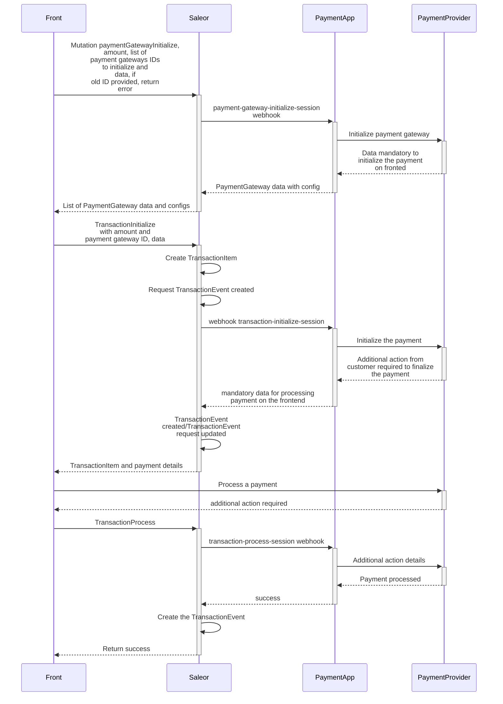
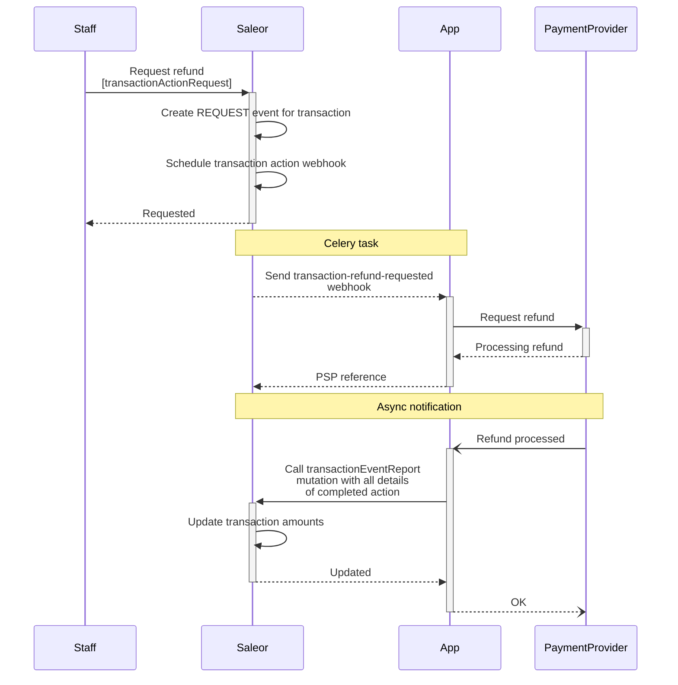
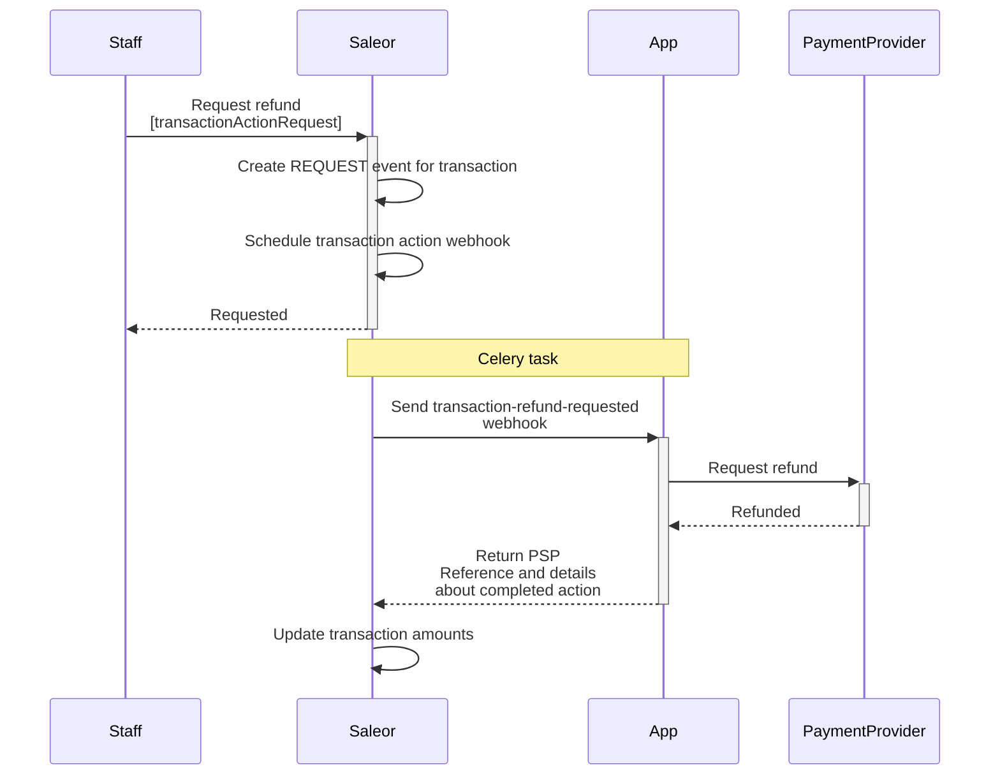
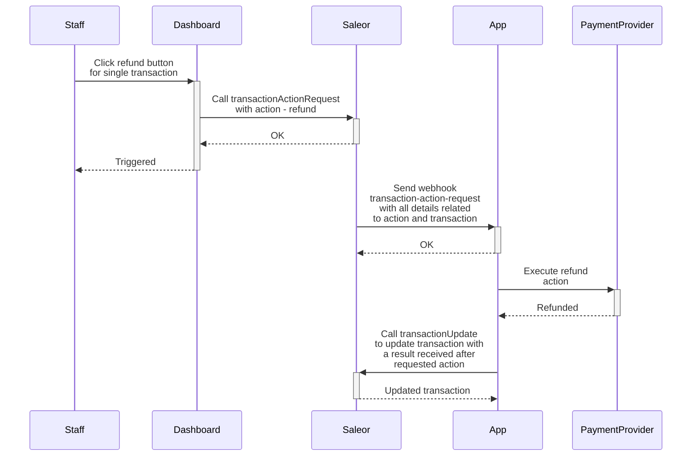

## Introduction

The process below describes the key milestones in the Saleor payment flow.
Additional steps may also occur along the way; however, the purpose of this instruction is to
deliver a base reference for the user to work with.

Saleor distinguishes two different approaches to processing a payment:

- By using a [Saleor App](docs/developer/extending/apps/index.mdx).
- By using a [plugin](docs/developer/extending/plugins/overview.mdx) embedded in the Saleor code.

## Saleor App

Saleor offers two ways to process payments using the Saleor app:

- [Saleor payment app](docs/developer/payments.mdx#processing-a-payment-with-payment-app) - The communication between the storefront and payment app goes through Saleor.
  Saleor allows the storefront to provide and receive data directly from the app. Based on the response received from the app,
  Saleor can determine the current status of the payment and update it on its side.
- [Saleor app with existing checkout app](docs/developer/payments.mdx#processing-a-payment-with-checkout-app): This is recommended for more advanced use cases when a shop owner needs to provide more
  validation before finalizing the checkout or to cover specific cases. The `CheckoutApp` handles the payment process on its side
  and uses Saleor's mutation to report any changes that happen for a specific `transactionItem`.
  The order can be created by protected mutation [orderCreateFromCheckout](docs/api-reference/checkout/mutations/order-create-from-checkout.mdx).

### Processing a payment with the Payment App

:::info

This feature was introduced in **Saleor 3.13**.

:::

:::caution

This feature is in the **Feature Preview** stage, which means that it is available for experimentation and
feedback. However, it is still undergoing development and is subject to modifications.

:::

This section describes the flow for processing payments using the Payment App. The communication between the storefront and the Payment App
goes through Saleor. Based on the Payment App's response, Saleor creates or updates the transaction with the appropriate status.

The described flow can be used with Order and Checkout.



#### Initialize payment gateway

To initialize the payment app, call the [paymentGatewayInitialize](api-reference/payments/mutations/payment-gateway-initialize.mdx) mutation.
The [data](api-reference/payments/inputs/payment-gateway-to-initialize.mdx#code-style-fontweight-normal-paymentgatewaytoinitializebdatabcodejson--) provided in the
[paymentGateways](api-reference/payments/inputs/payment-gateway-to-initialize.mdx) will be sent to the payment app. Saleor will then return the [data](api-reference/payments/objects/payment-gateway-initialize.mdx#code-style-fontweight-normal-paymentgatewayinitializebgatewayconfigsbcodepaymentgatewayconfig---) received from each app as a response.

This step is useful when some data needs to be fetched from the Payment App, such as fetching the available payment methods for a specific checkout.

The [paymentGatewayInitialize](api-reference/payments/mutations/payment-gateway-initialize.mdx) mutation requires the following arguments:

- `id` - ID of the `Checkout` or `Order`.
- `amount` - The amount requested for initializing the payment gateway. If not provided, the difference between `checkout.total` and transactions that are already processed will be sent to the apps.
- `paymentGateways` - A list of payment gateways to initialize. If not provided, all apps subscribed to the webhook [PAYMENT_GATEWAY_INITIALIZE_SESSION](api-reference/webhooks/enums/webhook-event-type-sync-enum.mdx#code-style-fontweight-normal-webhookeventtypesyncenumbpayment_gateway_initialize_sessionbcode) will be used.
- `paymentGateways.id` - The identifier of the payment gateway app to initialize.
- `paymentGateway.data` - The data to be passed to the payment gateway.

The [paymentGatewayInitialize](api-reference/payments/mutations/payment-gateway-initialize.mdx) mutation returns the following response:

- `gatewayConfigs` - A list of payment apps that were initialized.
- `gatewayConfigs.id` - The app identifier.
- `gatewayConfigs.data` - The data required to initialize the payment gateway returned by the app.
- `gatewayConfigs.errors` - A list of errors related to the specific payment gateway app.
- `errors` - Errors related to the mutation call.

The following example shows how to use the [paymentGatewayInitialize](api-reference/payments/mutations/payment-gateway-initialize.mdx) mutation to initialize the payment gateways:

```graphql
mutation {
  paymentGatewayInitialize(
    id: "Q2hlY2tvdXQ6ZmIxMzljMjgtYWY4OS00Mzk2LWEyMjgtZmM2ZDg0NGFhOWY3"
    amount: 100
    paymentGateways: [
      { id: "payment.app", data: { details: { passed: "to-app" } } }
    ]
  ) {
    gatewayConfigs {
      id
      data
      errors {
        field
        message
        code
      }
    }
    errors {
      field
      message
      code
    }
  }
}
```

The response would look like this:

```json
{
  "data": {
    "paymentGatewayInitialize": {
      "gatewayConfigs": [
        {
          "id": "payment.app",
          "data": {
            "json": "data-returned-by-app"
          },
          "errors": []
        }
      ],
      "errors": []
    }
  }
}
```

The mutation will trigger the [PAYMENT_GATEWAY_INITIALIZE_SESSION](api-reference/webhooks/enums/webhook-event-type-sync-enum.mdx#code-style-fontweight-normal-webhookeventtypesyncenumbpayment_gateway_initialize_sessionbcode) webhook.
For more details about this webhook, please refer to its [documentation](developer/extending/apps/synchronous-webhooks/transaction-webhooks.mdx#initialize-payment-gateway-session).

#### Initialize transaction

To initiate payment processing, call the [transactionInitialize](api-reference/payments/mutations/transaction-initialize.mdx) mutation.
The [data](api-reference/payments/inputs/payment-gateway-to-initialize.mdx#code-style-fontweight-normal-paymentgatewaytoinitializebdatabcodejson--) provided in the
[paymentGateways](api-reference/payments/inputs/payment-gateway-to-initialize.mdx) field will be sent to the payment app, and Saleor will return the
[data](api-reference/payments/objects/transaction-initialize.mdx#code-style-fontweight-normal-transactioninitializebdatabcodejson--) received from the app as a response.
Based on the Payment App's response, Saleor will create or update the transaction with the appropriate status.

The [transactionInitialize](api-reference/payments/mutations/transaction-initialize.mdx) mutation requires the following arguments:

- `id` - ID of the `Checkout` or `Order`.
- `paymentGateway` - The payment gateway used to initiate payment processing.
- `paymentGateway.id` - The identifier of the payment gateway app.
- `paymentGateway.data` - The data to be passed to the payment gateway.
- `action` - The expected action called for the transaction. By default, the `channel.defaultTransactionFlowStrategy` will be used. This field can be used only by an app that has `HANDLE_PAYMENTS` permission.
- `amount` - The amount requested for the payment. If not provided, the difference between `checkout.total` and transactions that are already processed will be sent.

The [transactionInitialize](api-reference/payments/mutations/transaction-initialize.mdx) mutation returns the following response:

- `transaction` - The initialized transaction.
- `transactionEvent` - The event created based on the response received from the payment app.
- `data` - The data returned by the app.
- `errors` - Errors related to the mutation call.

The mutation will trigger the [TRANSACTION_INITIALIZE_SESSION](api-reference/webhooks/enums/webhook-event-type-sync-enum.mdx#code-style-fontweight-normal-webhookeventtypesyncenumbtransaction_initialize_sessionbcode) webhook.
For more details about this webhook, please refer to its [documentation](developer/extending/apps/synchronous-webhooks/transaction-webhooks.mdx#initialize-transaction-session).

The following example demonstrates how to use the [transactionInitialize](api-reference/payments/mutations/transaction-initialize.mdx) mutation to initiate payment processing:

```graphql
mutation TransactionInitialize {
  transactionInitialize(
    amount: 100
    id: "Q2hlY2tvdXQ6MzE3NDk5MjgtZDFkMC00NjdjLTgxNjktMGRiZGM4ZGJhMGZh"
    paymentGateway: { id: "payment.app", data: { details: "passed-to-app" } }
  ) {
    transaction {
      id
    }
    transactionEvent {
      type
      pspReference
    }
    errors {
      field
      message
      code
    }
  }
}
```

The response would look like this:

```json
{
  "data": {
    "transactionInitialize": {
      "data": {
        "some-json": "data"
      },
      "transaction": {
        "id": "VHJhbnNhY3Rpb25JdGVtOjhhMzE1ODVlLWE1MTktNDVkMS1hNTFmLTYwZGZlNGRkM2FkNg"
      },
      "transactionEvent": {
        "type": "CHARGE_SUCCESS",
        "pspReference": "ppp-123"
      },
      "errors": []
    }
  }
}
```

The current status of a payment can be determined based on the value of [transactionEvent.type](api-reference/payments/enums/transaction-event-type-enum.mdx):

- `AUTHORIZATION_ACTION_REQUIRED` or `CHARGE_ACTION_REQUIRED` indicates that additional action is required from the
  customer to finalize the payment. Calling [transactionProcess](api-reference/payments/mutations/transaction-process.mdx) will be required to pass the result of the action to the app.
- `AUTHORIZATION_SUCCESS` indicates that funds have been authorized.
- `AUTHORIZATION_FAILURE` indicates that authorization has failed.
- `AUTHORIZATION_REQUEST` indicates that authorization is in a pending state.
- `CHARGE_SUCCESS` indicates that funds have been charged.
- `CHARGE_FAILURE` indicates that charging has failed.
- `CHARGE_REQUEST` indicates that charging is in a pending state.

#### Process transaction

If [transactionInitialize](api-reference/payments/mutations/transaction-initialize.mdx) or [transactionProcess](api-reference/payments/mutations/transaction-process.mdx)
returns `transactionEvent.type` equal to [AUTHORIZATION_ACTION_REQUIRED](api-reference/payments/enums/transaction-event-type-enum.mdx#code-style-fontweight-normal-transactioneventtypeenumbauthorization_action_requiredbcode)
or [CHARGE_ACTION_REQUIRED](api-reference/payments/enums/transaction-event-type-enum.mdx#code-style-fontweight-normal-transactioneventtypeenumbcharge_action_requiredbcode), additional steps from the customer are required. To provide the app with the result of the additional action, call the [transactionProcess](api-reference/payments/mutations/transaction-process.mdx) mutation.

The [transactionProcess](api-reference/payments/mutations/transaction-process.mdx) mutation requires the following arguments:

- `id` - The ID of the transaction returned by [transactionInitialize](api-reference/payments/mutations/transaction-initialize.mdx).
- `data` - The data to be passed to the payment gateway.

The [transactionProcess](api-reference/payments/mutations/transaction-process.mdx) mutation returns:

- `transaction` - The processed transaction.
- `transactionEvent` - The event created based on the response received from the payment app.
- `data` - The data returned by the app.
- `errors` - Errors related to the mutation call.

The mutation triggers the [TRANSACTION_PROCESS_SESSION](api-reference/webhooks/enums/webhook-event-type-sync-enum.mdx#code-style-fontweight-normal-webhookeventtypesyncenumbtransaction_process_sessionbcode) webhook.
For more details about this webhook, refer to its [documentation](developer/extending/apps/synchronous-webhooks/transaction-webhooks.mdx#process-transaction-session).

The following example demonstrates how to use the [transactionProcess](api-reference/payments/mutations/transaction-process.mdx) mutation to process the payment:

```graphql
mutation TransactionInitialize {
  transactionProcess(
    id: "VHJhbnNhY3Rpb25JdGVtOjhhMzE1ODVlLWE1MTktNDVkMS1hNTFmLTYwZGZlNGRkM2FkNg"
    data: { additional: { actions: "details" } }
  ) {
    transaction {
      id
    }
    transactionEvent {
      type
      pspReference
    }
    errors {
      field
      message
      code
    }
  }
}
```

The response would look like this:

```json
{
  "data": {
    "transactionProcess": {
      "data": {
        "some-json": "data"
      },
      "transaction": {
        "id": "VHJhbnNhY3Rpb25JdGVtOjhhMzE1ODVlLWE1MTktNDVkMS1hNTFmLTYwZGZlNGRkM2FkNg"
      },
      "transactionEvent": {
        "type": "CHARGE_SUCCESS",
        "pspReference": "ppp-123"
      },
      "errors": []
    }
  }
}
```

The current status of a payment can be determined based on the value of `transactionEvent.type`:

- `AUTHORIZATION_ACTION_REQUIRED` or `CHARGE_ACTION_REQUIRED` indicates that additional action is required from the customer to
  finalize the payment. Calling [transactionProcess](api-reference/payments/mutations/transaction-process.mdx) will be required to pass the result of the action to the app.
- `AUTHORIZATION_SUCCESS` indicates that funds have been authorized.
- `AUTHORIZATION_FAILURE` indicates that authorization has failed.
- `AUTHORIZATION_REQUEST` indicates that authorization is in a pending state.
- `CHARGE_SUCCESS` indicates that funds have been charged.
- `CHARGE_FAILURE` indicates that charging has failed.
- `CHARGE_REQUEST` indicates that charging is in a pending state.

### Processing a payment with Checkout App

This section describes the flow where the payment process is handled by an external Saleor App such as [Checkout](https://github.com/saleor/react-storefront/tree/canary/apps/checkout).
In this case, Saleor expects to receive a result of the payment transaction processed by the Saleor App.

#### Creating transaction

:::info

This feature was introduced in **Saleor 3.4**.

:::

:::caution

This feature is in the **Feature Preview** stage, which means that it is available for experimentation and
feedback. However, it is still undergoing development and is subject to modifications.

:::

Transaction stores details of a payment transaction attached to an order or a checkout:

The [transactionCreate](../api-reference/payments/mutations/transaction-create) mutation takes the following arguments:

- `id`: The ID of the checkout or order.
- `transaction`: Input data required to create a new transaction object.
- `transactionEvent`: Data that defines a transaction event. It can be used to provide more context about the current state of the transaction.

The following example shows how you can use the [transactionCreate](../api-reference/payments/mutations/transaction-create) mutation to create a new transaction.

The transaction was authorized, and the payment was made with a credit card. The actions that can be called from Saleor are: `CANCEL` and `CHARGE`.
The authorized amount is **$99**.

::: info
The [transactionCreate] can only be called by staff users or app with
[HANDLE_PAYMENTS](api-storefront/users/enums/permission-enum.mdx#code-style-fontweight-normal-permissionenumbhandle_paymentsbcode) permission.
:::

##### Saleor 3.13+

```graphql
mutation {
  transactionCreate(
    id: "Q2hlY2tvdXQ6MWQzNmU5YzctYWEwYS00NzM5LTk0MGQtNzdjNmU4Mjc5YmQ0"
    transaction: {
      name: "Credit card"
      message: "Authorized"
      pspReference: "PSP-ref123"
      availableActions: [CANCEL, CHARGE]
      amountAuthorized: { currency: "USD", amount: 99 }
      externalUrl: "https://saleor.io/payment-id/123"
    }
  ) {
    transaction {
      id
    }
  }
}
```

The response would look like this:

```json
{
  "data": {
    "transactionCreate": {
      "transaction": {
        "id": "VHJhbnNhY3Rpb25JdGVtOjE="
      }
    }
  },
  "extensions": {
    "cost": {
      "requestedQueryCost": 0,
      "maximumAvailable": 50000
    }
  }
}
```

##### Saleor 3.4 (deprecated)

```graphql
mutation {
  transactionCreate(
    id: "Q2hlY2tvdXQ6MWQzNmU5YzctYWEwYS00NzM5LTk0MGQtNzdjNmU4Mjc5YmQ0"
    transaction: {
      status: "Authorized"
      type: "Credit card"
      reference: "PSP-ref123"
      availableActions: [CANCEL, CHARGE]
      amountAuthorized: { currency: "USD", amount: 99 }
    }
    transactionEvent: {
      status: SUCCESS
      name: "Authorized credit card"
      reference: "PSP-ref123"
    }
  ) {
    transaction {
      id
    }
  }
}
```

The response would look like this:

```json
{
  "data": {
    "transactionCreate": {
      "transaction": {
        "id": "VHJhbnNhY3Rpb25JdGVtOjE="
      }
    }
  },
  "extensions": {
    "cost": {
      "requestedQueryCost": 0,
      "maximumAvailable": 50000
    }
  }
}
```

:::info

- Transactions attached to the checkout are accessible via the [transactions](../api-reference/checkout/objects/checkout#code-style-fontweight-normal-checkoutbtransactionsbcodetransactionitem--) field.
- Transactions attached to the order are accessible via the [transactions](../api-reference/orders/objects/order#code-style-fontweight-normal-orderbtransactionsbcodetransactionitem--) field.

:::

#### Updating transaction

:::info

This feature was introduced in **Saleor 3.4**.

:::

:::caution

This feature is in the **Feature Preview** stage, which means that it is available for experimentation and
feedback. However, it is still undergoing development and is subject to modifications.

:::

The [transactionUpdate](../api-reference/payments/mutations/transaction-update) mutation allows updating the transaction details.
It takes the following arguments:

- `id`: The ID of the transaction.
- `transaction`: Input data that will be used to update the transaction object.
- `transactionEvent`: Data that defines a transaction event. It can be used to provide more context about the current state of the transaction.

:::info

The [transactionUpdate](../api-reference/payments/mutations/transaction-update) can only be called by staff users with
[HANDLE_PAYMENTS](api-storefront/users/enums/permission-enum.mdx#code-style-fontweight-normal-permissionenumbhandle_paymentsbcode) permission
or by App which is the owner of the transaction and has [HANDLE_PAYMENTS](api-storefront/users/enums/permission-enum.mdx#code-style-fontweight-normal-permissionenumbhandle_paymentsbcode) permission.
:::

The following example shows how you can use the [transactionUpdate](../api-reference/payments/mutations/transaction-create) mutation to update the transaction.

The available action is `REFUND`. The authorized funds are charged, so `amountAuthorized` is **$0**. `amountCharged` is equal to **$99**.

```graphql
mutation {
  transactionUpdate(
    id: "VHJhbnNhY3Rpb25JdGVtOjE="
    transaction: {
      name: "Credit card"
      message: "Authorized"
      pspReference: "PSP-ref123"
      availableActions: [REFUND]
      amountAuthorized: { currency: "USD", amount: 0 }
      amountCharged: { currency: "USD", amount: 99 }
    }
    transactionEvent: {
      message: "Payment charged"
      pspReference: "PSP-ref123.charge"
    }
  ) {
    transaction {
      id
    }
  }
}
```

The response would look like this:

```json
{
  "data": {
    "transactionUpdate": {
      "transaction": {
        "id": "VHJhbnNhY3Rpb25JdGVtOjE="
      }
    }
  },
  "extensions": {
    "cost": {
      "requestedQueryCost": 0,
      "maximumAvailable": 50000
    }
  }
}
```

:::note
During the update of transactions, all funds that go to a new state should be subtracted from the previous state.
Assuming we have a transaction with `authorizedAmount` equal to 100 USD. Moving the `authorizedAmount` to `chargedAmount` requires setting the`authorizedAmount` to 0.

```graphql
mutation {
  transactionUpdate(
    id: "VHJhbnNhY3Rpb25JdGVtOjE="
    transaction: {
      status: "Charged"
      availableActions: [REFUND]
      amountAuthorized: { currency: "USD", amount: 0 }
      amountCharged: { currency: "USD", amount: 100 }
    }
    transactionEvent: {
      status: SUCCESS
      name: "Charged credit card"
      reference: "PSP-ref123.charge"
    }
  ) {
    transaction {
      id
    }
  }
}
```

:::

### Reporting action for transaction

:::info

This feature was introduced in **Saleor 3.13**.

:::

:::caution

This feature is in the **Feature Preview** stage, which means that it is available for experimentation and
feedback. However, it is still undergoing development and is subject to modifications.

:::

The [transactionEventReport](../api-reference/payments/mutations/transaction-event-report) is used to
report a new transaction event. The newly created event will be used to [recalculate](#re-calculations-of-transaction-amounts) the transaction's amounts.
The mutation should be used in case of [asynchronously processing the requested action](#handling-an-action-request-for-a-transaction) or reporting any
changes that happened on the payment provider side.

It takes the following arguments:

- `id`: The id of the transaction.
- `type`: Type of the reported action.
- `amount`: The amount of the reported action.
- `pspReference`: The reference assigned to the action.
- `time`: The time of the action.
- `externalUrl`: The URL that will allow redirecting the user to the payment provider page with action details.
- `message`: Message related to the action.
- `availableActions`: Current list of actions available for the transaction.

:::info

The [transactionEventReport](../api-reference/payments/mutations/transaction-event-report) can only be called by staff users with
[HANDLE_PAYMENTS](api-storefront/users/enums/permission-enum.mdx#code-style-fontweight-normal-permissionenumbhandle_paymentsbcode) permission
or by App which is the owner of the transaction and has [HANDLE_PAYMENTS](api-storefront/users/enums/permission-enum.mdx#code-style-fontweight-normal-permissionenumbhandle_paymentsbcode) permission.
The owner is the User or App that created the given transaction.
:::

The following example shows how the [transactionEventReport](../api-reference/payments/mutations/transaction-event-report) mutation is used to report an event
that happened for a given transaction.
The report is a success charge action, with 20 as an amount. The currency is the same as declared
for the transaction. Available action that can proceed for a transaction is `REFUND`.
The provided data will be used to create a new [TransactionEvent](../api-reference/payments/objects/transaction-event) object that will be included in the
[re-calculation](#re-calculations-of-transaction-amounts) process.

```graphql
mutation TransactionEventReport {
  transactionEventReport(
    id: "VHJhbnNhY3Rpb25JdGVtOjE="
    type: CHARGE_SUCCESS
    amount: 20
    pspReference: "psp-123"
    time: "2022-01-01"
    externalUrl: "https://saleor.io/event-details/123"
    message: "Charge completed"
    availableActions: [REFUND]
  ) {
    errors {
      field
      code
    }
    alreadyProcessed
    transaction {
      id
    }
    transactionEvent {
      id
    }
  }
}
```

In the response, Saleor returns:

- `alreadyProcessesed` - Defines if the reported event hasn't been processed earlier.
  If there is an event with the same `pspReference`, `amount`, and `type` as the ones provided in the input
  mutation, Saleor will return it instead of creating a new one, and the flag will be set
  to `true`. If the event with provided `pspReference` and `type` was already reported but with a
  different amount, the error with code [INCORRECT_DETAILS](../api-reference/payments/enums/transaction-event-report-error-code#code-style-fontweight-normal-transactioneventreporterrorcodebincorrect_detailsbcode)
  will be raised.
- `transaction` - Transaction that has been updated based on the received report.
- `transactionEvent` - [TransactionEvent](../api-reference/payments/objects/transaction-event) that has been created based on the received report.

### Handling an action request for a transaction

:::info

This feature was introduced in **Saleor 3.4**.

:::

:::caution

This feature is in the **Feature Preview** stage, which means that it is available for experimentation and
feedback. However, it is still undergoing development and is subject to modifications.

:::

An action request is called when a staff user or an app triggers a request for an action that should be called for a given transaction.

#### Saleor 3.13+

There are two mutations that can trigger the action on the app side:

- Calling mutation [transactionRequestAction](../api-reference/payments/mutations/transaction-request-action) will also create a new
  [TransactionEvent](../api-reference/payments/objects/transaction-event) with one of the request type ([AUTHORIZATION_REQUEST](../api-reference/payments/enums/transaction-event-type-enum#code-style-fontweight-normal-transactioneventtypeenumbauthorization_requestbcode),
  [CHARGE_REQUEST](../api-reference/payments/enums/transaction-event-type-enum#code-style-fontweight-normal-transactioneventtypeenumbcharge_requestbcode),
  [REFUND_REQUEST](../api-reference/payments/enums/transaction-event-type-enum#code-style-fontweight-normal-transactioneventtypeenumbrefund_requestbcode),
  [CANCEL_REQUEST](../api-reference/payments/enums/transaction-event-type-enum#code-style-fontweight-normal-transactioneventtypeenumbcancel_requestbcode)),
  `amount` and the `owner` (User or App). Saleor will send a synchronous webhook dedicated to the action
  [TRANSACTION_CHARGE_REQUESTED](../api-reference/webhooks/enums/webhook-event-type-sync-enum.mdx#code-style-fontweight-normal-webhookeventtypesyncenumbtransaction_charge_requestedbcode),
  [TRANSACTION_CANCELATION_REQUESTED](../api-reference/webhooks/enums/webhook-event-type-sync-enum.mdx#code-style-fontweight-normal-webhookeventtypesyncenumbtransaction_cancelation_requestedbcode),
  [TRANSACTION_REFUND_REQUESTED](../api-reference/webhooks/enums/webhook-event-type-sync-enum.mdx#code-style-fontweight-normal-webhookeventtypesyncenumbtransaction_refund_requestedbcode)

- Calling mutation [transactionRequestRefundForGrantedRefund](../api-reference/payments/mutations/transaction-request-refund-for-granted-refund) will create a new [TransactionEvent](../api-reference/payments/objects/transaction-event) with
  [REFUND_REQUEST](../api-reference/payments/enums/transaction-event-type-enum#code-style-fontweight-normal-transactioneventtypeenumbrefund_requestbcode) type, `amount` and the `owner` (User or App).
  Saleor will send a synchronous webhook [TRANSACTION_REFUND_REQUESTED](../api-reference/webhooks/enums/webhook-event-type-sync-enum.mdx#code-style-fontweight-normal-webhookeventtypesyncenumbtransaction_refund_requestedbcode).
  [OrderGrantedRefund](api-reference/orders/objects/order-granted-refund.mdx) will be included in the webhook payload (if requested in a [subscription query](developer/extending/apps/subscription-webhook-payloads.mdx#custom-payloads) for the webhook).
  The mutation is useful when the payment provider requires details about lines that are related to refund action.

The response should contain at least `pspReference` of the action. The `pspReference` will be placed in the previously created event of `_REQUEST` type.
Optionally the response can contain the details of the completed action.

More details about request webhook can be found [here](extending/apps/synchronous-webhooks/transaction-webhooks).

:::caution

The webhook will be sent only to the app that is the owner of the transaction.

:::

#### Asynchronously processing the action

When action is processed asynchronously on the payment provider side, the app should call the [transactionActionRequest](../api-reference/payments/mutations/transaction-request-action)
mutation once it receives a webhook notification from the payment provider.

The below diagram shows an example of processing asynchronous refund action.



#### Synchronously processing the action

The app immediately receives the status of the requested action. It can provide the details of the action in response to the received Saleor webhook. The following webhook events
can accept action details in the response:: [TRANSACTION_CHARGE_REQUESTED](../api-reference/webhooks/enums/webhook-event-type-sync-enum.mdx#code-style-fontweight-normal-webhookeventtypesyncenumbtransaction_charge_requestedbcode),
[TRANSACTION_CANCELATION_REQUESTED](../api-reference/webhooks/enums/webhook-event-type-sync-enum.mdx#code-style-fontweight-normal-webhookeventtypesyncenumbtransaction_cancelation_requestedbcode),
[TRANSACTION_REFUND_REQUESTED](../api-reference/webhooks/enums/webhook-event-type-sync-enum.mdx#code-style-fontweight-normal-webhookeventtypesyncenumbtransaction_refund_requestedbcode).

The below diagram shows an example of processing synchronous refund action.



#### Saleor 3.4 (Deprecated)

If your app should also process payment request actions (like charge, refund, or CANCEL) triggered by staff users on the Saleor dashboard side or by the app,
make sure that your app subscribes to the [transaction-action-request](developer/extending/apps/sample-webhook-payloads.mdx#transaction-action-request) webhook.

The chart below shows a workflow for handling a `refund` request.



### Re-calculations of transaction amounts

The re-calculation will differ based on the value of the [TransactionEventTypeEnum](../api-reference/payments/enums/transaction-event-type-enum) provided as the field `type`
used in the [transactionEventReport](#reporting-action-for-transaction) [transactionInitialize](#initialize-transaction), [transactionProcess](#process-transaction) mutations, [optionally in the webhook response](extending/apps/synchronous-webhooks/transaction-webhooks):

#### Event type explanation

##### AUTHORIZATION_SUCCESS

Saleor assigns provided `amount` to `transaction.authorizedAmount`. If an `AUTHORIZATION_SUCCESS` event is related to an `AUTHORIZATION_REQUEST` event by `pspReference`, then the `transactionItem.authorizePendingAmount`
will be reduced by the amount reported in the `AUTHORIZATION_SUCCESS` event.
You can’t have two successful authorizations for a single transaction.
Each successful request after the first one will raise an exception. `AUTHORIZATION_ADJUSTMENT` should be used to change the `transaction.authorizedAmount`.

:::info
In the case of finding `AUTHORIZATION_SUCCESS` and `AUTHORIZATION_FAILURE` with the same `pspReference`,
the re-calculation for `transaction.authorizedAmount` will not take into account the amount from
`AUTHORIZATION_SUCCESS`, when `AUTHORIZATION_SUCCESS` is the older one.
:::

##### AUTHORIZATION_FAILURE

If an `AUTHORIZATION_FAILURE` event is related to an `AUTHORIZATION_REQUEST` event by `pspReference`, then the `transactionItem.authorizePendingAmount`
will be reduced by the amount reported in the `AUTHORIZATION_FAILURE` event. If there is no related `AUTHORIZATION_REQUEST`, the failure event will only
be used to provide the history of `transactionItem` actions.

##### AUTHORIZATION_ADJUSTMENT

Saleor assigns the provided `amount` to the `transaction.authorizedAmount`.

##### CHARGE_SUCCESS

Adds the provided `amount` to the `transaction.chargedAmount`. Each next call will add the `amount` to the existing
`transaction.chargedAmount` (`transaction.chargedAmount += amount`). If a `CHARGE_SUCCESS` event is related to a `CHARGE_REQUEST` event by `pspReference`, then the `transactionItem.chargePendingAmount`
will be reduced by the amount reported in the `CHARGE_SUCCESS` event. If there is no related `CHARGE_REQUEST` event, the provided `amount` will reduce `transaction.authorizedAmount`.

:::info
In the case of finding `CHARGE_SUCCESS` and `CHARGE_FAILURE` with the same `pspReference`, the re-calculation
for `transaction.chargedAmount` will not take into account the amount from `CHARGE_SUCCESS`, when
`CHARGE_SUCCESS` is the older one.
:::

##### CHARGE_FAILURE

If an `CHARGE_FAILURE` event is related to an `CHARGE_REQUEST` event by `pspReference`, then the `transactionItem.chargePendingAmount`
will be reduced by the amount reported in the `CHARGE_FAILURE` event. If there is no related `CHARGE_REQUEST`, the failure event will only
be used to provide the history of `transactionItem` actions.

##### CHARGE_BACK

The provided `amount` will be used to reduce `transaction.chargedAmount`
(`transaction.chargedAmount -= amount`).

##### REFUND_SUCCESS

Adds provided `amount` to `transaction.refundedAmount`. Each next call will add the `amount` to the existing
`transaction.refundedAmount` (`transaction.refundedAmount += amount`). If a `REFUND_SUCCESS` event is related to a `REFUND_REQUEST` event by `pspReference`, then the `transactionItem.refundPendingAmount`
will be reduced by the amount reported in the `REFUND_SUCCESS` event. If there is no related `REFUND_REQUEST` event, the provided `amount` will reduce `transaction.chargedAmount`.

:::info
In the case of finding `REFUND_SUCCESS` and `REFUND_FAILURE` with the same `pspReference`, the re-calculation
for `transaction.refundedAmount` will not take into account the amount from `REFUND_SUCCESS`, when
`REFUND_SUCCESS` is the older one.
:::

##### REFUND_FAILURE

If an `REFUND_FAILURE` event is related to an `REFUND_REQUEST` event by `pspReference`, then the `transactionItem.refundPendingAmount`
will be reduced by the amount reported in the `REFUND_FAILURE` event. If there is no related `REFUND_REQUEST`, the failure event will only
be used to provide the history of `transactionItem` actions.

##### REFUND_REVERSE

The provided `amount` will be used to reduce `transaction.refundedAmount` (`transaction.refundedAmount -= amount`).
The provided `amount` will increase `transaction.chargedAmount`.

##### CANCEL_SUCCESS

The provided `amount` will be added to `transaction.canceledAmount`
(`transaction.canceledAmount += amount`). If a `CANCEL_SUCCESS` event is related to a `CANCEL_REQUEST` event by `pspReference`, then the `transactionItem.cancelPendingAmount`
will be reduced by the amount reported in the `CANCEL_SUCCESS` event. If there is no related `CANCEL_REQUEST` event, the provided `amount` will reduce `transaction.authorizedAmount`.

:::info
In the case of finding `CANCEL_SUCCESS` and `CANCEL_FAILURE` with the same `pspReference`, the re-calculation
for `transaction.canceledAmount` will not take into account the amount from `CANCEL_SUCCESS`, when
`CANCEL_SUCCESS` is the older one.
:::

##### CANCEL_FAILURE

If an `CANCEL_FAILURE` event is related to an `CANCEL_REQUEST` event by `pspReference`, then the `transactionItem.cancelPendingAmount`
will be reduced by the amount reported in the `CANCEL_FAILURE` event. If there is no related `CANCEL_REQUEST`, the failure event will only
be used to provide the history of `transactionItem` actions.

#### Example of re-calculations

The tables below show examples of transactions and their amounts when a given event is attached to the transaction.
Depending on the event type, the amounts may change. The last columns show the current amounts assigned to the transaction after
processing the events defined in a given row and in the rows above it.

| Event |         Type          | pspReference |           Time            | Amount | `transaction.authorizedAmount` | `transaction.authorizePendingAmount` |
| :---: | :-------------------: | :----------: | :-----------------------: | :----: | :----------------------------: | :----------------------------------: |
|   1   | AUTHORIZATION_REQUEST |     AB12     | 2022-03-28T12:50:33+00:00 |   10   |               0                |                  10                  |
|   2   | AUTHORIZATION_SUCCESS |     AB12     | 2022-03-28T12:51:33+00:00 |   10   |               10               |                  0                   |
|   3   | AUTHORIZATION_FAILURE |     YZ13     | 2022-03-28T12:52:33+00:00 |   10   |               10               |                  0                   |

After receiving an `AUTHORIZATION_REQUEST` event, the amount defined in the event is attached to `transaction.authorizePendingAmount`.
Then, an `AUTHORIZATION_SUCCESS` event is attached to the transaction. Since the `AUTHORIZATION_SUCCESS` event has the same `pspReference` as
the `AUTHORIZATION_REQUEST` event, the `transaction.authorizePendingAmount` is reduced by the event amount, and added to the `transaction.authorizedAmount`.
An `AUTHORIZATION_FAILURE` event doesn’t change anything, as there isn’t an `AUTHORIZATION_REQUEST` event related to it.

---

| Event |           Type           | pspReference |           Time            | Amount | `transaction.authorizedAmount` | `transaction.authorizePendingAmount` |
| :---: | :----------------------: | :----------: | :-----------------------: | :----: | :----------------------------: | :----------------------------------: |
|   1   |  AUTHORIZATION_REQUEST   |     AB12     | 2022-03-28T12:50:33+00:00 |   10   |               0                |                  10                  |
|   2   |  AUTHORIZATION_SUCCESS   |     AB12     | 2022-03-28T12:51:33+00:00 |   10   |               10               |                  0                   |
|   3   | AUTHORIZATION_ADJUSTMENT |     YZ13     | 2022-03-28T12:52:33+00:00 |  100   |              100               |                  0                   |

Upon receiving an `AUTHORIZATION_REQUEST` event, the corresponding amount is attached to `transaction.authorizePendingAmount`. An `AUTHORIZATION_SUCCESS` event
is then attached to the transaction, with the same `pspReference` as the `AUTHORIZATION_REQUEST` event. The `transaction.authorizePendingAmount` is reduced
by the event amount, and the result is added to the `transaction.authorizedAmount`.
Note that an `AUTHORIZATION_ADJUSTMENT` event will overwrite the previous `transaction.authorizedAmount` and cause the
previous `AUTHORIZATION_SUCCESS` event to be ignored.

---

| Event |         Type          | pspReference |           Time            | Amount | `transaction.authorizedAmount` | `transaction.authorizePendingAmount` |
| :---: | :-------------------: | :----------: | :-----------------------: | :----: | :----------------------------: | :----------------------------------: |
|   1   | AUTHORIZATION_SUCCESS |     AB12     | 2022-03-28T12:51:33+00:00 |   10   |               10               |                  0                   |

---

The transaction receives an `AUTHORIZATION_SUCCESS` event. Since there is no `AUTHORIZATION_REQUEST` with the same pspReference, the value of `transaction.authorizePendingAmount`
will not be changed. The amount from the event is assigned to `transaction.authorizedAmount`.

| Event |         Type          | pspReference |           Time            | Amount | `transaction.chargedAmount` | `transaction.chargePendingAmount` | `transaction.authorizedAmount` |
| :---: | :-------------------: | :----------: | :-----------------------: | :----: | :-------------------------: | :-------------------------------: | :----------------------------: |
|   1   | AUTHORIZATION_SUCCESS |     AB12     | 2022-03-28T12:50:33+00:00 |   10   |              0              |                 0                 |               10               |
|   2   |    CHARGE_REQUEST     |     YZ13     | 2022-03-28T12:51:33+00:00 |   3    |              0              |                 3                 |               7                |
|   3   |    CHARGE_SUCCESS     |     YZ13     | 2022-03-28T12:52:33+00:00 |   3    |              3              |                 0                 |               7                |

When the transaction receives an `AUTHORIZATION_SUCCESS` event, if there is no `AUTHORIZATION_REQUEST` with the same pspReference, the value of `transaction.authorizePendingAmount`
will not change. The amount from the event is then assigned to `transaction.authorizedAmount`. Additionally, a `CHARGE_REQUEST` event is added to the transaction, and the amount
from the event is added to `transaction.chargePendingAmount`. The amount also reduces `transaction.authorizedAmount`. Finally, when a `CHARGE_SUCCESS` event occurs, the `transaction.chargePendingAmount`
is reduced by the event’s amount and added to `transaction.chargedAmount`.

---

| Event |         Type          | pspReference |           Time            | Amount | `transaction.chargedAmount` | `transaction.chargePendingAmount` | `transaction.authorizedAmount` |
| :---: | :-------------------: | :----------: | :-----------------------: | :----: | :-------------------------: | :-------------------------------: | :----------------------------: |
|   1   | AUTHORIZATION_SUCCESS |     AB12     | 2022-03-28T12:50:33+00:00 |   10   |              0              |                 0                 |               10               |
|   2   |    CHARGE_REQUEST     |     YZ13     | 2022-03-28T12:51:33+00:00 |   3    |              0              |                 3                 |               7                |
|   3   |    CHARGE_SUCCESS     |     YZ13     | 2022-03-28T12:51:33+00:00 |   3    |              3              |                 0                 |               7                |
|   4   |    CHARGE_FAILURE     |     YZ13     | 2022-03-28T12:55:33+00:00 |   3    |              0              |                 0                 |               10               |

When an `AUTHORIZATION_SUCCESS` event is attached to the transaction, the `transaction.authorizedAmount` is updated with the amount from the event.
If there is no `AUTHORIZATION_REQUEST` with the same `pspReference`, the `transaction.authorizePendingAmount` remains unchanged.
Additionally, a `CHARGE_REQUEST` event is added to the transaction, and its amount is added to `transaction.chargePendingAmount`.
The `transaction.authorizedAmount` is reduced by the amount from the `CHARGE_REQUEST` event.
Finally, when a `CHARGE_SUCCESS` event occurs, the `transaction.chargedAmount` is updated with the event's amount, and the
`transaction.chargePendingAmount` is reduced by the same amount. A `CHARGE_FAILURE` event with the same `pspReference` as `CHARGE_SUCCESS` is
also attached to the transaction, `time` indicating that it is newer than the `CHARGE_SUCCESS`. The previous `CHARGE_SUCCESS` event is ignored during the re-calculation process.

---

| Event |         Type          | pspReference |           Time            | Amount | `transaction.chargedAmount` | `transaction.chargePendingAmount` | `transaction.authorizedAmount` |
| :---: | :-------------------: | :----------: | :-----------------------: | :----: | :-------------------------: | :-------------------------------: | :----------------------------: |
|   1   | AUTHORIZATION_SUCCESS |     AB12     | 2022-03-28T12:50:33+00:00 |   10   |              0              |                 0                 |               10               |
|   2   |    CHARGE_REQUEST     |     YZ13     | 2022-03-28T12:51:33+00:00 |   3    |              0              |                 3                 |               7                |
|   3   |    CHARGE_SUCCESS     |     YZ13     | 2022-03-28T12:51:33+00:00 |   3    |              3              |                 0                 |               7                |
|   4   |    CHARGE_FAILURE     |     YZ13     | 2022-03-28T12:50:45+00:00 |   3    |              3              |                 0                 |               7                |

When an `AUTHORIZATION_SUCCESS` event is attached to a transaction, the `transaction.authorizedAmount` is updated with the event's amount. If there is no `AUTHORIZATION_REQUEST` with the
same `pspReference`, the `transaction.authorizePendingAmount` remains unchanged. In addition, a `CHARGE_REQUEST` event is added to the transaction, and its amount is added to
`transaction.chargePendingAmount`. The `transaction.authorizedAmount` is reduced by the amount from the `CHARGE_REQUEST` event. Finally, when a `CHARGE_SUCCESS` event occurs, the
`transaction.chargedAmount` is updated with the event's amount, and the `transaction.chargePendingAmount` is reduced by the same amount. A `CHARGE_FAILURE` event with
the same `pspReference` as `CHARGE_SUCCESS` is also attached to the transaction. The `time` field indicates that it is older than the `CHARGE_SUCCESS` event. This means
that the `CHARGE_FAILURE` event will be ignored, and the `CHARGE_SUCCESS` event will be included in the calculations.

---

| Event |      Type      | pspReference |           Time            | Amount | `transaction.chargedAmount` | `transaction.chargePendingAmount` | `transaction.authorizedAmount` |
| :---: | :------------: | :----------: | :-----------------------: | :----: | :-------------------------: | :-------------------------------: | :----------------------------: |
|   1   | CHARGE_SUCCESS |     AB12     | 2022-03-28T12:50:33+00:00 |   10   |             10              |                 0                 |               0                |

---

| Event |         Type          | pspReference |           Time            | Amount | `transaction.chargedAmount` | `transaction.chargePendingAmount` | `transaction.authorizedAmount` |
| :---: | :-------------------: | :----------: | :-----------------------: | :----: | :-------------------------: | :-------------------------------: | :----------------------------: |
|   1   | AUTHORIZATION_SUCCESS |     AB12     | 2022-03-28T12:50:33+00:00 |   10   |              0              |                 0                 |               10               |
|   2   |    CHARGE_SUCCESS     |     YZ13     | 2022-03-28T12:51:33+00:00 |   3    |              3              |                 0                 |               7                |

The `AUTHORIZATION_SUCCESS` event is attached to the transaction, and its amount is added to `transaction.authorizedAmount`. Similarly, the `CHARGE_SUCCESS` event is attached to the transaction,
and its amount is added to `transaction.chargedAmount`. Finally, the amount of the `AUTHORIZATION_SUCCESS` event is subtracted from the `transaction.authorizedAmount`.

---

## Payment Plugin

Using PaymentPlugin is strictly related to the checkout object and is explained in
[Checkout](checkout/finalizing) section.
