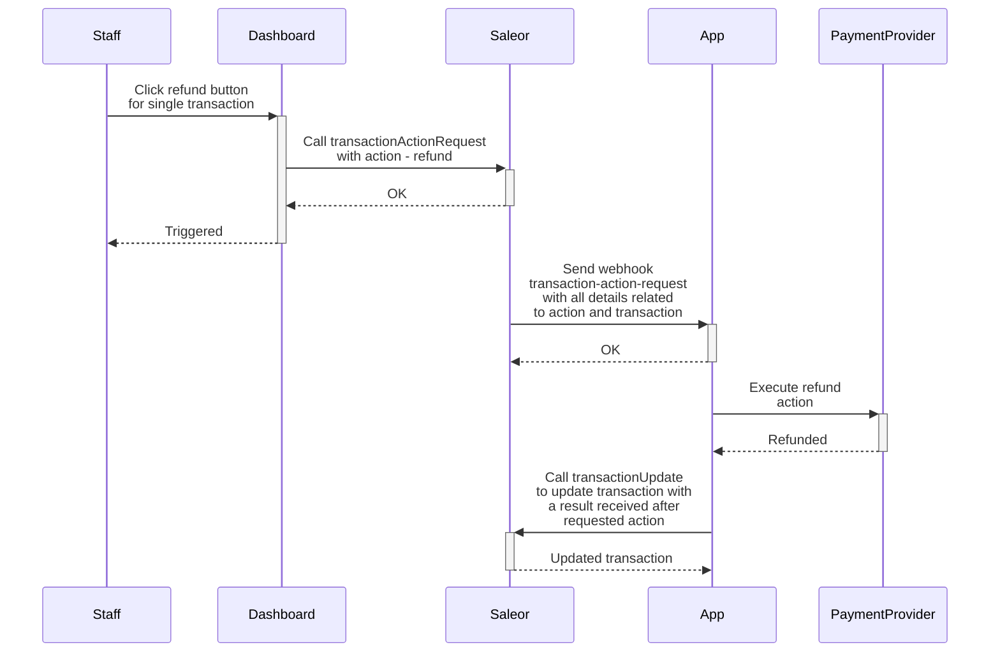

## Payment Plugin

Using PaymentPlugin is explained in [Checkout](/developer/checkout/finalizing.mdx) section.

### Actions Saleor 3.4

If your app should also process payment request actions (like charge, refund, or CANCEL) triggered by staff users on the Saleor dashboard side or by the app,
make sure that your app subscribes to the [`transaction-action-request`](developer/extending/webhooks/sample-webhook-payloads.mdx#transaction-action-request) webhook.

The chart below shows a workflow for handling a `refund` request.



### Creating transactions in Saleor 3.4

```graphql
mutation {
  transactionCreate(
    id: "Q2hlY2tvdXQ6MWQzNmU5YzctYWEwYS00NzM5LTk0MGQtNzdjNmU4Mjc5YmQ0"
    transaction: {
      status: "Authorized"
      type: "Credit card"
      reference: "PSP-ref123"
      availableActions: [CANCEL, CHARGE]
      amountAuthorized: { currency: "USD", amount: 99 }
    }
    transactionEvent: {
      status: SUCCESS
      name: "Authorized credit card"
      reference: "PSP-ref123"
    }
  ) {
    transaction {
      id
    }
  }
}
```

The response:

```json
{
  "data": {
    "transactionCreate": {
      "transaction": {
        "id": "VHJhbnNhY3Rpb25JdGVtOjE="
      }
    }
  },
  "extensions": {
    "cost": {
      "requestedQueryCost": 0,
      "maximumAvailable": 50000
    }
  }
}
```
