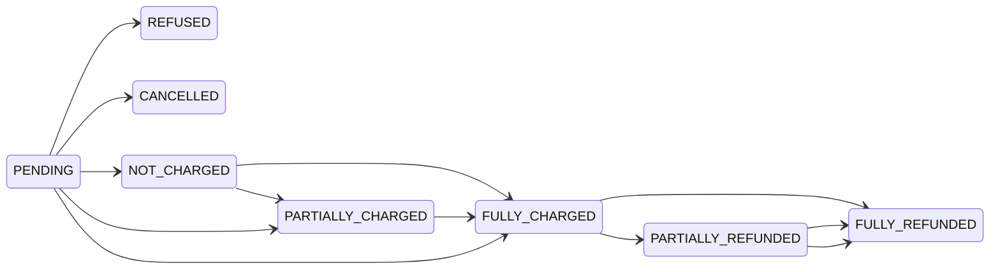
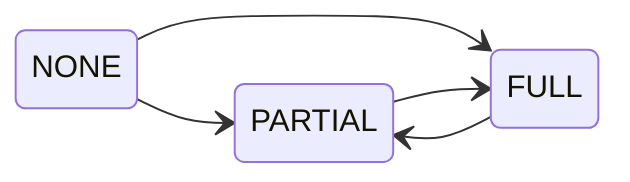
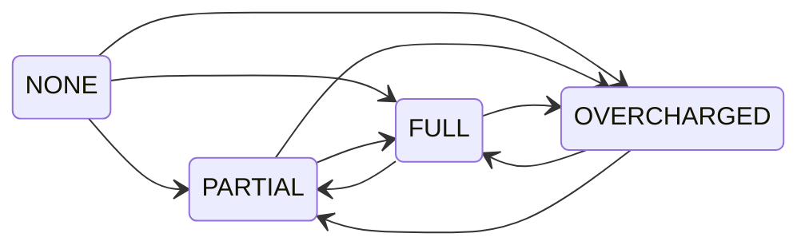

## Payment status

[Payment status](api-reference/orders/objects/order.mdx#orderpaymentstatuspaymentchargestatusenum--) represents the combined payment and refund status of the order. It's calculated based on:

- `order.total` value
- status of the payments
- refunds granted for the order

When no refunds are created, the status is one of the following:

- `PENDING`: waiting for the response from the payment gateway
- `REFUSED`: payment refused by the payment gateway
- `CANCELLED`: payment has been canceled
- `NOT_CHARGED`: the amount is authorized but not charged
- `PARTIALLY_CHARGED`: the charged amount does not cover the order total
- `FULLY_CHARGED`: charged funds fully cover the order total

Creating the refund will change the status to:

- `PARTIALLY_REFUNDED`: the refunded amount does not cover the order total
- `FULLY_REFUNDED`: refunded funds fully cover the order total

### Authorize status

Charge status depends on:

- the sum of **charged** transactions
- the sum of **authorized** transactions
- the `order.totalGrantedRefund` value
- the `order.total` value

The difference between `total` and `totalGrantedRefund` is compared with the sum of **charged** and **authorized** transactions. The result is one of the statuses: `PARTIAL`, `FULL`. If no transaction has been charged, the status is `NONE`.

#### Available transitions

- Status is updated on operations that change the order's `total,` `totalGrantedRefund`, or transactions.

### Charge status

Charge status depends on:

- the sum of **charged** transactions
- the `order.totalGrantedRefund` value
- the `order.total` value

The difference between `total` and `totalGrantedRefund` is compared with **charged** transactions, and the result is one of the statuses: `PARTIAL`, `FULL`, `OVERCHARGED`. If no transaction has been charged, the status is `NONE`.

#### Available transitions

- Status is updated on operations that change the order's `total`, `totalGrantedRefund`, or transactions.

## Recalculations of amounts

The recalculation will differ based on the value of the [`TransactionEventTypeEnum`](../api-reference/payments/enums/transaction-event-type-enum) provided as the field `type`
used in the [`transactionEventReport`](#reporting-actions-for-transactions), [`transactionInitialize`](#initialize-transaction), and [`transactionProcess`](#process-transaction) mutations, or [optionally in the webhook response](/developer/extending/webhooks/synchronous-events/transaction.mdx):

### Examples

The tables below show examples of transactions and their amounts when a given event is attached to the transaction.
Depending on the event type, the amounts may change. The last columns show the current amounts assigned to the transaction after
processing the events defined in a given row and in the rows above it.

| Event |         Type          | pspReference |           Time            | Amount | `transaction.authorizedAmount` | `transaction.authorizePendingAmount` |
| :---: | :-------------------: | :----------: | :-----------------------: | :----: | :----------------------------: | :----------------------------------: |
|   1   | AUTHORIZATION_REQUEST |     AB12     | 2022-03-28T12:50:33+00:00 |   10   |               0                |                  10                  |
|   2   | AUTHORIZATION_SUCCESS |     AB12     | 2022-03-28T12:51:33+00:00 |   10   |               10               |                  0                   |
|   3   | AUTHORIZATION_FAILURE |     YZ13     | 2022-03-28T12:52:33+00:00 |   10   |               10               |                  0                   |

After receiving an `AUTHORIZATION_REQUEST` event, the amount defined in the event is attached to `transaction.authorizePendingAmount`.
Then, an `AUTHORIZATION_SUCCESS` event is attached to the transaction. Since the `AUTHORIZATION_SUCCESS` event has the same `pspReference` as
the `AUTHORIZATION_REQUEST` event, the `transaction.authorizePendingAmount` is reduced by the event amount, and added to the `transaction.authorizedAmount`.
An `AUTHORIZATION_FAILURE` event doesn’t change anything, as there isn’t an `AUTHORIZATION_REQUEST` event related to it.

---

| Event |           Type           | pspReference |           Time            | Amount | `transaction.authorizedAmount` | `transaction.authorizePendingAmount` |
| :---: | :----------------------: | :----------: | :-----------------------: | :----: | :----------------------------: | :----------------------------------: |
|   1   |  AUTHORIZATION_REQUEST   |     AB12     | 2022-03-28T12:50:33+00:00 |   10   |               0                |                  10                  |
|   2   |  AUTHORIZATION_SUCCESS   |     AB12     | 2022-03-28T12:51:33+00:00 |   10   |               10               |                  0                   |
|   3   | AUTHORIZATION_ADJUSTMENT |     YZ13     | 2022-03-28T12:52:33+00:00 |  100   |              100               |                  0                   |

Upon receiving an `AUTHORIZATION_REQUEST` event, the corresponding amount is attached to `transaction.authorizePendingAmount`. An `AUTHORIZATION_SUCCESS` event
is then attached to the transaction, with the same `pspReference` as the `AUTHORIZATION_REQUEST` event. The `transaction.authorizePendingAmount` is reduced
by the event amount, and the result is added to the `transaction.authorizedAmount`.
Note that an `AUTHORIZATION_ADJUSTMENT` event will overwrite the previous `transaction.authorizedAmount` and cause the
previous `AUTHORIZATION_SUCCESS` event to be ignored.

---

| Event |         Type          | pspReference |           Time            | Amount | `transaction.authorizedAmount` | `transaction.authorizePendingAmount` |
| :---: | :-------------------: | :----------: | :-----------------------: | :----: | :----------------------------: | :----------------------------------: |
|   1   | AUTHORIZATION_SUCCESS |     AB12     | 2022-03-28T12:51:33+00:00 |   10   |               10               |                  0                   |

---

The transaction receives an `AUTHORIZATION_SUCCESS` event. Since there is no `AUTHORIZATION_REQUEST` with the same pspReference, the value of `transaction.authorizePendingAmount`
will not be changed. The amount from the event is assigned to `transaction.authorizedAmount`.

| Event |         Type          | pspReference |           Time            | Amount | `transaction.chargedAmount` | `transaction.chargePendingAmount` | `transaction.authorizedAmount` |
| :---: | :-------------------: | :----------: | :-----------------------: | :----: | :-------------------------: | :-------------------------------: | :----------------------------: |
|   1   | AUTHORIZATION_SUCCESS |     AB12     | 2022-03-28T12:50:33+00:00 |   10   |              0              |                 0                 |               10               |
|   2   |    CHARGE_REQUEST     |     YZ13     | 2022-03-28T12:51:33+00:00 |   3    |              0              |                 3                 |               7                |
|   3   |    CHARGE_SUCCESS     |     YZ13     | 2022-03-28T12:52:33+00:00 |   3    |              3              |                 0                 |               7                |

When the transaction receives an `AUTHORIZATION_SUCCESS` event, if there is no `AUTHORIZATION_REQUEST` with the same pspReference, the value of `transaction.authorizePendingAmount`
will not change. The amount from the event is then assigned to `transaction.authorizedAmount`. Additionally, a `CHARGE_REQUEST` event is added to the transaction, and the amount
from the event is added to `transaction.chargePendingAmount`. The amount also reduces `transaction.authorizedAmount`. Finally, when a `CHARGE_SUCCESS` event occurs, the `transaction.chargePendingAmount`
is reduced by the event’s amount and added to `transaction.chargedAmount`.

---

| Event |         Type          | pspReference |           Time            | Amount | `transaction.chargedAmount` | `transaction.chargePendingAmount` | `transaction.authorizedAmount` |
| :---: | :-------------------: | :----------: | :-----------------------: | :----: | :-------------------------: | :-------------------------------: | :----------------------------: |
|   1   | AUTHORIZATION_SUCCESS |     AB12     | 2022-03-28T12:50:33+00:00 |   10   |              0              |                 0                 |               10               |
|   2   |    CHARGE_REQUEST     |     YZ13     | 2022-03-28T12:51:33+00:00 |   3    |              0              |                 3                 |               7                |
|   3   |    CHARGE_SUCCESS     |     YZ13     | 2022-03-28T12:51:33+00:00 |   3    |              3              |                 0                 |               7                |
|   4   |    CHARGE_FAILURE     |     YZ13     | 2022-03-28T12:55:33+00:00 |   3    |              0              |                 0                 |               10               |

When an `AUTHORIZATION_SUCCESS` event is attached to the transaction, the `transaction.authorizedAmount` is updated with the amount from the event.
If there is no `AUTHORIZATION_REQUEST` with the same `pspReference`, the `transaction.authorizePendingAmount` remains unchanged.
Additionally, a `CHARGE_REQUEST` event is added to the transaction, and its amount is added to `transaction.chargePendingAmount`.
The `transaction.authorizedAmount` is reduced by the amount from the `CHARGE_REQUEST` event.
Finally, when a `CHARGE_SUCCESS` event occurs, the `transaction.chargedAmount` is updated with the event's amount, and the
`transaction.chargePendingAmount` is reduced by the same amount. A `CHARGE_FAILURE` event with the same `pspReference` as `CHARGE_SUCCESS` is
also attached to the transaction, `time` indicating that it is newer than the `CHARGE_SUCCESS`. The previous `CHARGE_SUCCESS` event is ignored during the recalculation process.

---

| Event |         Type          | pspReference |           Time            | Amount | `transaction.chargedAmount` | `transaction.chargePendingAmount` | `transaction.authorizedAmount` |
| :---: | :-------------------: | :----------: | :-----------------------: | :----: | :-------------------------: | :-------------------------------: | :----------------------------: |
|   1   | AUTHORIZATION_SUCCESS |     AB12     | 2022-03-28T12:50:33+00:00 |   10   |              0              |                 0                 |               10               |
|   2   |    CHARGE_REQUEST     |     YZ13     | 2022-03-28T12:51:33+00:00 |   3    |              0              |                 3                 |               7                |
|   3   |    CHARGE_SUCCESS     |     YZ13     | 2022-03-28T12:51:33+00:00 |   3    |              3              |                 0                 |               7                |
|   4   |    CHARGE_FAILURE     |     YZ13     | 2022-03-28T12:50:45+00:00 |   3    |              3              |                 0                 |               7                |

When an `AUTHORIZATION_SUCCESS` event is attached to a transaction, the `transaction.authorizedAmount` is updated with the event's amount. If there is no `AUTHORIZATION_REQUEST` with the
same `pspReference`, the `transaction.authorizePendingAmount` remains unchanged. In addition, a `CHARGE_REQUEST` event is added to the transaction, and its amount is added to
`transaction.chargePendingAmount`. The `transaction.authorizedAmount` is reduced by the amount from the `CHARGE_REQUEST` event. Finally, when a `CHARGE_SUCCESS` event occurs, the
`transaction.chargedAmount` is updated with the event's amount, and the `transaction.chargePendingAmount` is reduced by the same amount. A `CHARGE_FAILURE` event with
the same `pspReference` as `CHARGE_SUCCESS` is also attached to the transaction. The `time` field indicates that it is older than the `CHARGE_SUCCESS` event. This means
that the `CHARGE_FAILURE` event will be ignored, and the `CHARGE_SUCCESS` event will be included in the calculations.

---

| Event |      Type      | pspReference |           Time            | Amount | `transaction.chargedAmount` | `transaction.chargePendingAmount` | `transaction.authorizedAmount` |
| :---: | :------------: | :----------: | :-----------------------: | :----: | :-------------------------: | :-------------------------------: | :----------------------------: |
|   1   | CHARGE_SUCCESS |     AB12     | 2022-03-28T12:50:33+00:00 |   10   |             10              |                 0                 |               0                |

---

| Event |         Type          | pspReference |           Time            | Amount | `transaction.chargedAmount` | `transaction.chargePendingAmount` | `transaction.authorizedAmount` |
| :---: | :-------------------: | :----------: | :-----------------------: | :----: | :-------------------------: | :-------------------------------: | :----------------------------: |
|   1   | AUTHORIZATION_SUCCESS |     AB12     | 2022-03-28T12:50:33+00:00 |   10   |              0              |                 0                 |               10               |
|   2   |    CHARGE_SUCCESS     |     YZ13     | 2022-03-28T12:51:33+00:00 |   3    |              3              |                 0                 |               7                |

The `AUTHORIZATION_SUCCESS` event is attached to the transaction, and its amount is added to `transaction.authorizedAmount`. Similarly, the `CHARGE_SUCCESS` event is attached to the transaction,
and its amount is added to `transaction.chargedAmount`. Finally, the amount of the `AUTHORIZATION_SUCCESS` event is subtracted from the `transaction.authorizedAmount`.

---

## Event types

#### AUTHORIZATION_SUCCESS

Saleor assigns provided `amount` to `transaction.authorizedAmount`. If an `AUTHORIZATION_SUCCESS` event is related to an `AUTHORIZATION_REQUEST` event by `pspReference`, then the `transactionItem.authorizePendingAmount`
will be reduced by the amount reported in the `AUTHORIZATION_SUCCESS` event.
You can’t have two successful authorizations for a single transaction.
Each successful request after the first one will raise an exception. `AUTHORIZATION_ADJUSTMENT` should be used to change the `transaction.authorizedAmount`.

:::info

In the case of finding `AUTHORIZATION_SUCCESS` and `AUTHORIZATION_FAILURE` with the same `pspReference`,
the recalculation for `transaction.authorizedAmount` will not take into account the amount from
`AUTHORIZATION_SUCCESS`, when `AUTHORIZATION_SUCCESS` is the older one.

:::

#### AUTHORIZATION_FAILURE

If an `AUTHORIZATION_FAILURE` event is related to an `AUTHORIZATION_REQUEST` event by `pspReference`, then the `transactionItem.authorizePendingAmount`
will be reduced by the amount reported in the `AUTHORIZATION_FAILURE` event. If there is no related `AUTHORIZATION_REQUEST`, the failure event will only
be used to provide the history of `transactionItem` actions.

#### AUTHORIZATION_ADJUSTMENT

Saleor assigns the provided `amount` to the `transaction.authorizedAmount`.

#### CHARGE_SUCCESS

Adds the provided `amount` to the `transaction.chargedAmount`. Each next call will add the `amount` to the existing
`transaction.chargedAmount` (`transaction.chargedAmount += amount`). If a `CHARGE_SUCCESS` event is related to a `CHARGE_REQUEST` event by `pspReference`, then the `transactionItem.chargePendingAmount`
will be reduced by the amount reported in the `CHARGE_SUCCESS` event. If there is no related `CHARGE_REQUEST` event, the provided `amount` will reduce `transaction.authorizedAmount`.

:::info
In the case of finding `CHARGE_SUCCESS` and `CHARGE_FAILURE` with the same `pspReference`, the recalculation
for `transaction.chargedAmount` will not take into account the amount from `CHARGE_SUCCESS`, when
`CHARGE_SUCCESS` is the older one.
:::

#### CHARGE_FAILURE

If an `CHARGE_FAILURE` event is related to an `CHARGE_REQUEST` event by `pspReference`, then the `transactionItem.chargePendingAmount`
will be reduced by the amount reported in the `CHARGE_FAILURE` event. If there is no related `CHARGE_REQUEST`, the failure event will only
be used to provide the history of `transactionItem` actions.

#### CHARGE_BACK

The provided `amount` will be used to reduce `transaction.chargedAmount`
(`transaction.chargedAmount -= amount`).

#### REFUND_SUCCESS

Adds provided `amount` to `transaction.refundedAmount`. Each next call will add the `amount` to the existing
`transaction.refundedAmount` (`transaction.refundedAmount += amount`). If a `REFUND_SUCCESS` event is related to a `REFUND_REQUEST` event by `pspReference`, then the `transactionItem.refundPendingAmount`
will be reduced by the amount reported in the `REFUND_SUCCESS` event. If there is no related `REFUND_REQUEST` event, the provided `amount` will reduce `transaction.chargedAmount`.

:::info
In the case of finding `REFUND_SUCCESS` and `REFUND_FAILURE` with the same `pspReference`, the recalculation
for `transaction.refundedAmount` will not take into account the amount from `REFUND_SUCCESS`, when
`REFUND_SUCCESS` is the older one.
:::

#### REFUND_FAILURE

If an `REFUND_FAILURE` event is related to an `REFUND_REQUEST` event by `pspReference`, then the `transactionItem.refundPendingAmount`
will be reduced by the amount reported in the `REFUND_FAILURE` event. If there is no related `REFUND_REQUEST`, the failure event will only
be used to provide the history of `transactionItem` actions.

#### REFUND_REVERSE

The provided `amount` will be used to reduce `transaction.refundedAmount` (`transaction.refundedAmount -= amount`).
The provided `amount` will increase `transaction.chargedAmount`.

#### CANCEL_SUCCESS

The provided `amount` will be added to `transaction.canceledAmount`
(`transaction.canceledAmount += amount`). If a `CANCEL_SUCCESS` event is related to a `CANCEL_REQUEST` event by `pspReference`, then the `transactionItem.cancelPendingAmount`
will be reduced by the amount reported in the `CANCEL_SUCCESS` event. If there is no related `CANCEL_REQUEST` event, the provided `amount` will reduce `transaction.authorizedAmount`.

:::info
In the case of finding `CANCEL_SUCCESS` and `CANCEL_FAILURE` with the same `pspReference`, the recalculation
for `transaction.canceledAmount` will not take into account the amount from `CANCEL_SUCCESS`, when
`CANCEL_SUCCESS` is the older one.
:::

#### CANCEL_FAILURE

If an `CANCEL_FAILURE` event is related to an `CANCEL_REQUEST` event by `pspReference`, then the `transactionItem.cancelPendingAmount`
will be reduced by the amount reported in the `CANCEL_FAILURE` event. If there is no related `CANCEL_REQUEST`, the failure event will only
be used to provide the history of `transactionItem` actions.
