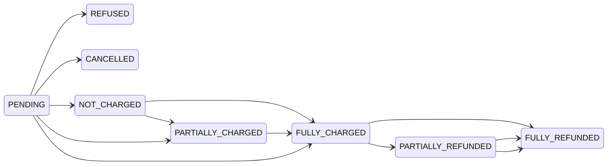
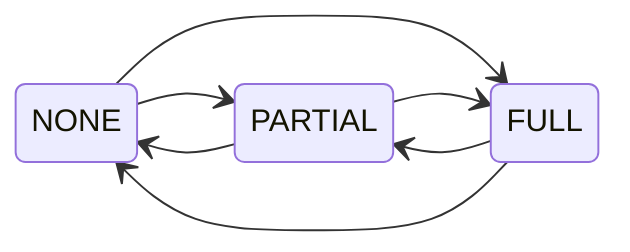
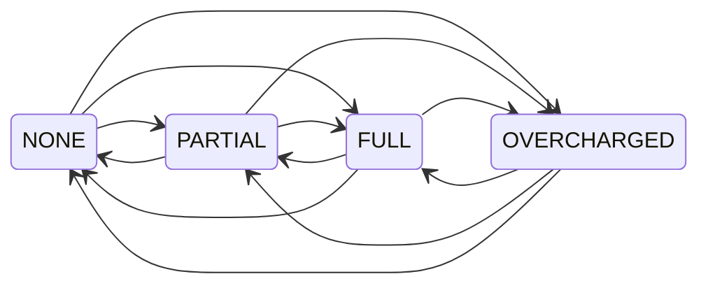
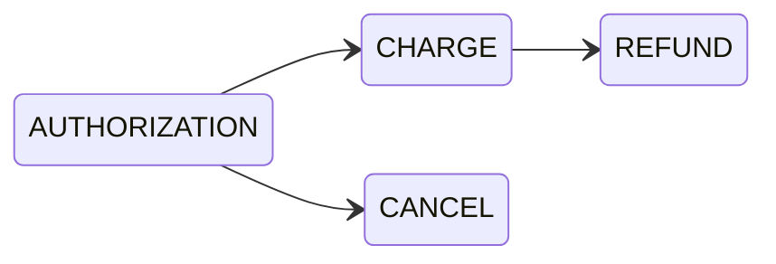
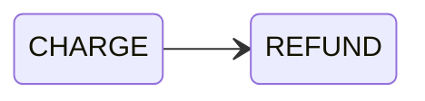

## Payment status on Order 



[`Order.paymentStatus`](api-reference/orders/objects/order.mdx#orderpaymentstatuspaymentchargestatusenum---) represents the combined payment and refund status of the order. It's calculated based on:

- `order.total` value
- status of the payments
- refunds granted for the order

When [no refunds](/developer/payments/refunds.mdx) are created, the status is one of the following:

- `PENDING`: waiting for the response from the payment gateway
- `REFUSED`: payment refused by the payment gateway
- `CANCELLED`: payment has been canceled
- `NOT_CHARGED`: the amount is authorized but not charged
- `PARTIALLY_CHARGED`: the charged amount does not cover the order total
- `FULLY_CHARGED`: charged funds fully cover the order total

Creating the refund will change the status to:

- `PARTIALLY_REFUNDED`: the refunded amount does not cover the order total
- `FULLY_REFUNDED`: refunded funds fully cover the order total

:::note
`Checkout` doesn't have `paymentStatus` field.
:::

## Authorize status



### Authorization status calculation for Checkout

[`Checkout.authorizeStatus`](/api-reference/checkout/objects/checkout#checkoutauthorizestatuscheckoutauthorizestatusenum---) depends on:
- sum of charged transactions (`TransactionItem.chargedAmount`)
- sum of transactions with pending charge (`TransactionItem.chargePendingAmount`)
- sum of a authorized transactions (`TransactionItem.authorizedAmount`)
- sum of transactions with pending authorization (`TransactionItem.authorizePendingAmount`)
- `checkout.totalPrice` value

:::tip
Note that pending amounts are included in Checkout `authorizeStatus` calculation, but are not considered in Order `authorizeStatus` calculation.
:::

In this context, authorization means that funds have been either authorized or charged (or a combination of partially charged and partially authorized).

```
AuthorizationStatus = Charged + ChargePending + Authorized + AuthorizePending
```

The status is calculated based on summing up all transactions assigned to the `Checkout` (`authorizedAmount`, `authorizationPendingAmount`, `chargedAmount`, `chargePendingAmount` on `TransactionItem`) and by comparing it with the `checkout.totalPrice` value.

It uses a formula:

```
AmountToCover = checkout.totalPrice
CoveredAmount = sum(checkout.transactions.chargedAmount) + sum(checkout.transactions.chargePendingAmount) + sum(checkout.transactions.authorizePendingAmount) + sum(checkout.transactions.authorizedAmount)
```

Based on that calculation `Checkout.authorizeStatus` can have the following values:

- **`NONE`**: No funds have been authorized. (`CoveredAmount <= 0`)
- **`PARTIAL`**: Some funds were authorized, but they do not cover required amount (`AmountToCover > CoveredAmount`)
- **`FULL`**: The authorized funds fully cover the required amount. (`AmountToCover <= CoveredAmount`)

:::caution
Transaction that is pending will be confirmed later by the payment app (it will result in either success or failure).

This means user can create an Order that may remain unpaid if the pending amounts eventually fail.
:::

#### Available transitions

- Status is updated when Checkout's `totalAmount` is changed.
- Status is updated when Checkout's `TransactionItem`'s amounts are updated.

### Authorization status calculation for Order

[`Order.authorizeStatus`](/api-reference/orders/objects/order#orderauthorizestatusorderauthorizestatusenum---) status depends on:

- sum of **charged** transactions (`TransactionItem.chargedAmount`)
- sum of **authorized** transactions (`TransactionItem.authorizedAmount`)
- `order.totalGrantedRefund` value
- `order.total` value

:::caution
Unlike Checkout, this status does not take into consideration pending transactions.

This means that after completing checkout, `authorizeStatus` might be set from `FULL` to `NONE`, if payments are pending.
:::

Authorization in this context means that funds have been either fully or partially authorized or charged.

```
AuthorizationStatus = Charged + Authorized
```

The status is calculated based on summing up all transactions assigned to the `Order` (`authorizedAmount` and `chargedAmount` on each `TransactionItem`) and by comparing it with the difference between [`total`](/api-reference/orders/objects/order.mdx#ordertotaltaxedmoney---) and [`totalGrantedRefund`](/api-reference/orders/objects/order.mdx#ordertotalgrantedrefundmoney---).

It uses a formula:
```
AmountToCover = order.total - order.totalGrantedRefund
CoveredAmount = sum(order.transactions.chargedAmount) + sum(order.transactions.authorizedAmount)
```

Based on that calculation `Order.authorizeStatus` can have the following values:

- **`NONE`**: No funds have been authorized. (`CoveredAmount <= 0`)
- **`PARTIAL`**: Some funds were authorized, but they do not cover required amount (`AmountToCover > CoveredAmount`)
- **`FULL`**: The authorized funds fully cover the required amount. (`AmountToCover <= CoveredAmount`)

#### Available transitions

- Status is updated when Order's `totalAmount` is changed.
- Status is updated when Order's `TransactionItem`'s amounts are updated.
- Status is updated when `Order.grantedRefunds` are updated.

## Charge status



### Charge status calculations for Order

[`Order.chargeStatus`](/api-reference/orders/objects/order.mdx#orderchargestatusorderchargestatusenum---) depends on:

- sum of **charged** transactions (`TransactionItem.chargedAmount`)
- `order.totalGrantedRefund` value
- `order.total` value

:::caution
Unlike Checkout, this status does not take into consideration pending transactions.
:::

The status is calculated by summing up all transactions assigned to the `Order` (`chargedAmount` on each `TransactionItem`) and by comparing it with the difference between [`total`](/api-reference/orders/objects/order.mdx#ordertotaltaxedmoney---) and [`totalGrantedRefund`](/api-reference/orders/objects/order.mdx#ordertotalgrantedrefundmoney---).

It uses a formula:

```
AmountToCover = order.total - order.totalGrantedRefund
CoveredAmount = sum(order.transactions.chargedAmount)
```

Based on that calculation `Order.chargeStatus` can have following values:

- **NONE**: No funds have been charged. (`CoveredAmount <= 0`)
- **PARTIAL**: Some funds were charged, but they do not cover required amount. (`AmountToCover > CoveredAmount`)
- **FULL**: Charged funds fully cover the required amount. (`AmountToCover == CoveredAmount`)
- **OVERCHARGED**: Charged funds exceed the required amount. (`CoveredAmount > AmountToCover`)

#### Available transitions

- Status is updated when Order's `totalAmount` is changed.
- Status is updated when Order's `TransactionItem`'s amounts are updated.
- Status is updated when new `TransactionItem` is created on Order.
- Status is updated when `Order.grantedRefunds` are updated.

### Charge status calculations for Checkout

[`Checkout.chargeStatus`](/api-reference/checkout/objects/checkout.mdx#checkoutchargestatuscheckoutchargestatusenum---) depends on:
- sum of **charged** transactions (`TransactionItem.chargedAmount`)
- sum of transactions with **pending charge** (`TransactionItem.chargePendingAmount`)
- `checkout.totalPrice` value

The status is calculated based on summing up all transactions assigned to the `Checkout` (`chargedAmount` and `chargePendingAmount` on each `TransactionItem`) and by comparing it with the `checkout.totalPrice` value.

It uses a formula:

```
AmountToCover = checkout.totalPrice
CoveredAmount = sum(checkout.transactions.chargedAmount) + sum(checkout.transactions.chargePendingAmount)
```

Based on that calculation `Checkout.chargeStatus` can have the following values:

- **NONE**: No funds have been charged.
- **PARTIAL**: The charged funds do not fully cover the checkout's total amount (`AmountToCover > CoveredAmount`).
- **FULL**: The charged funds fully cover the checkout's total. (`AmountToCover == CoveredAmount`)
  - At this point,
the `CHECKOUT_FULLY_PAID` webhook event is sent, and `checkoutComplete` can be called
to convert the checkout into an order.
- **OVERCHARGED**: The charged funds exceed the checkout's total. (`CoveredAmount > AmountToCover`)
  - In this case,
the `CHECKOUT_FULLY_PAID` webhook event is sent as well, and `checkoutComplete`
can still be called to convert the checkout into an order.

:::caution
When the checkout `chargeStatus` is either `FULL` or `OVERCHARGED`, the `authorizeStatus`
also changes to `FULL`, allowing the checkout to be completed.
However, any pending amounts (whether successful or failed) will be confirmed later
by the payment application. This means that even though the order is created,
it may still remain unpaid if the pending amounts fail to process.
:::

#### Available transitions

- Status is updated when Checkout's `totalAmount` is changed.
- Status is updated when Checkout's `TransactionItem`'s amounts are updated.


## Transactions recalculation of amounts

### Mental model

Each `TransactionItem` has a ledger of events. This way we can calculate current transaction state based on the events history. You can think about it as a bank account: you start with some balance, then you add or subtract amounts based on the events that happen.

History cannot be modified, just like in a bank account. In order to reverse an event you must create a new one.

### Order of events

New events can be reported to Saleor in non-subsequent order. This means that some old event might arrive later than a new one. For example:
- on 10 AM Saleor receives `CHARGE_SUCCESS` event from payment app that was processed at 9:50 AM by payment provider
- on 10:20 AM Saleor receives `AUTHORIZATION_SUCCESS` event, that was process at 9:30 AM by payment provider.

This will result in a following list of events:
- `AUTHORIZATION_SUCCESS` with `date: 9:30 AM`
- `CHARGE_SUCCESS` with `date: 9:50 AM`

### Reporting new events

#### Automatic events

Events are created automatically by Saleor when calling `transactionInitialize` mutation. It creates either:
- `AUTHORIZATION_REQUEST` when `action` in mutation input or `channel.transactionFlowStrategy` is `AUTHORIZATION`
- or `CHARGE_REQUEST` when `action` in mutation input or `channel.transactionFlowStrategy` is `CHARGE`

Events are also created when requesting action in Saleor (refund, charge, cancel) via [`transactionRequestAction`](/api-reference/payments/mutations/transaction-request-action.mdx) mutation.

Such events don't have initially any `pspReference`, it's filled in once Saleor receives a response from payment app.

Saleor also creates automatically `_FAILURE` events when an exception happens:
- when handling `transactionEventReport` mutation
- when handling incorrect response from [sync webhook sent to payment app](/developer/extending/webhooks/synchronous-events/transaction.mdx) (e.g. app didn't respond in 20s, returned JSON is invalid, etc.)

Such events don't have `pspReference` and include a `message` that explains the error.

#### App events

Events are also created by a payment app that processes the payment:

- When payment app sends response to any of the [Transaction synchronous events](/developer/extending/webhooks/synchronous-events/transaction.mdx)

:::info
Instead of creating new event, Saleor will update existing event's missing `pspReference` field when:
- Event without `pspReference` already exists, because it was automatically created by Saleor after calling `transactionInitialize` or `transactionProcess` mutation
- Response from `TRANSACTION_INITIALIZE_SESSION` or `TRANSACTION_PROCESS_SESSION` has the same `type` as that initial event

When updating event `createdAt` field won't be changed.
:::

:::note
It can look like this:
1. User requests payment by calling `transactionInitialize` mutation - Saleor immediately created new `CHARGE_REQUESTED` event
2. App sends response from `TRANSACTION_INITIALIZE_SESSION` webhook with `type`: `CHARGE_ACTION_REQUIRED`
3. User completes the action and calls `transactionProcess`
4. App sends response from `TRANSACTION_PROCESS_SESSION` webhook with the same type as first event - `CHARGE_REQUESTED`
5. Saleor instead of creating new event, updates existing event `CHARGE_REQUESTED` with received `pspReference`

Note that this will result in events order as follows:
1. `CHARGE_REQUESTED` with updated `pspReference` (updated events don't get their `createdAt` field modified)
2. `CHARGE_ACTION_REQUIRED`
:::
- When [`transactionEventReport` mutation is called](/developer/payments/transactions.mdx#reporting-actions-for-transactions) (usually happens when payment provider sends asynchronous webhook)

:::tip
Events can be de-duplicated, when that happens new one won't be created. Read more in [Event deduplication section](#events-deduplication).
:::

### Rules of calculating amounts

Each event impacts different amount on `TransactionItem`:

:::caution
Each event can be excluded from calculation if it has matching `*_FAILURE` event with the same `pspReference` and newer `time` than the `*_REQUEST` / `*_SUCCESS` event.
:::

- `authorizedAmount` - `AUTHORIZATION_SUCCESS` event amount
  - there can be only one `AUTHORIZATION_SUCCESS` event for given TransactionItem
  - it can be modified by `AUTHORIZATION_ADJUSTMENT` event
  - subtracting `canceledAmount` and `cancelPendingAmount`
- `authorizePendingAmount` - sum of `AUTHORIZATION_REQUEST` event amounts
- `chargedAmount` - sum of `CHARGE_SUCCESS` event amounts and sum `REFUND_REVERSE` event amounts
  - subtracting all `CHARGE_BACK` events that lower this amount
  - subtracting `refundedAmount` and `refundPendingAmount`
- `chargePendingAmount` - sum of `CHARGE_REQUEST` event amounts
- `refundedAmount` - sum of `REFUND_SUCCESS` event amounts
- `refundPendingAmount` - sum of `REFUND_REQUEST` event amounts
- `canceledAmount` - sum of `CANCEL_SUCCESS` event amounts
- `cancelPendingAmount` - sum of `CANCEL_REQUEST` event amounts


:::note
`AUTHORIZATION_ACTION_REQUIRED`, `CHARGE_ACTION_REQUIRED`, and `INFO` event types are not included in amount calculations.
:::

To learn more about each event type, see [Transaction event types](#transaction-event-types) section.

To learn more about amount calculations see [Price calculations](/developer/payments/price-calculations.mdx) page.

#### Events deduplication

Each event in `TransactionItem` is identified by `pspReference`. This field is used to de-duplicate events in case there were reported multiple times by the payment app. Deduplication is done within single `TransactionItem`.

For example if Saleor receives two `CHARGE_SUCCESS` events for a single `TransactionItem` with the same `pspReference` and `amount` there will be only one event stored on the Transaction. Second event will be treated as "already reported" and it won't be stored by Saleor.

:::caution
If the `CHARGE_SUCCESS` event has different `amount` Saleor **will throw an error**.
:::

When reporting such events in `transactionEventReport` mutation it returns event that already exists and a flag `alreadyReported: true`.

You can learn more about this mutation and event deduplication in [Reporting actions for transactions](/developer/payments/transactions.mdx#reporting-actions-for-transactions) docs.

### State machine

Saleor Transaction model **is not a state machine**. This allows great flexibility when integrating with many payment providers, even those that might implement some unconventional flows.
However this also means that we do not forbid changes on Transactions that might be seen as invalid by your business use-case, such validation is on the Payment App side.

For example:
- Available `actions` on `TransactionItem` (list of `REFUND`, `CHARGE`, `CANCEL`) are honored by Saleor Dashboard, but are not rejected once `transactionRequestAction` is requested via API - such request is sent to payment app
- Transaction might receive `CANCEL_SUCCESS` event even though it had `CHARGE_SUCCESS` reported (in such case to lower `chargedAmount` app would need to report `REFUND_SUCCESS` event).

#### Existing validation

With that in mind, Saleor prohibits following changes, that would otherwise cause incorrect internal calculations:
- Multiple `AUTHORIZATION_SUCCESS` events with different either `pspReference` or `amount`
  - Saleor will throw an exception: "Event with `AUTHORIZATION_SUCCESS` already reported for the transaction. Use `AUTHORIZATION_ADJUSTMENT` to change the authorization amount."

:::note
**Example**: `AUTHORIZATION_SUCCESS` event with `pspReference: psp1` and `amount: 10 USD`, then report `AUTHORIZATION_SUCCESS` event with `pspReference: psp2` and `amount: 10 USD`
:::

:::tip
**Fix**: In order to change `authorizedAmount` value on existing `TransactionItem`, payment app should send `AUTHORIZATION_ADJUSTMENT` event.

If there was a new payment made (e.g. outside of Saleor flow), instead of reporting multiple `AUTHORIZATION_SUCCESS` events which would be rejected by Saleor, create new `TransactionItem` by calling [`transactionCreate`](/api-reference/payments/mutations/transaction-create.mdx) mutation.
:::

- Reporting the same event based on `type` and `pspReference` with different `amount`
  - Saleor will throw an exception: "The transaction with provided `pspReference` and `type` already exists with different amount."

:::note
**Example**: `REFUND_SUCCESS` with `pspReference: psp1` and `amount: 10 USD`, then report `REFUND_SUCCESS` with `pspReference: psp1` and `amount: 21 USD`
:::

:::tip
**Fix**: Previous event must be invalidated via `_FAILURE` event, then report `_SUCCESS` event again, new `_SUCCESS` event must have **different pspReference**.
:::


### Examples

The tables below show examples of transactions and their amounts when a given event is attached to the transaction.
Depending on the event type, the amounts may change. The last columns show the current amounts assigned to the transaction after
processing the events defined in a given row and in the rows above it.

| Event |         Type          | pspReference |           Time            | Amount | `transaction.authorizedAmount` | `transaction.authorizePendingAmount` |
| :---: | :-------------------: | :----------: | :-----------------------: | :----: | :----------------------------: | :----------------------------------: |
|   1   | AUTHORIZATION_REQUEST |     AB12     | 2022-03-28T12:50:33+00:00 |   10   |               0                |                  10                  |
|   2   | AUTHORIZATION_SUCCESS |     AB12     | 2022-03-28T12:51:33+00:00 |   10   |               10               |                  0                   |
|   3   | AUTHORIZATION_FAILURE |     YZ13     | 2022-03-28T12:52:33+00:00 |   10   |               10               |                  0                   |

After receiving an `AUTHORIZATION_REQUEST` event, the amount defined in the event is attached to `transaction.authorizePendingAmount`.
Then, an `AUTHORIZATION_SUCCESS` event is attached to the transaction. Since the `AUTHORIZATION_SUCCESS` event has the same `pspReference` as
the `AUTHORIZATION_REQUEST` event, the `transaction.authorizePendingAmount` is reduced by the event amount, and added to the `transaction.authorizedAmount`.
An `AUTHORIZATION_FAILURE` event doesn’t change anything, as there isn’t an `AUTHORIZATION_REQUEST` event related to it.

---

| Event |           Type           | pspReference |           Time            | Amount | `transaction.authorizedAmount` | `transaction.authorizePendingAmount` |
| :---: | :----------------------: | :----------: | :-----------------------: | :----: | :----------------------------: | :----------------------------------: |
|   1   |  AUTHORIZATION_REQUEST   |     AB12     | 2022-03-28T12:50:33+00:00 |   10   |               0                |                  10                  |
|   2   |  AUTHORIZATION_SUCCESS   |     AB12     | 2022-03-28T12:51:33+00:00 |   10   |               10               |                  0                   |
|   3   | AUTHORIZATION_ADJUSTMENT |     YZ13     | 2022-03-28T12:52:33+00:00 |  100   |              100               |                  0                   |

Upon receiving an `AUTHORIZATION_REQUEST` event, the corresponding amount is attached to `transaction.authorizePendingAmount`. An `AUTHORIZATION_SUCCESS` event
is then attached to the transaction, with the same `pspReference` as the `AUTHORIZATION_REQUEST` event. The `transaction.authorizePendingAmount` is reduced
by the event amount, and the result is added to the `transaction.authorizedAmount`.
Note that an `AUTHORIZATION_ADJUSTMENT` event will overwrite the previous `transaction.authorizedAmount` and cause the
previous `AUTHORIZATION_SUCCESS` event to be ignored.

---

| Event |         Type          | pspReference |           Time            | Amount | `transaction.authorizedAmount` | `transaction.authorizePendingAmount` |
| :---: | :-------------------: | :----------: | :-----------------------: | :----: | :----------------------------: | :----------------------------------: |
|   1   | AUTHORIZATION_SUCCESS |     AB12     | 2022-03-28T12:51:33+00:00 |   10   |               10               |                  0                   |

---

The transaction receives an `AUTHORIZATION_SUCCESS` event. Since there is no `AUTHORIZATION_REQUEST` with the same pspReference, the value of `transaction.authorizePendingAmount`
will not be changed. The amount from the event is assigned to `transaction.authorizedAmount`.

| Event |         Type          | pspReference |           Time            | Amount | `transaction.chargedAmount` | `transaction.chargePendingAmount` | `transaction.authorizedAmount` |
| :---: | :-------------------: | :----------: | :-----------------------: | :----: | :-------------------------: | :-------------------------------: | :----------------------------: |
|   1   | AUTHORIZATION_SUCCESS |     AB12     | 2022-03-28T12:50:33+00:00 |   10   |              0              |                 0                 |               10               |
|   2   |    CHARGE_REQUEST     |     YZ13     | 2022-03-28T12:51:33+00:00 |   3    |              0              |                 3                 |               7                |
|   3   |    CHARGE_SUCCESS     |     YZ13     | 2022-03-28T12:52:33+00:00 |   3    |              3              |                 0                 |               7                |

When the transaction receives an `AUTHORIZATION_SUCCESS` event, if there is no `AUTHORIZATION_REQUEST` with the same pspReference, the value of `transaction.authorizePendingAmount`
will not change. The amount from the event is then assigned to `transaction.authorizedAmount`. Additionally, a `CHARGE_REQUEST` event is added to the transaction, and the amount
from the event is added to `transaction.chargePendingAmount`. The amount also reduces `transaction.authorizedAmount`. Finally, when a `CHARGE_SUCCESS` event occurs, the `transaction.chargePendingAmount`
is reduced by the event’s amount and added to `transaction.chargedAmount`.

---

| Event |         Type          | pspReference |           Time            | Amount | `transaction.chargedAmount` | `transaction.chargePendingAmount` | `transaction.authorizedAmount` |
| :---: | :-------------------: | :----------: | :-----------------------: | :----: | :-------------------------: | :-------------------------------: | :----------------------------: |
|   1   | AUTHORIZATION_SUCCESS |     AB12     | 2022-03-28T12:50:33+00:00 |   10   |              0              |                 0                 |               10               |
|   2   |    CHARGE_REQUEST     |     YZ13     | 2022-03-28T12:51:33+00:00 |   3    |              0              |                 3                 |               7                |
|   3   |    CHARGE_SUCCESS     |     YZ13     | 2022-03-28T12:51:33+00:00 |   3    |              3              |                 0                 |               7                |
|   4   |    CHARGE_FAILURE     |     YZ13     | 2022-03-28T12:55:33+00:00 |   3    |              0              |                 0                 |               10               |

When an `AUTHORIZATION_SUCCESS` event is attached to the transaction, the `transaction.authorizedAmount` is updated with the amount from the event.
If there is no `AUTHORIZATION_REQUEST` with the same `pspReference`, the `transaction.authorizePendingAmount` remains unchanged.
Additionally, a `CHARGE_REQUEST` event is added to the transaction, and its amount is added to `transaction.chargePendingAmount`.
The `transaction.authorizedAmount` is reduced by the amount from the `CHARGE_REQUEST` event.
Finally, when a `CHARGE_SUCCESS` event occurs, the `transaction.chargedAmount` is updated with the event's amount, and the
`transaction.chargePendingAmount` is reduced by the same amount. A `CHARGE_FAILURE` event with the same `pspReference` as `CHARGE_SUCCESS` is
also attached to the transaction, `time` indicating that it is newer than the `CHARGE_SUCCESS`. The previous `CHARGE_SUCCESS` event is ignored during the recalculation process.

---

| Event |         Type          | pspReference |           Time            | Amount | `transaction.chargedAmount` | `transaction.chargePendingAmount` | `transaction.authorizedAmount` |
| :---: | :-------------------: | :----------: | :-----------------------: | :----: | :-------------------------: | :-------------------------------: | :----------------------------: |
|   1   | AUTHORIZATION_SUCCESS |     AB12     | 2022-03-28T12:50:33+00:00 |   10   |              0              |                 0                 |               10               |
|   2   |    CHARGE_REQUEST     |     YZ13     | 2022-03-28T12:51:33+00:00 |   3    |              0              |                 3                 |               7                |
|   3   |    CHARGE_SUCCESS     |     YZ13     | 2022-03-28T12:51:33+00:00 |   3    |              3              |                 0                 |               7                |
|   4   |    CHARGE_FAILURE     |     YZ13     | 2022-03-28T12:50:45+00:00 |   3    |              3              |                 0                 |               7                |

When an `AUTHORIZATION_SUCCESS` event is attached to a transaction, the `transaction.authorizedAmount` is updated with the event's amount. If there is no `AUTHORIZATION_REQUEST` with the
same `pspReference`, the `transaction.authorizePendingAmount` remains unchanged. In addition, a `CHARGE_REQUEST` event is added to the transaction, and its amount is added to
`transaction.chargePendingAmount`. The `transaction.authorizedAmount` is reduced by the amount from the `CHARGE_REQUEST` event. Finally, when a `CHARGE_SUCCESS` event occurs, the
`transaction.chargedAmount` is updated with the event's amount, and the `transaction.chargePendingAmount` is reduced by the same amount. A `CHARGE_FAILURE` event with
the same `pspReference` as `CHARGE_SUCCESS` is also attached to the transaction. The `time` field indicates that it is older than the `CHARGE_SUCCESS` event. This means
that the `CHARGE_FAILURE` event will be ignored, and the `CHARGE_SUCCESS` event will be included in the calculations.

---

| Event |      Type      | pspReference |           Time            | Amount | `transaction.chargedAmount` | `transaction.chargePendingAmount` | `transaction.authorizedAmount` |
| :---: | :------------: | :----------: | :-----------------------: | :----: | :-------------------------: | :-------------------------------: | :----------------------------: |
|   1   | CHARGE_SUCCESS |     AB12     | 2022-03-28T12:50:33+00:00 |   10   |             10              |                 0                 |               0                |

---

| Event |         Type          | pspReference |           Time            | Amount | `transaction.chargedAmount` | `transaction.chargePendingAmount` | `transaction.authorizedAmount` |
| :---: | :-------------------: | :----------: | :-----------------------: | :----: | :-------------------------: | :-------------------------------: | :----------------------------: |
|   1   | AUTHORIZATION_SUCCESS |     AB12     | 2022-03-28T12:50:33+00:00 |   10   |              0              |                 0                 |               10               |
|   2   |    CHARGE_SUCCESS     |     YZ13     | 2022-03-28T12:51:33+00:00 |   3    |              3              |                 0                 |               7                |

The `AUTHORIZATION_SUCCESS` event is attached to the transaction, and its amount is added to `transaction.authorizedAmount`. Similarly, the `CHARGE_SUCCESS` event is attached to the transaction,
and its amount is added to `transaction.chargedAmount`. Finally, the amount of the `AUTHORIZATION_SUCCESS` event is subtracted from the `transaction.authorizedAmount`.

---

## Transaction event types

### Authorization events

#### `AUTHORIZATION_SUCCESS`

Saleor assigns provided `amount` to `transaction.authorizedAmount`. If an `AUTHORIZATION_SUCCESS` event is related to an `AUTHORIZATION_REQUEST` event by `pspReference`, then the `transactionItem.authorizePendingAmount`
will be reduced by the amount reported in the `AUTHORIZATION_SUCCESS` event.
You can’t have two successful authorizations for a single transaction.
Each successful request after the first one will raise an exception. `AUTHORIZATION_ADJUSTMENT` should be used to change the `transaction.authorizedAmount`.

:::info

In the case of finding `AUTHORIZATION_SUCCESS` and `AUTHORIZATION_FAILURE` with the same `pspReference`,
the recalculation for `transaction.authorizedAmount` will not take into account the amount from
`AUTHORIZATION_SUCCESS`, when `AUTHORIZATION_SUCCESS` is the older one.

:::

#### `AUTHORIZATION_FAILURE`

If an `AUTHORIZATION_FAILURE` event is related to an `AUTHORIZATION_REQUEST` event by `pspReference`, then the `transactionItem.authorizePendingAmount`
will be reduced by the amount reported in the `AUTHORIZATION_FAILURE` event. If there is no related `AUTHORIZATION_REQUEST`, the failure event will only
be used to provide the history of `transactionItem` actions.

#### `AUTHORIZATION_ADJUSTMENT`

Saleor assigns the provided `amount` to the `transaction.authorizedAmount`.

#### `AUTHORIZATION_ACTION_REQUIRED`

Indicates that additional action is required from the customer to finalize the payment.
Does not affect any amounts in the `transactionItem`.
Multiple events of this type might be present.

### Charge events

#### `CHARGE_SUCCESS`

Adds the provided `amount` to the `transaction.chargedAmount`. Each next call will add the `amount` to the existing
`transaction.chargedAmount` (`transaction.chargedAmount += amount`). If a `CHARGE_SUCCESS` event is related to a `CHARGE_REQUEST` event by `pspReference`, then the `transactionItem.chargePendingAmount`
will be reduced by the amount reported in the `CHARGE_SUCCESS` event. If there is no related `CHARGE_REQUEST` event, the provided `amount` will reduce `transaction.authorizedAmount`.

:::info
In the case of finding `CHARGE_SUCCESS` and `CHARGE_FAILURE` with the same `pspReference`, the recalculation
for `transaction.chargedAmount` will not take into account the amount from `CHARGE_SUCCESS`, when
`CHARGE_SUCCESS` is the older one.
:::

#### `CHARGE_FAILURE`

If an `CHARGE_FAILURE` event is related to an `CHARGE_REQUEST` event by `pspReference`, then the `transactionItem.chargePendingAmount`
will be reduced by the amount reported in the `CHARGE_FAILURE` event. If there is no related `CHARGE_REQUEST`, the failure event will only
be used to provide the history of `transactionItem` actions.

#### `CHARGE_BACK`

The provided `amount` will be used to reduce `transaction.chargedAmount`
(`transaction.chargedAmount -= amount`).


#### `CHARGE_ACTION_REQUIRED`

Indicates that additional action is required from the customer to finalize the payment.
Does not affect any amounts in the `transactionItem`.
Multiple events of this type might be present.

### Refund events

:::warning
Refund events should only be triggered if the transaction has been previously charged.
Triggering a refund for uncharged transactions can lead to negative `chargedAmount`.
Refund events modify both the `refundedAmount` and `chargedAmount` values, so if the transaction wasn’t charged beforehand, it may result in data inconsistencies.
:::

#### `REFUND_SUCCESS`

Adds provided `amount` to `transaction.refundedAmount` and removes it from `transaction.chargedAmount`. Each next call will add the `amount` to the existing
`transaction.refundedAmount` (`transaction.refundedAmount += amount`) and remove from `transaction.chargedAmount` (`transaction.chargedAmount -= amount`).

If a `REFUND_SUCCESS` event is related to a `REFUND_REQUEST` event by `pspReference`, then the `transactionItem.refundPendingAmount`
will be reduced by the amount reported in the `REFUND_SUCCESS` event. If there is no related `REFUND_REQUEST` event, the provided `amount` will reduce `transaction.chargedAmount`.

:::info
In the case of finding `REFUND_SUCCESS` and `REFUND_FAILURE` with the same `pspReference`, the recalculation
for `transaction.refundedAmount` will not take into account the amount from `REFUND_SUCCESS`, when
`REFUND_SUCCESS` is the older one.
:::

#### `REFUND_FAILURE`

If an `REFUND_FAILURE` event is related to an `REFUND_REQUEST` event by `pspReference`, then the `transactionItem.refundPendingAmount`
will be reduced by the amount reported in the `REFUND_FAILURE` event. If there is no related `REFUND_REQUEST`, the failure event will only
be used to provide the history of `transactionItem` actions.

#### `REFUND_REVERSE`

The provided `amount` will be used to reduce `transaction.refundedAmount` (`transaction.refundedAmount -= amount`).
The provided `amount` will increase `transaction.chargedAmount`.

### Cancel events

:::warning
Cancel events should only be triggered if the transaction has been previously authorized.
Triggering a cancel for transactions that didn't have any `authorizedAmount` can lead to negative `authorizedAmount`.
Cancel events modify both the `canceledAmount` and `authorizedAmount` values, so if the transaction wasn’t authorized beforehand, it may result in data inconsistencies.
:::

#### `CANCEL_SUCCESS`

The provided `amount` will be added to `transaction.canceledAmount`
(`transaction.canceledAmount += amount`). If a `CANCEL_SUCCESS` event is related to a `CANCEL_REQUEST` event by `pspReference`, then the `transactionItem.cancelPendingAmount`
will be reduced by the amount reported in the `CANCEL_SUCCESS` event. If there is no related `CANCEL_REQUEST` event, the provided `amount` will reduce `transaction.authorizedAmount`.

:::info
In the case of finding `CANCEL_SUCCESS` and `CANCEL_FAILURE` with the same `pspReference`, the recalculation
for `transaction.canceledAmount` will not take into account the amount from `CANCEL_SUCCESS`, when
`CANCEL_SUCCESS` is the older one.
:::

#### `CANCEL_FAILURE`

If an `CANCEL_FAILURE` event is related to an `CANCEL_REQUEST` event by `pspReference`, then the `transactionItem.cancelPendingAmount`
will be reduced by the amount reported in the `CANCEL_FAILURE` event. If there is no related `CANCEL_REQUEST`, the failure event will only
be used to provide the history of `transactionItem` actions.

### Other events

#### `INFO`

Represents an informational event that provides context or updates without directly impacting the payment process.
Does not affect any amounts in the `transactionItem`.
Multiple events of this type might be present.

## Transaction event flow

Transaction events modify the amount fields, which define the state of the transaction.
We do not require any specific order of incoming events, the transaction amounts will be calculated
based on the rules described [above](#transaction-event-types).
But to maintain accuracy and integrity, it is important that events are triggered in a valid order.
The chart below illustrates the possible sequence of events that can follow one another.
Failure to adhere to these guidelines may result in negative values and data inconsistencies.

- Transaction flow strategy: `Authorization`


- Transaction flow strategy: `Charge`

