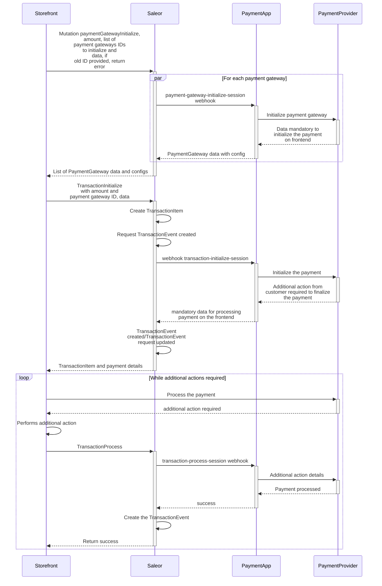

Payment App is a Saleor App that handles the payment process for a specific payment provider.
End users are unaware of the payment app's existence as they communicate only with Saleor via GraphQL API.
Saleor then communicates with the app using synchronous webhooks, automatically [updates statuses and balances](/developer/payments/lifecycle.mdx#transactions-recalculation-of-amounts), and returns the response to the storefront. Checkout is finalized with the [`checkoutComplete`](api-reference/checkout/mutations/checkout-complete.mdx) mutation.

Payment apps are responsible for handling the implementation details of payments with a certain payment gateway (i.e. Adyen, Stripe) while Saleor hides the complexity of the payment process from the storefront under a consistent set of GraphQL queries and mutations.

:::tip

In this guide, we use the terms **Payment App** and **Payment Gateway** interchangeably.

:::

### Processing Payments With the Payment App

This section describes the flow for processing payments using Payment Apps. The communication between the storefront and the Payment App
goes through Saleor. Based on the Payment App's response, Saleor creates or updates the transactions with the appropriate [statuses and balances](developer/payments/lifecycle.mdx#transactions-recalculation-of-amounts).

The following diagram shows the flow of processing a payment with a Payment App:



### Creating Orders

Payment Apps support two distinct ways of processing checkouts:

- first payments, then order
- first order, then payments

The first approach is used by default. It means that the order can be only created after the checkout is fully paid. See [`allowUnpaidOrders`](api-reference/miscellaneous/objects/order-settings.mdx#ordersettingsallowunpaidordersboolean---) setting for more details.

In both cases, the order is created by calling the [`checkoutComplete`](api-reference/checkout/mutations/checkout-complete.mdx) mutation.

### Initialize Payment Gateway

To initialize the payment app, call the [`paymentGatewayInitialize`](api-reference/payments/mutations/payment-gateway-initialize.mdx) mutation.
The [`data`](api-reference/payments/inputs/payment-gateway-to-initialize.mdx#paymentgatewaytoinitializedatajson--) provided in the
[`paymentGateways`](api-reference/payments/inputs/payment-gateway-to-initialize.mdx) will be sent to the payment app. Saleor will then return the [`data`](api-reference/payments/objects/payment-gateway-initialize.mdx#paymentgatewayinitializegatewayconfigspaymentgatewayconfig---) received from each app as a response.

This step is useful when information needs to be obtained from the Payment App even before initializing the payment process. Typically used for getting the available payment methods for a specific checkout, or for fetching the payment form configuration to be rendered on the frontend. Multiple Payment Apps can be initialized with a single mutation call.

The [`paymentGatewayInitialize`](api-reference/payments/mutations/payment-gateway-initialize.mdx) mutation requires the following arguments:

- `id` - ID of the `Checkout` or `Order`
- `amount` - The amount requested for initializing the payment gateway. The amount is rounded based on the given currency precision. If not provided, the difference between `checkout.total` and transactions that are already processed will be sent to the apps.
- `paymentGateways` - A list of Payment Apps to initialize. If not provided, all apps subscribed to the webhook [`PAYMENT_GATEWAY_INITIALIZE_SESSION`](api-reference/webhooks/enums/webhook-event-type-sync-enum.mdx#webhookeventtypesyncenumpayment_gateway_initialize_session) will be used.
- `paymentGateways.id` - The identifier of the Payment App to initialize.
- `paymentGateways.data` - The data to be passed to the Payment App.

The [`paymentGatewayInitialize`](api-reference/payments/mutations/payment-gateway-initialize.mdx) mutation returns the following response:

- `gatewayConfigs` - A list of Payment Apps that were initialized.
- `gatewayConfigs.id` - The app identifier.
- `gatewayConfigs.data` - The data required to initialize the Payment App.
- `gatewayConfigs.errors` - A list of errors related to the specific payment gateway app.
- `errors` - Errors related to the mutation call.

The following example shows how to use the [`paymentGatewayInitialize`](api-reference/payments/mutations/payment-gateway-initialize.mdx) mutation to initialize the payment gateways:

```graphql
mutation {
  paymentGatewayInitialize(
    id: "Q2hlY2tvdXQ6ZmIxMzljMjgtYWY4OS00Mzk2LWEyMjgtZmM2ZDg0NGFhOWY3"
    amount: 100
    paymentGateways: [
      { id: "app.saleor.payment", data: { details: { passed: "to-app" } } }
    ]
  ) {
    gatewayConfigs {
      id
      data
      errors {
        field
        message
        code
      }
    }
    errors {
      field
      message
      code
    }
  }
}
```

The response:

```json
{
  "data": {
    "paymentGatewayInitialize": {
      "gatewayConfigs": [
        {
          "id": "app.saleor.payment",
          "data": {
            "json": "data-returned-by-app"
          },
          "errors": []
        }
      ],
      "errors": []
    }
  }
}
```

The mutation will trigger the [`PAYMENT_GATEWAY_INITIALIZE_SESSION`](api-reference/webhooks/enums/webhook-event-type-sync-enum.mdx#webhookeventtypesyncenumpayment_gateway_initialize_session) webhook.
For more details about this webhook, please refer to the [Transaction events guide](developer/extending/webhooks/synchronous-events/transaction.mdx#initialize-payment-gateway-session).

### Initialize Transaction

To initiate payment processing, call the [`transactionInitialize`](api-reference/payments/mutations/transaction-initialize.mdx) mutation.
The [`data`](api-reference/payments/inputs/payment-gateway-to-initialize.mdx#paymentgatewaytoinitializedatajson--) provided in the
[`paymentGateways`](api-reference/payments/inputs/payment-gateway-to-initialize.mdx) field will be sent to the payment app, and Saleor will return the
[`data`](api-reference/payments/objects/transaction-initialize.mdx#transactioninitializedatajson--) received from the app as a response.
Based on the Payment App's response, Saleor will create or update the transaction with the appropriate status and balance.

Depending on the implementation of the Payment App, the `transactionInitialize` may charge or authorize the customer.

The [`transactionInitialize`](api-reference/payments/mutations/transaction-initialize.mdx) mutation accepts the following arguments:

- `id` - ID of the `Checkout` or `Order`.
- `paymentGateway` - The payment gateway used to initiate payment processing.
- `paymentGateway.id` - The identifier of the payment gateway app.
- `paymentGateway.data` - The data to be passed to the payment gateway.
- `amount` - The amount requested for the payment. The amount is rounded based on the given currency precision. If not provided, the difference between `checkout.total` and transactions that are already processed will be sent.
- `action` - The expected action (charge or authorization). By default, the `channel.defaultTransactionFlowStrategy` will be used and can be configured from the Saleor Dashboard. The default value can be overridden only by an app that has `HANDLE_PAYMENTS` permission.
- `idempotencyKey` - Idempotency key which will be passed to the payment app. The key needs to be unique for the pair - `idempotencyKey` and `paymentGateway.id`.
- `customerIpAddress` - The customer's IP address. If not provided, Saleor will try to determine the customer's IP address on its own. The customer's IP address will be passed to the payment app. The IP should be in ipv4 or ipv6 format. The field can be used only by an app that has `HANDLE_PAYMENTS` permission.

Depending on the provided `idempotencyKey` value, the below results will happen:

- If `idempotencyKey` key is not provided, a new one will be generated automatically.
- If `idempotencyKey` is provided as an empty string, the error with the INVALID code will be raised.
- If provided pair: `idempotencyKey` and `paymentGateway.id` is already assigned to the existing transaction that belongs to a different order/checkout, the error with the UNIQUE code will be raised.

- If provided pair: `idempotencyKey` and `paymentGateway.id` is used more than once for a single order/checkout but with different `amount`, `action` input, the error with UNIQUE code will be raised.
- If provided pair: `idempotencyKey` and `paymentGateway.id` is used more than once for a single order/checkout, with the same input for `amount`, `action`, the existing `TransactionItem` will be used to send the request to the payment app.

The idempotency is used to detect the same payment request made by `transactionInitialize`. The idempotency key should be generated by the storefront and passed as a mutation input. Any retries made with `transactionInitialize` mutation should provide the same idempotency key.

In Web, UUID can be generated by using Crypto Web API:

```js
const idempotencyKey = window.crypto.randomUUID();
```

The key should be also stored in the form of persistent storage. This way it can be re-used even if the user leaves the page/app. On the Web, this can be done with `localStorage`:

```js
// set
localStorage.setItem("idempotencyKey", idempotencyKey);
// get
const idempotencyKey = localStorage.getItem("idempotencyKey");
```

The [`transactionInitialize`](api-reference/payments/mutations/transaction-initialize.mdx) mutation returns the following response:

- `transaction` - The initialized transaction.
- `transactionEvent` - The event created based on the response received from the payment app.
- `data` - The data returned by the app.
- `errors` - Errors related to the mutation call.

The mutation will trigger the [`TRANSACTION_INITIALIZE_SESSION`](api-reference/webhooks/enums/webhook-event-type-sync-enum.mdx#webhookeventtypesyncenumtransaction_initialize_session) webhook.
For more details about this webhook, please refer to the [Transaction events guide](developer/extending/webhooks/synchronous-events/transaction.mdx#initialize-transaction-session).

The following example demonstrates how to use the [`transactionInitialize`](api-reference/payments/mutations/transaction-initialize.mdx) mutation to initiate payment processing:

```graphql
mutation TransactionInitialize {
  transactionInitialize(
    amount: 100
    id: "Q2hlY2tvdXQ6MzE3NDk5MjgtZDFkMC00NjdjLTgxNjktMGRiZGM4ZGJhMGZh"
    paymentGateway: {
      id: "app.saleor.payment"
      data: { details: "passed-to-app" }
    }
  ) {
    transaction {
      id
    }
    transactionEvent {
      type
      pspReference
    }
    errors {
      field
      message
      code
    }
  }
}
```

The response:

```json
{
  "data": {
    "transactionInitialize": {
      "data": {
        "some-json": "data"
      },
      "transaction": {
        "id": "VHJhbnNhY3Rpb25JdGVtOjhhMzE1ODVlLWE1MTktNDVkMS1hNTFmLTYwZGZlNGRkM2FkNg"
      },
      "transactionEvent": {
        "type": "CHARGE_SUCCESS",
        "pspReference": "ppp-123"
      },
      "errors": []
    }
  }
}
```

The current status of payment can be determined based on the value of [`transactionEvent.type`](api-reference/payments/enums/transaction-event-type-enum.mdx):

- `AUTHORIZATION_ACTION_REQUIRED` or `CHARGE_ACTION_REQUIRED` indicates that additional action is required from the
  customer to finalize the payment (e.g. 3D Secure, mobile app confirmation, redirect to the payment provider page, etc.) Calling the [`transactionProcess`](api-reference/payments/mutations/transaction-process.mdx) mutation is required in order to proceed.
- `AUTHORIZATION_SUCCESS` indicates that funds have been authorized.
- `AUTHORIZATION_FAILURE` indicates that authorization has failed.
- `AUTHORIZATION_REQUEST` indicates that authorization is pending.
- `CHARGE_SUCCESS` indicates that funds have been charged.
- `CHARGE_FAILURE` indicates that charging has failed.
- `CHARGE_REQUEST` indicates that charging is pending.

Pending statuses are used when the Payment App requires additional time or a manual action on the payment provider side to process the payment.
Depending on the implementation, the Payment App may report the final status of the payment later using the `transactionEventReport` mutation.

### Process Transaction

If [`transactionInitialize`](api-reference/payments/mutations/transaction-initialize.mdx) or [`transactionProcess`](api-reference/payments/mutations/transaction-process.mdx)
returns `transactionEvent.type` equal to [`AUTHORIZATION_ACTION_REQUIRED`](api-reference/payments/enums/transaction-event-type-enum.mdx#transactioneventtypeenumauthorization_action_required)
or [`CHARGE_ACTION_REQUIRED`](api-reference/payments/enums/transaction-event-type-enum.mdx#transactioneventtypeenumcharge_action_required), additional steps from the customer are required. After completing those steps, pass the results to the [`transactionProcess`](api-reference/payments/mutations/transaction-process.mdx) mutation.

The [`transactionProcess`](api-reference/payments/mutations/transaction-process.mdx) mutation accepts the following arguments:

- `id` - The ID of the transaction returned by [`transactionInitialize`](api-reference/payments/mutations/transaction-initialize.mdx).
- `data` - The data to be passed to the payment gateway.
- `customerIpAddress` - The customer's IP address. If not provided, Saleor will try to determine the customer's IP address on its own. The customer's IP address will be passed to the payment app. The IP should be in ipv4 or ipv6 format. The field can be used only by an app that has `HANDLE_PAYMENTS` permission.

The [`transactionProcess`](api-reference/payments/mutations/transaction-process.mdx) mutation returns:

- `transaction` - The processed transaction.
- `transactionEvent` - The event created based on the response received from the payment app.
- `data` - The data returned by the app.
- `errors` - Errors related to the mutation call.

The mutation triggers the [`TRANSACTION_PROCESS_SESSION`](api-reference/webhooks/enums/webhook-event-type-sync-enum.mdx#webhookeventtypesyncenumtransaction_process_session) webhook.
For more details about this webhook, refer to the [Transaction events guide](developer/extending/webhooks/synchronous-events/transaction.mdx#process-transaction-session).

The following example demonstrates how to use the [`transactionProcess`](api-reference/payments/mutations/transaction-process.mdx) mutation to process the payment:

```graphql
mutation TransactionInitialize {
  transactionProcess(
    id: "VHJhbnNhY3Rpb25JdGVtOjhhMzE1ODVlLWE1MTktNDVkMS1hNTFmLTYwZGZlNGRkM2FkNg"
    data: { additional: { actions: "details" } }
  ) {
    transaction {
      id
    }
    transactionEvent {
      type
      pspReference
    }
    errors {
      field
      message
      code
    }
  }
}
```

The response:

```json
{
  "data": {
    "transactionProcess": {
      "data": {
        "some-json": "data"
      },
      "transaction": {
        "id": "VHJhbnNhY3Rpb25JdGVtOjhhMzE1ODVlLWE1MTktNDVkMS1hNTFmLTYwZGZlNGRkM2FkNg"
      },
      "transactionEvent": {
        "type": "CHARGE_SUCCESS",
        "pspReference": "ppp-123"
      },
      "errors": []
    }
  }
}
```

The current status of payment can be determined based on the value of [`transactionEvent.type`](api-reference/payments/enums/transaction-event-type-enum.mdx).
On some occasions, multiple calls to [`transactionProcess`](api-reference/payments/mutations/transaction-process.mdx) may be required to proceed with the payment.

## FAQ

### `checkout.availablePaymentGateways` doesn't show in my app

`availablePaymentGateways` on Checkout returns apps that listen to `TRANSACTION_INITIALIZE_SESSION` event. Ensure your app has active webhook for this event.

```graphql
query{
  app(id: "<MY_APP_ID>"){
    webhooks{
      syncEvents{
        eventType # Should include TRANSACTION_INITIALIZE_SESSION
      }
      isActive # Should be true
    }
  }
}
```

## Related Resources

- [Building payment apps](developer/extending/apps/building-payment-app.mdx) - Guide on how to build a payment app
